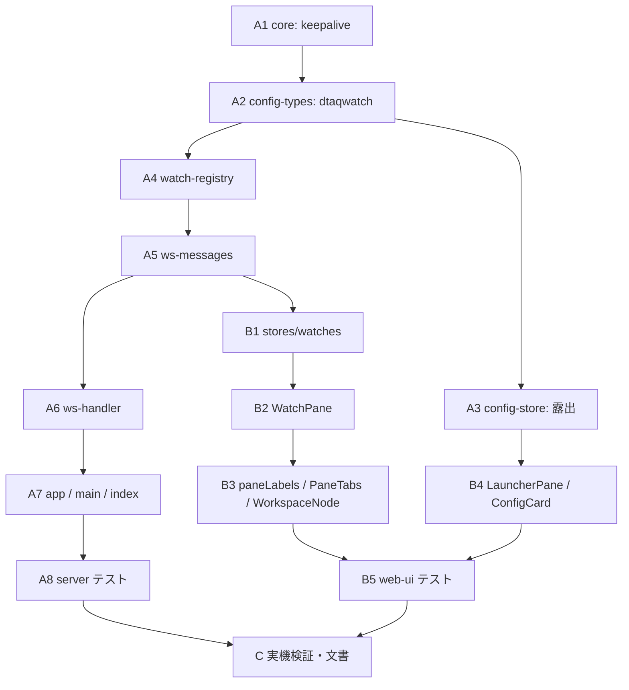

# 計画: データ待ち行列の常駐監視と到着通知

## split 判定: **subtask に割らない**

spec は範囲を 2 つ（01-registry / 02-console）に分けて書いたが、**work は割らない**。

`aidev-docs/DESIGN.md`「5.」の discriminator は「そのピースは**単独で検証・デリバリ可能か**」。

- **単独でデリバリできない**: レジストリだけでは利用者に何も見えず、
  コンソールだけでは動くものが無い。1 PR で初めて意味を持つ
- **単独の検証はどちらも可能**だが、それは subtask でなくても
  「ファイル群ごとにテストを書く」で足りる（実際そうする）
- **漸進レビューの価値が薄い**: 契約が WS メッセージ型 1 枚に閉じているので、
  片方を先に承認しても後で見直す量が減らない

→ 「不可分」として**単一の tasks.md ＋ 章立てされたコミット構成**で進める。
spec の 2 分割は**タスクの並び**として残す（下記 A 群 / B 群）。

## 実装方針

**下から積む**。サーバー側（レジストリ → WS）を先に通し、契約が固まってから web-ui を書く。

`WatchRegistry` は `DtaqConnection` を注入で受ける（`host-dtaq.ts` の `connect?` と同じ手）。
これが無いと「無限待ちのループ・再接続・履歴の上限」という**本体がどれも単体テストできない**。

## 作業順序と依存関係

## リスク / 留意点

- **`dispose` がレジストリに触らないこと**が要件の核心（research F1）。
  ここを間違えると「ブラウザを閉じたら止まる」に戻る。**テストで固定する**
- **停止と障害の区別**。停止は `close()` で待機中の `read` を reject させるので、
  **停止フラグを先に立てる**。立てないと停止操作が `error` 表示になる
- **`.strict()` と `superRefine` の順序**。`sessionType` と `dtaqWatch` の整合を
  parse で強制する（片方だけ書ける状態を作らない）
- **既存の `dtaq:entries` タブに触らない**（pull 型。既存テストで担保）
- **`watch-*` は `open` を要さない**。既存メッセージは `requireSession()` を通すので、
  同じ扱いにすると監視コンソールから使えない
- **上限を超えたときのコード**は新設せず `SESSION_LIMIT` を使う
  （`20260729-connect-failed-semantics` で足したもの。意味が合っている）
- pane タブの未読は**セッションの `unread` を流用しない**（セッションが無いので引けない）

## テスト方針

### server

- `watch-registry`: 開始 → エントリ受信で履歴に積む → push が飛ぶ / 履歴の上限で古いものが落ちる /
  停止で `read` の reject を `error` にしない / 接続断で `reconnecting` → 復帰 /
  権限エラーは `error` に落として再試行しない / 上限超過は `SESSION_LIMIT` /
  所有者以外の `list`/`history`/`stop` は `FORBIDDEN`
- `config-types`: `dtaqwatch` に `dtaqWatch` 必須 / 他種別は `dtaqWatch` を持てない /
  `.strict()` で未知キーを弾く
- `ws-handler`: `open` していない WS でも `watch-*` が通る / **`dispose` で監視が止まらない** /
  購読解除で push が止まる / 他人の watchId は `FORBIDDEN`

### web-ui

- `stores/watches`: 一覧・履歴の反映 / 未読の合計 / `markRead` で 0
- `WatchPane`: 一覧の描画 / 行選択で履歴が変わる / 停止ボタン / **消費の注意文が常時出る**
- `PaneTabs`: pane タブに未読バッジが出る（セッションが無くても）
- `LauncherPane`: `dtaqwatch` の接続が**装置名の重複判定を通らない**

### 実機

- `scripts/probe-dtaq-longwait.mjs --minutes 45`（**並行実行中**）で
  長時間アイドルの生存を確かめる
- `scripts/verify-browser-watch.mjs`: 監視を開始 → 別接続からエントリを送る →
  **画面操作なしで履歴に現れる** → タブを離しているときに送ると未読が付く →
  停止できる

### 空振り検証（mutation）

- `dispose` でレジストリを止めるようにする（要件の核心が壊れる）
- 停止フラグを立てずに `close()` する（停止が `error` 表示になる）
- 履歴の上限を外す
- 所有者チェックを外す
- `watch-*` に `requireSession()` を通す
- 権限エラーで再試行し続ける
