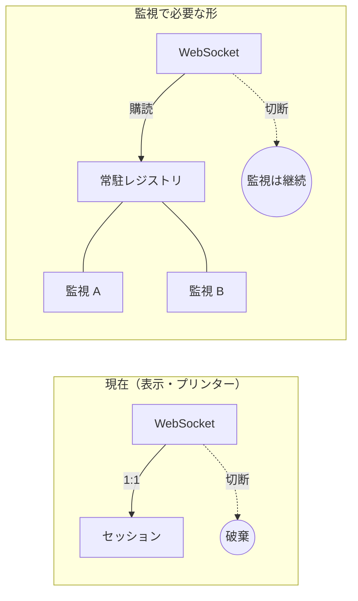
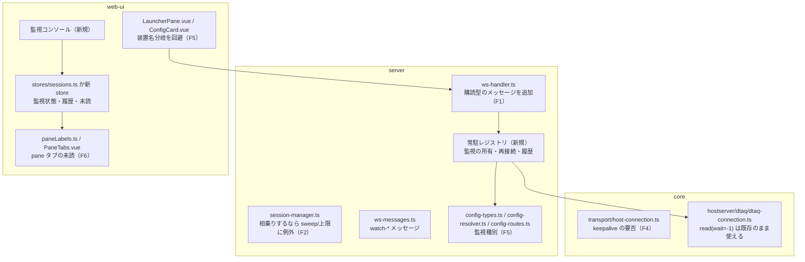

# 調査: データ待ち行列の常駐監視の実現性

## 調査の問い

- Q1: 既存の常駐セッション基盤（`session-manager.ts` / `ws-handler.ts`）は、
  ホストサーバー接続（0xE007）の常駐を載せられるか。とくに
  「ブラウザを閉じても待ち続ける」はプリンターセッション方式の踏襲で満たせるか。
- Q2: ホストサーバー接続を無期限に張ったときの実挙動。`wait=-1` はどこまで検証済みか。
- Q3: 常駐用の資格情報をどう持つか（現状は要求ごとに `resolveSource` で解決している）。
- Q4: セッション設定モデル（装置名前提）とタブ種別（`PANE_PREFIXES`）に、監視をどう載せるか。

---

## 判明した事実

### F1: WebSocket が切れるとセッションは**破棄される**（プリンターも同じ）

`/ws` は **1 接続 = 1 セッション**で、ソケットが閉じると `onSocketClose` → `dispose()` →
`sessions.close(sessionId)` が走り、**セッションそのものが切断・削除される**。

- `packages/server/src/app.ts:227-252`（`onClose(){ conn?.onSocketClose() }`）
- `packages/server/src/ws-handler.ts:79-82`, `:249-259`
- 再アタッチの口は無い。`WsConnection` は `sessionId` を 1 つ持つだけで、
  既存セッションを引き受ける経路が存在しない。

**含意（設計の核心）**: プリンターセッションは「ブラウザを閉じても生きている」わけではない。
requirement の「ブラウザを閉じて再度開いても監視は続いている」を満たすには、
**監視の寿命を WebSocket から切り離す**必要がある。すなわち

- 監視は常駐レジストリ（サーバー）が所有し、WS は**購読するだけ**にする
- WS 切断では監視を止めない（`dispose` の対象外にする）
- 再接続時は「今ある監視の一覧＋その間に届いた履歴」を配り直す（購読の再開）

### F2: SessionManager は 30 分の無通信で掃除する。上限 8 は表示・プリンター合算

- 保持は `Map` 2 本（`sessions` / `printers`）。`size` は両者の合計（`session-manager.ts:261-288`）
- `maxSessions` 既定 **8**。超過は `CONNECT_FAILED "session limit reached"`（`:290-293`, `:414-417`）
- `idleTimeoutMs` 既定 **30 分**、60 秒ごとの `sweepIdle()` が `lastActivity` を見て切断する
  （`:279-284`, `:684-694`）
- `main.ts:164-165` は既定のまま生成し、上限・アイドルを変える CLI オプションは無い

**含意**: 監視を同じ Map 群に素直に足すと、**エントリが 30 分来ないだけで掃除される**。
監視は「何も来ない状態が正常」なので、sweep の対象外にするか、待機中も `lastActivity` を
更新し続ける必要がある。上限 8 を共有すると、監視が表示セッションの枠を食う。

### F3: 資格情報はいつでもサーバー側だけで解決できる（常駐に足りる）

- `resolveSource()` → `ConfigResolver.resolve()` が保存済み設定から `ConnectOptions` を作る
  （`host-api.ts:81-90`）。ブラウザへは渡さない
- ホストサーバー接続はそこから `host / user / password / tls` だけを取り出す
  （`host-connect.ts:40-53` の `hostAuthFrom`）
- 資格情報の出どころはシステム設定の `signon`（`passwordEnv` または AES-256-GCM の `passwordEnc`）
  （`config-types.ts:29-39`）

**含意**: 監視は**ブラウザに依存せず自力で再接続できる**。ただし前提が 2 つある。

- 対象システムに `signon` が登録されていること（無ければ
  「ユーザーとパスワードが登録されていないためホストサーバーに接続できません」で開けない）
- ブラウザ直指定（`open` に host/user/password を載せる経路）は常駐に使わない。
  常駐の対象は保存済み設定（`srv:` / `own:`）に限るのが素直

### F4: 無限待ちは実機で成立済み。ただし**長時間アイドルは未検証**で、TCP キープアライブが無い

検証済みの範囲（`20260720-dtaq-server/research.md` F3・実機）:

- `wait=-1` で受信を張り、**7.6 秒後**に別接続から送られたデータを受信できた
- ソケットの read タイムアウト（既定 20 秒）を無効化しないと切れる。25 秒後の到着は
  `host server timed out after 20000ms` で失敗した
- 現在の実装はこれに対応済み: `wait < 0` → `readTimeoutMs: 0`（タイムアウト無効）
  （`dtaq-connection.ts:46-58`, `host-connection.ts:24-32`）

未検証・リスク:

- **分〜時間の単位で待ち続けたときの生存は誰も確かめていない**。ホスト側のアイドル切断、
  経路上の NAT/ファイアウォールのアイドル回収がありうる
- `host-connection.ts` は `socket.setKeepAlive()` を**呼んでいない**（grep で 0 件）。
  タイムアウトを無効化している間は、相手が黙って消えても**永久に待ち続ける**
- 接続は 1 往復 1 要求（`pending` は 1 本）。待機中の接続では他の要求を出せないので、
  属性取得やクリアは別接続が要る。停止は `close()` で待機中の要求が reject される
  （`host-connection.ts:112-146` の `fail()`）

**検証手段はある**: `tools/hostserver-check/src/dtaq.ts` に `--wait-test` があり、
無限待ちを実機で確認できる。長時間版（例: 45 分放置して到着を受けられるか）を足せば埋まる。
実行には `AS400_USER` / `AS400_PASSWORD` が要るため、**利用者に実行を依頼する必要がある**。

### F5: セッション設定は 2 値の `sessionType` と `.strict()`。装置名は監視には不要

- `sessionTypeSchema = z.enum(["display", "printer"])`（`config-types.ts:16`）
- サーバー設定・個人設定の両スキーマとも `.strict()`（`:104-117`）。
  未知キーは parse 時に 400 で弾かれる
- 信頼境界の都合で `printer`（PDF/印刷の出力先）だけはサーバー設定にしか置けない（`:100-117`）。
  監視設定はファイル書き込みを伴わないので**個人設定にも置ける**
- ホストサーバー API は「システムだけで足りる。**装置名も画面サイズも使わない**」
  （`host-api.ts:16-19`）
- 一方ランチャーの接続経路は装置名の重複判定を通る（`LauncherPane.vue:153-159`）。
  装置名を持たない監視はこの分岐を通してはいけない

**含意**: 監視種別を足す作業は、`sessionTypeSchema` の拡張＋監視固有フィールド
（ライブラリー・キュー・符号化・キー・検索条件）＋ `PublicSession` の拡張＋
web-ui の設定カード（`ConfigCard.vue`）の拡張、の 4 点セットになる。

### F6: 未読バッジは**セッションタブ専用**。pane タブには未読の口が無い

- `PANE_PREFIXES`（`paneLabels.ts:11`）に前置詞を持つタブ＝**セッションを持たないタブ**
- セッションタブの ID は `sessionId`（UUID）そのもの
- バッジは `sessionsStore.get(sessionId)?.unread` を引く（`PaneTabs.vue:41-42`, `:185`。
  `title="新着スプール"` 固定）
- タブを閉じる経路は種別で分岐する。セッションタブは `closeSession()` が
  `{type:"close"}` を送って**切断**する（`session-controller.ts:260-272`）

**含意**: 監視コンソールをどちらに置いても、そのままでは要件に届かない。

| 置き方 | 未読バッジ | タブを閉じたとき |
|---|---|---|
| pane タブ（`dtaqwatch:` を追加） | **使えない**（`unread` はセッション前提）→ 口を足す必要 | 監視は止まらない（要件どおり） |
| セッションタブ | そのまま使える | **切断される**（要件と矛盾） |

requirement（タブを閉じても監視は止まらない・未読バッジは出す）に整合するのは
**pane タブ＋未読の口を PaneTabs に足す**方向。

### F7: 同じ限界がプリンターの自動出力にも及んでいる（サービス型／対話型の区別）

F1 の帰結として、**自動 PDF 保存・自動印刷を設定したプリンターセッションも、
ブラウザを閉じた時点で止まる**。自動出力は `deliverReport` の中でセッション由来のイベントとして
走るため（`session-manager.ts:449-470`）、セッションが消えれば出力も消える。
MCP から開いたセッションはプロセスが生きている限り残るので、能力ではなく WS への束縛が原因。

セッションは 2 種に分けられる。

| | 対話型（揮発してよい） | サービス型（常駐すべき） |
|---|---|---|
| 例 | エミュレーター（display） | 自動出力付きプリンター、データ待ち行列監視 |
| 主体 | 人が画面を触る | 設定が仕事をする |
| 寿命 | タブ/ソケットと一緒 | サーバー設定が生きている限り |

display のサーバー設定は **CI プロファイルの定義**が目的なので、対話型のままで整合する。

**この作業では DTAQ 監視だけを実装する**。ただし常駐レジストリは
**サービス型セッションの一般形**として設計し、プリンターが後から乗れる形にしておく。
プリンターの常駐化は別作業とし、`.aidev/backlog/hostserver.md`
「サービス型セッションの常駐化（2026-07-24 追記）」に起票済み。

---

## 影響範囲

---

## 実現性 / リスク

- **実現できる**。プロトコル面（無限待ち・ピーク・キー検索）は実機確認済みで、
  資格情報もサーバー側だけで解決できる（F3・F4）。
- **R1（大）**: 監視の寿命を WS から切り離す設計が必須。プリンター方式をコピーすると
  「ブラウザを閉じたら止まる」になり要件を満たさない（F1）。
- **R2（中）**: `SessionManager` に相乗りするなら、30 分アイドル掃除と上限 8 の共有に例外が要る（F2）。
  独立レジストリにするなら、管理画面のセッション一覧（`listAll`）に出すかを決める必要がある。
- **R3（中・未検証）**: 長時間アイドルでの接続維持。TCP キープアライブが無く、read タイムアウトも
  無効なので、**相手が消えても気づけない**（F4）。心拍・keepalive・定期的な張り直しのいずれかが要る。
- **R4（中）**: 接続数。監視 1 本＝ホストサーバー接続 1 本を占有し、待機中は他の要求に使えない（F4）。
  同時監視数の上限と、既存セッション枠との関係を決める必要がある。
- **R5（中）**: pane タブに未読バッジの口が無い（F6）。`PaneTabs` の拡張が要る。
- **R6（中）**: 監視は**消費**する。本番キューに掛けると業務が壊れる。開始時の明示だけでなく、
  誤操作しにくい導線（確認・監視中の明示）が要る。
- **R7（小）**: 設定スキーマが `.strict()` のため、新フィールドの追加は前方互換に注意
  （古いサーバーに新しい設定を投げると 400。逆は無視されない＝弾かれる）（F5）。

---

## spec への申し送り

1. **監視レジストリは WS から独立させる**（F1・R1）。WS は購読／購読解除と push だけを担う。
   再接続時に「監視一覧＋未配信の履歴」を配り直す口を決めること。
   レジストリは **DTAQ 専用にせず、サービス型セッションの一般形**として設計する（F7）。
   後からプリンター（自動出力付き）を乗せられること——ただし**この作業では乗せない**。
2. **`SessionManager` に相乗りするか、独立レジストリを立てるか**を決める（F2・R2）。
   相乗りするなら sweep 除外・上限の扱いを明示する。
3. **常駐の対象は保存済み設定に限る**（F3）。`signon` 未登録のシステムでは監視を開始できない旨を
   エラー文言として設計する。
4. **長時間アイドル対策**を仕様に含める（F4・R3）。少なくとも次のいずれか:
   TCP キープアライブを入れる／一定時間で `wait` を区切って張り直す／心拍を持つ。
   **実機検証（45 分程度の放置）を利用者に依頼して裏を取る**のが望ましい。
5. **監視コンソールは pane タブ**とし、`PaneTabs` に pane タブ用の未読の口を足す（F6・R5）。
   タブを閉じても監視は止めない。
6. **セッション設定に監視種別を足す**（F5）。`sessionTypeSchema` / `sessionBase` / `PublicSession` /
   `ConfigCard` / ランチャーの装置名分岐（`deviceNameInUse` を通さない）まで一式。
7. **同時監視数の上限**と**履歴の保持件数**を数値で決める（requirement の未確定事項）。
8. 停止は接続の `close()`（待機中の要求は reject される）で行える（F4）。
   停止と「エラーで落ちた」を区別して表示すること。

### 残った未確定（spec では仮置きし、実機で確かめる）

- 長時間（分〜時間）のアイドルで、ホスト側／経路がホストサーバー接続を切るかどうか。
  検証手段は `tools/hostserver-check`（`--wait-test` の長時間版）。実行には
  `AS400_USER` / `AS400_PASSWORD` が要るため利用者の手が必要。
