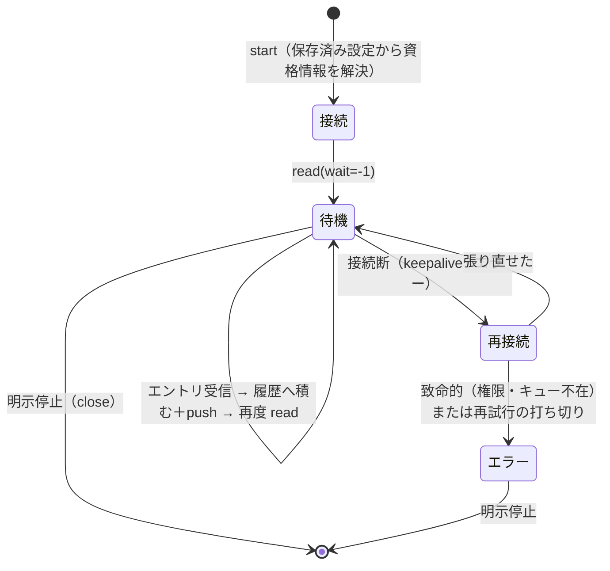

# 仕様: データ待ち行列の常駐監視と到着通知

## 概要

**監視をサーバーの常駐レジストリが所有し、WebSocket は購読するだけにする。**
これが設計の核心で、プリンター方式（WS 1:1）をコピーすると「ブラウザを閉じたら止まる」に
なって要件を満たさない（research F1・R1）。

監視は保存済みセッション設定（新種別 `dtaqwatch`）から開始し、監視コンソール（pane タブ）で
一覧・履歴・停止を行う。到着はタブの未読バッジで気づける。

## 設計方針

### 方針1: レジストリは `SessionManager` に相乗りさせず独立させる（research R2 の決着）

| 論点 | 相乗り | 独立（採用） |
|---|---|---|
| 30 分アイドル掃除 | **例外が要る**（監視は「何も来ないのが正常」） | 掃除の概念そのものが無い |
| 上限 8 の共有 | 監視が表示セッションの枠を食う | 監視専用の上限を持てる |
| 装置名・画面 | 監視は持たない（`SessionEntry` の半分が空になる） | 監視の形だけを持てる |
| WS との寿命 | `dispose` の対象外にする改造が要る | **最初から無関係** |

`SessionManager` に「掃除しないエントリ」を足すと、`20260729-session-lifetime-timeout` で
整理したばかりの寿命の規則（WS 切断＝破棄・アイドルで掃除）に例外が生える。
**寿命の異なるものを同じ箱に入れない。**

レジストリは **DTAQ 専用にしない**（research F7）。`WatchRegistry` は
「サービス型の常駐ジョブ」を持つ器で、監視の種類は `kind` で分ける。
今回入れるのは `kind: "dtaq"` の 1 種だけ——プリンターの常駐化は別作業（backlog に起票済み）。

### 方針2: 監視の寿命は「明示停止」または「プロセス終了」だけ

- WS 切断では止めない（`WsConnection.dispose()` はレジストリに触らない）
- タブを閉じても止めない（pane タブなので `closeSession` を通らない）
- **利用者のログアウトでも止めない。** 監視は設定が仕事をするサービス型で、
  「ログアウトしたら帳票が来なくなる」のと同じ違和感を避ける。
  所有者（`owner`）は保持し、**他人には見せない**
- プロセス再起動での自動復元はしない（requirement のスコープ外）

### 方針3: 長時間アイドルは **TCP キープアライブ＋自動再接続**で守る（research R3）

`wait=-1` は read タイムアウトを無効にするので、**相手が黙って消えても永久に待つ**。
`host-connection.ts` は `setKeepAlive()` を呼んでいない。

- **core に `setKeepAlive(true, 60_000)` を入れる**（全ホストサーバー接続に効く。
  プロトコルは変わらず、死んだ経路を OS が教えてくれるようになる）
- それでも切れたときは**レジストリが自動で張り直す**（指数バックオフ 1→2→5→10→30 秒上限）。
  連続失敗が続く間は `reconnecting`、致命的（権限・キュー不在）なら `error` に落とす
- **`wait` を区切って張り直す方式は採らない**——区切りの隙間に届いたエントリは
  次の `read` で取れるので取りこぼしは無いが、**「無通信で待つ」要件から離れる**うえ
  再接続のたびに認証往復が増える

> 実測を並行して走らせている（`scripts/probe-dtaq-longwait.mjs --minutes 45`）。
> **45 分越えが成立するかで keepalive の必要性の強さが変わる**が、
> 入れて損は無い（切断の検出が早くなるだけ）ので方針は変えない。

### 方針4: 常駐の対象は保存済み設定だけ（research F3）

ブラウザ直指定（`open` に host/user/password を載せる経路）は使わない。
資格情報はシステム設定の `signon` から**サーバー側だけで**解決するので、
ブラウザが居なくても再接続できる。`signon` 未登録なら開始時にエラーを返す。

### 方針5: 監視コンソールは pane タブ。未読の口を `PaneTabs` に足す（research F6）

セッションタブに置くと「タブを閉じたら切断」になり要件と矛盾する。
`PANE_PREFIXES` に `watch:` を足し、未読はセッションではなく**新しい store**から引く。

## 対象範囲（subtask で分ける）

| subtask | 範囲 |
|---|---|
| **01-registry** | core の keepalive / `watch-registry.ts` / 設定スキーマ（`dtaqwatch`）/ WS メッセージとハンドラ / server テスト |
| **02-console** | `stores/watches.ts` / `WatchPane.vue` / `paneLabels` ＋ `PaneTabs` の未読 / `LauncherPane` / `ConfigCard` / web-ui テスト |

契約（両者の境目）は **WS メッセージ型**と **`PublicSession.dtaqWatch`** の 2 つだけ。

### 01-registry のファイル

| ファイル | 変更 |
|---|---|
| `packages/core/src/transport/host-connection.ts` | `setKeepAlive(true, 60_000)` |
| `packages/server/src/watch-registry.ts` | **新規**。常駐レジストリ |
| `packages/server/src/config-types.ts` | `sessionTypeSchema` に `dtaqwatch` / `dtaqWatchSchema` / `sessionBase.dtaqWatch` / `PublicSession.dtaqWatch` / 種別と設定の整合チェック |
| `packages/server/src/config-store.ts` | `publicSession()` で転記 |
| `packages/server/src/ws-messages.ts` | `watch-*` メッセージ |
| `packages/server/src/ws-handler.ts` | 購読・開始・停止・履歴。**`dispose` はレジストリに触らない** |
| `packages/server/src/app.ts` | `WatchRegistry` を生成して `WsHandlerDeps` へ |
| `packages/server/src/main.ts` | `--max-watches`（既定 4） |
| `packages/server/src/index.ts` | 公開 |

### 02-console のファイル

| ファイル | 変更 |
|---|---|
| `packages/web-ui/src/stores/watches.ts` | **新規**。一覧・履歴・未読 |
| `packages/web-ui/src/components/WatchPane.vue` | **新規**。監視コンソール |
| `packages/web-ui/src/paneLabels.ts` | `watch:` を追加 |
| `packages/web-ui/src/components/PaneTabs.vue` | pane タブの未読 |
| `packages/web-ui/src/components/LauncherPane.vue` | `dtaqwatch` の接続＝監視開始（装置名分岐を通さない） |
| `packages/web-ui/src/components/ConfigCard.vue` | 種別と監視設定の編集 |
| `packages/web-ui/src/components/WorkspaceNode.vue` | `watch:` タブの描画 |

## インターフェース / データ構造

### 設定（`config-types.ts`）

```ts
export const sessionTypeSchema = z.enum(["display", "printer", "dtaqwatch"]);

/** 監視するキューの指定。**信頼設定ではない**（パス書き込み・コマンド実行・秘密に触れない） */
export const dtaqWatchSchema = z
  .object({
    library: z.string().min(1).max(10),
    name: z.string().min(1).max(10),
    /** 本文の符号化（既定 utf8）。`ebcdic` はシステム CCSID のキュー */
    encoding: z.enum(["utf8", "base64", "ebcdic"]).optional(),
    /** キー付きキューのキーと検索条件（両方揃って初めて意味を持つ） */
    key: z.string().optional(),
    search: z.enum(["EQ", "NE", "LT", "LE", "GT", "GE"]).optional()
  })
  .strict();
```

**種別と設定の整合を parse で強制する**（`superRefine`）:
`sessionType === "dtaqwatch"` なら `dtaqWatch` 必須。逆に他の種別で `dtaqWatch` を持たない。
片方だけ書ける状態にすると「監視のつもりで登録したのに何も起きない」が作れてしまう。

### レジストリ（`watch-registry.ts`）

```ts
/** サービス型の常駐ジョブ 1 本。**種類は kind で分ける**（今回は "dtaq" だけ） */
export interface WatchView {
  id: string;
  kind: "dtaq";
  /** 由来のセッション設定参照（`srv:` / `own:`） */
  ref: string;
  /** 表示名（`ライブラリー/キュー`） */
  label: string;
  state: "watching" | "reconnecting" | "error";
  error?: string;
  /** 累計受信件数 */
  received: number;
  startedAt: string;
  owner?: string;
}

/** 受信 1 件（履歴に積む） */
export interface WatchEntryView {
  seq: number;
  at: number;
  /** 本文（`encoding` で解いた文字列。base64 のときは base64 文字列） */
  text: string;
  bytes: number;
  /** 送信者情報（save sender 有効なキューのみ） */
  sender?: string;
}

export interface WatchRegistryOptions {
  /** 同時監視数の上限（既定 4）。1 本＝ホストサーバー接続 1 本を占有する */
  maxWatches?: number;
  /** 履歴の保持件数（キューあたり。既定 200） */
  historyLimit?: number;
  /** 接続を開く手段（テストで差し替える口） */
  connect?: (opts: ConnectOptions) => Promise<DtaqConnection>;
  now?: () => number;
}

export class WatchRegistry {
  start(opts: { ref: string; label: string; spec: DtaqWatchSpec; connect: ConnectOptions; owner?: string }): Promise<WatchView>;
  stop(id: string, user?: AuthUser): void;
  list(user?: AuthUser): WatchView[];
  history(id: string, user?: AuthUser): WatchEntryView[];
  /** push の購読（WS が使う）。戻り値で解除 */
  subscribe(fn: (ev: WatchEvent) => void): () => void;
  closeAll(): void;
}
```

**所有者の扱い**: `list` / `history` / `stop` は `assertOwner` で絞る（既存の規約を再利用）。
push も購読者の `user` で絞る。

### WS メッセージ（`ws-messages.ts`）

```ts
// client → server
export interface WsWatchSubscribe { type: "watch-subscribe"; }
export interface WsWatchStart { type: "watch-start"; session: string; }  // `srv:` / `own:`
export interface WsWatchStop { type: "watch-stop"; watchId: string; }
export interface WsWatchHistory { type: "watch-history"; watchId: string; }
// server → client
export interface WsWatchList { type: "watch-list"; watches: WatchView[]; }
export interface WsWatchEntry { type: "watch-entry"; watchId: string; entry: WatchEntryView; received: number; }
export interface WsWatchState { type: "watch-state"; watchId: string; state: WatchView["state"]; error?: string; }
export interface WsWatchHistoryRes { type: "watch-history"; watchId: string; entries: WatchEntryView[]; }
```

**`watch-*` はセッション（`open`）を要さない。** 監視コンソールは pane タブで
5250 セッションを持たないため、`open` していない WS でも通す。

## 振る舞いの詳細

### 監視 1 本のループ



- **エントリが無い間は無通信**（`wait=-1`）。ポーリングしない
- 履歴は上限 200 件。**古いものから落とす**（監視は続く）
- 停止は接続の `close()`。待機中の `read` は reject されるので、
  **停止フラグを立ててから閉じる**（reject を「エラー」と誤って表示しないため）

### 再接続の判定

| 事象 | 扱い |
|---|---|
| ソケット切断・タイムアウト | `reconnecting` → バックオフで張り直す |
| 権限が無い（`ACCESS_DENIED` 等） | **`error`**（待っても直らない） |
| キューが存在しない | **`error`** |
| `signon` 未登録 | `start` の時点でエラーを返す（監視を作らない） |
| 上限超過 | `start` が `SESSION_LIMIT` で失敗（既存コードを再利用） |

### 通知と未読

- push は購読中の WS 全部へ（所有者で絞る）
- 未読はクライアント側で数える（`stores/watches.ts`）。**タブを開いたら 0 に戻す**
  ——プリンターの `markSpoolRead` と同じ挙動
- タブのバッジは**全キュー合計**。行ごとの未読は一覧に出す

### 「消費する」ことの明示

監視は `read` でエントリを**取り出して消す**。本番キューに掛けると業務が壊れる。

- 設定カードに注意文を出す（`ConfigCard`）
- 監視コンソールの一覧上部にも常時出す（開始時だけの表示にしない）
- **文言は `opMessages.ts` に置く**（1 か所）

## ドメイン固有の考慮

- 監視 1 本＝ホストサーバー接続 1 本を占有する。**待機中は他の要求を出せない**
  （`pending` は 1 本）ので、属性取得やクリアは既存の HTTP ルート（別接続）で行う
- 既存の HTTP ルートの歯止め（**HTTP からの無限待ち禁止**）は維持する。
  無限待ちは常駐監視の内部でだけ使う
- 既存の `dtaq:entries` タブ（pull 型）には手を入れない

## エラー処理 / 異常系

| 事象 | 扱い |
|---|---|
| `watch-start` に `dtaqwatch` 以外の設定 | `CONFIG_ERROR`（種別が違う） |
| `watch-start` の参照が他人の設定 | `FORBIDDEN`（既存 `assertOwner`） |
| `watch-stop` に他人の watchId | `FORBIDDEN` |
| 上限超過 | `SESSION_LIMIT`（HTTP 換算 409） |
| 履歴が上限超過 | 古いものを落として続行（エラーにしない） |
| 購読中の WS が死んだ | 購読を解除するだけ。**監視は続く** |

## 受け入れ基準との対応

| requirement の完了条件 | 満たし方 |
|---|---|
| セッション段で接続すると監視が始まる | `dtaqwatch` 種別＋`LauncherPane` の分岐（02） |
| 監視中と対象キューが一覧で分かる | `watch-list`＋`WatchPane`（02） |
| 数秒以内に履歴へ現れる | `wait=-1` の受信 → `watch-entry` push（01） |
| タブに未読が付き、開くと消える | `stores/watches.ts`＋`PaneTabs`（02） |
| どのキューに何件かが行で分かる | 一覧の行ごとの未読（02） |
| 複数同時・個別停止 | レジストリの Map ＋ `watch-stop`（01） |
| タブを閉じても止まらない | pane タブ＋`dispose` がレジストリに触らない（01・02） |
| ブラウザを閉じても続く | レジストリが WS から独立（01） |
| 消費であることが分かる | 注意文（02） |
| 権限が無いとエラー状態で出る | `error` 状態＋`watch-state` push（01） |
| 履歴上限を超えても続く | 古いものを落とす（01） |
| 既存タブが壊れない | `dtaq:entries` に触らない（既存テストで担保） |
