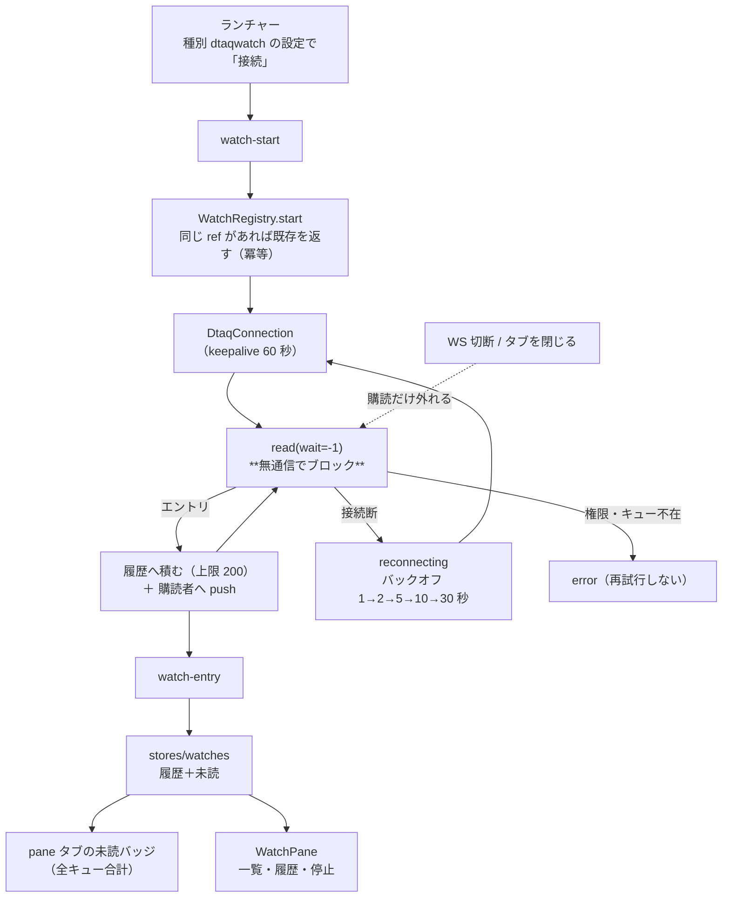

# レビューガイド: データ待ち行列の常駐監視と到着通知

## 変更概要 / 目的

指定したデータ待ち行列を**サーバーが常駐して待ち続け**、エントリが届いたら
**画面に触れなくても気づける**ようにした。既存の「データ待ち行列」タブ（pull 型・
押したときだけ要求）はそのまま残し、**push 型の別タブ**として作った。

## 特に見てほしい所

### 1. 実測が設計の必要性を決めた（**この PR で一番大事な発見**）

research が「利用者に実行を依頼する必要がある」と残していた唯一の未確定を測った。

| 45 分アイドル後の到着 | 結果 |
|---|---|
| **keepalive 無し**（これまでの実装） | **エントリが失われた** |
| **keepalive 有り**（この PR） | **受信できた** |

無しのとき何が起きたか: 別接続から送ったエントリは**キューから消えたのに、
待機中の `read` は返ってこなかった**（50 分時点でも待機のまま）。
つまり接続は死んでいるのに**こちらは気づかず、ホストは死んだソケットへ払い出して捨てた**。
「監視が止まる」より悪く、**取りこぼしが黙って起きる**。

`wait < 0` は read タイムアウトを無効にするので、**こちらから死を知る手はキープアライブだけ**。
`packages/core/src/transport/host-connection.ts:124` の 1 行は保険ではなく必須だった。

**残る限界**: 「受信＝消費」を 1 本の長寿命接続で行うので、**接続が死んだ瞬間に
払い出された 1 件は救えない**。業務で取りこぼしが許されないキューには掛けないこと
（その注意は UI に常時出している）。

### 2. 監視はレジストリが所有する。WS は購読するだけ（decisions D1・D7）

要件の核心は「**ブラウザを閉じても監視は続く**」。プリンター方式（WS 1:1）をコピーすると
「閉じたら止まる」になるので、

- `WatchRegistry`（新規）が監視を所有する。止まるのは**明示停止**か**プロセス終了**だけ
- `WsConnection.dispose()` は**購読を外すだけ**（`ws-handler.ts:503`）。
  ここを間違えると要件が壊れるので、空振り検証で固定した
- `watch-*` は **`open`（5250 セッション）を要さない**——コンソールは pane タブで
  セッションを持たないため

**`SessionManager` に相乗りさせなかった理由**: あちらの寿命の規則（WS 切断＝破棄・
アイドルで掃除）は先日整理したばかりで、監視は「**何も来ないのが正常**」。
同じ箱に入れると規則に例外が生える。

### 3. 実機とテストが 3 つの穴を見つけた

- **同じキューに監視が 2 本掛かった**（実機）。リロード後は画面側の重複判定がすり抜ける
  （**一覧がまだ届いていない**）。監視は消費するので 2 本掛かると
  **1 本ぶんを取り合って両方が欠ける**。判定を**サーバー側**へ移した（decisions D6）
- **リロード後に履歴が空だった**（実機）。`watch-list` は一覧だけで履歴を運ばない。
  **一覧の到着時に選択中の履歴を取り寄せる**ようにした
- **再接続後に永久に「再接続中」と表示された**（単体テスト）。受信できた時点で
  `watching` に戻す実装だったので、**エントリが来ないキューは戻らない**。
  接続が張れた時点で戻すよう直した（decisions D4）

## 処理フロー

## 主要な変更箇所

- `packages/core/src/transport/host-connection.ts:124` — **TCP キープアライブ**。
  上記 1 の測定が理由
- `packages/server/src/watch-registry.ts` — **新規**。冒頭の JSDoc に
  「なぜ `SessionManager` に相乗りしないか」「寿命」「待ち方」を書いてある
  - `:172` 同じ設定の二重監視を防ぐ（実機で踏んだ穴）
  - `:283` ループ本体。**繋がった時点で `watching` に戻す**理由がコメントにある
  - `:234` `subscribe(fn, user?)`。**絞り込みはレジストリが行う**（所有の規則を 2 か所に書かない）
- `packages/server/src/ws-handler.ts:503` — `dispose()` は**購読だけ**畳む
- `packages/server/src/config-types.ts` — `dtaqwatch` 種別・`dtaqWatchSchema`・
  **種別と設定の整合を parse で強制**（`assertTypeConsistent`）／
  `sessionInputSchema`（`.superRefine()` が `.omit()` を壊す問題。decisions D8）
- `packages/web-ui/src/stores/watches.ts` — サーバーの写し。**真実はサーバー**
- `packages/web-ui/src/components/WatchPane.vue` — コンソール。**消費の注意を常時**出す
- `packages/web-ui/src/components/PaneTabs.vue:51` — **pane タブの未読**
  （セッションを持たないタブでは `sessionsStore` から引けない）

## リスク / 確認してほしい点

- **取りこぼしはゼロにできない**（上記 1）。UI に常時注意を出しているが、
  「本番キューに掛けてはいけない」という運用上の約束が要る
- **測定は各 1 回**（45 分 × keepalive 有無）。機構は説明できるが試行数は少なく、
  経路（NAT・ファイアウォール）が違う環境では別の閾値になりうる
- **`setKeepAlive` は全ホストサーバー接続に効く**（SQL・IFS・コマンドも）。
  要求ごとの短い接続には実害が無いはずだが、影響範囲は core 全体
- **同時監視数の既定は 4**（`--max-watches`）。監視 1 本＝ホストサーバー接続 1 本を占有する
- **複数利用者・認証オンでの同時監視は実機で試していない**（所有の分離は単体テストのみ）
- 空振り検証 20/20。1 件すり抜けた「停止の印の順序」は**順序に依存していなかった**ことが
  分かったので、コメントを訂正した（decisions D3）
