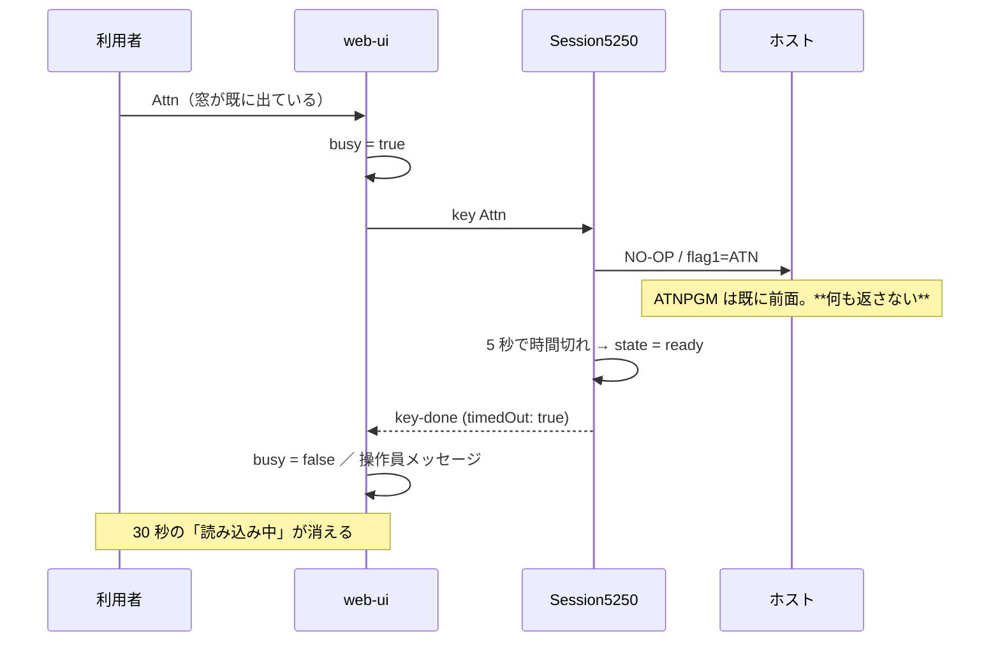

# 仕様: Attn 窓の高さずれと、応答しない Attn で固まる問題

## 概要

独立した 2 つの修正を 1 本にまとめる（同じ利用者報告に由来し、どちらも Attn 窓で観測される）。

1. **web-ui**: `.half-cell` の切り詰めを `overflow: hidden` から **`clip-path: inset(0)`** へ。
2. **core / web-ui**: **Attn / SysReq の応答待ちを 5 秒**にし、時間切れを操作員メッセージで知らせる。

## 設計方針

### 方針 1: 切り詰めは `clip-path` で行う（ベースラインを変えない）

CSS の規定で、インラインブロックのベースラインは `overflow` が `visible` 以外だと**下マージン端**になる。
実ブラウザで測ると `overflow: hidden` は隣の文字に対して **-2px** ずれ、`clip-path: inset(0)` は **0px**。
`clip-path` は**描画だけを切る**（レイアウト・ベースラインに影響しない）ので、目的
（1 桁幅に収めて左半分だけ見せる）を保ったままずれが消える。

`inset(0)` はボーダーボックス＝`width: 1ch` の箱に切る。glyph は 2ch ぶんの幅を持つが、
はみ出した部分は描画されない。

### 方針 2: フラグレコードは「応答しないことがある」操作として扱う（未確定事項 1 の解消）

**待ち時間を 5 秒**にする。根拠:

- 実機（LAN）で 1 回目の Attn は**送信から 40ms 以内**に 3 レコードが返る。5 秒は十分に余裕がある。
- **早く戻しても取りこぼさない**——ホストが後から画面を送ってきたら、従来どおり screen イベントで反映される。
  時間切れで失うのは busy（多重送信プロテクト）だけで、画面は壊れない。
- 既定 30 秒のままだと、無視されたときに**30 秒間オーバーレイが残る**。利用者の言う「固まる」はこれ。

通常の AID（Enter・F キー）は**従来どおり既定 30 秒**。画面を返すのが前提の操作なので、
短くすると遅いホストで誤って busy を解いてしまう。

```ts
/** Attn / SysReq の応答待ち（既定 5 秒）。ホストが黙って無視することが正常にあり得るため、
 *  画面を返す前提の AID（既定 30 秒）とは別の待ち時間にする。 */
export const FLAG_KEY_TIMEOUT_MS = 5_000;
```

### 方針 3: 時間切れは無言で戻さず、操作員メッセージを出す

`key-done` は既に `timedOut` を運んでいる。web-ui はこれを見て、セッション状態に
**操作員メッセージ**を立てる。「押したのに何も起きなかった」を無言にすると、利用者は
不具合と区別できない（今回の報告がまさにそれ）。

文言: **「ホストから応答がありませんでした」**。既存の操作員メッセージ（`MSG_PROTECTED` 等）と同じ枠で出す。

### 方針 4: 通知は store 経由（ペインをまたぐ配線を増やさない）

`key-done` を処理するのは `session-controller`（ws メッセージ受け）で、操作員メッセージを描くのは
`StatusBar`（`EmulatorPane` のローカル ref 経由）。両者を直接つなぐ代わりに、
**`SessionState` に `notice?: string` を足す**。`EmulatorPane` は自分のローカル通知と store の通知の
どちらかを `StatusBar` へ渡す。ローカル通知は既存どおりキー操作で消え、store 通知は
**次の送信で消す**（`sendKey` の先頭でクリア）。

## 対象範囲

| 層 | ファイル | 変更 |
|---|---|---|
| core | `src/session/session.ts` | `FLAG_KEY_TIMEOUT_MS` と、フラグキーのときの既定待ち時間 |
| core | `src/index.ts` | 定数の公開（テストから参照） |
| web-ui | `src/components/ScreenGrid.vue` | `.half-cell` を `clip-path` へ |
| web-ui | `src/stores/sessions.ts` | `SessionState.notice` |
| web-ui | `src/session-controller.ts` | `key-done` の `timedOut` で通知を立てる／`sendKey` で消す |
| web-ui | `src/components/EmulatorPane.vue` | ローカル通知と store 通知を束ねて `StatusBar` へ |
| web-ui | `src/composables/opMessages.ts` | 文言の定数 |

## インターフェース / データ構造

```ts
// core/session/session.ts
export const FLAG_KEY_TIMEOUT_MS = 5_000;

// buildAidRecord と同じ判定でフラグキーかを見る
const isFlagKey = key === "Attn" || key === "SysReq";
return this.sendAndWait(record, opts.timeoutMs ?? (isFlagKey ? FLAG_KEY_TIMEOUT_MS : undefined));
```

```ts
// web-ui/stores/sessions.ts
export interface SessionState {
  // …
  /** 操作員メッセージ（サーバー応答由来。ホスト無応答の通知等）。次の送信で消える */
  notice?: string;
}
```

```ts
// web-ui/composables/opMessages.ts
export const MSG_NO_RESPONSE = "ホストから応答がありませんでした";
```

## 振る舞いの詳細



- 時間切れ後にホストが遅れて画面を送ってきた場合、screen イベントで通常どおり反映される
  （メッセージは次の送信で消える）。
- 通常の AID が時間切れした場合も同じメッセージを出す（現状は無言で戻っていた）。

## ドメイン固有の考慮

- **ホストが応答しないのは正常**。ATNPGM が既に前面にあるとき IBM i は 2 回目の Attn を無視する
  （実機で確認）。こちらが待ち続けるのが誤りで、ホスト側に手を入れる話ではない。
- **5250 の Reset キー**（入力禁止の手動解除）は実装しない。今回は「勝手に戻る」ことで解決する。
  ACS の挙動（Reset 待ちか自動復帰か）は未確認で、違いが分かれば追随する（decisions）。
- `clip-path` は主要ブラウザで長く安定して使える。`overflow` と違いレイアウトに副作用が無い。

## エラー処理 / 異常系

- 時間切れは**エラーにしない**（既存の `timedOut: true` の契約を維持）。
- 切断中・busy 中の Attn は既存の `sendKey` の早期 return がそのまま効く。

## 受け入れ基準との対応

| requirement の完了条件 | 満たし方 |
|---|---|
| `.half-cell` のベースラインが揃う | 実ブラウザ計測（`clip-path` で 0px）＋既存の桁テスト |
| 1 桁幅を保ちはみ出さない | 既存 `screen-grid-dbcs-orphan.test.ts` が通ること |
| フラグキーの待ちが短い | `session.test.ts` で Attn が `FLAG_KEY_TIMEOUT_MS` で戻ることを確認 |
| 無応答で操作員メッセージ | コンポーネントテストで `key-done(timedOut)` → メッセージ表示 |
| 通常 AID の待ちが不変 | 既存テストが通ること |
| 実機で固まらない・ずれない | 実機で 2 回 Attn／窓のスクリーンショット |
