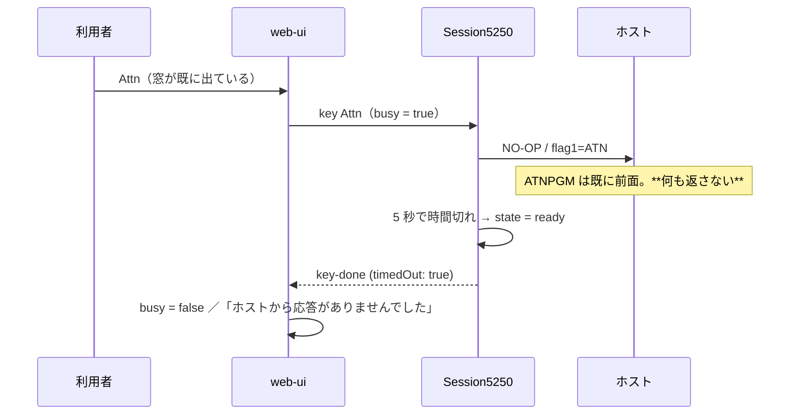

# レビューガイド: Attn 窓の高さずれと、応答しない Attn で固まる問題

## 変更概要 / 目的

利用者から 2 件の報告。どちらも Attn の窓で観測されるが、原因は別。

1. **高さ方向のずれ** — 直前の PR #159 で入れた `.half-cell` の **`overflow: hidden` が回帰**だった。
2. **窓が出た状態で再度 Attn を押すと読み込み中で固まる** — **ホストが 1 バイトも返さない**のに、
   画面を返す前提の AID と同じ 30 秒を待っていた。

## 重要ポイント（特に見てほしい所）

### 1. `overflow: hidden` はインラインブロックのベースラインを変える（回帰の正体）

CSS の規定で、インラインブロックのベースラインは通常「最後の行ボックスのベースライン」だが、
**`overflow` が `visible` 以外だと「下マージン端」**になる。実ブラウザで測った結果:

| 指定 | 隣の文字とのずれ |
|---|---|
| `overflow: hidden` | **-2px** |
| `clip-path: inset(0)` | 0px |
| 指定なし | 0px |

`clip-path` は**描画だけを切る**のでレイアウトに影響しない。切り詰めの目的（1 桁に収めて左半分を見せる）は
そのままに、ずれだけが消える。

### 2. Attn / SysReq は「応答しないことがある」操作（実測）

実機で Attn を 2 回続けて送った結果:

```
>>> Attn（1 回目）  <<< 0x0a → 0x04 → 0x03   timedOut=false
>>> Attn（2 回目）  （受信ゼロ）              timedOut=true 経過=20008ms
```

ATNPGM が既に前面にあるので、ホストは 2 回目を**無視する**（IBM i の正しい動作）。
こちらが 30 秒待ち続けるのが誤りだった。

**待ちを 5 秒にしても取りこぼさない**——時間切れ後にホストが送ってきた画面は screen イベントで
反映される。失うのは busy（多重送信プロテクト）だけ。通常の AID は 30 秒のまま。

### 3. 無応答を無言で戻さない

「押したのに何も起きない」が不具合と区別できないのが今回の報告そのもの。時間切れ時に
**操作員メッセージ**を出す。通知は `SessionState.notice` に持ち、次の送信で消す。

`EmulatorPane` の `effectiveNotice` は**ローカル発を優先**するが、そのままだとボタン経由の Attn で
ローカル通知が残り、サーバー発の通知を覆い隠す（review で検出）。`onAid` の先頭で消して塞いだ。

## 処理フロー



## 主要な変更箇所

- `packages/web-ui/src/components/ScreenGrid.vue` — `.half-cell` を `clip-path: inset(0)` へ（**回帰の修正**）
- `packages/core/src/session/session.ts` — `FLAG_KEY_TIMEOUT_MS = 5000` とフラグキーの既定待ち
- `packages/web-ui/src/session-controller.ts` — `key-done(timedOut)` で通知／`sendKey` で消す
- `packages/web-ui/src/components/EmulatorPane.vue` — `effectiveNotice`（ローカル優先＋ボタン経路の穴埋め）
- `packages/web-ui/src/stores/sessions.ts` / `composables/opMessages.ts` — 通知の置き場と文言

## リスク / 確認してほしい点

- **5 秒という値**（decisions D2）。実機では 1 回目の Attn が送信から 40ms 以内に返るので余裕はあるが、
  遠隔・低速回線のホストでは早すぎる可能性がある。早すぎても画面は届くので実害は busy が先に解けることだけ。
- **ACS が 2 回目の Attn でどう振る舞うかは未確認**（decisions D3）。ACS が入力禁止のまま Reset 待ちなら、
  こちらの「勝手に戻る」は挙動が違う。タップ採取には ACS 操作が要るため、まず自動復帰で実装した。
- **測り方を途中で変えた**（test.md）。最初はベースライン差を測ろうとしたが、インラインブロックと
  素のインライン要素では箱の高さが違い判定に使えなかった。症状そのもの（行の高さ・間隔の均一性）に変えた。
