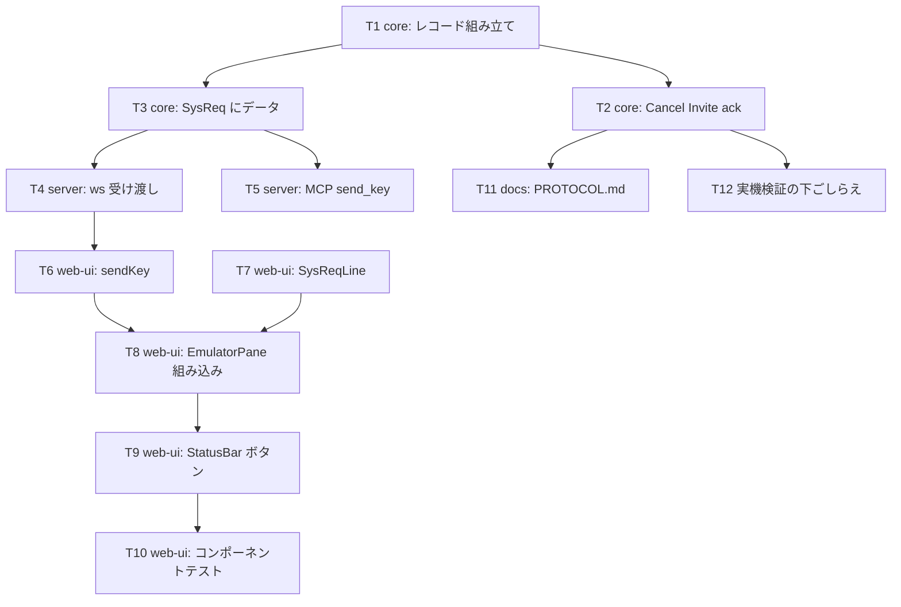

# 計画: Attn / SysReq を実際に機能させる

## 分割判定（split）

**分割しない（subtask 化しない）。** 決定木の discriminator「そのピースは単独で検証・デリバリ可能か」で見ると、
core の ack 修正だけは単独でも価値があるが、SysReq のシステム要求行は core（データ付きレコード）→
server（受け渡し）→ web-ui（入力行）が**一本の縦串**で、途中まででは検証できない。
一方で規模は小〜中（実質 10 ファイル・新規コンポーネント 1 つ）で 1 PR に収まる。
protocol「2.8」の「小〜中規模 work では使わない（過剰分割の禁止）」に該当する。

## 実装方針

**下から上へ**積む。core が固まれば server / web-ui は薄い配線で済み、各段でテストを添えられる。

**T2（ack）は単体で「Attn が動く」ところまで到達する**ので、ここを最優先で正しく置く。
以降の SysReq 系（T3 以降）は、その上に載る追加機能という位置づけ。

## 作業順序と依存関係

1. **T1 core: レコード組み立て**（依存: なし）— `buildFlagRecord` にデータ引数、`buildCancelInviteAck` を追加。
2. **T2 core: Cancel Invite ack**（依存: T1）— `handleRecord` の opcode 分岐。**本 work の本丸**。
3. **T3 core: SysReq にデータ**（依存: T1）— `SendAidOptions.sysReqText` と `buildAidRecord`。
4. **T4 server: ws 受け渡し**（依存: T3）／ **T5 server: MCP**（依存: T3）— 並行可。
5. **T6 web-ui: sendKey**（依存: T4）。
6. **T7 web-ui: SysReqLine**（依存: なし。単体で作れる）。
7. **T8 web-ui: EmulatorPane 組み込み**（依存: T6, T7）。
8. **T9 web-ui: StatusBar ボタン**（依存: T8）。
9. **T10 web-ui: コンポーネントテスト**（依存: T7〜T9）。
10. **T11 docs**（依存: T2, T3）／ **T12 実機検証の下ごしらえ**（依存: T2, T3）。

## リスク / 留意点

- **ack を無条件に返すことの副作用**。Attn/SysReq を押していないのにホストが Cancel Invite を投げた場合も
  ack を返し、かつキーボードをロックする。実機ではホストが直後に必ず書き込みを送ってくることを確認済みだが、
  万一送ってこなくても既存の `sendAid` タイムアウト（既定 30 秒）で `ready` に戻る安全弁が効く。
  **原典（tn5250j）と同じ挙動**を採る判断は spec 方針 1 に記録済み。
- **ack 送信の再入**。`handleRecord` の中から `telnet.sendRecord` を呼ぶのは既存の `saveScreenRequested` /
  `queryRequested` と同じ形なので、新しい危険は増えない。ただし ack 後に `return` **しない**点は既存応答と
  違う（データが空なので後続処理は無害だが、レビューで見落とされやすい）。コメントで意図を残す。
- **システム要求行のキー横取り**。`SysReqLine` の `<input>` は `.pane` の子なので keydown が
  `EmulatorPane` まで伝播する。早期 return を入れ忘れると **Enter が二重に解釈される**（行の確定と
  5250 の Enter 送信が両方走る）。T10 のテストで必ず押さえる。
- **既存テストの後方互換**。「SysReq は SRQ ヘッダフラグの空レコードを送る」は `buildFlagRecord` の
  シグネチャ変更後もそのまま通ること（データ引数は任意）。
- **実機検証は装置名の制約がある**。実機は事前定義された装置名しか受け付けず、`QPADEV000x` 系のみ
  自動作成が通る（`DEV1` は利用者が使用中のことがある）。`scripts/probe-sysreq.mjs` はこの前提で書いてある。

## テスト方針

### ユニット / コンポーネント（test 工程の主体）

- **core**（`packages/core/test/`）
  - `read-response.test.ts`: データ付き SRQ レコードの hex が実機採取値 `001012a0000004040000c4e2d7d1d6c2`
    と一致すること／`buildCancelInviteAck()` が `000a12a0000004000a`（opcode 0x0A・フラグ 0・データ無し）であること。
  - `session.test.ts`: `ReplayTransport` に `tx`（Attn）→ `rx`（Cancel Invite）→ `rx`（unlock 付き画面）の
    エントリを並べ、`sendAid("Attn")` が解決し、`sentChunks` に ack レコードが積まれていることを確認する。
    ReplayTransport は `send()` を受けて次の rx へ進むので、この並びで往復を再現できる。
  - `sysReqText` を SysReq 以外に付けたら `PROTOCOL_ERROR` になること。
  - 既存の「SysReq は SRQ ヘッダフラグの空レコードを送る」が通り続けること（後方互換）。
- **web-ui**（`cd packages/web-ui && npx vitest run`）
  - `SysReqLine`: 開くと入力欄にフォーカス／Enter で `submit`／Escape で `cancel`。
  - `EmulatorPane`: SysReq のキーバインドで行が開き **その時点では `sendKey` を呼ばない**／
    Escape で閉じて **1 度も送らない**／Enter で `sendKey(..., "SysReq", ..., text)` を呼ぶ／
    行が開いている間は F キーが 5250 へ飛ばない。
  - `StatusBar`: Attn ボタンが `sendKey(..., "Attn")` を呼ぶ／SysReq ボタンは送らず `sysreq` を emit する。

### 実機（受け入れ基準の要）

`node --env-file=.env scripts/probe-sysreq.mjs` を**手動 ack を外した状態**で実行し、次を確認する。

1. Attn → 画面下部に「コマンド入力」窓が出る → コマンドを実行できる → F3 で背面が戻る。
2. SysReq を空実行 → 「システム要求」メニューが出る。オプション `6` で該当画面へ遷移する。

装置名は `QPADEV000x`（`SRQ_DEV` で指定）。実行後は切断されたジョブが残るため、同じ装置名を続けて
使うと「対話式ジョブの回復」画面が出る点に注意する。

### ビルド

- `npm run build`（core / server）
- `npm run build -w @as400web/web-ui`（**vue-tsc 込み**。テンプレートの型エラーはこれでしか出ない）
- `npm test`（既存の全テスト）
