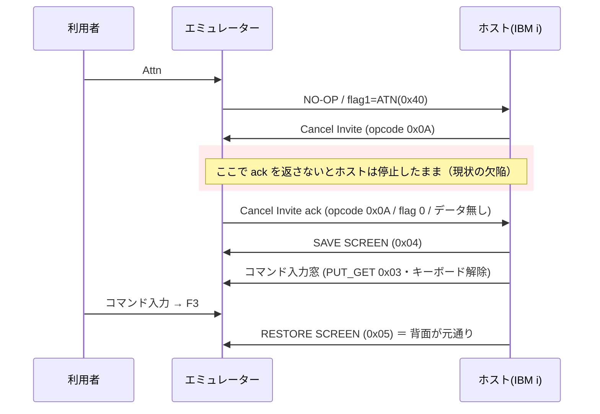

# 要件: Attn / SysReq を実際に機能させる（ACS の Esc 相当）

## 背景 / 課題

ACS（IBM i Access Client Solutions）では **Esc を押すと画面下部にコマンド入力欄が現れ、そこから CL コマンドを
実行できる**。利用者はこれを日常的に使っている。当エミュレーターは ACS の代替を目指しているのに、これができない。

正体を実機（/ system `S1234567`）で確かめたところ、この入力欄は **Attn（アテンション）キー**の結果だった。
Attn を送るとホスト側の ATNPGM（当該システムでは `EVXX01`）が画面下部に「コマンド入力」窓を重ねる。
**窓を描くのはホスト**なので、端末側は Attn を正しく送りさえすればよい。

ところが当実装では **Attn も SysReq も無反応**である。`AidKey` には両方あり、キー設定画面（⌨ キー）でも
MCP の `send_key` でも指定できるのに、押しても何も起きない。原因は**プロトコルの取りこぼし**だった。

ホストは Attn / SysReq を受け取ると **Cancel Invite（opcode `0x0A`）** を返し、端末が
**同じ opcode `0x0A`・フラグ 0・データ無しのレコードで返事する**まで先へ進まない。当実装は `0x0A` を
素通ししているため、ホストが待ち続けて画面が変わらず、キーボードもロックされたままになる。

実機での対照実験（`scripts/probe-sysreq.mjs`）:

| 返事 | 結果 |
|---|---|
| 返す | `SAVE SCREEN(0x04)` → コマンド入力窓 `PUT_GET(0x03)` → F3 → `RESTORE SCREEN(0x05)` が正常に流れる |
| 返さない | 無反応。次に別の AID を送った時点で**1 手遅れて**窓が出る |

原典の裏取りは tn5250j 0.8.0-beta2 の `org.tn5250j.framework.tn5250.tnvt` を逆アセンブルして行った
（AGENTS.md「既存プロトコル実装の移植」に従い、**逐語移植せず事実として書き起こす**）:

- `cancelInvite()` = `writeGDS(0, 10, null)` … flags1=0 / opcode=`0x0A` / データ無しを返す
- `systemRequest(String)` = `writeGDS(4, 0, ebcdic(str))` … flags1=`0x04`(SRQ) / opcode=`0x00`(NO-OP) /
  **データにシステム要求行の文字列**。先頭が `2` のときは受信キューを捨てる（前の要求の終了のため）
- tn5250j はシステム要求行を**ローカルに**入力させてから 1 レコードで送る
  （＝入力欄はホスト往復を伴わない端末側の機能）

## 目的 / ゴール

- Attn を押すと、ACS と同じようにホストの ATNPGM 窓（当該システムでは画面下部のコマンド入力欄）が出て、
  コマンドを実行でき、F3 で元の画面へ戻れる。
- SysReq を押すと、ACS と同じように**システム要求行**が画面下部に出て、オプション（`2` / `6` / `90` 等）を
  打てる。空のまま実行すれば「システム要求」メニューが出る。
- キー設定画面を触らない利用者にも導線がある。

## スコープ

### 対象

1. **Cancel Invite（`0x0A`）への ack を返す**（core）。これが無いと Attn も SysReq も動かない。
   MCP の `send_key` 経由にも同時に効く。
2. **SysReq にデータを載せられるようにする**。ACS 相当の「システム要求行」を画面下部にローカル表示し、
   打った文字列を SRQ レコードのデータとして送る（空実行ならシステム要求メニュー）。
3. **トップバーに Attn / SysReq ボタンを足す**（キー設定を触らない人向けの導線）。
4. `docs/PROTOCOL.md`「6.2 SysReq / Attn」に ack の往復とデータ付き SysReq を追記する。

### 対象外

- **Esc の既定キーバインドを足すこと**。Esc は現在「ヘッダーメニューを閉じる」「ブロック選択を解除」に
  使われており、既存の挙動を一切変えない（利用者が ⌨ キー設定で自分で Esc → Attn を割り当てる前提）。
- **コマンド入力窓そのものの描画**。あれはホストの ATNPGM が描くもので、端末の責務ではない。
  ATNPGM の内容はシステム設定（`EVXX01` は実機固有）なので、こちらで模倣しない。
- **システム要求行での CL コマンド実行**。実機で `DSPJOB` を送ると「オプション D は正しくない」となり、
  この欄は**オプション専用**であることを確認済み。コマンドが打てるのは Attn 側の窓（ホストが描く）。
- **TRQ（Test Request）/ HLP（Help in Error State）フラグの対応**。今回の欠陥とは別軸。
- Esc 以外のキーの既定バインド変更。

## 機能要件

- ホストから opcode `0x0A`（Cancel Invite）のレコードを受けたら、**opcode `0x0A`・フラグ 0・データ無し**の
  レコードを返す。ack は Attn / SysReq の送信有無に関わらず、受信したら常に返す（原典と同じ無条件）。
- ack 後にホストが送る `SAVE SCREEN` / `RESTORE SCREEN` は既存のバッファ実装（`saveScreen` / `restoreScreen`）で
  そのまま処理でき、背面が元通りに戻る。
- SysReq は文字列を伴って送れる。レコードは opcode NO-OP・flag1 に SRQ、データは当該セッションの CCSID で
  EBCDIC 化した文字列。文字列なし（空）も従来どおり送れる。
- Web UI で SysReq を押すと**画面下部にシステム要求行**が出る。ホストへの往復は発生せず、端末側だけで表示する。
  - 行の入力を確定するとホストへ送る。取り消したときは**何も送らない**。
  - 表示中は 5250 画面側のキー操作を奪い、システム要求行が入力を受ける。
- トップバーから Attn / SysReq を押せる。押下対象は**フォーカス中の 5250 ペイン**（既存のヘッダー機能ボタンと
  同じ連動規則。AGENTS.md「UI デザインガイド」）。5250 ペインが活性でないときは出さない。

## 非機能要件 / 制約

- **core のピュアロジック層は Node API 非依存**を維持する（AGENTS.md）。ack の送信は既存の telnet 層経由。
- ack の送信は**受信処理の再入に耐える**こと。既存コードの「先に状態を戻す」流儀に合わせ、
  ack を送った結果ホストが即座に次データを流しても取りこぼさない。
- 原典（tn5250j / JTOpen）は **IBM Public License 1.0** 系のため逐語移植しない。バイト配置・定数・手順は
  事実として書き起こし、参照した原典クラス／メソッド名をコメントに残す（AGENTS.md「4. ライセンスと出典」）。
- web-ui のビルドは `vue-tsc` を含めて通す。テストは `cd packages/web-ui && npx vitest run` で実行する。
- UI の見た目は `docs/UI-DESIGN.md` に従う（配色は CSS 変数・トップバーのボタンは `.theme-btn`）。
- 既存の Esc の挙動・既定キーバインドを変えない（後方互換）。

## 完了条件 (受け入れ基準)

- [ ] opcode `0x0A` を受けたら `0x0A`・フラグ 0・データ無しを返すユニットテストが通る。
- [ ] データ付き SysReq のレコードが `LL / 0x12A0 / 予約 / 0x04 / flag1=0x04 / flag2=0 / opcode=0x00 / EBCDIC` の
      並びで組まれるユニットテストが通る（実機で採取した `001012a0000004040000c4e2d7d1d6c2` と同形）。
- [ ] SysReq を空で送るレコードが従来どおり `000a12a0000004040000` であること（後方互換）。
- [ ] Web UI で SysReq を押すと画面下部にシステム要求行が出て、取り消すと**何も送らない**ことを
      コンポーネントテストで確認できる。
- [ ] トップバーの Attn / SysReq ボタンがフォーカス中の 5250 ペインに送ることを確認できる。
- [ ] **実機（）で Attn を押すとコマンド入力窓が出て、コマンドを実行でき、F3 で背面が戻る**。
- [ ] **実機で SysReq を空実行すると「システム要求」メニューが出る**。オプション（例 `6`）を打つと
      該当画面へ遷移する。
- [ ] `docs/PROTOCOL.md` 6.2 に ack の往復とデータ付き SysReq が追記されている。
- [ ] 既存テストが全て通り、`npm run build` と `npm run build -w @as400web/web-ui`（vue-tsc 込み）が通る。

## 未確定事項 / 確認したいこと

- **tn5250j の「先頭が `2` なら受信キューを捨てる」を再現するか**。あちらは受信データストリームを
  `BlockingQueue` に積む設計で、前の要求を終了させるとき積み残しが害になるための処置。当実装は
  レコードを到着順にその場で処理していてキューが無いため、**そのまま不要と考えられる**。spec で判断する。
- **システム要求行の見た目と入力幅**。実機のシステム要求行は最下行に出る。既存の CRT ペインの
  どこに・どの意匠で出すか（`docs/UI-DESIGN.md` 準拠）は spec / design で決める。
- **キーボードロック中に SysReq を出せるか**。5250 の System Request は本来ロック中でも効く
  （ホスト応答待ちを抜けるための手段）。当実装の `assertReady` / `locked` 状態との折り合いを spec で決める。
