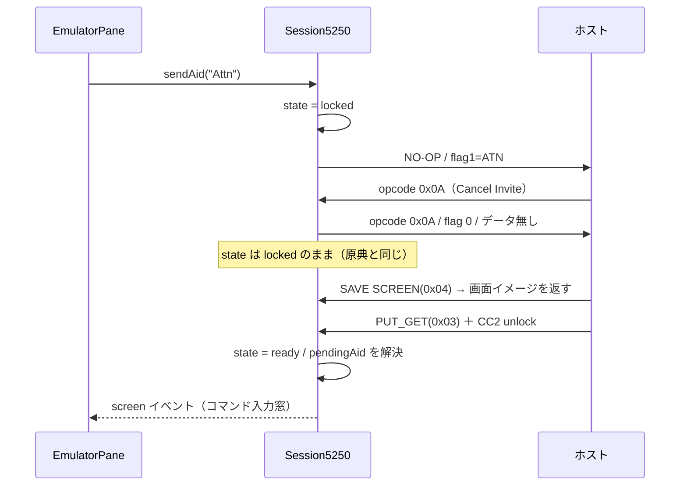

# 仕様: Attn / SysReq を実際に機能させる（Cancel Invite 応答 ＋ システム要求行）

## 概要

3 層に分けて実装する。

1. **core（プロトコル）** — ホストの Cancel Invite（opcode `0x0A`）に ack を返す。これが本丸で、
   これ単体で Attn が実機どおり動くようになる。併せて SysReq がデータ（システム要求行の文字列）を
   載せられるようにする。
2. **server（配線）** — SysReq の文字列を WebSocket / MCP から core まで通す。
3. **web-ui（操作）** — SysReq を押したら画面下部にシステム要求行を出し、確定した文字列を送る。
   Attn / SysReq を CRT フッター（`StatusBar`）のキー行から押せるようにする。

## 設計方針

### 方針 1: ack は opcode を見て無条件に返す（原典と同じ）

`handleRecord` の opcode 分岐で `OPCODE.CANCEL_INVITE` を見て ack を返す。**Attn / SysReq を送ったかどうかで
条件分けしない**。tn5250j は opcode ディスパッチで無条件に `cancelInvite()` を呼んでおり、
AGENTS.md「規格どおりより既存クライアントと同じ挙動を優先する」に従う。状態で条件分けすると、
ホスト都合の invite 取り消し（こちらが Attn を押していない場合）で再び固まる。

ack と同時に**キーボードをロックする**（`state === "ready"` のときだけ `locked` にする）。
これも原典と同じ（`cancelInvite()` は `setInputInhibited(1,1)` を呼ぶ）。ホストは ack の直後に必ず
書き込み（`SAVE SCREEN` → `PUT_GET` の unlock）を送ってくることを実機で確認済みなので、
ロックしたまま取り残されることはない。

### 方針 2: 受信キューの破棄は移植しない

tn5250j の `systemRequest(String)` は先頭が `2`（前の要求の終了）のとき `dsq.clear()` で受信キューを捨てる。
これは**あちらが受信データストリームを `BlockingQueue` に積む設計だから**必要な処置で、当実装は
`telnet.onRecord` → `handleRecord` で到着順にその場で処理しており**キューが存在しない**。
移植する対象そのものが無いので入れない（requirement 未確定事項 1 の解消）。

### 方針 3: SysReq の文字列は `SendAidOptions` に載せる（新メッセージ型を作らない）

送信経路（busy プロテクト・`assertKeyAllowed` の readOnly ゲート・監査ログ・`key-done` の対応付け）は
既存の AID 経路と完全に同じでよい。ここに `sysreq` という別メッセージ型を作ると、同じ歯止めを
2 系統に書くことになり、片方の付け忘れが起きる（AGENTS.md「認可はサーバーで担保する」の
「呼び出し元に条件分岐を書かない」と同じ理由）。よって既存の `key` 経路にオプション項目を 1 つ足す。

### 方針 4: システム要求行は端末側だけで完結させる

システム要求行はホストとの往復を伴わない**端末のローカル機能**である（tn5250j は同等の入力を
ダイアログでローカルに取ってから 1 レコードで送る）。したがって core / server は関与せず、
web-ui の状態として持つ。取り消したときは**レコードを 1 本も送らない**。

### 方針 5: キーボードロック中の送信は今回の対象外（requirement 未確定事項 3 の解消）

5250 の System Request は本来ホスト応答待ちの最中でも効く（固まった要求を option 2 で切るための手段）。
しかし当実装で今それを通すには、

- `Session5250.pendingAid` が**1 本しか持てない**（2 本目を投げると `key-done` の対応付けが壊れる）
- `session-controller.sendKey` の `s.busy` 早期 return（多重送信プロテクト）
- `sendAid` が入口で `assertReady()` を投げる

の 3 つを同時に崩す必要があり、AID 送信の中核に手を入れる話になる。今回の目的（Esc でコマンド入力欄）は
ack の修正だけで達成でき、**そもそも「固まる」原因が今回直す欠陥そのもの**なので、切り離して見送る。
`decisions.md` に残し、必要になったら別 work で扱う。

### 方針 6: ボタンの置き場は CRT フッター（`StatusBar`）にする

**利用者は「トップバー」を選んだが、置き場を `StatusBar` のキー行に変える。** 理由は PJ の明文規約に
反するため（AGENTS.md「ボタンは設置面の系統に合わせる（トップバー `.theme-btn`＝固定高 28px /
CRT ペイン＝`.fk` 意匠）」／`App.vue` のヘッダー冒頭コメント「**ヘッダーに置くのは『いまどのシステムに
繋いでいるか』と、このアプリ自身の管理だけ。IBM i の機能はランチャー（本体）に並ぶ**」）。
Attn / SysReq は IBM i の機能（5250 の AID キー）であってアプリ管理ではない。

`StatusBar` には既に **`F1 ヘルプ / F3 終了 / F4 プロンプト / F5 更新 / F12 取消 / ⏎ 実行` の `.fk` ボタン行**が
あり、AID を押す導線としてはここが正規の置き場。ペインごとに描かれるのでアクティブペイン連動の配線も要らない。
利用者の意図（「キー設定を触らない人向けの導線」）はこちらの方が素直に満たせる。

## 対象範囲

| 層 | ファイル | 変更 |
|---|---|---|
| core | `src/protocol/read-response.ts` | `buildFlagRecord` にデータ引数を足す／`buildCancelInviteAck` を追加 |
| core | `src/session/session.ts` | `handleRecord` に Cancel Invite 分岐／`SendAidOptions.sysReqText`／`buildAidRecord` |
| server | `src/ws-messages.ts` | `WsKey.sysReqText` |
| server | `src/ws-handler.ts` | `onKey` で `sysReqText` を `sendAid` へ渡す |
| server | `src/mcp-tools.ts` | `send_key` に `sysReqText`（任意） |
| web-ui | `src/components/SysReqLine.vue`（新規） | システム要求行 |
| web-ui | `src/components/EmulatorPane.vue` | SysReq で行を開く／行が開いている間はペインのキー処理を止める |
| web-ui | `src/components/StatusBar.vue` | `Attn` ボタン／`SysReq` ボタン（`sysreq` を emit） |
| web-ui | `src/session-controller.ts` | `sendKey` に `sysReqText` |
| docs | `docs/PROTOCOL.md` | 6.2 に ack の往復とデータ付き SysReq |

## インターフェース / データ構造

### core

```ts
// protocol/read-response.ts
/** ヘッダフラグのみのレコード（SysReq=SRQ / Attn=ATN）。data 省略時は空 */
export function buildFlagRecord(flags: Partial<RecordHeaderFlags>, data?: Uint8Array): Uint8Array;

/**
 * Cancel Invite（opcode 0x0A）への返事。フラグ 0・データ無しで同じ opcode を返す
 * （tn5250j tnvt.cancelInvite = writeGDS(0, 10, null) と同形）。
 */
export function buildCancelInviteAck(): Uint8Array;
```

```ts
// session/session.ts
export interface SendAidOptions {
  cursor?: { row: number; col: number };
  timeoutMs?: number;
  /**
   * **SysReq 専用**: システム要求行に打たれた文字列。セッションの CCSID で EBCDIC 化して
   * SRQ レコードのデータに載せる。空文字/未指定ならデータ無し（＝システム要求メニュー）。
   * SysReq 以外のキーに指定された場合はエラーにする（黙って捨てない）。
   */
  sysReqText?: string;
}
```

### server

```ts
export interface WsKey {
  type: "key";
  key: string;
  cursor?: { row: number; col: number };
  fields?: { field: number | { row: number; col: number }; value: string }[];
  /** SysReq のシステム要求行の文字列（SysReq のときだけ意味を持つ） */
  sysReqText?: string;
}
```

MCP `send_key` に `sysReqText: z.string().optional()` を足す（説明: システム要求行の文字列。SysReq のみ）。

### web-ui

```ts
// session-controller.ts
export function sendKey(
  sessionId: string,
  key: AidKey,
  cursor?: { row: number; col: number },
  sysReqText?: string
): void;
```

`SysReqLine.vue`:

```ts
defineProps<{ open: boolean }>();
defineEmits<{ (e: "submit", text: string): void; (e: "cancel"): void }>();
```

## 振る舞いの詳細

### Cancel Invite の往復



`handleRecord` での位置は **`applyDataStream` の後**とする。Cancel Invite レコードのデータ部は空なので
`applyDataStream` は何もしないが、順序を「解析 → 応答」に揃えることで既存の `saveScreenRequested` /
`queryRequested` 等の応答と同じ流儀になる。ack 送出後は `return` せず、通常どおり画面イベント判定へ進む
（データが無いので画面は変わらず、`unlocked` も立たない）。

### SysReq のレコード

`sysReqText` を CCSID で EBCDIC 化してデータに載せる。実機採取と同形になること:

| 入力 | レコード（hex） |
|---|---|
| なし / 空文字 | `000a12a0000004040000` |
| `"DSPJOB"`（CCSID 939） | `001012a0000004040000c4e2d7d1d6c2` |

`sysReqText` が SysReq 以外のキーに付いていたら `PROTOCOL_ERROR` を投げる（無視して黙って捨てない）。

### システム要求行（web-ui）

- **開く**: SysReq が来たら（キーバインド経由・`StatusBar` のボタン経由のいずれも）行を開く。
  **この時点ではホストへ何も送らない。**
- **表示位置**: `EmulatorPane` の `.screen-wrap` の**最下部にオーバーレイ**する（CRT 面の中）。
  `StatusBar` の外に置くと 5250 画面の一部に見えず、実機・ACS の見え方から外れる。
  レイアウトを押し出さないよう `position: absolute` で重ねる。
- **意匠**: 画面と同じ等幅フォント・CRT 配色（`docs/UI-DESIGN.md`。生色を使わず CSS 変数で組む）。
  左にラベル「システム要求」、右に入力欄。入力欄に**桁数制限は設けない**——実機ではホスト側が
  オプションとして検証し（`DSPJOB` は「オプション D は正しくない」で弾かれる）、端末が先回りして
  切る根拠が無い。
- **確定（Enter）**: 行を閉じて `sendKey(sessionId, "SysReq", undefined, text)` を呼ぶ。空のままでも送る
  （＝システム要求メニュー）。
- **取り消し（Escape）**: 行を閉じるだけで**何も送らない**。
- **フォーカス**: 開いたら入力欄へフォーカスし、閉じたらペインへ戻す。
- **キーの横取り**: 行が開いている間は `EmulatorPane` の keydown ハンドラを**早期 return** して
  5250 のキー処理（F キー送信・カーソル移動・ブロック選択）を止める。入力欄は `.pane` の子なので
  イベントが伝播してくるため、この歯止めが無いと Enter が二重に解釈される。

### StatusBar のボタン

- `Attn` は既存の `press()` と同じ経路で即送信する。
- `SysReq` は送信せず `sysreq` を emit し、`EmulatorPane` が行を開く（＝キーバインド経由と同じ入口に合流）。
- ラベルは日本語表記に揃える（既存が `F3 終了` 等なので `Attn 割込` / `SysReq システム要求`）。

## ドメイン固有の考慮

- **原典の扱い**（AGENTS.md「既存プロトコル実装の移植」）: tn5250j は IBM Public License 系。
  逐語移植せず、バイト配置・opcode・手順を**事実として書き起こす**。
  `read-response.ts` / `session.ts` の該当箇所に、参照した原典クラス・メソッド名
  （`org.tn5250j.framework.tn5250.tnvt#cancelInvite` / `#systemRequest(String)`）をコメントで残す。
- **コメント密度**（AGENTS.md）: プロトコルの状態機械にあたるので厚めに。「なぜ無条件で返すか」
  「なぜロックするか」「なぜキュー破棄を移植しないか」を意図として残す。
- **readOnly セッション**: `SysReq` / `Attn` は `READONLY_ALLOWED_KEYS`（PageUp/PageDown のみ）に
  含まれないので、閲覧専用セッションでは従来どおり `READ_ONLY_SESSION` で弾かれる。**変更しない**
  （システム要求は「前の要求の終了」等セッションの状態を変える操作を含むため、閲覧専用に開けない）。
- **CCSID**: `sysReqText` の EBCDIC 化はセッションの `codec` を使う（画面と同じ変換。DBCS プロファイルでも
  オプション文字は SBCS 範囲なので実害は無いが、経路を分けない）。

## エラー処理 / 異常系

- `sysReqText` を SysReq 以外に指定 → `As400Error("PROTOCOL_ERROR")`。
- `sysReqText` の EBCDIC 変換で置換が出た場合 → 既存の `warn` と同じく警告ログに出す（送信は続行）。
- Cancel Invite の ack 送信中に transport が閉じている → 既存の `telnet.sendRecord` と同じ扱い
  （`handleClose` 経路。ここで握り潰さない）。
- ホストが ack の後に何も送ってこない → 既存の `sendAid` タイムアウト（既定 30 秒）で `timedOut: true` を返し、
  `state` は `ready` に戻る（現状の安全弁がそのまま効く）。
- システム要求行を開いたままセッションが切れた → 行を閉じる（`connected` を監視）。

## 受け入れ基準との対応

| requirement の完了条件 | 満たし方 |
|---|---|
| `0x0A` に `0x0A`/フラグ0/データ無しを返す UT | `session.test.ts` に Cancel Invite の rx エントリを差し込み、`ReplayTransport.sentChunks` の末尾を `parseRecord` して検証 |
| データ付き SysReq のレコード組み立て UT | `read-response.test.ts` に `buildFlagRecord({srq:true}, ebcdic)` の hex 比較。実機採取値 `001012a0000004040000c4e2d7d1d6c2` と一致 |
| 空 SysReq の後方互換 | 既存テスト「SysReq は SRQ ヘッダフラグの空レコードを送る」がそのまま通ること |
| システム要求行の取り消しで送らない | `SysReqLine` / `EmulatorPane` のコンポーネントテストで、Escape 後に `sendKey` が呼ばれないことを検証 |
| StatusBar の Attn / SysReq ボタン | コンポーネントテストで Attn=`sendKey` 呼び出し・SysReq=`sysreq` emit を検証 |
| 実機で Attn → コマンド入力窓 → F3 で復帰 | test 工程で `scripts/probe-sysreq.mjs` を修正版 core で実行（ack を手で足していた部分を外して本体の実装に任せる） |
| 実機で SysReq 空実行 → システム要求メニュー | 同上。オプション `6` の遷移も確認 |
| PROTOCOL.md 6.2 の追記 | 同節に ack の往復とデータ付き SysReq のバイト列を追記 |
| 既存テスト・ビルド | `npm test` ／ `npm run build` ／ `npm run build -w @as400web/web-ui`（vue-tsc 込み） |
