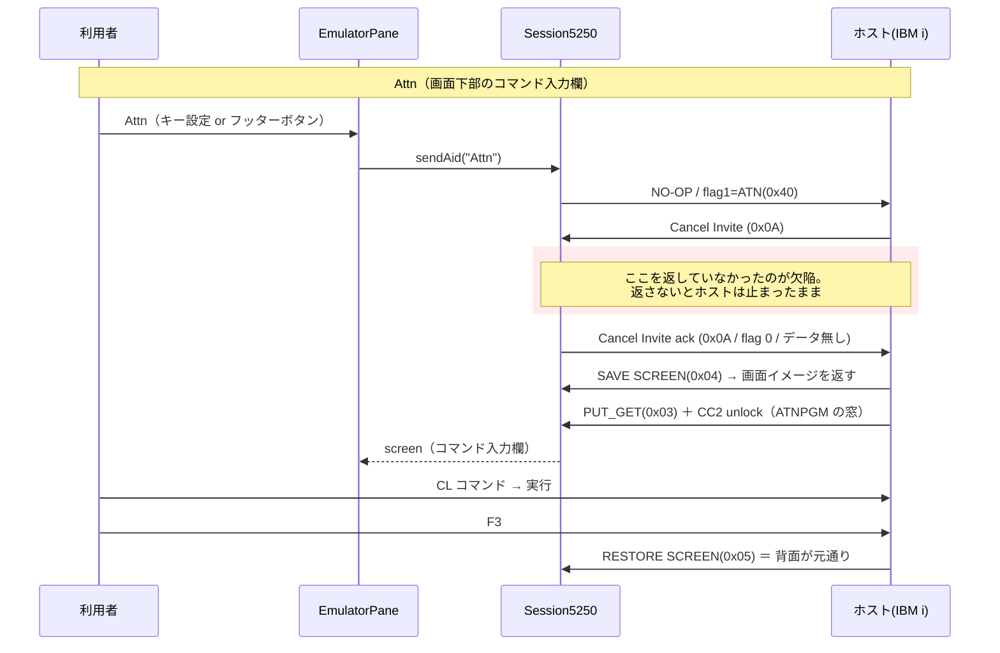
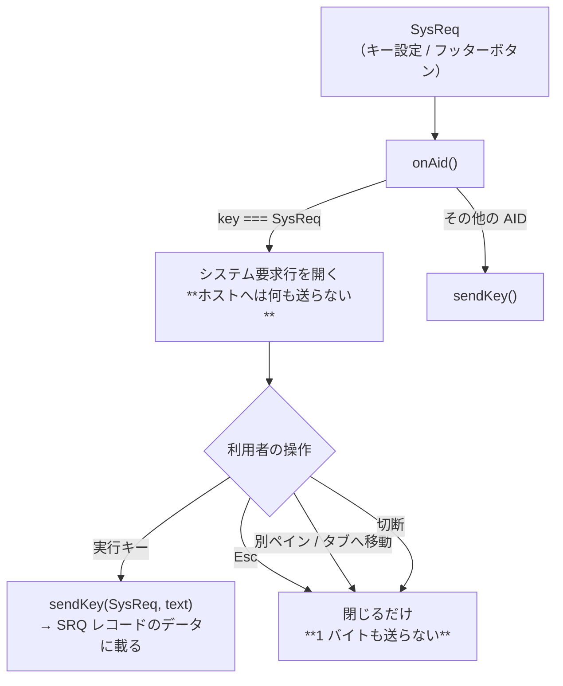

# レビューガイド: Attn / SysReq を実際に機能させる

## 変更概要 / 目的

「ACS では **Esc** を押すと画面下部にコマンド入力欄が出てコマンドを実行できる。同じことをしたい」という要望が起点。

調べると、その入力欄の正体は **Attn（アテンション）キー**だった。実機では ATNPGM（`EVXX01`）が
画面下部に「コマンド入力」窓を重ねる。**窓を描くのはホスト**なので、端末側は Attn を正しく送るだけでよい。

ところが当実装では **Attn も SysReq も無反応**だった。`AidKey` に両方あり、キー設定画面でも MCP でも
指定できるのに押しても何も起きない。**原因はプロトコルの取りこぼし**である。

> ホストは Attn / SysReq を受けると **Cancel Invite（opcode `0x0A`）** を返し、端末が
> **同じ opcode をフラグ 0・データ無しで返す**まで次のデータを送らない。

これを返していなかったのでホストが待ち続け、画面が変わらずキーボードもロックしたままになっていた。
**この 1 点を直すことが本丸**で、それだけで Attn は実機どおり動くようになる。SysReq のシステム要求行と
フッターのボタンは、その上に載せた追加分。

## 重要ポイント（特に見てほしい所）

### 1. ack は「送ったキー」ではなく「opcode」で無条件に返す

`packages/core/src/session/session.ts:403`

Attn / SysReq を送ったかどうかで条件分けしていない。ホスト都合の invite 取り消しでも同じ返事が要るため
（tn5250j も opcode ディスパッチで無条件に `cancelInvite()` を呼ぶ）。**状態で条件分けすると、こちらが
押していないケースで再び固まる**。

同時にキーボードをロックする（原典の `setInputInhibited` 相当）。ホストは ack の直後に必ず書き込みを
送ってくることを実機で確認済みで、万一来なくても `sendAid` のタイムアウト（既定 30 秒）が `ready` に戻す。

**ack のあと `return` しない**のも意図的。データ部が空なので後続処理は無害で、画面イベントの発火判定を
他の opcode と同じ道に通しておく方が特別扱いが減る（既存の `queryRequested` 等は `return` するので、
差分だけ見ると不揃いに見える箇所）。

### 2. 実機で採取したバイト列をテストに焼き込んでいる

- `buildCancelInviteAck()` = `000a12a000000400000a`（`packages/core/src/protocol/read-response.ts:73`）
- データ付き SysReq = `001012a0000004040000c4e2d7d1d6c2`（CCSID 939 で `"DSPJOB"`）

いずれも**推測ではなく実機採取値**。`scripts/probe-sysreq.mjs` で再現できる。
原典（tn5250j）は逐語移植せず、参照クラス／メソッド名をコメントに残す方針（AGENTS.md）に従っている。

### 3. SysReq は「押した瞬間に送らない」

`packages/web-ui/src/components/EmulatorPane.vue:340`（`onAid`）

実機・ACS と同じく画面下部に**システム要求行**を出し、確定して初めて SRQ レコードを送る。
押した瞬間に送る実装だと、オプション（`2`=前の要求の終了 / `6`=システム操作員メッセージ / `90`=サインオフ）を
選ぶ機会が無くなり、メニュー要求しか出せない。**取り消したときはレコードを 1 本も送らない**。

なお、この行は**オプション専用**でありコマンドは打てない。実機で `DSPJOB` を送ると
「オプション D は正しくない」が返る。コマンドが打てるのは Attn 側（ホストの ATNPGM が描く窓）。

### 4. フォーカス調停 — **review で 2 回差し戻した箇所**

ここが唯一トリッキーで、実装中とレビューで欠陥が 3 つ出た。いずれも回帰テスト付き。

| # | 欠陥 | 対処 |
|---|---|---|
| D7 | Esc を SysReq に割り当てると、取り消しの Esc がそのまま行を開き直し**二度と閉じられない** | ガードを「行が開いているか」だけでなく「**行の中で起きたキーか**」でも判定（`EmulatorPane.vue:580`） |
| D8 | ホスト画面のプッシュで `ScreenGrid` がフォーカスを奪い、キー処理は止まったままで**端末が固まって見える** | 行が `@focusout` でフォーカスを取り戻す（`SysReqLine.vue:48`） |
| D10 | そのフォーカス保持が**タブ・ペイン切替と喧嘩**する（Alt+PageUp/Down は App のグローバルハンドラなので行を開いていても発火） | ペインがフォーカスを失ったら行を畳む＝取り消し扱い（`EmulatorPane.vue:376`） |

D7 の要点: 入力欄は `.pane` の子なので keydown がペインまでバブルする。確定・取り消しのハンドラが先に走って
`sysReqOpen` を false にしてから、**同じイベントが**ペインへ届く。`ev.defaultPrevented` で一律に止める案は
退けた——`ScreenGrid` は欄内 Shift 移動を preventDefault して**ペインへ委譲する**設計（矩形選択）なので壊れる。

## 処理フロー

## 主要な変更箇所

- `packages/core/src/protocol/read-response.ts:61` — `buildFlagRecord` にデータ引数（SysReq の文字列用）
- `packages/core/src/protocol/read-response.ts:73` — `buildCancelInviteAck()`（**本丸**）
- `packages/core/src/session/session.ts:403` — Cancel Invite の受信分岐と ack 送出
- `packages/core/src/session/session.ts:276` — `sysReqText` を SysReq 以外に付けたら `PROTOCOL_ERROR`
- `packages/server/src/ws-handler.ts:215` / `packages/server/src/mcp-tools.ts:677` — `sysReqText` の受け渡し
- `packages/web-ui/src/components/SysReqLine.vue` — 新規。画面下部のシステム要求行
- `packages/web-ui/src/components/EmulatorPane.vue:580` — 行が開いている間のキー横取り（D7）
- `packages/web-ui/src/components/StatusBar.vue:101` — `Attn 割込` / `SysReq システム要求` ボタン
- `docs/PROTOCOL.md` 6.2 — ack の往復とバイト列表
- `README.md` — 利用者向けの説明（**既定バインドを付けないので、文書が唯一の導線**）

## リスク / 確認してほしい点

- **ack を無条件に返す設計でよいか**。原典（tn5250j）と同じ挙動を採ったが、Attn/SysReq を押していない
  ケースでもキーボードをロックする。実機ではホストが直後に必ず書き込みを送ってくることを確認済みで、
  タイムアウトの安全弁もあるが、**判断としてレビューしてほしい点**（decisions D1・spec 方針 1）。
- **ボタンの置き場を利用者の選択から変えた**（decisions D3）。「トップバー」を選ばれたが、
  AGENTS.md「ボタンは設置面の系統に合わせる」と `App.vue` の「ヘッダーに置くのはアプリ自身の管理だけ」に
  反するため、既に AID ボタンが並ぶ `StatusBar` のキー行に置いた。**移設は容易**なので、元の選択を
  通したい場合は差し戻してほしい。
- **Esc の既定バインドは付けていない**（decisions D2・利用者の指示）。既存の Esc の用途
  （メニューを閉じる / ブロック選択を解除）を変えないため。ACS と同じ体感にするには
  「⌨ キー」で `Esc → Attn` を割り当てる。
- **キーボードロック中の SysReq は対象外**（decisions D5）。本来 5250 の System Request は
  ホスト応答待ちでも効くが、`pendingAid` が 1 本しか持てない等の制約があり別 work に切り出した。
- **既知の環境制約**: `packages/server/test/zip-writer.test.ts` の 4 件はこの環境に `unzip` バイナリが
  無いため失敗する（本変更と無関係・`zip-writer` は未変更）。
