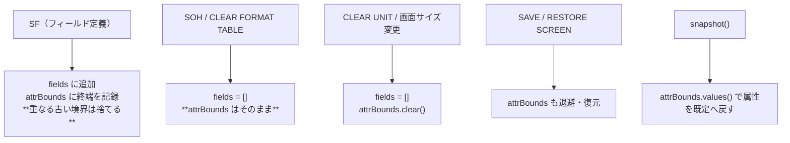

# 仕様: 表示属性の終端境界をフォーマットテーブルから独立させる

## 概要

`ScreenBuffer` に **表示属性の終端境界**（`attrBounds`）を持たせ、`snapshot()` の下線・色の
打ち切り判定をそこから引く。フォーマットテーブル（`fields`）は入力の受け皿として従来どおり
SOH / CLEAR FORMAT TABLE で消えるが、**境界は消えない**。

## 設計方針

### 方針 1: 境界は「開始アドレス → 終端アドレス」の Map で持つ

```ts
/** 表示属性の打ち切り位置（開始アドレス → 終端アドレス）。**フォーマットテーブルとは別に持つ** */
private attrBounds = new Map<number, number>();
```

- `addField()` … `attrBounds.set(startAddr, startAddr + length)`
- `clearFormatTable()` … **触らない**（入力の受け皿だけ消す）
- `clearUnit()` / `resize()` … `attrBounds.clear()`（画面の中身ごと消えるため）
- `saveScreen()` / `restoreScreen()` … 退避・復元に含める
- `snapshot()` … `fieldEnds` を `this.fields` ではなく `attrBounds.values()` から作る

開始アドレスを鍵にするのは、**同一開始アドレスの再定義**（`addField` が既にやっている置換）と
歩調を合わせるため。長さが変われば境界も自動で追従する。

### 方針 2: 新しいフィールドと重なる古い境界は捨てる（未確定事項 1 の解消）

古い境界を持ち続けると、ホストが同じ場所を**別レイアウトで描き直した**とき、消えたはずの欄の境界が
残って下線が早く切れうる。そこで `addField()` で、**新しいフィールドの範囲 [start, end) に
掛かる古い境界を取り除く**。

これで実害のある場面は塞げる:

- **Attn の窓**: 新しいフィールドは窓の中（20〜21 行目）にあり、背面（3〜4 行目）の境界とは重ならない
  → 背面の境界は残る＝**直したい挙動**
- **画面の描き直し**: 新しいフィールドが同じ場所に来るので古い境界は消える＝**古い情報が残らない**

CLEAR UNIT を伴う描き直し（F1 ヘルプ等）ではそもそも全消しなので影響しない。

### 方針 3: READ SCREEN 応答の閉じ属性は今のまま（未確定事項 2 の解消）

`fieldEndAttrAddrs()`（READ SCREEN / READ SCREEN EXTENDED 応答に閉じ属性を差す処理）は
`buf.orderedFields()` を引き続き使う。理由:

- あちらは終端だけでなく**フィールドの占有範囲全体**を必要とする（他の欄のデータ桁を潰さないため）。
  境界の集合だけでは足りない。
- F1 ヘルプが READ SCREEN を送ってくる時点ではフォーマットテーブルは生きている（実機で確認済み・
  現に F1 では不具合が出ていない）。

出所が 2 つになるが、**用途が違う**（表示の打ち切り／送信イメージの補完）ことをコメントに残す。

## 対象範囲

| ファイル | 変更 |
|---|---|
| `packages/core/src/screen/buffer.ts` | `attrBounds` の追加と各ライフサイクルへの反映／`snapshot()` の参照先 |
| `packages/core/test/screen-buffer-attr-bounds.test.ts`（新規） | 回帰テスト |
| `docs/PROTOCOL.md` | 4.3 に「境界はフォーマットテーブルと独立」を追記 |

## 振る舞いの詳細



### 直る筋道（実機の Attn）

1. PDM 画面が 44 フィールドを定義 → `attrBounds` に 44 個の終端が入る
2. Attn の窓の WTD が SOH を送る → `fields` は空になるが **`attrBounds` は残る**
3. 窓の 2 フィールドが定義される → 背面（3〜4 行目）とは重ならないので背面の境界は生き残る
4. `snapshot()` は従来どおり 3〜4 行目の下線を欄の終端で止める → **背面の見え方が変わらない**

## エラー処理 / 異常系

- 画面サイズ変更をまたいだ境界は `resize()` で消えるので、範囲外アドレスが残らない。
- 復元スタックに積むのは Map のコピー（参照を共有しない）。

## 受け入れ基準との対応

| requirement の完了条件 | 満たし方 |
|---|---|
| `clearFormatTable()` 後も下線が止まる | 新規テスト（属性→フィールド→クリア→snapshot で桁を確認） |
| `clearUnit()` 後は境界が消える | 新規テスト |
| SAVE/RESTORE で境界が戻る | 新規テスト |
| 再定義で境界が追従 | 新規テスト（同一開始アドレス・重なる別アドレスの両方） |
| 既存テストが通る | `npm test` |
| **実機 PDM の Attn で下線が伸びない** | スクリーンショット（修正前後） |
| F1 ヘルプの背面が従来どおり | 既存の READ SCREEN 応答テスト＋実機 |
