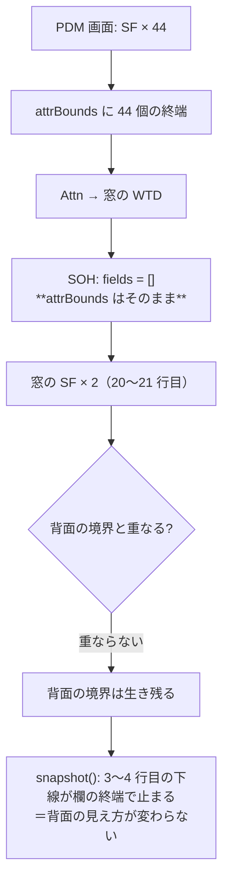

# レビューガイド: Attn の窓で背面の下線が伸びる

## 変更概要 / 目的

> Attn でコマンドを表示すると、画面上部の入力欄の罫線が延びてしまいます。F1 ヘルプの場合は問題ありません。

WRKOBJPDM で Attn を押すと、背面の「ライブラリー」「位置指定」の**下線が右へ伸びて次行へ回り込む**。

### 原因（実機で採取）

Attn の窓を描く WTD が **SOH でフォーマットテーブルを消している**。

```
Attn 前のフィールド数: 44   ← PDM 画面の入力欄
Attn 後のフィールド数:  2   ← 窓の 2 欄だけ
受信: opcode=0x03 306B commands=[WTD, READ_MDT] SOH あり
```

この実装は下線・色の終端を**フィールド長で打ち切って**いる（`docs/PROTOCOL.md` 4.3。閉じ属性を
送らないアプリで漏れるのを防ぐ ACS 準拠の処置）。その境界の出所が `ScreenBuffer.fields`
**だけ**だったので、テーブルが消えると境界も消え、下線が次の属性桁まで伸びていた。

F1 で起きないのは、ホストが `CLEAR UNIT ＋ 全画面 WTD` で背面ごと描き直し、フィールドが作り直されるため。

**Attn を押しても背面の表示内容は 1 桁も変わっていない。** 変わったのは入力の受け皿だけで、
**入力の話が表示を変えてしまっている**のが不具合。

## 重要ポイント（特に見てほしい所）

### 1. 入力の受け皿と表示の見え方を分ける

`ScreenBuffer.attrBounds`（開始アドレス → 終端アドレス）を新設し、`snapshot()` の打ち切り判定を
そこから引く。`fields` は従来どおり SOH で消えるが、**`attrBounds` は消えない**。

| 操作 | `fields` | `attrBounds` |
|---|---|---|
| SF（フィールド定義） | 追加 | 記録（重なる古い境界は捨てる） |
| SOH / CLEAR FORMAT TABLE | **消す** | **残す** ← 今回の肝 |
| CLEAR UNIT / 画面サイズ変更 | 消す | 消す |
| SAVE / RESTORE SCREEN | 退避・復元 | 退避・復元 |

### 2. 引き継ぎの失効条件は「ホストがその行を書き直したか」

**ここは一度間違えて差し戻した**（decisions D4 / review ラウンド 2）。当初は「重なる新フィールドで捨てる」
としたが、窓の新フィールドは窓の中（20〜21 行目）にあり**タイトル行の古い境界とは重ならない**ため
捨てられず、**窓のタイトル帯の反転が 29 桁目で切れた**（利用者報告「上枠の背景色が消えている」）。

正しい条件は**ホストがその行のセルを書き直したか**。書き直しは「そこのレイアウトはもう別物」という
観測可能な事実で、間接的な重なり判定より確実:

| 行 | ホストの書き込み | 引き継ぎ | 結果 |
|---|---|---|---|
| 17〜23（窓） | あり（RA でブランク埋め） | **失効** | タイトル帯が窓幅いっぱいに出る |
| 3〜4（背面） | なし | **残る** | 背面の下線が伸びない |

`setChar` / `setAttr` / `setDbcs` / `setShift` / `eraseRange` から `dropRetainedInRow` を呼ぶ。
`retainedEnds` が空のときは走査せず即 return する（通常の画面では費用ゼロ）。

### 3. READ SCREEN 応答の閉じ属性は据え置き

`fieldEndAttrAddrs()`（F1 ヘルプ用に閉じ属性を差す処理）は `orderedFields()` のまま。あちらは
終端だけでなく**欄の占有範囲全体**が必要（他の欄のデータ桁を潰さないため）で、境界の集合では
代替できない。用途が違うことをコメントに残してある（decisions D3）。

## 処理フロー



## 主要な変更箇所

- `packages/core/src/screen/buffer.ts` — `attrBounds` の新設と各ライフサイクルへの反映、`snapshot()` の参照先
- `packages/core/test/screen-buffer-attr-bounds.test.ts` — 新規。**修正前に落ちることを確認済み**
- `docs/PROTOCOL.md` 4.3 — 「境界はフォーマットテーブルと独立」を明文化

## リスク / 確認してほしい点

- **ホストが同じ行を書き直さずにその行へ新たな下線を引く**経路があれば、古い境界が効きうる。
  行単位の失効なので当初案よりずっと狭いが、理屈上は残る（実機では観測していない）。
- 実機で **Attn（直った）と F1 ヘルプ（従来どおり）の両方**を確認済み。他の窓を出す画面での目視も歓迎。
