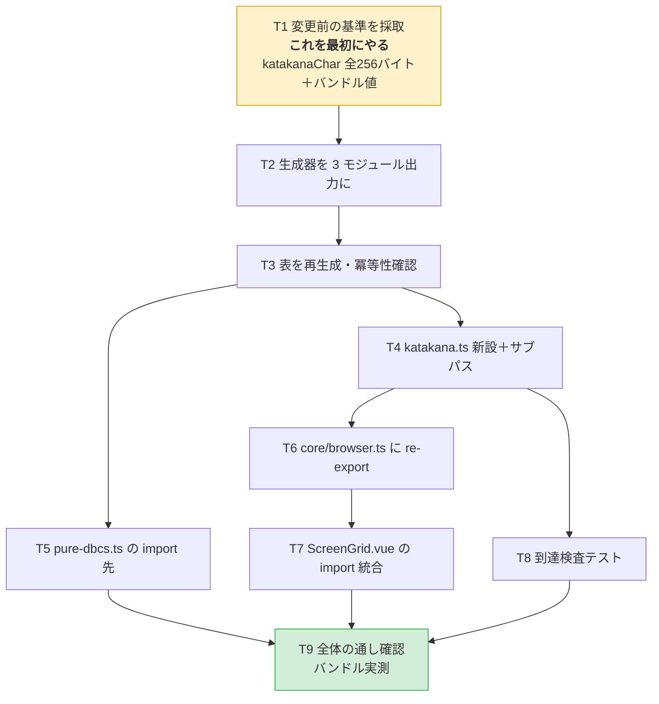

# 計画: CCSID テーブルの同梱単位を見直し、web-ui のバンドルから DBCS 表を外す

## split 判定

**subtask に分割しない**（親 work 単体・単一 `tasks.md`）。
振る舞い不変の refactor で、`DESIGN.md`「5.」の決定木では subtask に落とさない側。
規模は生成器 1 ファイル＋ebcdic 4 ファイル＋core 1 行＋web-ui 1 行で 1 PR に収まる。

## 実装方針

**基準の採取を最初に置く。** この作業の核心は「`katakanaChar` の出力が変わらないこと」の証明だが、
**表を分割した後では変更前の値を取れない**。順序を間違えると証明の手段そのものを失う。

T2〜T3 の間は生成物の形式が変わるためビルドが一時的に赤くなる。
T4 で `codec.ts` 側を合わせて緑に戻す。

## 作業順序と依存関係

1. **T1 — 変更前の基準を採取**（依存: なし）
   `katakanaChar` の全 256 バイト出力をテストに固定し、**この時点で緑になる**ことを確認する。
   バンドルの baseline（1,407,469 バイト）も再確認する。
2. **T2 / T3 — 生成器と生成物**（依存: T1）
   振り分けロジック（flag による方向規則）は触らず、**出力の分け方だけ**を変える。
3. **T4 / T5 — ebcdic 側の付け替え**（依存: T3）
   T4 完了時点で `npm run build` が緑に戻ること。
4. **T6 / T7 — 利用側**（依存: T4）
   core は 1 行追加、web-ui は import 1 行の統合。
5. **T8 — 到達検査**（依存: T4）
6. **T9 — 通し確認**（依存: すべて）

## リスク / 留意点

| # | リスク | 対応 |
|---|---|---|
| R1 | **T1 を後回しにすると `katakanaChar` の同一性を証明できない** | T1 を依存なしの最初のタスクに固定。実装前に緑を確認してから T2 へ進む |
| R2 | 生成器の分割で SBCS / DBCS の振り分けを取り違える | 振り分けロジック自体は変更しない（出力の分け方だけ変える）。既存の変換テスト 5 種＋T1 の 256 バイトテストが検出する |
| R3 | 生成物が 5 → 11 ファイルになり、lint の ignore が効かなくなる | `packages/ebcdic/src/tables/**` はディレクトリ単位なので新ファイルも自動で対象外。T9 の lint で確認する |
| R4 | `browser.ts` に足すことで、web-ui の他の利用箇所にも SBCS 表（256 要素）が入る | 許容する。`browser.ts` は元から「軽い部品の集合」で、狙いは **DBCS 表（98%）を外すこと**。`catalog` の「表ゼロ」性質は別入口なので影響を受けない |
| R5 | バンドルが期待ほど減らない（400,000 バイトの床に届かない） | 数値で判定する。届かなければ**着地させず原因を追う**（他の到達経路が残っている可能性） |
| R6 | `dist/` に旧形式の生成物が残り、ビルド検証を誤魔化す | T9 はクリーンビルドで行う（前作業でも `tsc -b` が古い出力を消さないことを確認済み） |
| R7 | 生成器の変更で既存の `gen.test.ts` が壊れる | `gen.test.ts` は `parseUcm` と `emitSbcsTable` のみを検査しており `emitStatefulTable` は未テスト。T2 で分割の検査を新規に足す |
| R8 | web-ui は root の `tsc -b` に含まれない（前作業 R8 と同じ） | T9 で `npm run build -w @as400web/web-ui`（`vue-tsc` 込み）を必ず実行する |

## テスト方針

**「変わっていないこと」の検証が主で、「減ったこと」の検証が従。**

**不変の検証（最重要）**
- `katakanaChar` 全 256 バイトが変更前と同一（T1 で採取した固定値との突き合わせ）
- 既存の変換テストが全通過（`codec` / `dbcs-codec` / `ccsid-text` / `pure-dbcs` / `dbcs-session`）
- `codec-reexport.test.ts`（前作業の後方互換テスト）が**無変更で**通る
- `packages/server/src` の差分がゼロ

**削減の検証**
- web-ui バンドルに `ibm-930_P120-1999` / `ibm-939_P120-1999` の DBCS 表の識別子が現れない
- バンドルが baseline 1,407,469 バイトから **400,000 バイト以上小さい**
- `@as400web/ebcdic/katakana` と `@as400web/core/browser` の import グラフに DBCS 表が現れない

**生成物の検証**
- `npm run gen:tables` を 2 回流して `git diff --exit-code`（冪等）
- 分割後の 3 モジュールすべてに出典ヘッダ（ICU / Unicode License V3）が付く

**全体**
- クリーンビルド `tsc -b` / `npm test` / `npm run lint`
- `npm run build -w @as400web/web-ui`（`vue-tsc -b && vite build`）

**ガードの検証**（AGENTS.md／前作業 retro の原則）
- T1 の 256 バイトテストと T8 の到達検査は、**追加後に実際に壊して落ちることを確認**してから完成とする

**実機観点**: `katakanaView` の表示は 256 バイト全数テストで機械的に固定するため、実機確認は不要と判断する。
