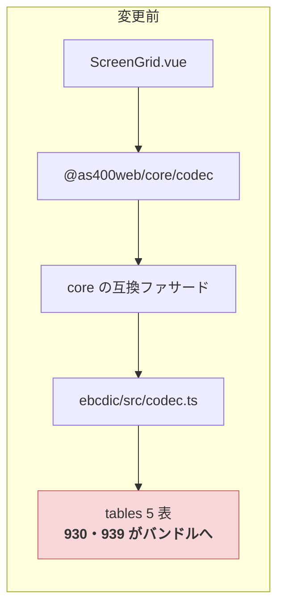
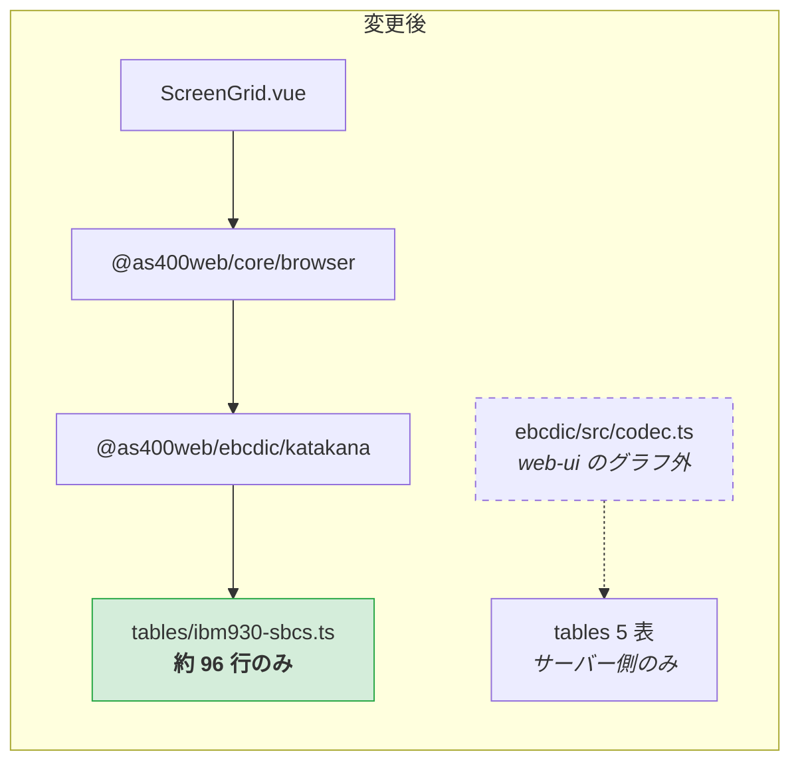

# 仕様: CCSID テーブルの同梱単位を見直し、web-ui のバンドルから DBCS 表を外す

## 概要

生成される混在 CCSID の表（930 / 939 / 1399）を **SBCS 部と DBCS 部の別モジュールに割り**、
`katakanaChar` を SBCS 部だけに依存する専用モジュールへ移す。
web-ui は `@as400web/core/browser`（ブラウザ安全な既存の入口）経由で `katakanaChar` を取り、
`codec.ts`（5 表を静的 import するモジュール）を**モジュールグラフから完全に外す**。

サーバー側と core 内部は従来どおり全表を持つ。**変換結果は 1 文字も変わらない。**

## 設計方針

### D1. backlog の (c)＋(b) を採る — 生成物の分割 ＋ 狭い入口の追加

backlog は (a) 遅延 import 化 / (b) サブパス export の分割 / (c) 生成物の形式変更 を挙げている。
**(c) を土台に (b) を被せる**構成を採り、(a) は採らない。

| 手 | 採否 | 理由 |
|---|---|---|
| (a) 遅延 import 化 | **不採用** | `katakanaChar` は**同期関数**で、`ScreenGrid.vue` の描画パス（`cellText` / `copyCharOf`）から呼ばれる。非同期化すると呼び出し側の描画ロジックまで波及し、「表示が一瞬遅れる」新しい失敗モードを作る。**振る舞いを変えない**という要件に真っ向から反する |
| (b) サブパス分割 | **採用** | 前作業で `./codec` / `./catalog` の前例があり、狭い入口を足すだけで済む |
| (c) 生成物の形式変更 | **採用（土台）** | (b) だけでは足りない。`katakanaChar` の依存先が `tables/ibm930.ts` 1 ファイルである限り、どんな入口を作っても DBCS 部 98% が付いてくる。**モジュールを割らないと分けられない** |

### D2. 分割の粒度は「SBCS 部 / DBCS 部 / 合成」の 3 モジュール

`ibm930.ts`（4,794 行）の内訳は SBCS 部が約 2%（6〜101 行）、DBCS 部が約 98%。
この境界がそのままモジュール境界になる。

```
tables/ibm930-sbcs.ts   SbcsTable   … 約 96 行。katakanaChar が要るのはここだけ
tables/ibm930-dbcs.ts   DbcsPart    … 約 4,670 行
tables/ibm930.ts        StatefulTable … 上 2 つを合成するだけ（数行）
```

型は既存の `SbcsTable` / `DbcsPart` / `StatefulTable` をそのまま使う——
**`table-types.ts` は変更しない**。`StatefulTable` は元々 `sbcs: SbcsTable` と `dbcs: DbcsPart` の
合成として定義されており、**型の構造が既に分割の形をしていた**。データの置き方を型に合わせるだけ。

SBCS 単独表（`ibm37` / `ibm273`）は元から 1 モジュール 8 KB 程度なので**割らない**。

### D3. `katakanaChar` を `codec.ts` から `katakana.ts` へ移す

現在 `packages/ebcdic/src/codec.ts:210` にあり、同居しているだけで 5 表が付いてくる。
`ibm930.sbcs.ebcdicToUnicode` の 256 要素しか読まないので、そこだけに依存する
モジュールへ移し、`@as400web/ebcdic/katakana` サブパスで出す。

**`katakanaChar` の実装は 1 文字も変えない。** 参照先が
`ibm930.sbcs`（＝`withCcsid300Dbcs(ibm930Ucm).sbcs`）から `ibm930Sbcs` に変わるが、
`withCcsid300Dbcs` は `.dbcs` しか差し替えないので **`.sbcs` は同一オブジェクトの内容**である
（この同一性は D7 の 256 バイト全数テストで機械的に固定する）。

`codec.ts` は `katakana.js` から `katakanaChar` を**再輸出**する。
これにより `@as400web/ebcdic`（バレル）と `@as400web/ebcdic/codec` の公開面は変わらず、
`@as400web/core` / `@as400web/core/codec` の後方互換もそのまま保たれる。

### D4. web-ui は `@as400web/core/browser` から取る（新しい入口を core に足さない）

`ScreenGrid.vue:41` の `import { katakanaChar } from "@as400web/core/codec"` を、
**既に同ファイル 43〜48 行で使っている `@as400web/core/browser` の import にまとめる**。

`browser.ts` は「ブラウザから安全に import できる純粋な部品だけを集めた入口」と定義されており
（同ファイル冒頭）、`katakanaChar` はまさにその条件を満たす。
core に 4 つ目のサブパスを足すより、**既存の意味づけに乗せる方が概念が増えない**。

結果、web-ui のモジュールグラフから `@as400web/core/codec` が消え、
`codec.ts` ごと 5 表が届かなくなる。

**`@as400web/core/codec` は残す**（`packages/server/src/host-dtaq.ts` が使っており、
前作業で確立した後方互換でもある）。web-ui が使わなくなるだけ。

### D5. `pure-dbcs.ts` は DBCS 部を直接参照する

`pure-dbcs.ts:11` は `tables/ibm1399.js` を import して `ibm1399.dbcs` しか使っていない。
分割後は `tables/ibm1399-dbcs.js` を直接指す。**必要なものだけを名指しする**形に揃える
（web-ui のバンドルには元から届いていないので削減効果は無いが、依存の意図が明確になる）。

### D6. `codec.ts` 内部の合成は変えない

`ibm290` / `ibm1027`（930 / 939 の SBCS 部を借りる日本語 SBCS）も SBCS 部しか要らないが、
`codec.ts` は `codecForCcsid(930)` のために結局 DBCS 部も持つ。
**バンドルへの影響がゼロの箇所を触っても、回帰の危険が増えるだけ**なので変更しない。

### D7. 削減が黙って戻らないことを 2 種類の検査で固定する

このリファクタは、壊しても**ビルドもテストも通ってしまう**種類のものが 2 つある。
前作業（`20260726-library-extraction-codec`）と同じ考え方で、性質そのものを検査する。

| 守りたい性質 | 壊れたときの症状 | 検査 |
|---|---|---|
| `katakanaChar` の出力が変わらない | 半角カナ表示が化ける。誰も気づかない | 全 256 バイトの出力を固定した回帰テスト |
| 狭い入口が DBCS 表に到達しない | バンドルが元に戻る。ビルドもテストも通る | import グラフ到達検査（`catalog-no-tables.test.ts` の手法を拡張） |

## 対象範囲

### 変更（生成器）

- `tools/gen-tables/src/emit-stateful.ts` — 1 文字列ではなく **3 モジュール分の文字列**を返す
  （`{ sbcs, dbcs, index }`）。データの振り分けロジック（flag による方向規則）は変更しない
- `tools/gen-tables/src/main.ts` — 混在 CCSID は 3 ファイルを書き出す

### 変更（ebcdic）

- `packages/ebcdic/src/katakana.ts` — **新規**。`katakanaChar` の実体
- `packages/ebcdic/src/codec.ts` — `katakanaChar` の定義を削除し、`./katakana.js` から再輸出
- `packages/ebcdic/src/pure-dbcs.ts` — import 先を `tables/ibm1399-dbcs.js` に
- `packages/ebcdic/package.json` — `./katakana` サブパスを追加
- `packages/ebcdic/src/index.ts` — 入口一覧の表に `./katakana` を追記
- `packages/ebcdic/src/tables/` — 生成物が 5 ファイル → 11 ファイルに
  （SBCS 単独 2＋混在 3×3）

### 変更（core / web-ui）

- `packages/core/src/browser.ts` — `katakanaChar` を `@as400web/ebcdic/katakana` から再輸出
- `packages/web-ui/src/components/ScreenGrid.vue:41` — import を `@as400web/core/browser` に統合

### 変更しない

- `packages/ebcdic/src/table-types.ts`（型は既に分割の形をしている）
- `packages/core/src/codec/codec.ts`（互換ファサード。公開面も参照先も不変）
- `packages/core/src/index.ts`（バレルの公開面は不変）
- `packages/server/**`（**差分ゼロが受け入れ基準**）
- `katakanaChar` の振る舞い・対応 CCSID・変換結果

## インターフェース / データ構造

### 生成物のモジュール構成（混在 CCSID）

```ts
// tables/ibm930-sbcs.ts
import type { SbcsTable } from "../table-types.js";
export const ibm930Sbcs: SbcsTable = { ccsid: 930, name: "ibm-930_P120-1999_SBCS", ... };

// tables/ibm930-dbcs.ts
import type { DbcsPart } from "../table-types.js";
export const ibm930Dbcs: DbcsPart = { ebcdicToUnicode, unicodeToEbcdic, sub: 0xfefe };

// tables/ibm930.ts（合成のみ）
import type { StatefulTable } from "../table-types.js";
import { ibm930Sbcs } from "./ibm930-sbcs.js";
import { ibm930Dbcs } from "./ibm930-dbcs.js";
export const ibm930: StatefulTable = {
  ccsid: 930, name: "ibm-930_P120-1999", sbcs: ibm930Sbcs, dbcs: ibm930Dbcs
};
```

**既存の `ibm930` の値・型・名前は変わらない**（`codec.ts` 側は import 文も含めて無変更）。

### `@as400web/ebcdic` の入口（1 つ増える）

| 入口 | 中身 | 引き込む表 |
|---|---|---|
| `.` | 全部（codec / pure-dbcs / ccsid-text） | 5 表すべて |
| `./codec` | SBCS/DBCS の変換 | 5 表すべて |
| `./katakana` | **`katakanaChar` のみ** | **ibm930 の SBCS 部だけ（約 96 行）** |
| `./catalog` | CCSID の一覧 | **なし** |

```jsonc
"./katakana": { "types": "./dist/katakana.d.ts", "default": "./dist/katakana.js" }
```

### `@as400web/core/browser` に 1 つ増える

```ts
export { katakanaChar } from "@as400web/ebcdic/katakana";
```

## 振る舞いの詳細

- **変換結果は一切変わらない。** `katakanaChar(b)` は全 256 バイトで変更前と同一の文字を返す
- `codecForCcsid(930)` / `(939)` / `(1399)` の結果も不変（合成後の `StatefulTable` が同値）
- 純 DBCS（300 / 16684）も不変
- サーバー側は 5 表すべてを従来どおり読み込む（Node には削減の必要がない）

### 到達経路の変化





## ドメイン固有の考慮

- **AGENTS.md「実機と同じ挙動を優先する」** — `katakanaView` は ACS の表示コード切替
  （半角カナ ⇔ 英小文字）に対応する機能。化ける位置が 1 バイトでもずれれば
  「ACS と違う」＝利用者にとっての不具合になる。D7 の 256 バイト全数テストはこのための担保
- **AGENTS.md「ガードを足したら壊して確認する」**（前作業の retro で原則化を提案した項目）——
  D7 の 2 検査は、追加後に**実際に壊して落ちることを確認**してから完成とする
- **出典表記の維持** — 生成物のヘッダ（ICU / Unicode License V3 / 再生成コマンド）は
  分割後の 3 ファイルすべてに付ける。分割で出典が落ちる形にしない
- **ピュアロジック層の Node 非依存** — `katakana.ts` は新規ファイルだが
  `packages/ebcdic/src/**` に入るので既存の eslint ガードが自動的に効く（設定変更は不要）

## エラー処理 / 異常系

| 想定 | 扱い |
|---|---|
| 分割で SBCS/DBCS の振り分けを取り違える | 既存の変換テスト（`codec` / `dbcs-codec` / `ccsid-text` / `pure-dbcs` / `dbcs-session`）が落ちる。加えて D7 の 256 バイトテスト |
| 生成が冪等でない（実行のたび差分が出る） | `npm run gen:tables` を 2 回流して `git diff --exit-code` |
| `browser.ts` が誤って重い入口を指す | D7 の到達検査（`browser` からの到達に DBCS 表が含まれないこと） |
| web-ui のバンドルが期待ほど減らない | 数値で判定（baseline − 400,000 バイト以上）。届かなければ原因を追ってから着地する |

## 受け入れ基準との対応

| requirement の完了条件 | 満たし方 |
|---|---|
| バンドルに 930/939 の DBCS 表が含まれない | D3＋D4（`codec.ts` が web-ui のグラフから外れる） |
| バンドルが 400,000 バイト以上小さい | 同上。実測して報告 |
| `katakanaChar` が全 256 バイトで同一の文字を返す | D7 の回帰テスト（**変更前の出力を先に採取**してから実装する） |
| `npm run build` 成功 | 型は不変（`table-types.ts` を変えない） |
| `npm test` が従来と同じ結果 | 既存の変換テストがそのまま回帰検査になる |
| `npm run lint` 成功 | 新規ファイルは既存 glob（`packages/ebcdic/src/**`）に入る |
| web-ui の `vue-tsc` ビルド成功 | `browser.ts` 経由に変えるため型解決を要確認 |
| `packages/server/src` の差分ゼロ | server は `@as400web/core/codec` を使い続ける（D4） |
| `gen:tables` の生成物が安定 | 2 回実行して差分なしを確認 |
| core の 3 経路が解決できる | `codec-reexport.test.ts`（既存）が無変更で通る |
| 削減が戻らない検査がある | D7 の到達検査 |
