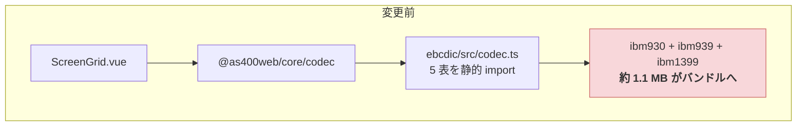
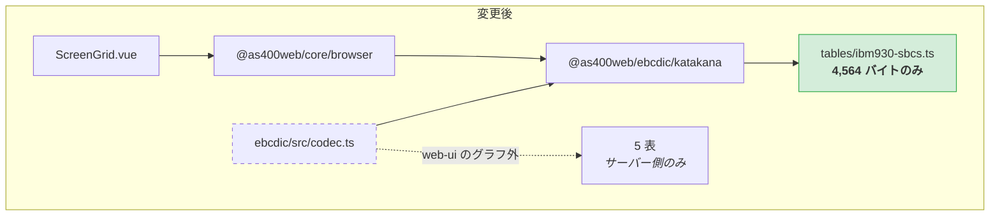
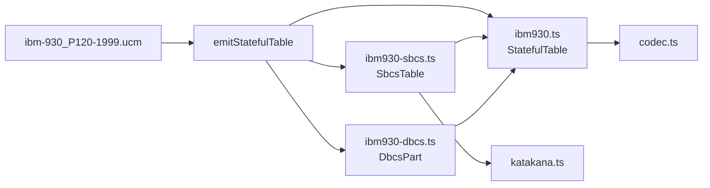

# レビューガイド: CCSID テーブルの同梱単位を見直し、web-ui のバンドルから DBCS 表を外す

## 変更概要 / 目的

`.aidev/backlog/library-extraction.md` の「CCSID テーブルの同梱単位を見直す」を実施した。

**web-ui の本番バンドルが 1,407,469 → 305,643 バイト（−1,101,826・78% 減）**になった。
`katakanaChar` という 1 関数のために CCSID 930 / 939 / 1399 の変換表が丸ごと運ばれていたのを、
実際に必要な **930 の SBCS 部 256 要素だけ**が届くようにした。

**変換結果は 1 文字も変わっていない。** レビューで見るべきは「動くか」ではなく
**「本当に何も変わっていないか」「削減が戻らない形になっているか」**の 2 点。

### 差分の読み方（先に読んでほしい）

生成物 11 ファイルを除くと**実装差分は 10 ファイル・約 200 行**しかない。

| 種類 | ファイル | 見る必要 |
|---|---|---|
| **生成物**（`tables/*.ts` 11 ファイル） | — | **不要**。`npm run gen:tables` の出力で、冪等性を確認済み |
| **生成器** | `emit-stateful.ts` / `main.ts` | **要**。ここが分割の本体 |
| **切り出し** | `katakana.ts`（新規）/ `codec.ts` | **要**。3 行の関数と、その置き場所 |
| **利用側の 1 行** | `browser.ts` / `ScreenGrid.vue` / `pure-dbcs.ts` | 流し読み |
| **検査** | `katakana.test.ts` / `katakana-no-dbcs.test.ts` / `gen.test.ts` | **要**。この作業の担保 |

## 重要ポイント（特に見てほしい所）

### 1. なぜ「サブパスを足すだけ」では足りなかったのか

backlog は (a) 遅延 import 化 / (b) サブパス export の分割 / (c) 生成物の形式変更 を挙げていた。

**(b) だけでは 1 バイトも減らない。** `katakanaChar` の依存先が `tables/ibm930.ts` という
1 ファイルである限り、どんな入口を作っても DBCS 部 98% が付いてくる——
bundler が落とせるのは**モジュール単位**だから。**割らなければ分けられない**。

(a) は退けた。`katakanaChar` は同期関数で `ScreenGrid.vue` の描画パス
（`cellText` / `copyCharOf`）から 1 桁ごとに呼ばれる。非同期化は呼び出し側へ波及し、
「表示が一瞬遅れる」新しい失敗モードを作る。**振る舞いを変えない**という要件に反する。

### 2. 割り方は型がすでに示していた

`table-types.ts` の `StatefulTable` は元から
`sbcs: SbcsTable` と `dbcs: DbcsPart` の**合成**として定義されている。
つまり**型の構造がすでに分割の形をしていた**——データの置き方を型に合わせただけで、
**`table-types.ts` は 1 行も変えていない**。

```
tables/ibm930-sbcs.ts   SbcsTable      4,564 バイト  ← katakanaChar が要るのはここだけ
tables/ibm930-dbcs.ts   DbcsPart     293,942 バイト
tables/ibm930.ts        StatefulTable    603 バイト  ← 上 2 つを合成するだけ
```

### 3. 削減幅が見積もりの 1.5 倍だったので、正体を実測した（decisions.md D1）

spec の見積もりは「表 2 つ分＝約 700 KB」。実測は **1,101,826 バイト**。
**期待より良い結果は、期待どおりの結果より疑うべき**——必要なコードまで落としていれば、
同じように「小さくなった」と見える。`main` を worktree に取って突き合わせた。

| 軸 | 旧 | 新 |
|---|---|---|
| サイズ | 1,407,469 | 305,643 |
| **数値トークン**（`\d+,`） | **187,881** | **2,063** |
| 旧のみに存在する識別子（7 文字以上） | — | **`d5d71879` の 1 個だけ**（チャンクのハッシュ） |

減ったのはほぼ全部が数値データ＝変換表で、**機能を持つ識別子は 1 つも消えていない**。
185,818 という減少数は表の構成と一致する（930・939 が各 12,015 マッピング、1399 が 22,321、
それぞれ E2U/U2E に 2 数値ずつで ×4 → 計 185,404）。

つまり **baseline には 1399 の DBCS データも入っていた**。requirement 段階で
名前文字列を検索したときに見つからなかったのは、bundler が外側のオブジェクトリテラル
（`name` を含む）だけ落とし、参照されている配列は残していたため。
**識別子検索では表の在処を測り切れない**という測定手法上の教訓（decisions.md D2）。

### 4. 「変わっていない」ことの担保 — 順序が肝

この作業の核心は**`katakanaChar` の出力が変わらないこと**の証明だが、
**表を分割した後では変更前の値を取れない**。だから最初のタスク（T1）で
全 256 バイトを実物から採取してテストに焼き付け、**その時点で緑になることを確認してから**
実装に入った。移設後もそのまま緑＝参照先が `ibm930.sbcs` から `ibm930Sbcs` に変わっても
値が同一であることの証明になっている。

### 5. 削減が黙って戻らない形にした

2 つとも**壊れても型検査もテストもビルドも通る**種類なので、性質そのものを検査する。
どちらも**実際に壊して落ちることを確認済み**。

| 守りたい性質 | 検査 | 壊したときの結果 |
|---|---|---|
| `katakanaChar` の出力が不変 | `katakana.test.ts` | 1 バイトずらして 2 件失敗 |
| 狭い入口が DBCS 表に到達しない | `katakana-no-dbcs.test.ts` | 合成モジュール参照で 3 件失敗 |

## 処理フロー

### 到達経路の変化





`codec.ts` は `katakana.ts` を**再輸出**しているので、
`@as400web/ebcdic` / `/codec` / `@as400web/core` / `/codec` の公開面は変わっていない
（4 経路すべてから同一実体が取れることを実解決で確認済み）。

### 生成物の構成



## 主要な変更箇所

- `tools/gen-tables/src/emit-stateful.ts:4` — 戻り値を `StatefulModules`（3 文字列）に。
  **flag による方向規則の振り分けロジックは 1 行も変えていない**（出力の分け方だけ）
- `tools/gen-tables/src/main.ts:42` — 混在 CCSID は 3 ファイル書き出し
- `packages/ebcdic/src/katakana.ts:17` — `tables/ibm930-sbcs.js` **だけ**を import。
  ここに `codec.js` や `*-dbcs.js` を足した瞬間に元へ戻る
- `packages/ebcdic/src/codec.ts:213` — 定義を消して `./katakana.js` から再輸出（公開面は不変）
- `packages/core/src/browser.ts:42` — `@as400web/ebcdic/katakana` から re-export
- `packages/web-ui/src/components/ScreenGrid.vue:50` — import を `browser` 側に統合
- `packages/ebcdic/src/pure-dbcs.ts:12` — `ibm1399.dbcs` しか使わないので DBCS 部を直接指す

**新規テスト 3 種**

- `packages/ebcdic/test/katakana.test.ts` — 全 256 バイトの期待値（**分割前に採取**）
- `packages/ebcdic/test/katakana-no-dbcs.test.ts` — import グラフの到達検査
- `tools/gen-tables/test/gen.test.ts` — `emitStatefulTable` の分割検査（従来は未テスト）

## リスク / 確認してほしい点

### 判断を仰ぎたい点

- **`@as400web/ebcdic` の入口が 4 つになった**（`.` / `./codec` / `./katakana` / `./catalog`）。
  それぞれ「どこまで引き込むか」が違い `index.ts` の表に整理してあるが、
  公開時には整理の対象になりうる
- **`katakanaChar` を `browser.ts` に置いたこと**。core に 5 つ目のサブパスを足すより
  既存の意味づけ（「ブラウザから安全に import できる純粋な部品」）に乗る方が
  概念が増えないと判断した。ただし「純粋」の基準に**サイズ**が加わったので、
  その旨を `browser.ts` の冒頭に明記した

### 既知の制限

- **`packages/server/test/zip-writer.test.ts` が 4 件失敗する。** `spawnSync unzip EACCES`——
  検証環境に `unzip` が無いため。前作業（PR #169）で `main` でも同一の失敗が出ることを
  実測確認済みで、同テストは core / ebcdic / scs と接点がない
- **サーバー側のサイズは変えていない。** Node は表を全部持ってよいので対象外とした
- **実機（PUB400 等）での再検証はしていない。** `katakanaView` の表示は
  256 バイト全数テストで機械的に固定しており、変換結果が不変であることは型ではなく値で担保している

### 検証済みの受け入れ基準（11 項目）

| 検証 | 結果 |
|---|---|
| バンドルに 930/939 の DBCS 表が無い | 残る識別子は `ibm-930_P120-1999_SBCS` のみ |
| バンドルの削減 | **1,101,826 バイト減**（基準は 400,000 以上） |
| `katakanaChar` 全 256 バイト | 分割前と完全一致 |
| クリーンビルド `tsc -b` | 成功 |
| `npm test` | 2,377 passed / 4 failed（環境要因のみ） |
| `npm run lint` | エラー 0 |
| web-ui `vue-tsc -b && vite build` | 成功 |
| `packages/server/src` の差分 | **ゼロ** |
| `npm run gen:tables` 冪等性 | 2 回実行して差分なし |
| core の 3 経路（`exports` マップ経由の実解決） | 4 経路すべて同一実体 |
| 削減が戻らない検査 | 到達検査あり・壊して発火を確認 |
