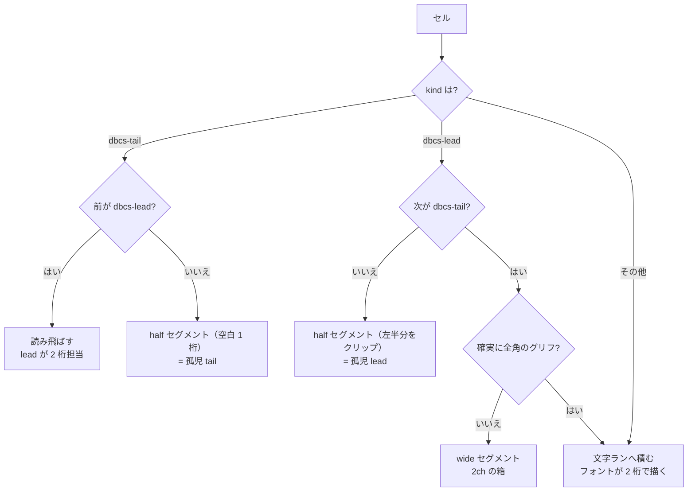

# 仕様: 相方を失った DBCS セルを 1 桁で描く

## 概要

`ScreenGrid` の行セグメント組み立てで、**全角セルが対（lead＋tail）を成しているかを見て**分岐を足す。

| セル | 現在 | 変更後 |
|---|---|---|
| `dbcs-lead`（次が `dbcs-tail`） | 2 桁の箱 or 文字ラン | **変更なし** |
| `dbcs-lead`（次が `dbcs-tail` **でない**） | 2 桁ぶん描いて隣を侵す | **1 桁に切り詰め**（グリフは左半分） |
| `dbcs-tail`（前が `dbcs-lead`） | 読み飛ばす（lead が 2 桁担当） | **変更なし** |
| `dbcs-tail`（前が `dbcs-lead` **でない**） | 読み飛ばして桁が消える | **空白 1 桁**として占有 |

core は触らない。バッファは「tail が属性で潰された」事実を正しく保持しており、直すのは描画側の解釈だけ。

## 設計方針

### 方針 1: 判定は「隣のセルの kind」だけで行う（状態を持たない）

対の有無は同じ行の隣の桁を見れば決まる。`ScreenGrid` の行データ（`Cell[]`）は既に手元にあるので、
純関数の述語 2 つで足りる。バッファ側に「孤児フラグ」を持たせない——**表示の都合を core のデータモデルに
持ち込まない**（AGENTS.md「core はピュアロジック」）。

```ts
/** 対になる tail を持つ lead か（＝2 桁ぶん描いてよいか） */
function hasTail(row: Cell[], i: number): boolean   // row[i+1]?.kind === "dbcs-tail"
/** 対になる lead を持つ tail か（＝読み飛ばしてよいか） */
function hasLead(row: Cell[], i: number): boolean   // row[i-1]?.kind === "dbcs-lead"
```

### 方針 2: 切り詰めは CSS のクリップで行う（ACS と同じ見え方）

ACS は文字の左半分をそのまま描いて分断された形にする。`.wide-cell` と同じ `inline-block` の箱の
**幅を 1ch にして `overflow: hidden`** すれば同じになる。空白に置き換える案は退けた——
AGENTS.md「規格どおりより既存クライアントと同じ挙動を優先する」に反するうえ、
**利用者が「ACS は分断して表示している」と認識しており**、そこを揃えるのが本 work の目的そのもの。

### 方針 3: 孤児 lead は `isCertainWideGlyph` に関わらず専用スパンにする

現在、確実に全角で描かれるグリフ（`isCertainWideGlyph`）は文字ランへそのまま積み、
フォントに 2 桁ぶん描かせている。孤児 lead ではこれが**そのまま桁ずれになる**ので、
確実に全角かどうかに関わらず**必ず 1 桁の箱に入れる**。

### 方針 4: 描画と桁数え（`localSpans`）を同じ述語で揃える

`localSpans`（リンク装飾の文字オフセット計算）は `kind !== "dbcs-tail"` で「表示文字を持つ桁」を数えている。
孤児 tail を**描くようにする以上、数える側も揃えないとリンクの下線位置がずれる**。
同じ述語を共有して二重定義を避ける。

一方、**コピー・欄値の取り出し**（`sliceText` / 未編集欄の復元）は**変更しない**。あちらが返すのは
「文字列」であって桁位置ではなく、孤児 tail は文字を持たないので出さないのが正しい。
ここを変えると送信バイト列に空白が混ざり、**ホストへ送る内容を壊す**（要件の対象外）。

### 方針 5: 入力欄内は今回対象外（requirement 未確定事項 2 の解消）

孤児が生じるのは「ホストが既存の全角の片割れに上書きした」ときで、実測した事例は
**保護領域（背面テキスト）**だった。入力欄（`dbcsType` 付き）では欄の値は `fieldSlices` 経由で
`<input>` に流れ、桁配置の規則が別系統（`roundToDbcsLead` 等）になる。同じ規則をそちらへ広げるのは
影響範囲が別物なので、本 work では**表示セグメント側に限定**する。実機で入力欄側の事例が出たら別 work で扱う。

## 対象範囲

| ファイル | 変更 |
|---|---|
| `packages/web-ui/src/components/ScreenGrid.vue` | 述語 2 つ／セグメント組み立ての分岐／`localSpans` の桁数え／`.half-cell` の CSS |
| `packages/web-ui/test/screen-grid-dbcs-orphan.test.ts`（新規） | 回帰テスト |

## インターフェース / データ構造

セグメントの種別に `half` を足す（既存の `wide` の 1 桁版）。

```ts
type Seg =
  | { kind: "text"; ... }
  | { kind: "input"; ... }
  | { kind: "wide"; text: string; cls: string; col: number }   // 既存: 2 桁の箱
  | { kind: "half"; text: string; cls: string; col: number };  // 追加: 1 桁に切り詰め
```

```vue
<span v-else-if="seg.kind === 'half'" class="grid-span half-cell" :class="seg.cls">{{ seg.text }}</span>
```

```css
/* 相方を失った全角セル。ホストが片割れの桁に上書きしたときに出る。
   ACS は左半分だけを描いて分断された形にするので、1ch の箱でクリップして同じ見え方にする。 */
.half-cell {
  display: inline-block;
  width: 1ch;
  overflow: hidden;
  vertical-align: baseline;
}
```

## 振る舞いの詳細

### セグメント組み立ての分岐（`while` ループ内）



- 孤児 lead の `text` は `displayChar(cell)`（＝その全角文字そのもの）。1ch の箱に入るのでクリップされる。
- 孤児 tail の `text` は **半角空白**。`displayChar` は `dbcs-tail` に `""` を返すため、
  孤児のときだけ `" "` を使う（`displayChar` 自体は変えない——あちらは
  「lead が文字を持つ」前提でコピー経路とも共有しているため）。
- `cls`（属性クラス）は他のセグメントと同じくそのセルのものを付ける。反転・下線が 1 桁ぶん乗る。

### 桁数え（`localSpans`）

「表示文字を 1 つ持つ桁」の判定を、`kind !== "dbcs-tail"` から**「`dbcs-tail` でない、または孤児 tail」**へ変える。
孤児 tail は空白 1 文字として描くので、リンクのオフセット計算でも 1 文字として数える。

### 実機の再現ケース（受け入れの要）

19 行目「選択項目またはコマンド」（2 桁目から DBCS 11 文字）の最後の「ド」が 22〜23 桁で、
23 桁目が窓の属性バイトに潰されている。

- 変更前: 22 桁目の lead が 2 桁ぶん描かれ、窓の左端（23 桁目）に食い込む
- 変更後: 22 桁目は 1 桁に切り詰められ、23 桁目は属性の空白 → **窓が 23 桁目から始まって見える＝ACS と一致**

## ドメイン固有の考慮

- **ACS を正とする**（AGENTS.md）。分断された見た目は「崩れ」ではなく実機・ACS の挙動そのもの。
- **1 セル = 1 桁の原則**。この実装は DBCS でも桁位置を厳密に保つ設計（`PROTOCOL.md` §7）で、
  孤児セルはその原則の穴だった。
- **送信バイト列は変えない**。表示だけを直し、コピー・欄値・送信経路には触らない（方針 4）。

## エラー処理 / 異常系

- 行末の lead（次の桁が存在しない）も「tail 無し」として 1 桁に切り詰める（`row[i+1]` が `undefined`）。
- 行頭の tail（前の桁が存在しない）も「lead 無し」として空白 1 桁にする。
- 連続する孤児（lead lead / tail tail）もそれぞれ独立に 1 桁として扱う。特別扱いは要らない。

## 受け入れ基準との対応

| requirement の完了条件 | 満たし方 |
|---|---|
| 孤児 lead が 1 桁で隣を侵さない | 新規テストで `.half-cell` が出ること＋行の総桁数が `cols` と一致すること |
| 孤児 tail が 1 桁を占有し以降がずれない | 同上（孤児 tail のケース） |
| 通常の全角の描画が変わらない | 既存の `screen-grid-*` テスト群がそのまま通ること |
| 切り詰めセルに反転・下線が乗る | テストで `.half-cell` に属性クラスが付くことを確認 |
| **実機の Attn 窓で ACS と同じ桁位置** | 修正前後のスクリーンショットを撮って窓の左端が 23 桁目から始まることを確認 |
| ビルド | `npm run build` ／ `npm run build -w @as400web/web-ui`（vue-tsc 込み） |
