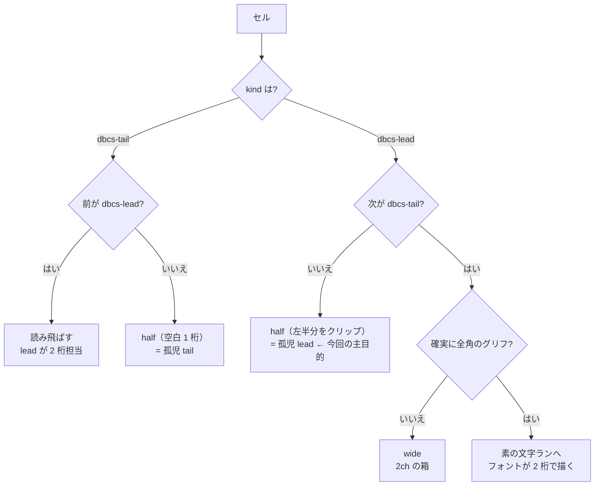

# レビューガイド: 相方を失った DBCS セルを 1 桁で描く

## 変更概要 / 目的

利用者から「ACS 側は DBCS を途中で分断する形で表示しているのに対して、WEB 画面側は分断をしていない結果、
1 桁分ずれているのでは？」という指摘があり、**実機で裏が取れた**。

5250 の全角は **lead（前半）＋ tail（後半）の 2 桁**を占める。ホストが**既に全角が書かれている桁へ
属性バイトや別データを重ねて書く**と、片割れだけが残る。実機では Attn の「コマンド入力」窓が
23 桁目から重なり、背面 19 行目「選択項目またはコマンド」（2 桁目から DBCS 11 文字＝2〜23 桁）の
**最後の「ド」の tail が潰された**。

```
      ....+....|....+....|      ← 桁の目盛り
行19  .LTLTLTLTLTLTLTLTLTLTLA.  L=lead T=tail A=属性
                          ↑22桁=lead だけが残る  ↑23桁=窓の左端の属性
```

ACS はこれを 1 桁に切り詰めて描く。こちらは `.wide-cell { width: 2ch }` で必ず 2 桁ぶん描くため、
**窓の左端に食い込んで以降が 1 桁ずれていた**。

## 重要ポイント（特に見てほしい所）

### 1. 分岐の順序が要（`ScreenGrid.vue:544`）

孤児 lead の分岐は、**`isCertainWideGlyph` の分岐より前**に置いてある。後ろに置くと、確実に全角として
描かれるグリフは素の文字ランへ積まれ、**フォントが 2 桁で描いて桁ずれが残る**。「箱に入れるかどうか」は
グリフの確実性ではなく**対の有無**で決まる、というのがこの変更の肝。

### 2. 描画と桁数えを同じ述語で揃える（`ScreenGrid.vue:439`）

孤児 tail を**描くようにした以上**、`localSpans`（F キー凡例リンクの文字オフセット計算）も
同じ判定で数えないと下線の位置がずれる。述語 `hasLead` を共有して二重定義を避けている。

### 3. コピー・欄値の経路は**意図的に触っていない**（decisions D3）

`sliceText` / 未編集欄の値復元は「文字列」を作る経路で、孤児 tail は文字を持たないので出さないのが正しい。
ここに空白を混ぜると**ホストへ送るバイト列が壊れる**。桁数えのうち `localSpans` だけを揃えたのはそのため。

### 4. 切り詰めは空白置換ではなくクリップ（decisions D2）

ACS が左半分だけを描いて分断された形にするため、`overflow: hidden` の 1ch 箱で同じ見え方にした。
空白に置き換えると桁は合うが ACS と別物になる（AGENTS.md「既存クライアントと同じ挙動を優先する」）。

## 処理フロー



## 主要な変更箇所

- `packages/web-ui/src/components/ScreenGrid.vue:238` — 述語 `hasTail` / `hasLead`（状態を持たない）
- `packages/web-ui/src/components/ScreenGrid.vue:540` — 孤児 tail → 空白 1 桁
- `packages/web-ui/src/components/ScreenGrid.vue:547` — 孤児 lead → 1 桁クリップ（**主目的**）
- `packages/web-ui/src/components/ScreenGrid.vue:439` — 桁数えを描画と揃える
- `packages/web-ui/src/components/ScreenGrid.vue:2579` — `.half-cell` の CSS
- `packages/web-ui/test/screen-grid-dbcs-orphan.test.ts` — 新規。**修正前に落ちることを確認済み**

## リスク / 確認してほしい点

- **既存の全角描画を壊していないか**が最大の関心事。`screen-grid-*` のテスト群（DBCS 上書き・桁幅・
  コピー・ペースト・SO/SI 表示・曖昧幅）を含む **web-ui 770 件が全通過**しているが、
  実機の日本語画面（SEU・PDM・UPDDTA 等）での目視も歓迎。
- **クリップの見え方はフォント依存**。「左半分」がどう出るかはフォントで変わる（ACS とピクセル一致は
  しない）。目的は**桁位置を合わせること**で、そこは実機の前後比較で確認済み。
- 入力欄内の孤児は対象外（decisions D4）。実測事例が保護領域だったため。実機で入力欄側の事例が出たら別 work。
- 実機検証では Attn を動かすため **PR #158 の core を一時的に借りた**（本ブランチは main 起点）。
  撮影後に戻してあり、**本 PR の差分は `ScreenGrid.vue` とテスト 1 本だけ**。
