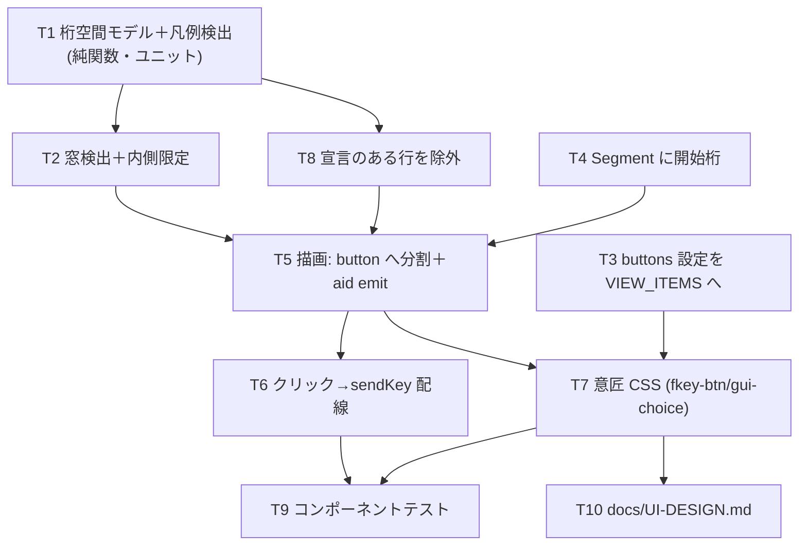

# 計画: 機能キー凡例のボタン化

## split 判定

**分割しない（subtask 化しない）**。判定の discriminator「そのピースは単独で検証・デリバリ可能か」に対し、
検出ロジック・描画・設定・配線は**同じ振る舞いを一緒にしか検証できない**（検出だけ入れてもボタンは出ず、
描画だけ入れても押せない）。規模も 1 PR に収まる中規模で、漸進レビューの価値より過剰分割の害が大きい。
→ 単一の `tasks.md` で進める。

## 実装方針

**下から積む**（純関数 → 設定 → 描画 → 配線 → 意匠）。純関数を先に固めることで、
実データ（PUB400 fixture・research で採取した実画面）に対する検証を**ホスト接続なしで**回せる。

1. **純関数の層**（`composables/fkeyLegend.ts`）: 桁空間の行モデルと検出。ここが仕様の核心（spec D1）で、
   DBCS の桁ズレ・窓の内外判定という**間違えやすい部分を先に単体で固める**。
2. **設定の層**（`viewSettings`）: `buttons` を `VIEW_ITEMS` に載せる。載せるだけで
   設定メニューとキー設定の順送りに自動で出る（既存の仕組みに乗る）。
3. **描画の層**（`ScreenGrid`）: `linkify` と同じ継ぎ目に差し込む。先に `Segment.col`（開始桁）を
   用意してから分割処理を足す。
4. **配線**（`EmulatorPane`）: クリック → `sendKey`。
5. **意匠**（CSS）: `.fkey-btn` と `.gui-choice` に 4 種を適用。
6. **回帰資産**（コンポーネントテスト）と**規約の記録**（docs）。

## 作業順序と依存関係

- **T1 → T2**: 窓判定は検出結果を桁で絞るので、検出が先。
- **T4 → T5**: セグメントの開始桁が無いと、行単位の span を描画位置へ落とせない。
- **T3 → T7**: 設定値が無いと意匠を出し分けられない。
- **T5 → T6**: emit が無いと配線できない。

## リスク / 留意点

| リスク | 対応 |
|---|---|
| **DBCS で桁がずれる**（research で実測。文字列 index ≠ 桁） | T1 で桁空間モデルを純関数として作り、**DBCS 行のユニットテストで固定**。T9 で ON/OFF の桁一致も確認 |
| **窓検出の誤爆**（罫線に見える行がある画面） | 誤爆すると「内側だけ」に絞られる＝**検出漏れ方向に倒れる**（fail-safe）。破壊的にはならない |
| **窓検出の取りこぼし**（非定型の枠） | 窓なし扱い＝画面全体が対象。切れたラベルが残りうるが AID は有効。許容してテストで挙動を明示 |
| **拡張5250 の pushbutton 実データが無い**（research F5） | `.gui-choice` の意匠変更と宣言行の除外は、**合成スナップショットのコンポーネントテストで担保**する（実機では確認できない） |
| **`.gui-choice` の状態表現が消える** | `selected` / `unavailable` の区別を全意匠で保つことをテストで固定（T9） |
| Tab 順の乱れ | ボタンは `tabindex="-1"`。Tab はフィールド間移動のまま（spec B2） |
| クリックでカーソルが飛ぶ | `mousedown` を `preventDefault`（spec B3）。T9 で確認 |

## テスト方針

**実データを起点にする**（このリポジトリの資産を使い、推測でテストを書かない）。

- **ユニット（純関数）**
  - PUB400 fixture（`packages/core/test/fixtures/*.jsonl`）を再生した実スナップショットで、
    メニュー画面の 6 キー検出とサインオン画面の 0 件を固定する。
  - research で採取した実画面（日本語メニュー・F1 ヘルプ）を**合成スナップショット**に写して、
    窓の内側限定（`F3@2` `F13@2` の除外）を固定する。
  - DBCS 行で桁が正しいこと（文字列 index との差）を固定する。
- **コンポーネント（`@vue/test-utils`）**
  - 入力欄に `F12=X` があっても検出されない。
  - クリックで `sendKey` が呼ばれる／`busy`・`keyboardLocked` では呼ばれない。
  - 意匠 4 種の切り替えが `.fkey-btn` と `.gui-choice` の両方に効く。`selected`/`unavailable` が残る。
  - **ボタン化 ON/OFF で桁位置が変わらない**（DBCS を含む行）。
- **ビルド**: `npm run build -w @as400web/web-ui`（vue-tsc 込み）。テストは `cd packages/web-ui && npx vitest run`（AGENTS.md）。
- **実機**: ホストが空いていれば日本語メニューと F1 ヘルプで目視確認（窓の内外）。
  **取れなくても受け入れ判定は上記の自動テストで成立**させる（research の実データを写しているため）。
