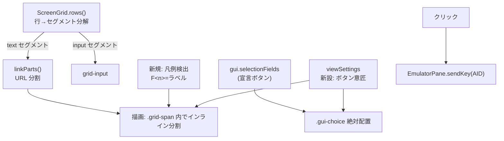

# 調査: 機能キー凡例のボタン化 — 拡張5250 との共存と検出の実データ確認

実機（TESTLIB/EXTPGM・日本語メニュー・F1 ヘルプ）と、リポジトリ内の実機キャプチャ
（`packages/core/test/fixtures/` の PUB400 トレース）で確認した。調査スクリプトは
`scripts/research-ext-gui.mjs`、採取した生データは scratchpad の `probe-*.json`。

## 調査の問い

- **Q1**: `gui.selectionFields`（拡張5250 の pushbutton/menu）の実構造と描画はどうなっているか。
  意匠を設定連動にしたとき、選択済み／利用不可の状態表現は保てるか。
- **Q2**: `gui.windows` の bounds は実際に取れるか。ヘルプ窓の検出範囲を絞るのに使えるか。
- **Q3**: 拡張5250 の画面でも、下部の F キー凡例は素のテキストのままか（ホスト宣言と併存するか）。
- **Q4**: 日本語ラベル・DBCS 行で検出が成立するか。桁がずれない描画手段はあるか。
- **Q5**: 検出の誤り（誤検出・取りこぼし）が実データで起きるのはどこか。

## 判明した事実

### F1. gui の型（`packages/core/src/screen/types.ts`）

- `GuiWindow` は `row / col / width / height / title / restrictCursor / pulldown` を持つ。**矩形が確定できる**。
- `GuiSelectionField` は `id / row / col / kind / fieldType / multiple / choices[]`。
- `GuiChoice` は `index / text / selected / available / numericChar? / aid?`。
- **重要**: `GuiChoice` は**個々の桁位置・幅を持たない**。フィールドの `row/col` が起点で、
  描画は `.gui-selection` を絶対配置し、その中で選択肢を flex で並べている
  （`ScreenGrid.vue` の `guiPos(f.row, f.col)` ＋ `.gui-choice` の並び）。
  → **選択肢が画面上で占める桁範囲は、データからは正確に決まらない**（描画結果に依存）。

### F2. 拡張 WINDOW の bounds は実データで取れる（Q2 → 条件付き Yes）

`TESTLIB/EXTPGM` の 2 画面目（WINDOW）で実測:

```
windows = 1
win style=left: 16ch; top: 6.25em; width: 46ch; height: 12.5em; title="Window"
```

`left:16ch → col 17` / `top:6.25em ÷ 1.25 = 行 6 → row 7` / `width 46 桁` / `height 10 行` と
矩形が確定できる。**ホストが拡張 WINDOW を使う画面では bounds を範囲限定に使える**。

### F3. ただし通常のヘルプ窓は `gui.windows` に出ない（Q2 の限界・重要）

日本語メニューで **F1 ヘルプ**を出したときの実測:

```
gui.selectionFields = 0   windows = 0   scrollbars = 0
```

ヘルプ窓は**文字で描かれている**（上下端が `.`、左右が `:`、色は blue）。
つまり **`gui.windows` は「ホストが拡張 WINDOW を使った場合」しか埋まらない**。
日常的に出会うヘルプ窓は対象外なので、**bounds に依存した設計は成立しない**。

### F4. 拡張5250 の画面でも凡例は素のテキスト（Q3 → Yes・併存する）

`EXTPGM` の 2 画面とも、gui 構造（scrollbar / window）を持ちながら凡例はテキストだった:

```
r1  |  ENHANCED: scrollbar          Enter=next F3=exit|     ← F3@56 を検出
r14 |   Row 9 scrollable Enter=OK   F12=Cancel|            ← F12@32 を検出（窓の中）
```

→ **ホスト宣言（gui）と凡例テキストは併存する**。凡例はどの画面でも宣言されない。
requirement の FR-8（宣言優先で重複回避）は、「同じ場所に二重に出る」ケースを避けるためのもので、
**凡例そのものが宣言に置き換わることはない**。

### F5. pushbutton / menu の実データは取得できなかった（Q1 → 未検証・制約）

採取した全画面（EXTPGM ×2・日本語メニュー・F1 ヘルプ）で **`selectionFields = 0`**。
TESTLIB に選択フィールド（pushbutton/menu）の画面は無い。
これは以前の作業で **`CHCCTL` の構文が確定できず選択フィールドを断念した**経緯と整合する
（代わりに WINDOW＋サブファイルのスクロールバーで拡張5250 を確認していた）。

→ **FR-7（意匠を `.gui-choice` にも効かせる）と FR-8（宣言領域の除外）は、実データで検証できない。**
コード上の型と描画からの推論に留まる。

### F6. 日本語・カナ画面で検出成立（Q4 の一部 → Yes）

日本語メニューの実測（桁位置つきで全て検出）:

```
r22  F3@2 F4@12 F5@25 F12@37  | F3= 終了    F4=ﾎﾟﾜ]ﾎﾟn   F5= 最新表示    F12= 取り消し|
r23  F13@2 F24@35             | F13= この画面の使用法                    F24= キーの続き|
```

- `=` の**後ろに空白が入る**（`F3= 終了`）。区切りは**空白2つ以上**で正しく割れた。
- ラベルがカナ表示で崩れていても（`F4=ﾎﾟﾜ]ﾎﾟn`）検出自体は成立する。

### F7. 窓が重なると、下の画面の凡例が「切れた状態」で見えている（最大の落とし穴）

F1 ヘルプ表示中の実データ（`|` は行の端。窓は col 16〜78）:

```
r21 |               :  F2= 拡張ヘルプ   F3= ヘルプ終了   F10= 最初へ移動           :|
r22 | F3= 終了    F :  F12= 取消し      F13= 情報援助    F14= ヘルプの印刷         :|
r23 | F13= この画   :                                                              :|
```

3 つの実害が同時に起きる。

1. **ラベルが途中で切れる**: `F13= この画`（本来 `F13= この画面の使用法`）。
   このままボタン化すると「この画」というラベルのボタンが出る。
2. **同じキーが二重に見える**: `F3= 終了`（下の画面・col 2）と `F3= ヘルプ終了`（窓の中・col 31）。
   AID はどちらも F3 で、**ホストは前面の窓の文脈で解釈する**（＝実際は「ヘルプ終了」）。
   下の `終了` を押せてしまうと、ラベルと結果が食い違う。
3. **色では区別できない**: 実画面を確認したところ、**下の画面の凡例も窓の凡例も同じ blue**。
   窓の罫線も blue。→ **色は窓の内外を判定する手掛かりにならない**。

なお、この状況で `gui.windows` は空（F3）なので、**矩形はデータからは分からない**。
罫線文字（上下 `.`／左右 `:`）は規則的に並んでおり、**文字からの窓検出は可能に見える**。

### F8. 罫線文字の実際（F4 の裏取り）

IBM i の既定のヘルプ窓は **`.`（上下端）と `:`（左右）** で描かれていた。
試作時に想定していた罫線集合（box-drawing に加え `.` `:`）は実データと一致した。

### F9. 桁を崩さずに装飾する手段は既にある（Q4 の後半 → Yes）

`linkify` が同じ問題（テキストランの一部を装飾する）を既に解いている。

```html
<span class="grid-span" :class="seg.cls"><template v-for="p in linkParts(seg.text)"
  ><a v-if="p.href" class="grid-link" ...>{{ p.text }}</a><template v-else>{{ p.text }}</template
></template></span>
```

**同じ `.grid-span` の中でインラインに分割**し、`.grid-link` は色と下線しか付けない
（padding/margin を持たない）ため桁が動かない。**本番で使われている実績のある継ぎ目**であり、
機能キーのボタン化も同じ場所に載せられる。

## 影響範囲



- `packages/web-ui/src/components/ScreenGrid.vue` — 検出と描画（`linkParts` と同じ継ぎ目）、`.gui-choice` の意匠。
- `packages/web-ui/src/stores/viewSettings.ts` — 「ボタン意匠」設定の追加（`VIEW_ITEMS` に載せる）。
- `packages/web-ui/src/components/ViewSettingsMenu.vue` — 設定 UI（`VIEW_ITEMS` 由来なので自動）。
- `packages/web-ui/src/components/EmulatorPane.vue` — クリック → `sendKey` の配線。
- `docs/UI-DESIGN.md` — 規約追記。
- テスト（`packages/web-ui/test/`）— 検出のユニット、描画・桁不変のコンポーネントテスト。

## 実現性 / リスク

| | 判定 | 根拠 |
|---|---|---|
| 凡例の検出 | **実証済み** | 英語（PUB400 実機キャプチャ 6 キー）・日本語（実機 6 キー）・窓の中（実機）で桁位置つきに検出（F6・F4） |
| 桁を崩さない描画 | **実証済み** | `linkify` が同じ継ぎ目で本番稼働（F9） |
| 入力値の誤検出回避 | **実証済み** | 保護セル限定で、入力欄の `F12=X` が消えることを確認（requirement 記載の実測） |
| 拡張 WINDOW の範囲限定 | **条件付き可** | bounds は取れるが（F2）、**通常のヘルプ窓では空**（F3）。単独では成立しない |
| 窓の重なりの処理 | **未解決・要設計** | ラベル切れ・キー二重・色で判別不可（F7）。**本作業の最大の論点** |
| 宣言ボタンとの重複回避 | **未検証** | 実データが取れず（F5）。`GuiChoice` に桁情報が無い（F1）ため、占有範囲を正確に出せない |
| `.gui-choice` の意匠差し替え | **未検証** | 実データが無く、`selected` / `unavailable` の区別が保てるか実物で確認できない（F5） |

## spec への申し送り

1. **窓の重なりの扱いを決める（最重要）**。F7 の 3 実害に対する選択肢:
   - (a) **罫線から窓を検出**し、窓があるときは**窓の内側の凡例だけ**ボタン化する（下の画面は無効化）。
     実データ上、罫線は規則的（F8）で実現可能に見えるが、アプリ独自の枠には弱い。
   - (b) **ラベルの右隣を見て、罫線文字に接している凡例を捨てる**。`F13= この画   :` は捨てられるが、
     窓の中の最後の凡例（`F10= 最初へ移動           :`）も巻き添えで捨ててしまう。
   - (c) 何もしない（そのまま出す）。実装は最小だが、**切れたラベル**と**意味の食い違い**が残る。
     requirement の非機能要件「誤検出は実害」に反するため非推奨。
2. **`gui.windows` があるときだけ bounds を使う**（拡張 WINDOW 画面）。無いときのフォールバックを 1. で決める。
3. **宣言ボタンとの重複回避の粒度**を決める。`GuiChoice` に桁が無い（F1）ため、桁単位の厳密な除外はできない。
   現実的には「`selectionFields` が存在する**行**は凡例検出しない」等の粗い粒度になる。
   ただし F4 の通り、実データでは**凡例と宣言ボタンは別の行**にあったので、粗い粒度でも実害は小さいと見込む。
4. **意匠「なし」のときクリックできるか**を決める（requirement の未確定事項）。
   現時点の想定は「なし＝ボタン化しない（クリックも不可）」。
5. **`.gui-choice` の意匠差し替えでは `selected` / `unavailable` の区別を必ず残す**。
   実データで検証できない（F5）ため、**合成スナップショットのコンポーネントテストで担保**する。
6. **`Enter=` 系は対象外**（requirement のスコープどおり）。実データにも `Enter=next` `Enter=OK` があるが拾わない。
7. 検出は `linkify` と同じ継ぎ目に載せる（F9）。**`linkify` と同時に効く場合の順序**（URL とキー凡例が
   同一ラン内に共存しうるか）を spec で整理する。
