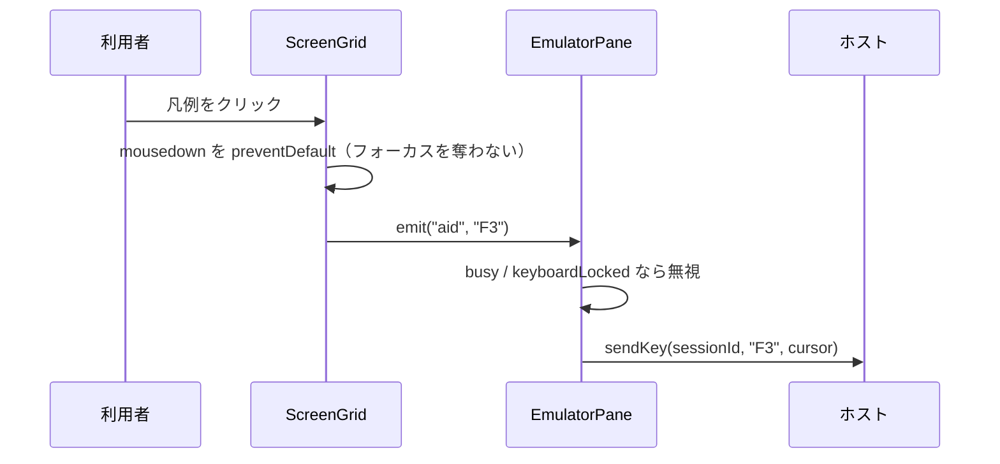

# 仕様: 機能キー凡例のボタン化

## 概要

画面テキスト中の `F<n>=<ラベル>` を**桁空間**で検出し、`linkify` と同じ継ぎ目で
インラインに `<button>` へ差し替える。クリックで対応する AID を送る。
見た目は新設の**ボタン意匠**設定（なし/下線/塗り/枠）で決め、拡張5250 の宣言ボタン
（`.gui-choice`）にも同じ設定を効かせる。

窓（ヘルプ等）が出ているときは、**窓の内側の凡例だけ**をボタン化する。

## 設計方針

### D1. 検出は「桁空間」で行う（文字列インデックスでは駄目）

research で実証した通り、**DBCS があると文字列インデックスと桁がずれる**。

```
r22 実測  | F3= 終了    F :  F12= 取消し …
   文字列 index:  F12 → 17     桁: F12 → 19
r22（メニュー）F4  文字列 12 → 桁 14 ／ F12 文字列 37 → 桁 43
```

桁がずれるとボタンの位置と幅が実際の文字とずれ、requirement FR-10（桁不変）を満たせない。
そこで検出は `snapshot.cells`（**1 セル = 1 桁**、DBCS は lead + tail の 2 セル）を基準にする。

- 行ごとに「tail を除いた表示文字列」と「文字列 index → 桁」の対応表を同時に作る。
- 正規表現はその文字列に当て、得た index を対応表で桁へ戻す。

### D2. 対象は「フィールド外の定数」＝ text セグメントのみ

`ScreenGrid.rows()` は行をセグメントへ割るとき、**フィールド（保護・非保護を問わず）を
`kind:"input"` に分ける**。したがって `kind:"text"` のセグメントは**どのフィールドにも属さない定数**であり、
requirement FR-2（入力欄を対象にしない）が構造的に満たされる。

実データでも、凡例は全て（日本語メニュー・F1 ヘルプ・EXTPGM）フィールド外の定数だった
（凡例を値に含む入力欄は 0 件）。

> 限界: アプリが凡例を**保護出力フィールド**の中に置いた場合は検出されない。
> 「押せない」だけで誤動作はしないので許容する（fail-safe）。

### D3. 窓があれば内側だけ（research 案 a）

窓の矩形を次の優先順で決める。

1. `snapshot.gui.windows` があればその**最後の要素**（＝最前面）を使う。
2. 無ければ**罫線文字から検出**する（通常のヘルプ窓は `gui.windows` に出ないため必須）。

罫線検出（桁空間で実行。実データで検証済み）:

- 横罫 `. - ─ ━ ═ _`、縦罫 `: | │ ┃ ║ ：`
- 各行から**長さ 8 桁以上の横罫の連なり**を拾い、上端候補・下端候補とする。
- 上下の対は、桁範囲が**8 割以上重なる**こと（端の記号の有無で 1〜2 桁ずれるため厳密一致にしない）。
- 上下の間の行の**半数以上**で、左端または右端の桁に縦罫が立っていること。
- 条件を満たす対のうち**面積が最大**のものを採る。内側 = 上下端・左右端を除いた矩形。

窓が見つかったら、**その内側に完全に収まる凡例だけ**をボタン化する。

実データでの効果（`probe-jp-help.json`）:

| 行 | 採用 | 除外 | 除外の理由 |
|---|---|---|---|
| r21 | F2@19 F3@36 F10@53 | — | すべて窓の中 |
| r22 | F12@19 F13@36 F14@53 | **F3@2** | 下の画面の凡例。押すと窓の文脈で解釈され「ヘルプ終了」になり、ラベル「終了」と食い違う |
| r23 | — | **F13@2** | 窓に隠れてラベルが `この画` に切れている |

### D4. 描画は `linkify` と同じ継ぎ目

`linkify` は同一 `.grid-span` 内でテキストを分割し、`.grid-link` に padding/margin を持たせないことで
**桁を動かさずに**装飾している（本番稼働の実績）。同じ場所に `<button>` を差し込む。

### D5. 意匠は独立設定・「押せるもの」に一律で効く

`viewSettings` に **`buttons`**（なし/下線/塗り/枠）を新設する。「コントロール表現」（`controls`＝入力欄の
見せ方）とは別軸で、**機能キーボタンと `.gui-choice` の両方**に効かせる。

## 対象範囲

| ファイル | 変更 |
|---|---|
| `packages/web-ui/src/composables/fkeyLegend.ts` | **新規**。検出（桁空間）と窓検出の純関数 |
| `packages/web-ui/src/stores/viewSettings.ts` | `buttons` 追加・`VIEW_ITEMS` に項目追加 |
| `packages/web-ui/src/components/ScreenGrid.vue` | セグメントに開始桁を持たせる／text 描画で分割／`.gui-choice` 意匠／`aid` emit |
| `packages/web-ui/src/components/EmulatorPane.vue` | `@aid` → `sendKey` の配線 |
| `docs/UI-DESIGN.md` | 規約追記 |
| `packages/web-ui/test/*` | 検出のユニット／描画・桁不変のコンポーネントテスト |

`ViewSettingsMenu.vue` は `VIEW_ITEMS` 由来なので**変更不要**。

## インターフェース / データ構造

### `composables/fkeyLegend.ts`

```ts
import type { AidKey, ScreenSnapshot } from "@as400web/core";

/** 検出した凡例 1 件（座標は 1 始まりの桁） */
export interface FkeySpan {
  row: number;
  /** "F" が始まる桁 */
  col: number;
  /** 凡例全体（"F3= 終了"）が占める桁数 */
  width: number;
  key: AidKey;     // F1〜F24
  label: string;   // "終了"（罫線・前後空白は除去済み）
}

/** 窓の内側（1 始まり・閉区間）。窓が無ければ null */
export interface WindowRect { row1: number; row2: number; col1: number; col2: number }

export function detectWindowRect(snap: ScreenSnapshot): WindowRect | null;

/** 画面全体から凡例を検出する（窓があれば内側のみ） */
export function detectFkeyLegends(snap: ScreenSnapshot): FkeySpan[];
```

### `stores/viewSettings.ts`

```ts
/** 押せるもの（機能キー凡例・拡張5250 の選択肢）の見せ方 */
export type ButtonStyle = "none" | "underline" | "filled" | "rich";

export interface ViewSettings {
  … 既存 …
  buttons: ButtonStyle;   // 既定 "none"
}
```

`VIEW_ITEMS` に追加（`wide: true`。「コントロール表現」の直後に置く）:

```ts
{ key: "buttons", label: "ボタン意匠", wide: true,
  opts: [ {value:"none",label:"なし"}, {value:"underline",label:"下線"},
          {value:"filled",label:"塗り"}, {value:"rich",label:"枠"} ] }
```

キー設定の順送り（`view:buttons`）にも自動で載る（`VIEW_ITEMS` 由来のため）。

### `ScreenGrid.vue`

- `Segment` に **`col`（そのセグメントの開始桁・1 始まり）** を追加する（現在は持っていない）。
- 描画用の部品を `LinkPart` から拡張する:

```ts
interface DecoPart { text: string; href?: string; aid?: AidKey }
```

- emit を 1 つ追加: `(e: "aid", key: AidKey): void`。

## 振る舞いの詳細

### B1. 検出規則

1. 行ごとに、**tail を除いた表示文字**を連結した文字列 `s` と、`s` の各 index に対応する桁 `colOf[]` を作る
   （`displayChar()` を通すので SO/SI マーク・カナ表示の設定も反映される）。
2. `s` に `/(?<![A-Za-z0-9])(F\d{1,2})\s*=\s*/g` を当てる。`n` が **1〜24 以外は捨てる**。
3. ラベルは次の凡例の開始まで、または**空白 2 個以上**まで。前後の空白と**末尾の罫線文字**を除去する。
4. ラベルが空なら捨てる。
5. 窓が検出されていれば、`row/col` と `col+width-1` が**内側に収まる**ものだけ残す。
6. 得た span のうち、**単一の text セグメントに完全に収まらないもの**は捨てる
   （途中で色が変わる等でセグメントが割れている場合。ラベルが切れたボタンを出さないため）。

### B2. 描画

- text セグメントを描くとき、そのセグメントに属する span を**セグメント内の文字列 index** に直し、
  `linkify` の分割結果とマージする。**重なる場合は凡例を優先**し、重なるリンクは捨てる。
- 凡例部分は `<button type="button" class="fkey-btn" tabindex="-1">` として描く。
  - **タブ順に含める**（decisions D5 で変更）。Tab はペインが横取りするため、巡回の停止点を
    「入力欄＋機能キーボタン」にする。フォーカス中の Space で押せる。Enter は 5250 の AID のまま。
  - `font: inherit; padding: 0; border: 0; background: none; line-height: inherit`
    で**桁を動かさない**（`.grid-input` と同じ考え方）。
  - 色は指定しない（**ホストが送った色をそのまま継ぐ**）。
- 意匠 `none` のときは**ボタンにしない**（素のテキストのまま。クリックもしない）。

### B3. クリック



- `mousedown` は `preventDefault` する。入力欄からフォーカスが飛ぶと、5250 のカーソル位置が変わってしまうため。
- 送信位置は**現在の有効カーソル**（キーボードで F キーを押したときと同じ）。
- `busy`（応答待ち）・`keyboardLocked` のときは送らない（既存のキー操作と同じ扱い）。

### B4. 意匠（`buttons` 設定）

`.pane[data-buttons="…"]` を祖先に付け、`.fkey-btn` と `.gui-choice` の両方に効かせる。

| 値 | `.fkey-btn` | `.gui-choice` |
|---|---|---|
| `none` | ボタン化しない（素のテキスト） | **現状の意匠を維持**（宣言された操作部品なので、見た目を消さない） |
| `underline` | 下線＋hover でアクセント | 下線基調 |
| `filled` | うっすら背景＋角丸 | 塗り基調 |
| `rich` | 枠＋hover/フォーカスリング | 枠基調 |

- 色替えは `box-shadow` と限定的な背景のみ（**桁とホスト色を崩さない**。コントロール表現と同じ方針）。
- `.gui-choice` の **`selected` / `unavailable` の区別は全ての意匠で残す**
  （選択マーカー `◉/☐` は据え置き、`unavailable` は `opacity` を維持）。

## ドメイン固有の考慮

- **桁揃え（AGENTS.md / docs/UI-DESIGN.md）**: 桁は `ch` 単位・DBCS=2ch。D1 の桁空間と、
  B2 の padding なし描画で守る。**DBCS を含む行での桁不変をテストで固定する**。
- **表示設定との整合**: 検出は `displayChar()` の結果に対して行うので、SO/SI マーク表示・
  カナ表示の設定が反映される。カナ表示でラベルが崩れても（実データ `F4=ﾎﾟﾜ]ﾎﾟn`）キーは正しい。
- **テーマ・スキン**: 色は CSS 変数経由（`--accent` 等）。11 スキン・light/dark で破綻させない。
- **ホスト宣言優先（FR-8）**: `gui.selectionFields` が存在する**行**では凡例検出を行わない。
  `GuiChoice` は桁情報を持たない（research F1）ため桁単位の厳密な除外はできないが、
  実データでは宣言ボタンと凡例は別の行にあり、行単位で実害はない。

## エラー処理 / 異常系

| 状況 | 扱い |
|---|---|
| `n` が 25 以上（`F25=`） | 検出しない（AID に存在しない） |
| ラベルが空（`F3=` の後が空白のみ） | 検出しない |
| 窓の罫線が非定型でうまく検出できない | 窓なしとして扱う＝画面全体が対象。切れたラベルが残りうるが、**押しても AID は有効**で破壊的ではない |
| 窓検出が誤爆（罫線に見える行がある） | 内側だけが対象になる＝**検出漏れ**方向に倒れる（fail-safe） |
| セグメント境界で凡例が割れる | 検出しない（B1-6） |
| `busy` / `keyboardLocked` | クリックを無視 |
| 同一キーが複数箇所（窓ありで下の画面にも） | D3 で下の画面側を除外する |

## 受け入れ基準との対応

| requirement の完了条件 | 実現方法 |
|---|---|
| PUB400 メニューで 6 キー検出 | B1。既存 fixture を再生するユニットテストで固定 |
| 入力欄の `F12=X` を検出しない | D2（text セグメント限定）。合成スナップショットのテスト |
| ヘルプ窓でラベルに罫線が混入しない | B1-3（末尾の罫線除去）＋ D3（窓の内側限定） |
| 凡例の無い画面で検出ゼロ | B1。PUB400 サインオンの fixture で固定 |
| クリックで AID 送信 | B3。コンポーネントテストで `sendKey` 呼び出しを確認 |
| 意匠 4 種が切り替わり `.gui-choice` にも効く | B4。合成スナップショット（`gui.selectionFields` 込み）で確認 |
| 宣言領域と二重に出ない | 「宣言のある行は検出しない」。合成スナップショットで確認 |
| 桁がずれない（DBCS 含む） | D1・B2。DBCS 行で ON/OFF の桁位置一致をテスト |
| `npm run build` 成功・テスト追加 | AGENTS.md の手順（vue-tsc 込み・`cd packages/web-ui`） |

## 未確定を解消した項目

- **意匠「なし」のクリック可否** → 「なし」はボタン化しない（クリック不可）。ただし `.gui-choice`
  （ホストが宣言した操作部品）は「なし」でも**現状の意匠で機能を維持**する。
- **`linkify` との順序** → 同一範囲が重なったら凡例を優先。実際には共存はまず起きない。

---

# 仕様（追補）: 設定名の是正とデザイン候補

requirement FR-12〜14 に対応する。

## D6. 名称は「対象」で呼ぶ

| 旧 | 新 | 理由 |
|---|---|---|
| コントロール表現 | **入力項目設定** | 実体は入力欄（`.grid-input`）に対する設定。名が実態を表していなかった |
| ボタン意匠 | **ボタン設定** | 有効/無効とデザインが同居する。「意匠」だと有効/無効を含められない。 有効/無効を別項目に切り出すのは設定が増えて無駄なので、**ラベルを緩くして 1 項目に留める** |
| （ボタンの）なし | **無効** | 「デザインが無い」ではなく「機能が無効」だから |

## D7. セグメントは「よく使う 3 つ ＋ その他」

`ViewItemDef` に **`quick`（セグメントに出す先頭 N 件）** を足す。

```ts
export interface ViewItemDef {
  key; label; wide?;
  opts: { value; label }[];  // 全選択肢（キー設定の順送りはこれを一巡する）
  quick?: number;            // 先頭 N 件だけセグメントに出し、残りは「その他」から選ぶ
}
```

- セグメント = `opts.slice(0, quick)` ＋ **「その他」**ボタン。
- 現在値が `quick` の外なら「その他」が選択状態（`on`）になる。
- 「その他」を押すと**デザイン候補の一覧**（パレット）が開く。パレットには**全選択肢**を出す
  （よく使う 3 つも含める）。現在値には印を付ける。選ぶと即反映し、パレットを閉じる。

## D8. 用意するデザイン

すべて**桁を動かさない**手段だけで作る（`box-shadow` / `outline` / `background` / `border-radius`）。
`outline` は**レイアウトに影響しない**ので破線などに使える。`padding` / `margin` / `border-width` は使わない。

### 入力項目（`data-controls`・`.grid-input`）

| 値 | ラベル | 見た目 |
|---|---|---|
| `plain` | プレーン | 5250 準拠（ホストの下線属性のみ） |
| `underline` | 下線 | 淡い下線／フォーカスでアクセント太線 |
| `filled` | 塗り | うっすら背景＋角丸 |
| `box` | 枠 | 枠＋フォーカスリング（旧 `rich`） |
| `boxRound` | 丸枠 | 角丸の大きい枠 |
| `inset` | くぼみ | 上辺の内側に影（へこんで見える） |
| `dashed` | 破線 | 破線の枠（`outline` で描く） |
| `glow` | 発光 | フォーカスでアクセントの光 |

### ボタン（`data-buttons`・`.fkey-btn` / `.gui-choice`）

| 値 | ラベル | 見た目 |
|---|---|---|
| `none` | 無効 | ボタン化しない（`.gui-choice` は現状維持） |
| `underline` | 下線 | 下線／hover でアクセント |
| `filled` | 塗り | うっすら背景＋角丸 |
| `box` | 枠 | 枠＋hover リング（旧 `rich`） |
| `pill` | ピル | 塗り＋大きい角丸 |
| `ghost` | ゴースト | 通常は無地、hover で枠が出る |
| `raised` | 立体 | 影で浮いて見える |
| `link` | リンク風 | アクセント色＋下線 |

### 旧値の移行

保存済みの `rich` は **`box` に読み替える**（`initViewSettings` で正規化）。
`rich` は同じ「枠」の意匠なので、利用者から見た変化は無い。

## D9. パレットの UI

`ViewSettingsMenu` 内に開くインラインのパネル（別ポップオーバーにはしない）。

- 候補はグリッドで並べ、**各候補に小さなプレビュー**（その意匠を当てた見本）を出す。
- 現在値には選択の印。`aria-pressed` を付ける。
- 同じ行の「その他」を再度押す／別の行の「その他」を押すと閉じる（同時に 1 つだけ開く）。

## 受け入れ基準との対応（追補）

| 追加の完了条件 | 実現方法 |
|---|---|
| ラベルが「入力項目設定」「ボタン設定」 | `VIEW_ITEMS` の `label` |
| 無効値が「無効」 | `opts` の `label` |
| セグメントが 3 つ＋その他 | D7（`quick: 3`） |
| その他で候補一覧が開き即反映 | D9。コンポーネントテスト |
| 候補側を選ぶと「その他」が on | D7。コンポーネントテスト |
| 追加デザインでも桁が動かない | D8（layout に影響しない CSS のみ）＋ CSS 契約テストを全意匠へ拡張 |
