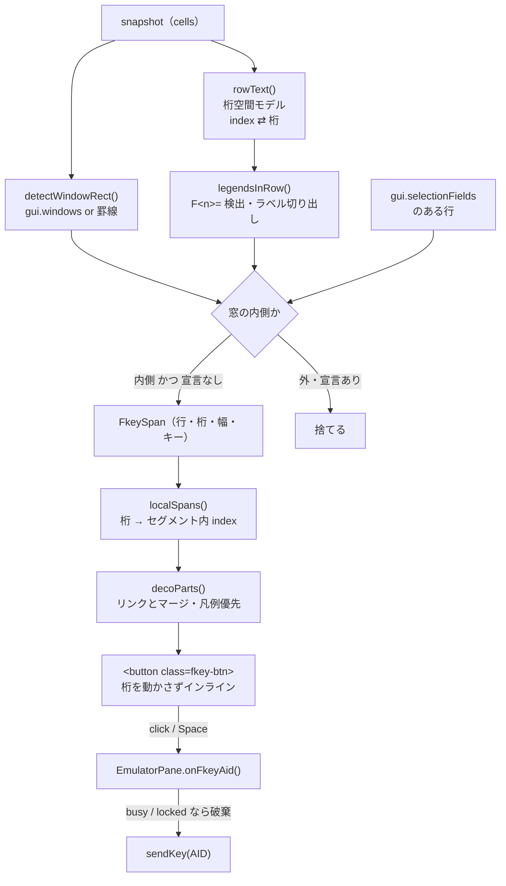

# レビューガイド: 機能キー凡例のボタン化

## 変更概要 / 目的

画面の `F3=終了` `F12=取消` といった**機能キー凡例**は、利用者から見れば「押せる操作」だが、
ホストからは**単なるテキスト**として届く（拡張5250 の画面でも同じ）。そのため画面に見えているのに
クリックできなかった。これをテキストから機械的に検出してボタンにする。

見た目は新設の**ボタン意匠**設定（なし/下線/塗り/枠・既定なし）で決め、拡張5250 の宣言ボタン
（`.gui-choice`）にも同じ設定を効かせる。

- 変更: 5 ファイル（+304/-15）＋ 新規 3 ファイル（実装 207 行 / テスト 576 行）
- 実装 3 に対しテスト 2.8 倍。**検出ロジックは実機データで固定**している。

## 重要ポイント（特に見てほしい所）

### 1. 位置は「桁」で数える。文字列インデックスでは駄目 — 最重要

`packages/web-ui/src/composables/fkeyLegend.ts:62` `rowText()`

**DBCS があると文字列インデックスと桁がずれる**（実機で計測: 同じ行で `F12` が文字列 37・桁 43）。
ずれるとボタンの位置と幅が実際の文字とずれ、5250 の桁レイアウトが壊れる。
`cells`（**1 セル = 1 桁**、DBCS は lead + tail の 2 セル）を基準に、
「表示文字列」と「文字列 index → 桁」の対応表を同時に作っている。

> ここは research 中に**実際に踏んだ落とし穴**。最初の試作は文字列 index で動いていて、
> 日本語画面で桁がずれていた。

### 2. 窓（ヘルプ等）が出ているときは窓の内側だけ

`packages/web-ui/src/composables/fkeyLegend.ts:111` `detectWindowRect()`

窓の外＝下の画面の凡例をボタンにすると**実害が出る**。実機の F1 ヘルプで確認した 2 つのケース:

| 実データ | 問題 |
|---|---|
| `F13= この画` | 窓に隠れて**ラベルが切れている**（本来「この画面の使用法」） |
| `F3= 終了`（下の画面）と `F3= ヘルプ終了`（窓の中） | AID は同じ F3 で、**ホストは前面の窓の文脈で解釈**する。表示は「終了」なのに実際は「ヘルプ終了」 |

**色では区別できない**（下の画面も窓も凡例は同じ青。実画面で確認済み）。

`gui.windows` があればそれを使うが、**通常のヘルプ窓は `gui.windows` に出ない**（文字で描かれる）。
そのため罫線文字からの検出が実質の主経路。上下の縁は端の記号の有無で 1〜2 桁ずれるので
**厳密一致ではなく「8 割以上重なる」**で対にしている（`fkeyLegend.ts:129`）。

### 3. 入力欄を誤ってボタンにしない仕掛けは「構造」で担保

`packages/web-ui/src/components/ScreenGrid.vue:447` 付近

`rows()` はフィールド（保護・非保護を問わず）を `kind:"input"` セグメントに分ける。
したがって `kind:"text"` セグメント＝**どのフィールドにも属さない定数**であり、
入力欄に `F12=X` と打たれても検出対象に入らない。条件分岐ではなく構造で保証している。

### 4. 桁を動かさない描画は `linkify` と同じ継ぎ目

`packages/web-ui/src/components/ScreenGrid.vue:256` `decoParts()` / `:2483` `.fkey-btn`

同一 `.grid-span` 内でインラインに分割し、ボタンに `padding/margin/border` を持たせず `font` を継ぐ。
色も指定せず**ホストが送った色をそのまま継ぐ**。

**実ブラウザで実測**して 4 意匠すべて**差 0.00px**（桁ずれなし）を確認した（`test.md` 参照）。
vitest の DOM はレイアウトしないため、この検証は CI では回せない。代わりに
「桁を動かす指定が入り込んでいないこと」をビルド後 CSS で固定するガードを置いた
（`test/fkey-button-ui.test.ts` の「桁を動かさないための CSS 契約」）。

### 5. ボタンの操作性と 5250 の操作性の両立（decisions D5）

`packages/web-ui/src/components/EmulatorPane.vue:193` `tabStops()` / `:509` Space 処理

- **Tab**: ペインが Tab を `preventDefault` して横取りするため、ブラウザ既定のタブ順は使われない。
  巡回の停止点を**入力欄＋機能キーボタン**に拡張して到達できるようにした。
- **Space**: `isProtectedEdit` が Space を `preventDefault` して native の起動を潰すので、明示的に click する。
- **Enter は 5250 の AID のまま**。普通のボタンは Enter でも起動するが、端末で最も使われるキーを
  「たまたまボタンにフォーカスがある」という理由で奪わない。**ここは意図的な逸脱**。
- **マウス**は `mousedown` を `preventDefault`（フォーカス＝カーソル位置を奪わない）。
  `stopPropagation` は**していない**ので、グリッドのドラッグ矩形選択はそのまま始まる。

## 処理フロー

意匠「なし」のときは `legendsByRow` が空を返し（`ScreenGrid.vue:352`）、
描画は従来どおりの `linkParts` 経路に戻る＝**既定では何も変わらない**。

## 主要な変更箇所

| 場所 | 要点 |
|---|---|
| `packages/web-ui/src/composables/fkeyLegend.ts:62` | 桁空間モデル（DBCS の tail を飛ばし index→桁を対応づけ） |
| `packages/web-ui/src/composables/fkeyLegend.ts:111` | 窓検出（`gui.windows` 優先 → 罫線） |
| `packages/web-ui/src/composables/fkeyLegend.ts:173` | **review R1 の修正**: ラベルと占有幅を同じ切り出しから求める（下記リスク参照） |
| `packages/web-ui/src/composables/fkeyLegend.ts:191` | 窓・宣言行での絞り込み |
| `packages/web-ui/src/components/ScreenGrid.vue:352` | 検出は `snapshot` だけに依存する computed（打鍵で再検出しない。decisions D1） |
| `packages/web-ui/src/components/ScreenGrid.vue:367` | 桁 → セグメント内 index への変換。**収まらない span は捨てる**（ラベルが切れたボタンを出さない） |
| `packages/web-ui/src/components/ScreenGrid.vue:2628` | 意匠 CSS。`.fkey-btn` と `.gui-choice` の**両方**に効かせる |
| `packages/web-ui/src/components/EmulatorPane.vue:367` | クリック → `sendKey`（busy / keyboardLocked を弾く） |
| `packages/web-ui/src/stores/viewSettings.ts:65` | `VIEW_ITEMS` に載せるだけで設定 UI とキー順送りに自動で出る |
| `packages/web-ui/test/global-input-scope.test.ts` | 既存ガードが**コメント内の `.grid-input` を選択子と誤認**していたのを修正（検査の意図は不変。decisions D3） |

## リスク / 確認してほしい点

1. **Enter をボタンに割り当てなかった判断**（decisions D5）。普通のボタンの流儀からは外れる。
   端末の Enter を優先したが、異論があれば変えられる。
2. **拡張5250 の pushbutton/menu は実データが無い**。TESTLIB に該当画面が無く（`CHCCTL` の構文が
   確定できず断念した経緯）、FR-7・FR-8 は**合成スナップショットでのみ検証**している。
   実機で pushbutton を出せる画面が用意できたら、意匠の掛かりと二重描画の有無を実物で見たい。
3. **実機での目視確認は未実施**（装置がビジーで接続できず）。検証データは research で実機から採取した
   実画面を写しているが、最終的な見た目は実機で一度見ておきたい。
4. **窓検出のヒューリスティック**（横罫 8 桁以上・8 割重なり・縦罫が半数以上）は、
   アプリ独自の枠には外れうる。外れた場合は**窓なし＝画面全体が対象**に倒れる
   （切れたラベルが残りうるが AID は有効）。逆に誤爆した場合は**検出漏れ**に倒れる（安全側）。
5. **凡例が保護出力フィールドの中**にある画面では検出されない（既知の限界。「押せない」だけ）。
