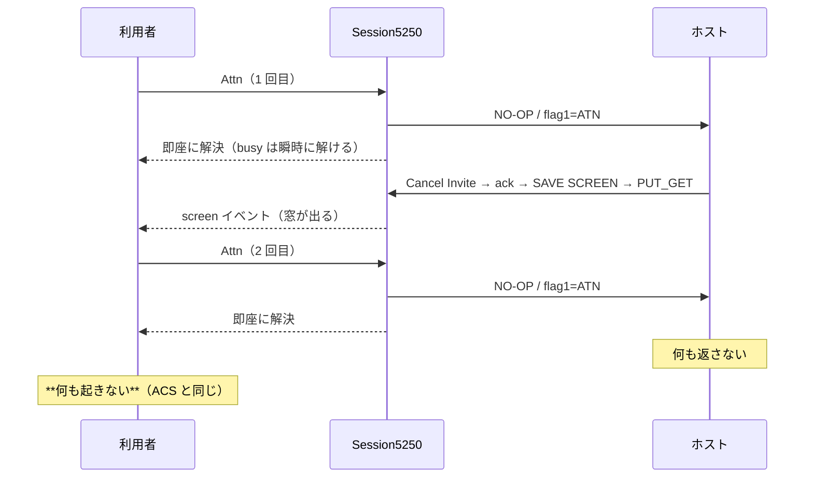

# 仕様: フラグレコードは応答を待たない

## 概要

`Session5250.sendAid` で、Attn / SysReq のときは `sendAndWait` を通さず**送信して即座に解決**する。

```ts
sendAid(key: AidKey, opts: SendAidOptions = {}): Promise<SendAidResult> {
  this.assertReady();
  const record = this.buildAidRecord(key, opts.cursor, opts.sysReqText);
  if (key === "Attn" || key === "SysReq") {
    // ACS 準拠: 応答を待たない（ホストが黙って無視するのが正常。実機で受信ゼロを確認）
    this.telnet.sendRecord(record);
    return Promise.resolve({ screen: this.snapshot(), timedOut: false });
  }
  return this.sendAndWait(record, opts.timeoutMs);
}
```

`FLAG_KEY_TIMEOUT_MS` は不要になるので取り除く（公開 API からも外す）。

## 設計方針

### 方針 1: 「待たない」は取りこぼしにならない

ホストが後から送ってくる画面は `handleRecord` → `screen` イベントで届く。`sendAid` の解決は
**busy（多重送信プロテクト）を解く合図**にすぎず、画面の反映経路ではない。よって即解決しても
1 回目の Attn で窓は出る。

### 方針 2: `locked` にしない

`sendAndWait` は先頭で `state = "locked"` にする。フラグキーでそれをやると、応答が来ない 2 回目で
**キーボードロックが解けないまま残る**（🔒 表示が消えない）。待たないなら状態も動かさないのが一貫する。

### 方針 3: 通常の AID は変えない

Enter・F キーは画面を返すのが前提なので、既定 30 秒待つ従来動作を維持する。
`MSG_NO_RESPONSE`（無応答の操作員メッセージ）もそちらでは引き続き出す（decisions D2）。

## 対象範囲

| ファイル | 変更 |
|---|---|
| `packages/core/src/session/session.ts` | `sendAid` の分岐／`FLAG_KEY_TIMEOUT_MS` 削除 |
| `packages/core/src/index.ts` | 公開 API から `FLAG_KEY_TIMEOUT_MS` を外す |
| `packages/core/test/session.test.ts` | 待たないことの検証に差し替え |
| `docs/PROTOCOL.md` | 6.2 に「応答を待たない」を明記 |

## 振る舞いの詳細



## 受け入れ基準との対応

| requirement の完了条件 | 満たし方 |
|---|---|
| 待たずに解決し `timedOut: false` | `session.test.ts` で解決までの時間と戻り値を検証 |
| `locked` にならない | 同テストで `keyboardLocked` を検証 |
| 通常 AID は従来どおり | 既存テスト＋「Enter は 5 秒では戻らない」テスト |
| 実機で 2 回目に何も起きない | 実機でオーバーレイとメッセージの不在を確認 |
| 実機で 1 回目は窓が出る | 実機で確認 |
