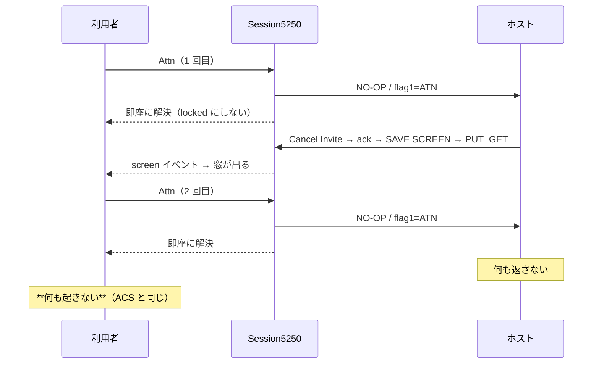

# レビューガイド: フラグレコードは応答を待たない

## 変更概要 / 目的

利用者に ACS の実挙動を確認していただいた:

> ACS での attn コマンド入力エリア表示後に再度 attn を呼び出しても何も起きません

**ACS は何も起きない。** #160 では「5 秒待って『ホストから応答がありませんでした』を出す」としたが、
それは **ACS に無い反応**だった。固まらなくはなったが、方向が違っていた。

## 重要ポイント

### 1. 「短く待つ」ではなく「待たない」

前 work で採取した事実——**ホストは 2 回目の Attn に 1 バイトも返さない**。つまり
**応答が返らないのが正常**な操作で、応答を待つ設計そのものが誤りだった。短くしても
オーバーレイとメッセージという ACS に無い反応が残る。

### 2. 待たなくても取りこぼさない

1 回目の Attn で窓が出るのは、ホストが**その後に**画面を送ってくるから。それは
`handleRecord` → `screen` イベントで届く。`sendAid` の解決は **busy（多重送信プロテクト）を解く
合図にすぎず、画面の反映経路ではない**。実機で 1 回目の窓が従来どおり出ることを確認済み。

### 3. `locked` にしないのが要点

`sendAndWait` は先頭で `state = "locked"` にする。フラグキーでそれをやると、応答が来ない 2 回目で
**ロックが残り 🔒 が消えなくなる**。待たないなら状態も動かさない。

## 処理フロー

## 主要な変更箇所

- `packages/core/src/session/session.ts` — `sendAid` のフラグキー分岐（即解決・ロックしない）
- `packages/core/src/index.ts` — `FLAG_KEY_TIMEOUT_MS` を公開 API から削除（死んだ定数を残さない）
- `packages/core/test/session.test.ts` — 「待たない・ロックしない」の検証へ差し替え
- `docs/PROTOCOL.md` 6.2 — 「フラグレコードは応答を待たない」を明文化

## リスク / 確認してほしい点

- **1 回目の Attn で busy が即解ける**ので、窓が来る前（〜40ms）に次のキーを押せる。ACS も入力を
  止めていない（利用者確認）ので許容した。
- `MSG_NO_RESPONSE` は**通常 AID の無応答では残す**（decisions D2）。フラグキーでは出ない。
- ACS が 1 回目で入力禁止（X SYSTEM）を出すかは未確認。出していても実害はない（busy が瞬時に解ける）。
