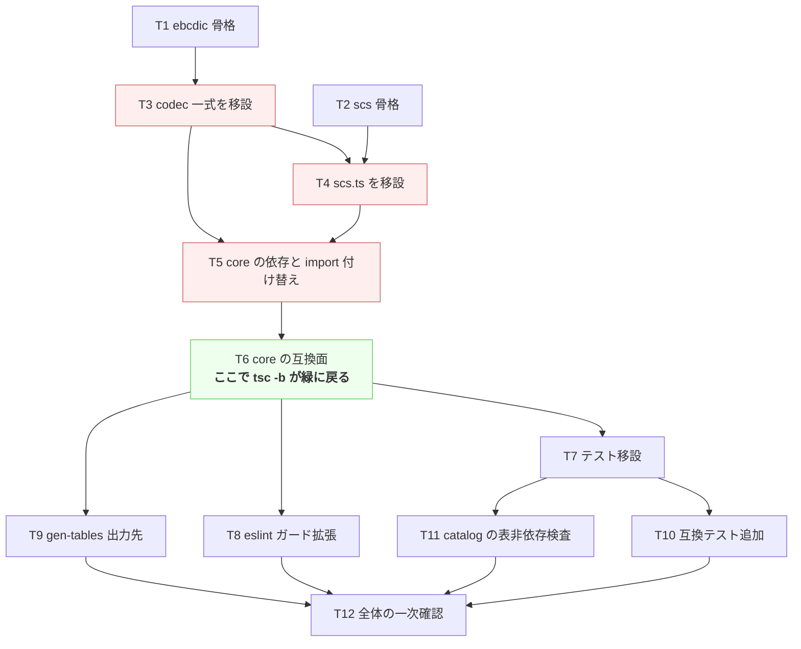

# 計画: EBCDIC コーデックと SCS デコーダのパッケージ分割

## split 判定

**subtask に分割しない**（親 work 単体・単一 `tasks.md`）。

- 本作業は**振る舞い不変の refactor**であり、`DESIGN.md`「5.」の決定木では subtask に落とさない側に当たる
- `git mv` で実体を移す以上、**移設から core の import 付け替えが済むまでビルドが赤い**。
  この区間に「単独で検証可能な中間状態」は作れず、漸進レビューの seam が取れない
- 規模（新規 2 パッケージ・移動 18 ファイル・変更 約 35 ファイル）は 1 PR に収まる。過剰分割はしない

## 実装方針

**赤い区間を最短にする順序**で組む。`git mv` した瞬間に core が壊れるので、
テストの移設や lint 設定といった「後でもできる作業」を先に挟まず、
**移設 → core の付け替え → 緑に戻す** を一続きで終える。

**赤い区間は T3〜T5**（T6 完了で緑に戻る）。この間は `tsc -b` を成否の判定に使えないので、
各タスクの完了判定は「spec で定めた移設内容が済んでいるか」で行う。

## 作業順序と依存関係

1. **T1 / T2 — 新パッケージの骨格**（依存: なし）
   先に空の器と build 配線を作る。`tsc -b` は `include: ["src"]` が空でも通るので、
   骨格だけの時点ではリポジトリは緑のまま。
2. **T3 / T4 — 実体の移設**（依存: T1 / T2）
   `git mv` で履歴を保って移す。**中身は import パス以外変えない**——
   原典参照コメント（tn5250 `scs.c`、ACS/jt400 の CCSID 300 差分、research F4、ICU 出典）を
   1 行も落とさない（AGENTS.md「既存プロトコル実装の移植」）。
3. **T5 / T6 — core を新パッケージへ向ける**（依存: T3, T4）
   T5 で内部 22 ファイル、T6 で公開面（facade / `index.ts` / `browser.ts`）。
   T6 完了時点で `npm run build` が通ることを確認する。
4. **T7〜T11 — 検証資産と設定の追従**（依存: T6）
   互いに独立なので順不同。
5. **T12 — 受け入れ基準の一次確認**（依存: すべて）

## リスク / 留意点

| # | リスク | 対応 |
|---|---|---|
| R1 | T3〜T5 でビルドが赤い。中断すると再開時に状況が読めない | 赤い区間を 3 タスクに閉じる。`tasks.md` に赤/緑を明記し、中断するなら T6 の後にする |
| R2 | 互換 re-export の列挙漏れ。**型検査では気づけない**（外に出なくなっても core 内部は通る） | T10 で実行時の互換テストを追加（`errors-compat.test.ts` の先例。同じ事故が `20260719-core-debt-payoff` で実際に起きている） |
| R3 | `browser.ts` を誤って `.` に向けると web-ui のバンドルに **1.17 MB** の表が入る。ビルドもテストも通ってしまう | T11 で `./catalog` の到達可能モジュールを静的検査。加えて T12 で web-ui の **dist サイズを分割前後で比較** |
| R4 | codec を core の外に出すと `eslint.config.js` の Node 非依存ガード（`files: ["packages/core/src/**"]`）が**静かに外れる** | T8 を独立タスクにする。かつ **違反コードを実際に書いて lint が落ちることを確認**する（`20260719-core-debt-payoff` で `no-restricted-globals` に対して行った検証と同じ手順） |
| R5 | `gen:tables` の再生成で差分が出る（相対 import が壊れる） | spec D6 のレイアウト維持（`src/table-types.ts` と `src/tables/` を親子で置く）。T9 で `git diff --exit-code` により機械的に確認 |
| R6 | workspace のシンボリックリンク未作成で `@as400web/ebcdic` が解決しない | T1/T2 の直後に `npm install` を実行する |
| R7 | 新パッケージに `types: ["node"]` を付けるため（`TextDecoder` の型に必要）、うっかり Node API を書ける | R4 の lint ガードで塞ぐ。これが T8 を「あとで」にしない理由 |
| R8 | web-ui は root の `tsc -b` に含まれない（vite/vue-tsc 系）。`browser.ts` の変更が web-ui の型解決を壊しても全体ビルドでは出ない | AGENTS.md「ビルドに vue-tsc を含める」に従い、T12 で `npm run build -w @as400web/web-ui` を必ず実行する |
| R9 | 1.17 MB の表を `git mv` するので diff が巨大に見え、レビューで本質が埋もれる | `git mv` で rename として記録させ、内容を変更しない（rename 検出が効く）。walkthrough 工程で読む順序を示す |

## テスト方針

test 工程では requirement の完了条件 9 項目を、次の順で検証する。

**単体（移設したテスト資産が機能しているか）**
- `packages/ebcdic` — `codec` / `dbcs-codec` / `pure-dbcs` / `ccsid-text` の 4 ファイル
- `packages/scs` — `scs` の 1 ファイル
- `packages/core` — 残りが従来どおり通ること

**互換（このリファクタ固有の回帰）**
- `@as400web/core`（root）/ `@as400web/core/codec` / `@as400web/core/browser` の 3 経路から
  期待シンボルが取得でき、`codecForCcsid(37).decode(...)` が移設前と同じ文字列を返す（T10）
- `@as400web/ebcdic/catalog` から EBCDIC 表へ到達しない（T11）

**全体**
- `npm run build`（`tsc -b`）
- `npm test`（`--workspaces`）— **core 単体の baseline は 74 ファイル / 871 テスト（実測・全通過）**。
  移設後は core＋ebcdic＋scs の合計がこれを下回らないこと（＋ T10/T11 の新規分）
- `npm run lint`
- **`npm run build -w @as400web/web-ui`**（`vue-tsc -b && vite build`。R8）
- `npm run gen:tables` → `git diff --exit-code`（R5）

**機械的な後方互換の確認**
- `git diff --stat -- packages/server/src packages/web-ui/src` が**空**であること。
  spec のとおり両者のソースは 1 行も変えない。空でなければ後方互換が破れている証拠
- web-ui の `dist` サイズを分割前後で比較し、増えていないこと（R3）

**実機観点**: 本作業は振る舞い不変の refactor であり、プロトコル挙動・UI 操作感に変更はない。
実機（PUB400 等）での再検証は不要と判断する。ただし web-ui のビルドと
バンドルサイズは上記のとおり必ず確認する。
