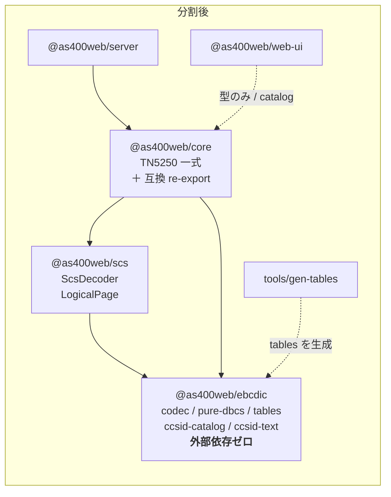
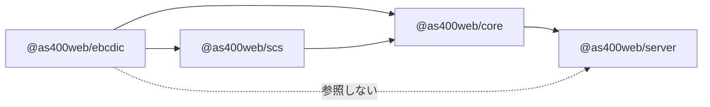

# 仕様: EBCDIC コーデックと SCS デコーダのパッケージ分割

## 概要

`packages/core/src/codec/` 一式と `packages/core/src/protocol/scs.ts` を、monorepo 内の
**2 つの新パッケージ** `@as400web/ebcdic` / `@as400web/scs` に移す。
`@as400web/core` は移設先を re-export する薄いファサードを持ち、**既存の import 文を一切変えずに**
従来どおり解決できる状態を保つ。npm publish は行わない。



## 設計方針

### D1. codec と scs は **2 パッケージに分ける**（1 パッケージ同梱ではなく）

backlog は「2 は 1 と同じ切り出しで一緒に出せる」としているが、**同時に出すことと 1 パッケージに
まとめることは別**である。分ける理由:

- 責務のドメインが違う（**文字コード変換** と **SNA 印刷ストリームの解釈**）。
  backlog 自身が「IBM i のスプールを扱いたいが TN5250 一式は要らない」需要と
  「EBCDIC 変換が欲しい」需要を別々に挙げている
- 依存の向き（`scs → ebcdic`）が `package.json` に構造として現れる。
  backlog が実測した「scs は codec のみ依存」がそのまま検査可能な形になる
- 将来の公開判断を**パッケージ単位で独立に**下せる（本作業では publish しないが、
  ゴールは「公開の判断を後回しにできる状態にすること」）
- monorepo 内では 2 個目のパッケージの追加コストは小さい（`package.json` + `tsconfig.json` + `vitest.config.ts`）

**退けた代替**: 1 パッケージ＋サブパス分割（`@as400web/ebcdic` と `@as400web/ebcdic/scs`）。
サブパスで論理的に分けても npm の依存グラフ上は 1 つのままで、EBCDIC だけ欲しい利用者に
印刷ストリームのデコーダが付いてくる。分割の目的（渡すものを絞る）を達成しない。

### D2. パッケージ名は `@as400web/ebcdic` / `@as400web/scs`

既存スコープ `@as400web/` を踏襲する。`ccsid-text.ts` は非 EBCDIC（UTF-8 / ISO-8859-1 / Shift_JIS 等）も
`TextDecoder` 経由で扱うため `@as400web/ccsid` も候補だが、**差別化の軸がそのまま名前になる方**を採る
（backlog: 「npm の EBCDIC 系は SBCS 止まりが多い」）。非 EBCDIC は EBCDIC を主役にした
テキスト入口の付随機能という位置づけ。

### D3. 「表を引き込まない入口」をサブパスで維持する（**現状の性質の保存**）

`ccsid-catalog.ts` は冒頭コメントのとおり **意図的に表へ依存しない**設計で、
`browser.ts` はこれを直接 import することで web-ui のバンドルに 1.17 MB の EBCDIC 表が
入らないようにしている。パッケージ分割で `.` エントリを 1 本にすると**この性質が壊れる**ため、
`@as400web/ebcdic` に **`./catalog` サブパス**を設ける。

これは新機能ではなく現状の維持である。**tree-shaking / テーブル同梱単位の改善は行わない**
（backlog の別項目・本作業のスコープ外。`codec.ts` の 5 表静的 import、
`pure-dbcs.ts` の `ibm1399` 静的 import は現状のまま移す）。

### D4. 後方互換は「core 内の薄い re-export ファイル」で担保する

`@as400web/core` の `exports` マップ（`.` / `./codec` / `./browser`）は**変更しない**。
移設先へは core の中のファイルが橋渡しする。

- `packages/core/src/codec/codec.ts` → **中身を捨て、`@as400web/ebcdic` からの明示 re-export のみ**にする。
  これにより `exports["./codec"] → ./dist/codec/codec.js` のマッピングを触らずに済む
  （AGENTS.md が言及する「codec サブパスからブラウザ安全に import」という規約もパスごと維持される）
- `packages/core/src/index.ts` の該当 export 行を新パッケージ由来に差し替える
- `packages/core/src/browser.ts` の catalog re-export を `@as400web/ebcdic/catalog` に差し替える
- **core 内部の利用側（約 25 ファイル）は新パッケージを直接 import する**。
  互換ファイル経由にはしない（同じものへの経路を 2 本作らない）

**re-export は明示列挙**とし、`export *` を使わない。`20260719-core-debt-payoff` で
「`index.ts` の re-export まで一括置換して旧名が外へ出なくなった」事故が起きているため、
公開面は列挙して目視・型検査の対象にする（→ D9 の互換テストと対で守る）。

### D5. `protocol/scs.ts` は完全撤去

`@as400web/core` に `./scs` のようなサブパス export は無く、外部利用は
`index.ts` 経由（`server/src/pdf.ts` / `host-spools.ts` の `LogicalPage` 型）だけなので、
facade ファイルは不要。`index.ts` の 1 行を `@as400web/scs` からの re-export に差し替える。

### D6. 生成テーブルの相対 import を壊さないため、パッケージ内レイアウトを維持する

生成物は先頭に `import type { SbcsTable } from "../table-types.js";` を持つ
（`tools/gen-tables/src/emit-sbcs.ts:44` / `emit-stateful.ts:46` が埋め込む）。
新パッケージでも **`src/table-types.ts` と `src/tables/` を親子関係のまま**置けば、
この相対 import は有効なままで、**再生成しても内容がバイト一致する**
（受け入れ基準「`gen:tables` の結果が変化しない」を構造で満たす）。

### D7. lint の Node 非依存ガードを新パッケージへ広げる（**穴を開けない**）

`eslint.config.js` の `no-restricted-imports`（`node:*`）と `no-restricted-globals`
（`Buffer` / `process` / `__dirname` / `__filename` / `global` / `require`）は
`files: ["packages/core/src/**"]` にしか掛かっていない。**codec を core の外へ出した瞬間に
このガードが外れる**——「依存ゼロ・ブラウザで動く」がこのパッケージの売りなので、
glob を新パッケージまで広げるのは分割と不可分の作業とする。

同様に `ignores` の `packages/core/src/codec/tables/**` も移設先へ付け替える
（付け替えないと 18,900 行の生成物が lint 対象になる）。

## 対象範囲

### 新規作成

| パス | 内容 |
|---|---|
| `packages/ebcdic/package.json` | name `@as400web/ebcdic` / exports `.` `./catalog` / **dependencies なし** |
| `packages/ebcdic/tsconfig.json` | `composite: true` / `rootDir: src` / `outDir: dist` / `types: ["node"]` |
| `packages/ebcdic/vitest.config.ts` | core と同じ `include: ["test/**/*.test.ts"]` |
| `packages/ebcdic/src/index.ts` | `.` の公開面（codec / pure-dbcs / ccsid-text / table 型） |
| `packages/ebcdic/src/catalog.ts` | `./catalog` の公開面（`ccsid-catalog.ts` を re-export、または `ccsid-catalog.ts` 自体を指す） |
| `packages/scs/package.json` | name `@as400web/scs` / exports `.` / dependencies `@as400web/ebcdic` |
| `packages/scs/tsconfig.json` | `composite: true` / references `../ebcdic` |
| `packages/scs/vitest.config.ts` | 同上 |
| `packages/scs/src/index.ts` | `ScsDecoder` / `LogicalPage` |

### 移動（`git mv` で履歴を保つ・内容は import パス以外変更しない）

| 移動元 | 移動先 |
|---|---|
| `packages/core/src/codec/codec.ts` | `packages/ebcdic/src/codec.ts` |
| `packages/core/src/codec/pure-dbcs.ts` | `packages/ebcdic/src/pure-dbcs.ts` |
| `packages/core/src/codec/ccsid300.ts` | `packages/ebcdic/src/ccsid300.ts` |
| `packages/core/src/codec/ccsid-catalog.ts` | `packages/ebcdic/src/ccsid-catalog.ts` |
| `packages/core/src/codec/ccsid-text.ts` | `packages/ebcdic/src/ccsid-text.ts` |
| `packages/core/src/codec/table-types.ts` | `packages/ebcdic/src/table-types.ts` |
| `packages/core/src/codec/tables/*.ts`（5 表） | `packages/ebcdic/src/tables/*.ts` |
| `packages/core/src/protocol/scs.ts` | `packages/scs/src/scs.ts` |
| `packages/core/test/{codec,dbcs-codec,pure-dbcs,ccsid-text}.test.ts` | `packages/ebcdic/test/` |
| `packages/core/test/scs.test.ts` | `packages/scs/test/` |

> `packages/core/test/dbcs-session.test.ts` は **session のテスト**（トレース再生）なので core に残す。

### 変更

- `packages/core/src/codec/codec.ts` — **新規に作り直す**（`@as400web/ebcdic` からの明示 re-export のみ）
- `packages/core/src/index.ts` — codec / pure-dbcs / ccsid-text / scs の export 元を差し替え（4 箇所）
- `packages/core/src/browser.ts` — catalog の import 元を `@as400web/ebcdic/catalog` に
- `packages/core/src/**` の codec 利用 約 25 ファイル — import を `@as400web/ebcdic` に
- `packages/core/src/session/printer-session.ts` / `hostserver/spool/netprint-connection.ts` — scs の import を `@as400web/scs` に
- `packages/core/package.json` — `dependencies` に 2 パッケージを追加
- `packages/core/tsconfig.json` — `references` に 2 パッケージを追加
- `tsconfig.json`（root） — `references` に 2 パッケージを追加
- `eslint.config.js` — ガードの glob 拡張・tables の ignore 付け替え（D7）
- `tools/gen-tables/src/main.ts:11` — 出力先を `packages/ebcdic/src/tables` に

### 変更しない

- `packages/server` / `packages/web-ui` の**ソースは 1 行も変えない**（後方互換の実証そのもの）
- 表の生成形式・同梱単位・tree-shaking
- 公開 API のシグネチャ・関数名

## インターフェース / データ構造

### `@as400web/ebcdic`

```jsonc
// package.json（抜粋）
{
  "name": "@as400web/ebcdic",
  "type": "module",
  "exports": {
    ".":        { "types": "./dist/index.d.ts",   "default": "./dist/index.js" },
    "./catalog":{ "types": "./dist/catalog.d.ts", "default": "./dist/catalog.js" }
  },
  "files": ["dist"]
  // dependencies なし（＝この値が受け入れ基準の 1 つ）
}
```

| 入口 | 公開シンボル | 表を引き込むか |
|---|---|---|
| `.` | `Codec`, `SbcsCodec`, `DbcsCodec`, `codecForCcsid`, `katakanaChar`, `SO`, `SI`,<br/>`SbcsTable`, `StatefulTable`,<br/>`PureDbcsCodec`, `pureDbcsCodecForCcsid`, `isPureDbcsCcsid`, `ibm16684`, `ibm300`,<br/>`decodeCcsidText`, `encodeCcsidText`, `isEbcdicCcsid`, `canDecodeCcsid`, `canEncodeCcsid`, `CcsidText`,<br/>（`ccsid-text.ts` 経由で `TEXT_CCSIDS` / `ccsidLabel` / `LineEnding` も再輸出） | **はい** |
| `./catalog` | `TEXT_CCSIDS`, `ccsidLabel`, `LineEnding` | **いいえ**（この性質が要件） |

### `@as400web/scs`

```jsonc
{
  "name": "@as400web/scs",
  "type": "module",
  "exports": { ".": { "types": "./dist/index.d.ts", "default": "./dist/index.js" } },
  "dependencies": { "@as400web/ebcdic": "0.1.0" }
}
```

公開シンボル: `ScsDecoder`, `LogicalPage`。

### `@as400web/core` の互換面（**変更なしで解決できること**が仕様）

| 経路 | 解決先 |
|---|---|
| `@as400web/core`（root） | `index.ts` が新パッケージから re-export |
| `@as400web/core/codec` | `dist/codec/codec.js`＝`@as400web/ebcdic` の明示 re-export ファイル |
| `@as400web/core/browser` | `@as400web/ebcdic/catalog` から re-export（表ゼロを維持） |

バージョン指定は既存に合わせ**完全一致**（`"0.1.0"`。`packages/server` の
`"@as400web/core": "0.1.0"` と同じ流儀）。

## 振る舞いの詳細

- **実行時の振る舞いは一切変わらない**。移設はファイル位置と import パスの変更に閉じる
- `codecForCcsid` は未対応 CCSID で `RangeError` を投げる（現状どおり）。
  core の `As400Error` / `ErrorCode` には**依存させない**——依存ゼロを保つため
- `ScsDecoder` の `warn` コールバックは呼び出し側注入のまま（ロガーを引き込まない）
- `ccsid-text.ts` は `TextDecoder` / `TextEncoder`（Web 標準）のみを使う。`node:*` は使わない
- `@as400web/core/browser` から `TEXT_CCSIDS` を import しても EBCDIC 表がバンドルに入らない

### ビルド順序



`tsc -b` は project references の順で解決する。root `tsconfig.json` の `references` に
`packages/ebcdic` と `packages/scs` を追加し、`packages/core/tsconfig.json` にも両者への
`references` を足す（`composite: true` が前提）。

## ドメイン固有の考慮

AGENTS.md の規約のうち、本作業で明示的に効くもの。

- **「core のピュアロジック層は Node API 非依存」**（AGENTS.md「コーディング規約」）——
  この制約は codec/scs にもそのまま適用される。lint の glob 拡張（D7）で機械的に守る。
  **散文の約束にせず、ルールを移設する**
- **「ログは stderr のみ・`console.*` は lint で禁止」**——`no-console` はリポジトリ全体ルールなので
  新パッケージにも効く（追加作業なし）
- **「原典の参照コメントを残す」**（AGENTS.md「既存プロトコル実装の移植」）——
  `scs.ts` の tn5250 `lib5250/scs.c` 参照、`codec.ts` の CCSID 300 と ACS/jt400 の挙動差、
  `ccsid-text.ts` の research F4 参照、生成表の ICU 出典・Unicode License 表記は
  **1 行も落とさずに移設する**。移設でこれらが消えると、なぜその実装なのかの根拠が失われる
- **依存ゼロが売り**（backlog）——`@as400web/ebcdic` の `dependencies` が空であることを
  受け入れ基準に含める。`20260719-core-debt-payoff` で pino を core から server へ追い出した
  成果を、パッケージ境界として固定する
- **ライセンス**——両パッケージとも `"license": "Apache-2.0"`。生成表に含まれる
  ICU / Unicode License V3 の出典コメントは維持する

## エラー処理 / 異常系

| 想定 | 扱い |
|---|---|
| `tsc -b` が references の設定漏れで失敗 | ビルド失敗として検出。root と core 双方の references を確認 |
| workspace のシンボリックリンク未作成 | 移設後に `npm install` を実行して解決する |
| 生成表の相対 import が壊れる | D6 のレイアウト維持で回避。`npm run gen:tables` 後に `git diff` が空であることで検証 |
| 互換 re-export の列挙漏れ | D9 の互換テストで検出（型検査だけでは通ってしまうため実行時テストを置く） |
| `browser.ts` が誤って `.` を指し、表がバンドルに入る | D9 の依存検査で検出 |

## 受け入れ基準との対応

| requirement の完了条件 | 満たし方 |
|---|---|
| core に codec / scs の実体が無い | D4（`codec.ts` は re-export のみ）・D5（scs は完全撤去） |
| 新パッケージに外部 `dependencies` が無い | `@as400web/ebcdic` の `package.json` に `dependencies` を置かない。scs は ebcdic のみ |
| `npm run build` 成功 | D6 の project references 追加 |
| `npm test` が従来と同じ結果 | テスト移設（core 74 ファイル / 871 テストが baseline。移設後は core＋ebcdic＋scs の**合計**で 871 を下回らない） |
| `npm run lint` 成功 | D7 の glob 拡張・ignore 付け替え |
| `server/src/host-dtaq.ts` が無変更で解決 | D4（`exports["./codec"]` を変更しない） |
| `server/src/pdf.ts` の `LogicalPage` が無変更で解決 | D5（`index.ts` の 1 行差し替え） |
| `gen:tables` の結果が変化しない | D6（レイアウト維持）＋ 実行後 `git diff --exit-code` |
| テスト総数が減っていない | 上記 baseline との突き合わせ |

### D9. 互換テスト（追加する新規テスト）

`packages/core/test/codec-reexport.test.ts`（仮称）を追加し、次を実行時に検証する。
先例は `packages/core/test/errors-compat.test.ts`——`As400Error` 改名時に
**re-export の一括置換で旧名が外へ出なくなった**事故を受けて追加されたもので、同じ轍を踏まない。

- `@as400web/core`（root）から `codecForCcsid` / `SbcsCodec` / `DbcsCodec` / `katakanaChar` /
  `SO` / `SI` / `PureDbcsCodec` / `decodeCcsidText` / `ScsDecoder` が取得でき、動作すること
- `@as400web/core/codec` から `codecForCcsid` が取得でき、`codecForCcsid(37).decode(...)` が
  移設前と同じ文字列を返すこと（`server/src/host-dtaq.ts` の利用形と同じ）
- `@as400web/core/browser` から `TEXT_CCSIDS` / `ccsidLabel` が取得できること

加えて `@as400web/ebcdic` 側に、**`./catalog` が表を引き込まないこと**の検査を置く
（`dist/catalog.js` から到達可能なモジュールに `tables/` が含まれないことを静的に確認する。
実装手段は plan で決める）。
