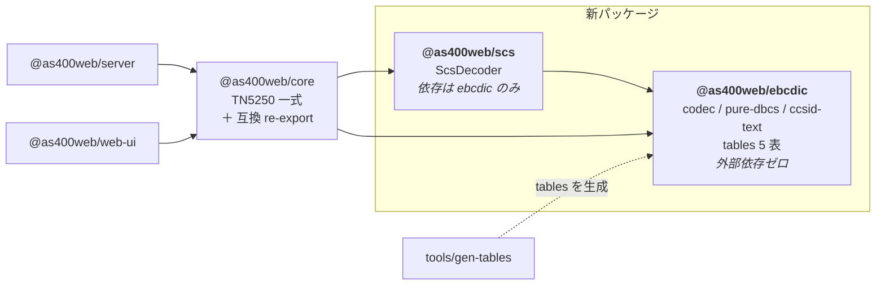
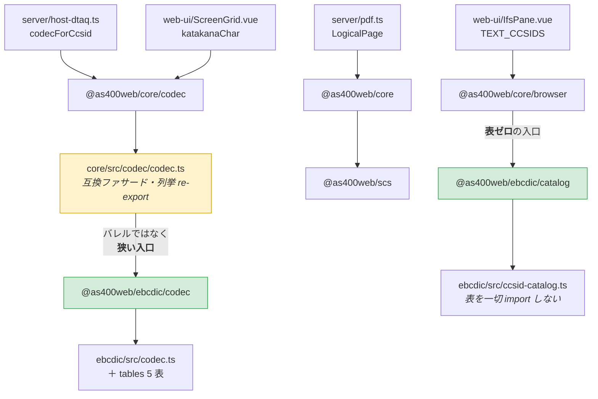

# レビューガイド: EBCDIC コーデックと SCS デコーダのパッケージ分割

## 変更概要 / 目的

`.aidev/backlog/library-extraction.md` の切り出し候補 **1. EBCDIC コーデック** と
**2. SCS デコーダ** を実施し、`packages/core` から 2 つの独立パッケージへ分離した。
**monorepo 内でのパッケージ分割まで**がゴールで、npm publish・別リポジトリ分離は行わない。

**振る舞いは 1 ミリも変えていない。** レビューで見るべきは「動くか」ではなく
**「境界が正しいか」「守りが外れていないか」**の 2 点に尽きる。

### 差分の読み方（先に読んでほしい）

変更 48 ファイル（＋ テーブル 5 表 18,900 行）と大きく見えるが、実質は次の 4 種類しかない。

| 種類 | ファイル数 | 見る必要 |
|---|---|---|
| **表の移動**（`src/codec/tables/` → `packages/ebcdic/src/tables/`） | 5 | **不要**。rename 検出で変更行 0 を確認済み |
| **実装の移動**（内容無変更） | 10 | **不要**。同上（下記「証明」参照） |
| **import の付け替え**（1 行ずつ） | 24 | 流し読みで十分 |
| **設計判断が入っている** | 9 | **ここだけ読めばよい** |

**内容無変更の証明**: `git diff -M main` の rename 検出で 10 ファイルが変更行 0。
`packages/ebcdic/src/codec.ts` だけは core 側に同名のファサードが残るため rename 対から外れるので、
`git show main:packages/core/src/codec/codec.ts` と `diff` を取り**バイト一致**を確認している。
原典参照コメント（tn5250 `lib5250/scs.c`・`0xFD`＝DBCS(IGC) 制御の実測メモ・ACS/jt400 の
CCSID 300 差分・ICU 出典と Unicode License・research F4）はすべて逐語で残っている。

## 重要ポイント（特に見てほしい所）

### 1. なぜ 1 パッケージではなく 2 パッケージなのか（spec D1）

backlog は「2 は 1 と同じ切り出しで一緒に出せる」と書いているが、
**同時に出すことと 1 パッケージにまとめることは別**と解釈した。責務のドメインが違い
（文字コード変換 ／ SNA 印刷ストリームの解釈）、backlog 自身が
「EBCDIC 変換が欲しい」需要と「スプールを扱いたいが TN5250 一式は要らない」需要を別に挙げている。
サブパスで論理的に分けても npm の依存グラフ上は 1 つのままなので、目的（渡すものを絞る）を達成しない。

### 2. 入口が 3 つある理由 — **バンドルサイズが実測で効いている**（decisions.md D2）

`@as400web/ebcdic` は `.` / `./codec` / `./catalog` の 3 入口を持つ。増やしたのではなく、
**分割前の core が既に持っていた構造（root / `./codec` / `./browser`）の写し**である。

ここが今回いちばん危なかった所で、**一度実際に壊している**。

- 分割前: `@as400web/core/codec` → `codec.ts` **1 モジュール**（表だけの狭い入口）
- 最初の実装: 同サブパス → 互換ファサード → **ebcdic のバレル** → `pure-dbcs` / `ccsid-text` まで到達
- 結果: web-ui の本番バンドルが **+628 バイト**（`ibm-1399` / `ibm-16684` が新たに混入）

`exports` マップは spec どおり変えていなかったのに、**その先の入口が広がっていた**。
`main` を worktree に取って同一条件でビルドし突き合わせて初めて分かった。
`@as400web/ebcdic/codec` を足してファサードをそちらへ向け、
**バンドルは 1,407,469 バイト・Vite のコンテンツハッシュ `index-CG8HnPjB.js` まで一致**する状態に戻した。

### 3. 「壊れても何も落ちない」性質を 3 つ、テストで固定した

このリファクタ特有のリスクは、**ビルドもテストも通るのに外の利用者だけが壊れる**類のもの。
人の注意ではなく検査で押さえた。3 つとも**実際に壊して落ちることを確認済み**。

| 守りたい性質 | 壊れたときの症状 | 検査 |
|---|---|---|
| 再輸出の列挙が欠けない | core 内部は無傷。外の利用者だけ壊れる | `codec-reexport.test.ts` |
| ファサードがバレルを参照しない | バンドルが静かに膨らむ | 同上（参照先を固定） |
| `catalog` が表を引き込まない | web-ui のバンドルに 1.17 MB 混入 | `catalog-no-tables.test.ts` |

再輸出の検査は空想ではない——`Tn5250Error` → `As400Error` の改名時に
**re-export の一括置換で旧名が外へ出なくなった**事故が実際にあり
（`20260719-core-debt-payoff`、`errors-compat.test.ts`）、その先例に倣っている。
だから互換ファサードでは `export *` を使わず**公開面を列挙**している。

### 4. 切り出すとガードが静かに外れる（plan R4）

`eslint.config.js` の Node 非依存ガードは `files: ["packages/core/src/**"]` にしか掛かっていなかった。
**codec を core の外へ出した瞬間、「依存ゼロ・ブラウザで動く」を守るルールが無効になる。**
glob を新パッケージまで広げ、`node:fs` / `Buffer` / `process` を実際に書いて
5 件のエラーが出ることを確認した（ルールを足しただけで効いていない事態を防ぐ）。

さらに `scs` は `types: []` にしたので、Node API は **eslint より手前の型検査**で
`TS2591` として弾かれる。`ebcdic` は `TextDecoder` の型のため `types: ["node"]` が要り、
この防壁を持てない——だから lint 側の守りが要る、という非対称がある。

## 処理フロー

### パッケージ構成と依存の向き

### 外の利用者から実体までの解決経路（**無変更で通ることが要件**）

緑の 2 つが**狭い入口**。ここをバレル（`@as400web/ebcdic`）に向け替えると、
どちらもビルドとテストは通ったままバンドルだけが膨らむ。

## 主要な変更箇所

**設計判断が入っている 9 ファイル**（他は移動と import 付け替えのみ）。

- `packages/core/src/codec/codec.ts:31` — 互換ファサード。参照先が
  `@as400web/ebcdic/codec`（狭い入口）であることが要点。バレルに戻すと +628 バイト
- `packages/core/src/browser.ts:32` — `@as400web/ebcdic/catalog` から re-export。
  **`@as400web/ebcdic` に向けると web-ui のバンドルに 1.17 MB 入る**
- `packages/core/src/index.ts:54` — `ScsDecoder` / `LogicalPage` を `@as400web/scs` から再輸出
- `packages/ebcdic/package.json:12` — `./codec` サブパス（狭い入口）の宣言
- `packages/ebcdic/src/catalog.ts` — 表ゼロの入口。**`ccsid-catalog.ts` 以外を import しない**のが契約
- `packages/ebcdic/tsconfig.json:11` — `types: ["node"]`。理由は `TextDecoder` の型のみ（コメント参照）
- `packages/scs/tsconfig.json:11` — 対して `types: []`。型の段階で Node API を塞ぐ
- `eslint.config.js:39` — ガードの glob を 3 パッケージへ拡張
- `tools/gen-tables/src/main.ts:14` — 生成先。**`src/table-types.ts` の兄弟に `src/tables/` を置く**
  構成が前提（生成物の `../table-types.js` が成り立つ配置）。崩すと再生成で差分が出る

**新規テスト 2 本**

- `packages/core/test/codec-reexport.test.ts` — 3 経路の到達可能性＋ファサードの参照先固定
- `packages/ebcdic/test/catalog-no-tables.test.ts:33` — import グラフを実際にたどる。
  `from "…"` / 副作用 import / 動的 import の 3 形式を拾う

## リスク / 確認してほしい点

### 判断を仰ぎたい点

- **パッケージ名** `@as400web/ebcdic` / `@as400web/scs`。`ccsid-text.ts` は非 EBCDIC
  （UTF-8 / ISO-8859-1 / Shift_JIS）も `TextDecoder` 経由で扱うため `@as400web/ccsid` も候補だった。
  「npm の EBCDIC 系は SBCS 止まりが多い」という**差別化の軸がそのまま名前になる**方を採ったが、
  公開時に見直す余地はある
- **`@as400web/ebcdic` の入口が 3 つ**あること。分割前の core の構造の写しだが、
  publish 時には整理の対象になりうる

### 既知の制限

- **`packages/server` の `zip-writer.test.ts` が 4 件失敗する**。`spawnSync unzip EACCES`——
  この環境に `unzip` が入っていない。`main` を worktree に取って実測し、
  **4 failed | 11 passed で同一の失敗**が出ることを確認済み。同テストは `../src/zip-writer.js` しか
  import せず core / codec / scs と接点がない（decisions.md D3）
- **web-ui のバンドルは減っていない**（1,407,469 バイトのまま）。`ScreenGrid.vue` が
  `katakanaChar` 1 関数のために `@as400web/core/codec` を引くので、今も表 2 つがバンドルに入る。
  **これを削るのは backlog の別項目**（「CCSID テーブルの同梱単位を見直す」）で、
  そこには「(a) 遅延 import 化 / (b) サブパス export の分割 / (c) 生成物の形式変更 のいずれかが要り、
  ブラウザのバンドル方法に影響する。バンドルサイズを実測しながら進める独立作業にすること」と
  明記されている。本作業では**悪化させないこと**だけを保証した
- **requirement を途中で訂正している**（decisions.md D1）。影響範囲の初回調査で `.vue` を
  検索対象に入れておらず、「web-ui は codec を import していない」と誤って書いた。
  実際は `ScreenGrid.vue:41` が使っており、backlog の記述の方が正しかった。
  受け入れ基準に web-ui のビルドとバンドルサイズを追加して塞いだ

### 検証済みの受け入れ基準（11 項目）

| 検証 | 結果 |
|---|---|
| クリーンビルド `tsc -b` | 成功 |
| `npm test` 合計 | 2,362 passed / 4 failed（上記の環境要因のみ） |
| テスト総数 | 882（baseline 871 ＋ 新規 11）で減少なし |
| `eslint packages tools` | エラー 0 |
| web-ui `vue-tsc -b && vite build` | 成功 |
| バンドル | 1,407,469 バイト・ハッシュ `index-CG8HnPjB.js` で**baseline と同一** |
| `npm run gen:tables` 再生成 | 差分なし（内容バイト一致） |
| `packages/server/src`・`packages/web-ui/src` の差分 | **ゼロ**（後方互換の機械的証明） |
| `exports` マップ経由の解決（dist を実 specifier で） | 13 項目すべて OK |
