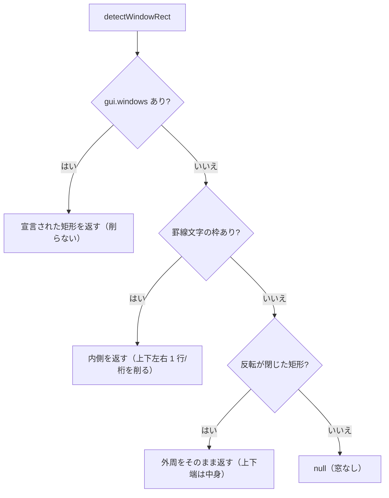

# 仕様: 反転表示で閉じた矩形を窓として判定する

## 概要

`detectWindowRect` に**第 3 の経路**を足す。優先順位は変えない。

```
1. gui.windows（拡張5250 の宣言）      … 従来どおり最優先
2. 罫線文字の枠                        … 従来どおり
3. **反転表示の閉じた矩形**            ← 追加（1・2 が空振りしたときだけ）
```

## 設計方針

### 方針 1: 「閉じている」ことを厳しく要求する（利用者提案の条件）

反転は見出し行・メッセージ行・選択行の強調にも使われるため、**枠として閉じていること**を
すべて満たす条件にする。

1. 上端: ある行に**途切れない**反転の連なり `[c1..c2]`（長さ ≥ `MIN_REVERSE_FRAME`）
2. 下端: 2 行以上下に、**同じ `c1..c2`** の途切れない反転の連なり
3. 側面: その間の**すべての行**で `c1` と `c2` の**両方**が反転

「上下 2 本の反転バー」だけでは 3 を満たさないので弾ける。罫線経路の「半数以上」より厳しく、
誤検出の余地が小さい。

### 方針 2: 上下端は完全一致を要求する（未確定事項 1 の解消）

罫線経路は端の記号（`:`）の有無で 1〜2 桁ずれるため重なり率 80% で判定しているが、
**反転枠は属性そのもので描かれるのでずれる理由が無い**。実機（の ATNPGM）で
上端・下端とも `24-78` の完全一致だった。

緩めると「見出しバー＋メッセージバー」を拾う余地が増えるので、**完全一致**にする。
他の ATNPGM でずれる例が出たら、その実測をもって緩める（推測で緩めない）。

### 方針 3: 最小幅は罫線経路と揃えて 8 桁（未確定事項 2 の解消）

`MIN_BORDER_RUN`（8）と同じ値を使う。別の値にする根拠が無く、2 つの下限を持つと
どちらが効いているか分からなくなる。定数は共有せず**別名で同じ値**にする——
将来どちらかだけを調整したくなったときに、片方を触ると両方動くのを避ける。

### 方針 4: 矩形は削らずそのまま返す

**上下端の行は枠ではなく中身**（タイトル・F キー凡例が載る）。罫線文字の窓のように上下 1 行を
削ると、**23 行目の F キー凡例＝ボタンにしたい対象が落ちる**。拡張5250 の窓で削らないのと同じ理由で、
外周をそのまま返す。

左右端（`c1` / `c2`）は側面の行では枠だが、上下端の行では中身。1 つの矩形では表せないので、
**外周を返して緩めに扱う**。枠の桁は空白なので凡例が引っかかることはない。

## 対象範囲

| ファイル | 変更 |
|---|---|
| `packages/web-ui/src/composables/fkeyLegend.ts` | 反転枠の検出を追加（`detectWindowRect` の第 3 経路） |
| `packages/web-ui/test/reverse-frame-window.test.ts`（新規） | 判定・非判定の回帰テスト |

## インターフェース / データ構造

公開 API は変えない（`detectWindowRect` の戻り値は既存の `WindowRect`）。内部に純関数を足す。

```ts
/** 反転が途切れず続く区間（桁は 1 始まりの閉区間） */
function reverseRuns(cells: readonly Cell[]): { from: number; to: number }[];

/**
 * 反転表示が**閉じた矩形**を作っていればその外周を返す。
 * 上下端は完全一致・側面は全行で両端が反転、を要求する（緩めると見出しバーを拾う）。
 */
function detectReverseFrame(snap: ScreenSnapshot): WindowRect | null;
```

## 振る舞いの詳細



### 判定の例（実機の Attn 窓）

```
行18: 24-78            → 上端候補（途切れなし・55 桁 ≥ 8）
行19: 24-24 , 78-78    → 24 と 78 の両方が反転 ✓
行20: 24-24 , 78-78    ✓
行21: 24-24 , 78-78    ✓
行22: 24-24 , 78-78    ✓
行23: 24-78            → 下端（上端と完全一致）
```
→ `{ row1: 18, row2: 23, col1: 24, col2: 78 }`

### 弾く例

| 形 | 弾く理由 |
|---|---|
| 上下 2 本の反転バーだけ | 側面が反転していない（条件 3） |
| 側面が 1 行でも途切れる | 条件 3（**すべての行**） |
| 上端 `24-78` / 下端 `24-70` | 完全一致でない（条件 2） |
| 反転の連なりが 7 桁以下 | 最小幅未満（条件 1） |

## エラー処理 / 異常系

- 反転が 1 つも無い画面は即 `null`（走査を打ち切る）。
- 上端候補が複数あるときは、条件を満たす組の**面積が最大**のものを採る。
- 行数・桁数の境界は `snap.rows` / `snap.cols` に従い、範囲外を触らない。

## 受け入れ基準との対応

| requirement の完了条件 | 満たし方 |
|---|---|
| 実機の形で `行18-23 / 桁24-78` | 新規テスト（実機の反転分布をそのまま合成） |
| 上下 2 本のバーだけでは判定しない | 新規テスト |
| 側面が途切れたら判定しない | 新規テスト |
| 罫線窓（F1）が従来どおり | 新規テスト＋既存 `fkey-legend` テスト |
| `gui.windows` が優先 | 新規テスト |
| 既存テスト全通過 | `cd packages/web-ui && npx vitest run` |
| **実機で凡例が窓側になる** | 実機で窓の凡例ボタンと背面凡例の不在を確認 |
| **反転を多用する画面で誤検出しない** | 実機で SEU・UPDDTA・サブファイルを回る |
