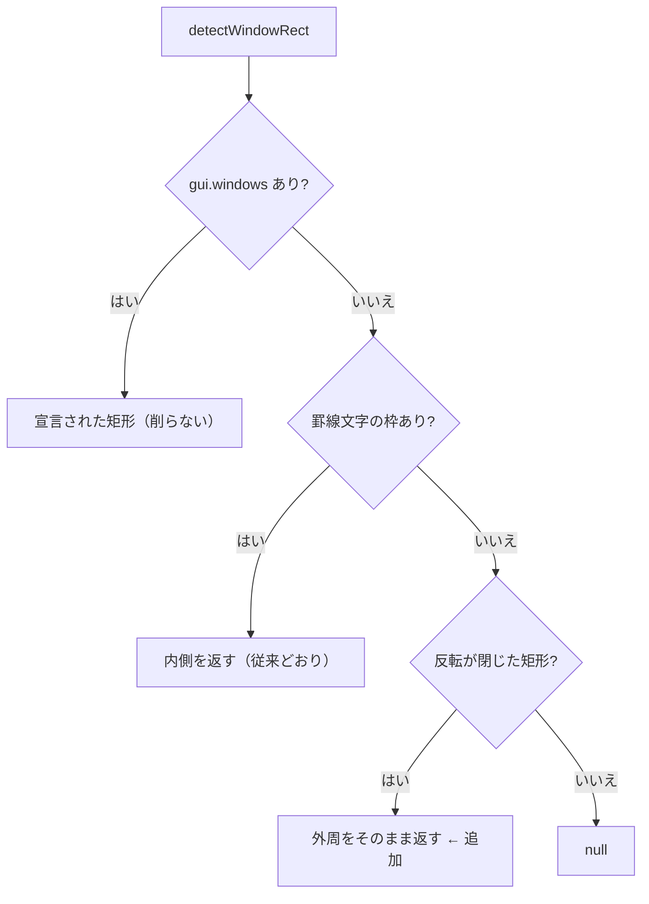

# レビューガイド: 反転表示で閉じた矩形を窓として判定する

## 変更概要 / 目的

Attn の「コマンド入力」窓は枠を**反転表示の空白セル**で描き、罫線文字を 1 つも使わないため
`detectWindowRect` に拾われていなかった。判定できないと装飾が効かないだけでなく、
**窓が出ている間も背面の F キー凡例がボタンとして残る**（押すと窓側の文脈で解釈されてラベルと食い違う）。

判定条件は**利用者の提案**をそのまま採った——「反転表示が途切れなく四角形の枠を構築していればウィンドウ」。

## 重要ポイント

### 1. 条件は 3 つすべてを要求する（緩めない）

```
1. 上端: 途切れない反転の連なり（8 桁以上）
2. 下端: 2 行以上下に、**同じ桁範囲**の途切れない連なり
3. 側面: 間の**すべての行**で左右端が両方とも反転
```

反転は見出し行・メッセージ行・選択行の強調にも使われる。当初こちらは罫線経路の流儀
（側面が「半数以上」）を考えていたが、**利用者提案の方が厳しく誤検出の余地が小さい**。
実機で枠が完全に閉じていることを確認して採用した（decisions D1）。

### 2. 上下端を完全一致にしている理由

罫線経路は端の記号（`:`）の有無で桁がずれるため重なり率 80% で判定している。**反転枠は属性
そのもので描かれるのでずれる理由が無い**（実機で上端・下端とも `24-78` の完全一致）。
緩めると見出しバーを拾う余地が増える。ずれる実例が出たら**その実測をもって**緩める（D2）。

### 3. 矩形は削らない

**上下端の行は枠ではなく中身**（18 行目にタイトル、23 行目に F キー凡例）。罫線窓のように
上下 1 行を削ると、**ボタンにしたい 23 行目の凡例が落ちる**。拡張5250 の窓で削らないのと同じ理由（D4）。

## 処理フロー



## 主要な変更箇所

- `packages/web-ui/src/composables/fkeyLegend.ts` — `reverseRuns` / `detectReverseFrame` と第 3 経路
- `packages/web-ui/test/reverse-frame-window.test.ts` — 判定する形 3 件・**弾く形 5 件**・既存経路 2 件

## リスク / 確認してほしい点

- **誤検出の検証が十分に張れていない**（review の should）。実機 14 画面を回ったが、
  **反転を使っていたのは Attn の窓だけ**で条件を stress できなかった。SEU・UPDDTA は
  副作用を避けて未巡回。反転を多用する画面をご存知なら教えてください
- 誤検出した場合の症状は「その画面の凡例ボタンが窓の中だけに絞られる」。押せるボタンが減るだけで
  **送信内容は壊れない**
- 実機で確認できた効果: `pdm-attn` の凡例が **8 件（背面 PDM）→ 4 件（窓の F3/F4/F9/F11）**
