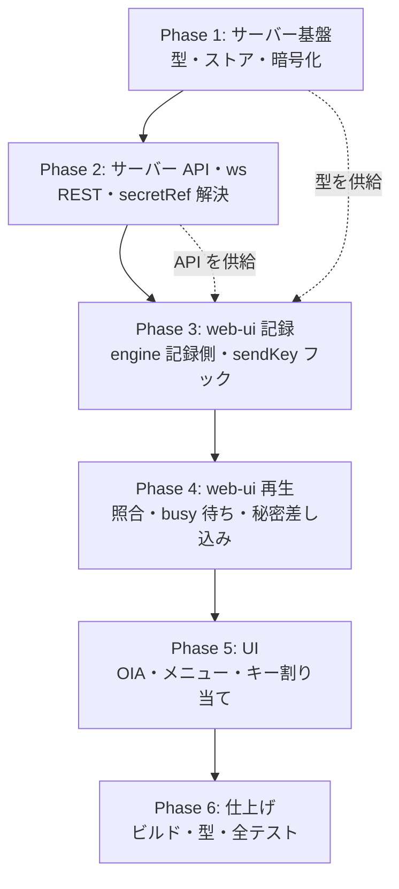

# 計画: 5250端末画面のマクロ機能（記録・再生）

## subtask 分割の判定

**分割しない**（単一 `tasks.md` ＋ 1 PR）。

判定の discriminator は「そのピースは単独で検証・デリバリ可能か」（DESIGN「5.」）:

- **サーバー側（ストア・REST・ws 拡張）だけを先に出せるか** → 出せるが、**ユーザー価値がゼロ**で
  API 形状はクライアントと同時設計。単独 PR にする意味が無い
- **web-ui 側だけを先に出せるか** → 出せない（サーバー API に依存）
- **高結合かつ「大規模で漸進レビューの価値がある」規模か** → 追加 5 ファイル・変更 10 ファイル。
  1 PR で通読できる範囲。subtask 層を持ち込むと**統合 test / 統合 review が別途必要**になり、
  得られる漸進レビューの利得を上回る

→ **不可分寄りの中規模**と判断。単一 tasks.md ＋ walkthrough のコミット構成で進める
（protocol「2.8」の「小〜中規模 work では使わない」に該当）。

## 実装方針

**サーバーから先に作り、web-ui を後に載せる。** 理由は 2 つ:

1. マクロの型（`MacroRecord` / `PublicMacro` / `MacroSecretRef` / `ScreenMatch`）は
   **サーバーを定義の家**にし、web-ui は `@as400web/server` から import する
   （`session-controller.ts` が既に `WsOpen` / `WsServerMessage` をそうしている既存パターン）
2. 秘密の扱い（spec D5・D11）が本作業の最大のリスク。**先に作ってテストで固める**ことで、
   後段の UI 実装が誤った前提の上に乗るのを防ぐ

各フェーズの終わりにテストを置き、**次のフェーズに進む前に緑にする**（spec の受け入れ基準 A8
「既存操作に回帰なし」を段階的に担保する）。

## 作業順序と依存関係

1. **Phase 1 サーバー基盤**（依存: なし）— `macro-types.ts` / `macro-store.ts` ＋ テスト。
   ここで **`secretEnc` が `PublicMacro` に漏れない**ことをテストで固定する
2. **Phase 2 サーバー API・ws**（依存: 1）— `/api/macros` の CRUD、`WsKey` の union 拡張、
   `ws-handler` の `secretRef` 解決（所有者検証・復号・差し替え・監査）
3. **Phase 3 web-ui 記録**（依存: 1, 2）— `MacroRuntime`、REST クライアント、記録の状態機械、
   `sendKey` フック。**`idle` 時に既存挙動が変わらない**ことをここでテストする
4. **Phase 4 web-ui 再生**（依存: 3）— 照合・`busy` 待ち・`secretRef` 送信・`promptFields` 自動休止・停止理由
5. **Phase 5 UI**（依存: 4）— OIA 表示、`MacroMenu`、`macro:<id>` キー割り当て
6. **Phase 6 仕上げ**（依存: 5）— `vue-tsc` を含むビルド、全テスト

## リスク / 留意点

| # | リスク | 対応 |
|---|---|---|
| **R-a** | **秘密の漏洩**（`secretEnc` や平文が API 応答・localStorage・ログに出る） | Phase 1 で `toPublic()` のテストを先に書く。`maskOutgoing` 経路も確認。テストで**明示的に「含まれないこと」を assert** する |
| **R-b** | `WsKey.fields` の union 化で**既存の送信経路が壊れる** | 既存形（`{field, value}`）をそのまま残す加算的な union にする。server/web-ui の既存テストで回帰を検知 |
| **R-c** | `sendKey` へのフックで**既存の打鍵・送信に副作用**が出る（A8 の回帰） | `idle` 時は早期 return で完全素通し。既存 75 テスト（web-ui）を Phase 3 で必ず通す |
| **R-d** | 画面照合（D4）が**厳しすぎて実用的なマクロが再生できない**／緩すぎて誤入力 | 照合対象を「書き込む欄の座標・長さ」に限定。サブファイル等での挙動は test 工程の実機観点で確認 |
| **R-e** | `busy` 待ちが**解けないまま止まる**（ホスト無応答） | `key-done.timedOut` を停止条件に含める（spec D9）。待ちには上限を設ける |
| **R-f** | 鍵未設定（`AS400_SECRET_KEY` 無し）環境での挙動 | 保存を拒否して `CONFIG_ERROR`。UI は「毎回入力する」を案内。テストで両方の分岐を押さえる |
| **R-g** | `macros.json` の**所有者チェック漏れ**（他人のマクロの秘密を引ける） | `assertOwner` を store の全 CRUD と `resolveSecret` に通す。「他人の macroId を指す `secretRef`」の拒否をテストする |
| **R-h** | UI のトグルで**レイアウトシフト**（UI-DESIGN の鉄則違反） | 記録中／停止でラベルが変わる部分は固定幅 span。既存 `.theme-btn` 意匠に合わせる |

## テスト方針

**test 工程で確認すること**（spec の受け入れ基準 A1〜A9 に対応）:

- **サーバー単体**（`packages/server/test/`）
  - `macro-store.test.ts`: CRUD、`owner` 検証、暗号化保存、**`PublicMacro` に `secretEnc`・平文が含まれない**、
    鍵未設定での保存拒否、`macros.json` の原子的保存
  - `macro-routes.test.ts`: `/api/macros` の CRUD、認証オン／オフ、他人のマクロへのアクセス拒否
  - ws の `secretRef` 解決: 正常系、所有者違い、復号失敗、鍵未設定 → **いずれも値を送らずに拒否**
- **web-ui 単体**（`packages/web-ui/test/`）
  - `macro-engine` の状態遷移（記録・再生 × 休止・停止の全遷移）
  - 記録: hidden 欄の値が draft に載らない／`secretChoices` の 3 分岐
  - 再生: `busy` 待ち、`ScreenMatch` 一致／不一致、`promptFields` での自動休止、停止理由
  - `sendKey` フック: **`idle` 時に既存挙動が変わらない**（A8）
  - キー割り当て: `macro:<id>` がホストへ送られない
- **回帰**: 既存 75 ファイル（web-ui）＋ server の既存テストを通す
- **人が触る操作感**（AGENTS.md の test 方針）: 記録→再生の一連を実際に動かし、
  カーソル位置・IME・DBCS 欄・パスワード欄での挙動を確認する。
  自動テストだけでは拾えないため、**test 工程で明示的に観点として立てる**
- **ビルド**: `npm run build -w @as400web/web-ui`（`vue-tsc -b && vite build`）
- **実行**: web-ui は `cd packages/web-ui && npx vitest run`（ルート実行は `.vue` の解析に失敗する）

## コミット構成（deliver 用の目安）

フェーズ境界でコミットを切り、レビュー時に「サーバーの秘密の扱い」だけを独立して読めるようにする。

1. `feat(server): マクロのストアと型を追加する`（Phase 1）
2. `feat(server): マクロの CRUD API と秘密の差し込みを追加する`（Phase 2）
3. `feat(web-ui): マクロの記録を追加する`（Phase 3）
4. `feat(web-ui): マクロの再生を追加する`（Phase 4）
5. `feat(web-ui): マクロの UI とキー割り当てを追加する`（Phase 5）
