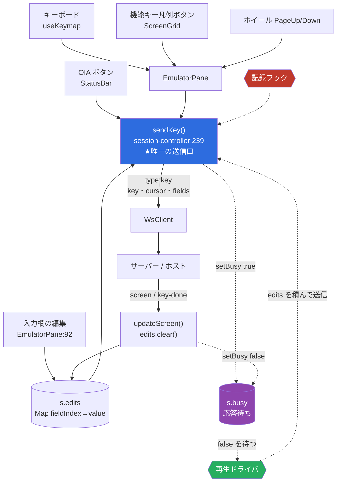
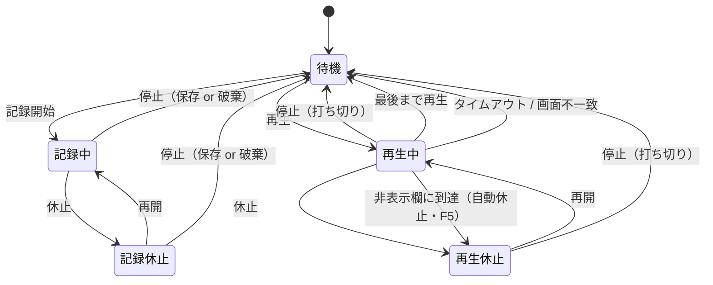

# 調査: 5250端末画面のマクロ機能（記録・再生）

requirement.md の未確定事項 U1〜U5 を事実で埋めることを目的とした調査。
外部（ACS/HOD の仕様）と内部（本 PJ の入力・送信・永続化の実装）の両面を見た。

## 調査の問い

- **Q1**: ACS の 5250 マクロは実際に何を記録・再生しているか（打鍵列か、AID＋フィールド値か、画面待ちを含むか）＝ U1
- **Q2**: ACS の「休止」「停止」の正確な意味。記録・再生それぞれで何が起きるか＝ U2
- **Q3**: ACS はパスワード（非表示入力欄）をどう扱うか
- **Q4**: 本 PJ のホスト送信経路はどこか。記録・再生のフックを 1 点に置けるか＝ U3
- **Q5**: 記録すべき「操作」の実体は何か（打鍵か、フィールド値か）
- **Q6**: 再生時の「ホスト応答待ち」を既存の状態で判定できるか＝ U4
- **Q7**: 非表示（パスワード）欄の値は、そもそもクライアントに届いているか
- **Q8**: 永続化の既存方式は何か。マクロをどこに置けるか＝ U5

---

## 判明した事実

### 外部: ACS / Host On-Demand のマクロ仕様

- **F1（Q1）**: **ACS の 5250 マクロの実体は Host On-Demand（HOD）マクロ言語**であり、XML の
  `<HAScript>` 形式。旧 PC5250 の `.mac` / `.vbs` マクロのうち「マウス・キーボード入力を捕捉して
  作られたもの」はマクロ変換ユーティリティで取り込めるが、**カスタムスクリプトは変換不可で書き直し**。
  理由は multi-platform 化（「Linux and Mac have no idea what VBScript is」）。
  出典: IBM「IBM i Access Client Solutions 5250 Macro Scripting」UID `nas8N1020968`（2021-04-05 更新）

- **F2（Q1・Q5）**: **記録の単位は「打鍵」ではなく「画面」**。HOD は各画面で
  「an impression of the application screen and the user's input to the application screen」を記録し、
  再生時は**画面を認識してから**「repeats the actions that the human operator previously performed」。
  マクロ構造は `<HAScript>` 直下に `<screen>` が並び、各 `<screen>` は必須の3要素を持つ:

  | 要素 | 役割 |
  |---|---|
  | `<description>` | 画面認識（テキスト・フィールド数・カーソル位置・**OIA 状態**。例 `<oia status="NOTINHIBITED"/>`） |
  | `<actions>` | その画面で行う操作（`<input value row col movecursor xlatehostkeys encrypted>` 等） |
  | `<nextscreens>` | 次に来うる画面の宣言（＝状態遷移） |

  出典: HOD Macro Programming Guide、および F1 の IBM ページ内の実マクロ例3件

- **F3（Q1）**: **同期は「画面認識 ＋ OIA 状態 ＋ タイムアウト」**で行う。`<HAScript>` の `timeout`
  （Timeout Between Screens＝画面遷移の最大待ち時間）と `<recolimit>`（Recognition limit）が、
  認識できない画面でのハング・無限ループを防ぐ。`pausetime` / `continueontimeout` も属性にある。
  観測した実例: `timeout="60000" pausetime="300" continueontimeout="true"`, `<recolimit value="10000"/>`

- **F4（Q2）**: **Stop は「再生または記録を終了」、Pause は一時中断**。HOD の Stop アイコンは
  「end[s] playing or recording a macro」と説明され、**記録・再生の両方に効く**。
  → ユーザーが挙げた「マクロの再生・記録の休止／停止」という括りは、ACS/HOD の実装どおり。

- **F5（Q2・Q3）**: 旧 IBM 5250 の record/playback（Network Station 版ヘルプ）には、より具体的な
  「休止」の意味が残っている。**記録中の Pause は 2 種類**ある:
  - 「Select 'None' to temporarily pause recording」＝**記録者の都合で一時的に記録を止める**
  - 「Select 'Pause playback at this point' to allow the user to enter private data (for example,
    Password) or data which may vary」＝**再生時にそこで止める印を埋め込む**

  再生側は「A playback pause will occur for a data key in a non-display entry field」＝
  **非表示入力欄では再生が自動的に一時停止する**（auto-logon 再生を除く）。
  再生速度は Playback Rate スライダーで調整。再生中は「Clicking on the playback indicator stops the
  playback」。出典: IBM publib「5250 Help」`v2mainhelp5250.htm` の Record / Playback 節

- **F6（Q3）**: パスワードは**平文で残さない**設計。`<input>` の `encrypted` 属性（Password checkbox）と
  Prompt アクションの Password Response listbox が用意されている。

- **F7**: ACS では HOD のうち `<sqlquery>` `<filexfer>` `<fileupload>` `<trace>` `<print start>`
  `<print extract>` `<print end>` が**未サポート**。SQL Query 機能も ACS 5250 マクロでは使えない。

- **F8**: マクロは**キーに割り当てて起動できる**。`Edit > Preferences > Keyboard` →
  Category に `Macro` を選び、対象マクロを選んで `Assign Key`。
  出典: IBM「How to start a macro using a function key in Access Client Solutions」UID `ibm10717645`

- **F9（重要な混同注意）**: ACS の `Actions > Record Playback` は**ユーザー用マクロではない**。
  これは **IBM サポートへ送るトレース採取ユーティリティ**（ACS 1.1.8.0 以降）で、記録中は画面下部に
  シアンのバーが出て Stop で保存し、`5250 Log Viewer`（Session Manager の Tools）で読む。
  出典: IBM「Using IBM i Access Client Solutions Playback Utility」
  → **本作業が作るのはこちらではなく、HOD マクロ相当の機能**。名前が紛らわしいので spec で用語を固定する。

### 内部: 本 PJ の実装

- **F10（Q4）**: **ホストへの AID 送信は 1 箇所に絞られている**。
  `packages/web-ui/src/session-controller.ts:239` の
  `sendKey(sessionId, key, cursor?, sysReqText?)` が唯一の送信口で、呼び出しは 6 箇所のみ:

  | 呼び出し元 | 契機 |
  |---|---|
  | `EmulatorPane.vue:377` | キーボード／ボタンの AID（`onAid`） |
  | `EmulatorPane.vue:382` | SysReq 行の確定（`sysReqText` 付き） |
  | `EmulatorPane.vue:477` | 機能キー凡例ボタン（`onFkeyAid`） |
  | `EmulatorPane.vue:684` | ホイールによる PageUp/PageDown |
  | `StatusBar.vue:62` | OIA の機能キーボタン |

  → **記録・再生のフックを `sendKey` 1 点に置ける**（U3 の答え）。

- **F11（Q5）**: **送信の実体は既に「AID ＋ フィールド値」であって打鍵列ではない**。
  `sendKey` は送信時に `s.edits`（`Map<fieldIndex, string>`）から `fields` を組み立てて
  `{ type:"key", key, cursor, fields, sysReqText }` を送る（session-controller.ts:248-255）。
  → マクロを**打鍵列ではなく「画面ごとの AID＋フィールド値」で記録する**のが、
  プロトコルの実体にも HOD のモデル（F2）にも一致する。

- **F12（Q6）**: **応答待ちは既存の `s.busy` で判定できる**。
  - `sendKey` が `setBusy(sessionId, true)`（session-controller.ts:256）
  - サーバーから `screen` または `key-done` を受けて `setBusy(sessionId, false)`（同 86・101 行）
  - `sendKey` 自身が冒頭で `if (!s || s.busy) return;` と**多重送信を弾いている**（同 246 行）

  → 再生側は「`busy` が false になってから次を送る」だけで requirement F5（応答待ち同期）を満たせる。
  なお `key-done` には `timedOut` フラグがあり、無応答復帰時は `s.notice` に `MSG_NO_RESPONSE` が入る
  （同 97-100 行）＝**再生中のタイムアウト検知にも使える**。

- **F13**: **画面が変わると編集差分は消える**。`sessionsStore.updateScreen` が
  `s.edits.clear()` する（`stores/sessions.ts:129`、コメント「ホスト発の新画面が来たらローカル編集差分はクリア」）。
  → 「1 画面 ＝ 1 組の編集 ＋ 1 個の AID」という区切りが**既に構造として存在する**。
  HOD の `<screen>` 単位（F2）とそのまま対応する。

- **F14**: 編集差分の書き込み口も 1 箇所（`EmulatorPane.vue:92` の `state.value?.edits.set(fieldIndex, value)`）。

- **F15（Q3・Q7）**: 非表示（パスワード）欄の扱いは**「ホスト由来の値は来ない」が「ユーザーが打った値は手元にある」**。
  この 2 つは別物なので分けて記録する:
  - **ホスト由来**: `packages/core/src/screen/buffer.ts:632` … `value: hidden ? "" : this.fieldValue(f)`
    ＝スナップショットは hidden 欄の値を**空で返す**。hidden 判定はセルの `nonDisplay` を優先し、
    属性由来の判定にフォールバック（同 614-618 行。「SEU の F1 ヘルプで実際に hidden=false /
    セルは nonDisplay=true」という実測コメントあり）
  - **ユーザーが打った値**: `EmulatorPane.vue:92` は hidden 欄かどうかに関わらず
    `s.edits.set(fieldIndex, value)` する。`sendKey` はそれを `fields` に載せて**ホストへ送る**。
    `ws-client.ts` の `maskOutgoing` が伏字化するのは**操作ログだけ**（ws-client.ts:10・15・37-45）

  → したがって `sendKey` にフックを置くと、**パスワードは「記録できてしまう」**。
  記録しないのは技術的制約ではなく**意図した方針**として spec で明示し、hidden 欄を
  記録対象から除外する処理を明示的に書く必要がある（`snapshot.fields[i].hidden` で判定できる）。
  除外したうえで、再生時はそこで止めてユーザーに入力させる＝ ACS の挙動（F5）と同じ着地。

- **F16**: 別系統の送信経路が 2 つある（拡張5250 の GUI 選択フィールド）。
  `selectGuiChoice`（ローカル選択・ホスト送信なし）と `submitGuiSelection`（AID 相当の確定送信、
  `setBusy(true)` する）。session-controller.ts:260・270。**マクロ対象に含めるかは spec の判断**。

- **F17（Q8）**: **クライアント永続化の既定パターンは localStorage**。
  `stores/keybindings.ts` が代表例で、`as400.keybindings` に本体、`as400.keybindings.version` に
  版印を置き、版でマイグレーションする（同 31・38-40 行）。`viewSettings` も localStorage。
  サーバー側には `config-store.ts` があり、**信頼境界で `profiles.json`（サーバー設定）と
  `connections.json`（個人設定）を分離**している。マクロを「個人のもの」に留めるなら localStorage、
  「共有・管理対象」にするならサーバー側という選択になる。

- **F18**: **キー割り当ての仕組みが既にある**。`stores/keybindings.ts` の割当先は
  `AidKey | \`view:${string}\`` で、`view:` 接頭辞で表示設定の順送りを割り当てている。
  → `macro:<id>` を足せば F8（ACS のマクロへのキー割り当て）相当が既存機構に載る。

- **F19**: **状態表示の置き場所は OIA（`StatusBar.vue`）**。既に `🔒 応答待ち`・`⌨ 入力可/入力禁止`・
  カーソル位置・`挿入/上書き`・操作員メッセージを 1 行に並べている。ACS のシアンバー（F9）に相当する
  「記録中／再生中／休止中」はここに置けば既存の意匠に収まる。

- **F20**: `AidKey` は `Enter | F1〜F24 | PageUp | PageDown | Clear | Help | Print | SysReq | Attn`
  （`packages/core/src/session/aid-keys.ts:4`）。**SysReq / Attn は AID コードを持たず**
  `aidCodeOf` が `undefined` を返す特別扱い（ヘッダフラグ送信）。SysReq は `sysReqText` を伴う。

- **F21**: web-ui のテスト資産は **75 ファイル**（`packages/web-ui/test/`）。`keymap.test.ts`・
  `keybindings.test.ts`・`busy-loading.test.ts`・`no-response-notice.test.ts` など、
  今回触る領域の回帰テストが既にある。実行は `cd packages/web-ui && npx vitest run`（AGENTS.md）。

---

## 影響範囲

記録・再生を差し込む位置と、既存の送信経路の関係:

ACS/HOD が持つ「記録・再生 × 休止・停止」の状態機械（F4・F5）:

**変更が波及する箇所（見込み）**

| 箇所 | 波及 |
|---|---|
| `session-controller.ts` | `sendKey` に記録フック。再生ドライバの送信元 |
| `stores/sessions.ts` | セッションごとのマクロ状態（記録中/再生中/休止中）を持つなら |
| `components/StatusBar.vue` | 状態表示（OIA） |
| `components/EmulatorPane.vue` | UI 起動点・キー割り当ての受け口 |
| `stores/keybindings.ts` | `macro:<id>` を割当先に足すなら（F18） |
| 新規ストア | マクロ本体の保持と永続化（F17） |
| 新規コンポーネント | マクロ一覧・記録/再生コントロール |

**触らずに済む見込み**: `packages/core`（プロトコル層）、`packages/server`（localStorage 保存を選ぶ場合）、
`ScreenGrid.vue` の文字編集ロジック。

---

## 実現性 / リスク

**実現性は高い。** 決定的な理由は3つ:

1. 送信口が `sendKey` 1 点に絞られている（F10）
2. 送信の実体が既に「AID ＋ フィールド値」で、打鍵列を再現する必要がない（F11）
3. 応答待ちが既存の `s.busy` で取れ、多重送信ガードも既にある（F12）

**リスク・注意点**

- **R1 画面認識の深さ**: HOD は `<description>` で画面を厳密に認識する（F2・F3）。同等を作るのは
  過剰だが、**何も見ないと「違う画面に打ち込む」事故**が起きる。requirement U9 の論点。
  軽い照合（画面サイズ・特定行の文字列・入力欄数など）で落としどころを作る必要がある。
- **R2 パスワード（要注意）**: `sendKey` にフックを置くと、ユーザーが打ったパスワードは
  `s.edits` 経由で**記録できてしまう**（F15）。「値が無いから安全」ではないので、
  **hidden 欄を明示的に除外する実装が必須**。除外し忘れると localStorage に平文の
  パスワードが残る。再生時はそこで止めてユーザーに入力させるのが ACS と同じ挙動（F5）。
- **R3 タイムアウト・無応答**: `key-done.timedOut` と `MSG_NO_RESPONSE`（F12）で検知できるが、
  再生をそこで打ち切るか続けるかは決めが要る。HOD は `continueontimeout` 属性で選ばせている（F3）。
- **R4 SysReq / Attn**: AID コードを持たない特別扱い（F20）。SysReq は `sysReqText` を伴う。
  記録対象に含めるかを決める必要がある（含めるなら sysReqText も記録対象）。
- **R5 GUI 選択フィールド**: `submitGuiSelection` は別経路（F16）。`sendKey` だけをフックすると
  拡張5250 の GUI 選択操作は記録から漏れる。
- **R6 busy 待ちの取りこぼし**: `s.busy` は「サーバーが応答した」であって「ホストの処理が終わった」
  とは限らない。複数レコードが分割して届く画面での挙動は実測で確かめたい。
- **R7 readOnly / 切断**: `readOnly` セッションと `connected: false` では再生を拒否する必要がある。
- **R8 ACS 互換の期待値**: マクロが HOD の XML（F1）である以上、「ACS のマクロを読み込める」と
  期待されうる。requirement で対象外としているが、**保存形式を HOD に寄せておくと将来の互換余地が残る**
  （逆に、独自形式にするなら理由を decisions に残すべき）。
- **R9 用語の混同**: ACS の「Record Playback」はトレース採取（F9）。UI 文言で「再生の記録」等と
  書くと ACS 利用者が誤解する。

---

## spec への申し送り

**この調査で解消したもの（U1〜U5）**

- U1 → F1・F2・F11: ACS は画面単位で「画面の印象＋ユーザー入力」を記録。本 PJ では
  「画面ごとの AID＋フィールド値＋カーソル」で記録するのが実体に一致する
- U2 → F4・F5: 停止は記録・再生の両方を終了。休止は一時中断で、記録側には「再生時にここで止める印」
  という第2の意味もある
- U3 → F10: フックは `sendKey`（＋編集差分は `s.edits`）1 点でよい
- U4 → F12: `s.busy` が false になるのを待てばよい。タイムアウトは `key-done.timedOut`
- U5 → F17: localStorage（`as400.<名前>` ＋ `.version`）が既定パターン。共有するならサーバー config-store

**spec で決めること（U6〜U10 に加え、調査で新たに出た論点）**

| # | 論点 | 根拠 |
|---|---|---|
| U6 | 保存単位と共有範囲 | F17（localStorage か サーバー config-store か） |
| U7 | パスワード欄の扱い | **F15・R2: 記録できてしまうので明示的な除外が必須**。再生時に止めるかを決める（F5 が前例） |
| U8 | 再生速度・待ちの扱い | F12（busy 待ち）＋ F5（ACS は速度スライダーを持つ） |
| U9 | 画面不一致時の挙動 | R1・F3（HOD は timeout ＋ recolimit ＋ continueontimeout） |
| U10 | UI の設置場所 | F19（OIA に状態、起動は EmulatorPane 周辺） |
| **U11** | **記録の単位を「画面ごとの AID＋fields」とするか** | F2・F11・F13（`edits.clear()` が画面境界を作っている） |
| **U12** | **再生時にどこまで画面を照合するか** | R1（無照合は事故、HOD 並みは過剰） |
| **U13** | **SysReq / Attn / GUI 選択を記録対象に含めるか** | R4・R5・F16・F20 |
| **U14** | **保存形式を HOD XML に寄せるか独自 JSON にするか** | R8・F1（将来の ACS 互換余地） |
| **U15** | **マクロをキーに割り当てられるようにするか** | F8・F18（`macro:<id>` で既存機構に載る） |

**用語の固定（spec の冒頭で宣言すること）**: 本作業の「マクロ」は ACS の
`Actions > Record Playback`（サポート用トレース採取。F9）ではなく、**HOD マクロ相当のユーザー機能**を指す。

## 出典

- [IBM i Access Client Solutions 5250 Macro Scripting](https://www.ibm.com/support/pages/ibm-i-access-client-solutions-5250-macro-scripting)（UID nas8N1020968、2021-04-05）
- [Using IBM i Access Client Solutions Playback Utility](https://www.ibm.com/support/pages/using-ibm-i-access-client-solutions-playback-utility)
- [How to start a macro using a function key in Access Client Solutions](https://www.ibm.com/support/pages/how-start-macro-using-function-key-access-client-solutions)（UID ibm10717645）
- [Host On-Demand Macro Programming Guide](https://scc.its.state.nc.us/hod/en/doc/macro/macro.html)
- [IBM 5250 Help（Record / Playback 節）](https://publib.boulder.ibm.com/netcom/html/v2mainhelp5250.htm)
- 本リポジトリ: `packages/web-ui/src/session-controller.ts`, `stores/sessions.ts`,
  `stores/keybindings.ts`, `components/EmulatorPane.vue`, `components/StatusBar.vue`,
  `ws-client.ts`, `packages/core/src/screen/buffer.ts`, `packages/core/src/session/aid-keys.ts`
