# 振り返り: 5250端末画面のマクロ機能（記録・再生）

## サマリ

ACS のマクロ機能（記録 / 再生 / 休止 / 停止）を、秘密（パスワード）の暗号化保存込みで実装し
**PR #167** として着地させた。追加 14 ファイル・変更 16 ファイル、新規テスト 106 件。

| 指標 | 値 |
|---|---|
| リードタイム | 13:25:59 → 14:42:27（**1 時間 16 分**。壁時計値・承認待ち込み） |
| 手戻り（coding の再開） | **2 回**（coding の start が 3 回） |
| 差し戻し | **3 回**（spec 1 / test 1 / review 1） |
| タスク | 20 計画 / 20 完了 |
| test | passed 1,473 / failed 4（すべて `unzip` 不在の環境要因） |
| review | must 0 / should 3 / nit 3 |

工程別の経過時間（壁時計）:

```mermaid
gantt
  dateFormat HH:mm
  axisFormat %H:%M
  title 工程別の経過時間（2026-07-26 UTC）
  section 上流
  requirement 1分23秒      :13:25, 2m
  research 6分40秒         :13:27, 7m
  spec 24分30秒（差し戻し1回） :crit, 13:35, 25m
  plan 1分56秒             :14:00, 2m
  section 実装
  coding 25分26秒          :14:02, 26m
  test 4分53秒（差し戻し1回） :crit, 14:28, 5m
  review 4分17秒（差し戻し1回） :crit, 14:34, 5m
  section 着地
  walkthrough 1分22秒      :14:38, 2m
  deliver（start 記録漏れ） :14:40, 3m
```

**spec が最長（24 分半）で、うち約半分が差し戻し由来。** 上流の方向性確認にコストが集中した形で、
これは `humanGates: [spec]` の設計意図（＝最大の手戻り源だけ人間が止める）どおりに機能した結果でもある。

## うまくいった点

- **research が実装を丸ごと救った。** ACS の `Actions > Record Playback` が
  「ユーザー用マクロではなく IBM サポート向けトレース採取」だと原典で確認できた（research F9）。
  検索結果の見出しだけで進んでいたら**まったく別のものを作っていた**。
  外部仕様は要約でなく一次ソースを直読する、という protocol「2.6」の方針が実利を生んだ。
- **送信口が 1 点だと事前に分かっていた**（research F10: `sendKey` の呼び出しは 6 箇所のみ）。
  おかげで記録・再生・手入力遮断のすべてを 1 箇所に集約でき、コンポーネントは無改造で済んだ。
  この構造把握が無ければ、6 箇所それぞれにフックを撒いて漏らしていた。
- **`humanGates: [spec]` が的中した。** 唯一置いた人間ゲートで、まさに方針転換（パスワードを扱う）が
  起きた。全自律だったら「記録しない」設計のまま PR まで走り、**中核ユースケースが欠けた成果物**が出ていた。
- **test / review が形式的な承認になっていない。** test で実欠陥 1 件（再生中の手入力が抜ける）、
  review で should 3 件を検出し、いずれも修正して着地した。
- **既存基盤の再利用**（`SecretCrypto`）で、秘密の扱いを一から設計せずに済んだ。
  暗号方式・鍵管理・鍵未設定時の縮退まで、既に運用実績のある形に乗せられた。

## 課題 / 手戻り

### 手戻り1: spec 差し戻し（パスワードの方針）— **防げた**

初版 spec を「パスワードは記録しない（再生時に毎回入力させる）」で出し、
「ログイン自動化が中核ユースケース。サーバー側の鍵で暗号化保存できないか」と差し戻された。

**原因**: research の調査範囲が **web-ui 側に偏っていた**。
`sendKey` / `busy` / `edits` / hidden 欄は深く見た一方、**server 側の既存資産
（`secret-crypto.ts`・`signon.passwordEnc`・`config-store.encryptPassword`）を調べていない**。
「永続化の既存方式（U5）」は問いに立てたが、**「秘密の保管という既存基盤があるか」という切り口が無かった**。

結果、技術的には最初から可能だったことを「できない前提」で設計し、24 分半の spec 工程の
約半分を差し戻しに費やした。**最も高くついた 1 件**。

### 手戻り2: test 差し戻し（`blocksManualInput` の配線漏れ）— **防げた**

spec のエッジケース表に「再生中は AID を無視」と書き、関数まで実装したのに**どこにも配線していなかった**。

**原因**: plan の `tasks.md` が **spec の「受け入れ基準 A1〜A9」だけを追い、
「エッジケース表（13 件）」を追っていなかった**。受け入れ基準はタスクに落ちたが、
エッジケースは誰も消化を確認しない場所に置き去りになった。

なお test 工程で再現テストを書いて `["Enter", "F3"]` が並ぶことを実測できたのは良かった
（「たぶん漏れる」で終わらせず、欠陥として確定させた）。

### 手戻り3: review 差し戻し（should 3 件）— **一部防げた**

| 指摘 | 前段で防げたか |
|---|---|
| `selectGuiChoice` が `noteUnrecordable` を呼ばない | **防げた**。`submitGuiSelection` に足したとき、対になる相方を見ていない |
| `secretRef` の形式未検証 | 半々。spec に「信頼境界で検証する」と書いていれば拾えた |
| `toPublic` が `screen` を参照のまま返す | **防げた**。**同じ罠の前例とコメントが `config-types.ts` の `publicSession` にある**のに踏んだ |

3 件目が特に痛い。既存コードが
「複製して返す——参照のまま渡すと、応答を受け取った側の書き換えがストアの実体に届く」と
**わざわざ警告を書き残してくれていた**のに、同種の変換関数を新規に書くとき参照しなかった。
しかも同じ関数の中で `fields` / `cursor` / `promptFields` は複製しており、`screen` だけ漏れている。
「似た関数を書くときは既存の対応物のコメントを読む」が抜けた。

### 課題4: 記録漏れ（`deliver` の start イベント）— ハーネス側の穴

`metrics.yml` に `deliver` の **`approved` はあるが `start` が無い**。
protocol「1.」は各工程の開始時に start を記録すると定めているが、deliver skill の手順は
「1.5 既着地の検知」から始まるため、**start 記録が手順の流れから埋もれた**。

結果、**deliver の所要時間が導出できない**。さらに問題なのは、
**`aidev verify` がこの状態で `OK` を返す**こと（実行して確認済み）。
記録の一貫性を機械検査する仕組みがあるのに、この不整合は検出対象外になっている。

### 課題5: 環境起因のノイズと、そこで見つけた地雷

- `unzip` 不在で `zip-writer.test.ts` 4 件が**常時赤**。毎回「本変更と無関係」を確認・説明するコストが乗る。
- 一方、**この環境ノイズを切り分ける過程で本物の地雷を発見**した:
  `spool-rescue.test.ts` が `it()` の中で `await import()` しており、
  **モジュール変換のコストがテストのタイムアウト（5 秒）に算入**されていた。
  本作業でテストファイルが 3 つ増えたことで顕在化したが、
  **作業前のコミットに中身のないダミーのテストファイルを 3 つ足すだけで同じ失敗が再現する**ことを
  worktree で確認し、本変更が原因でないことを立証したうえで修正した。
  「増やしたら落ちた＝自分のせい」で片付けず、baseline で切り分けたのが正解だった。

## 改善提案

### 製品 / コード（→ issue 候補）

1. **画面照合の穴**: 書き込む欄が無いステップ（F キーだけの遷移）は rows/cols しか照合されない。
   誤検知を増やさない軽量アンカー（例: 記録時のカーソル行の保護テキスト断片）を検討する。
   spec D4 の意図的な折り合いなので、**変えるなら判断込みで**。
2. **鍵ローテーション時のマクロ秘密の再暗号化**。現状は復号失敗で再生が止まり
   「記録し直してください」となる。`SecretCrypto` の `v1:` プレフィックスが枠組みを持っている。
3. **GUI 選択フィールド（拡張5250）の記録対応**。現状は `incomplete` フラグで可視化するのみ。
4. **再生速度の調整**（ACS の Playback Rate 相当）。`macro-engine` にステップ間ウェイトの器はある。
5. **マクロの共有**。既にサーバー保存なので、`owner` の扱いを変えれば実現できる。
6. **HOD XML の入出力**。ACS 資産の取り込み／持ち出し。spec D6 で構造の対応づけは確保済み。
7. **`it()` 内 `await import()` の他の箇所**: `host-spools.test.ts` に同じ形が残っている（未発症）。
8. **devcontainer に `unzip` を入れる**。テストが常時 4 件赤い状態を解消し、
   本物の失敗が埋もれないようにする。

### PJ プロセス / 規約（→ AGENTS.md）

1. **「API 露出用の変換関数はオブジェクト値を必ず複製する」を規約に昇格させる。**
   `config-types.ts` の `publicSession` にコメントとして存在するが、
   **今回まさに同じ罠を踏んだ**。個別コメントでは横展開しない。
   `toPublic` / `publicSystem` / `publicSession` の全てに効く規約として書く。
2. **「テスト本体（`it()`）の中で `await import()` しない」。**
   モジュール変換のコストがテストのタイムアウトに算入され、
   **ファイル数が増えただけで落ちる**。top-level await import に置く。
3. **「対になる関数を触ったら相方も確認する」**（`select`/`submit`、`start`/`stop`、
   `encode`/`decode` 等）。今回の `selectGuiChoice` / `submitGuiSelection` の非対称はこれで防げた。
4. **「ws メッセージの新フィールドは信頼境界で zod 検証する」。**
   既存は `msg.key as AidKey` のような cast のみで、新規に**秘密を運ぶフィールド**を足したとき
   検証の必要性が判断に委ねられた。明文化しておく。

### ハーネス自体（→ `aidev-*` への提案・適用は人間）

1. **`aidev-15-research` の調査観点に「再利用できる既存の横断基盤の棚卸し」を必須で加える。**
   現在の手順 2 の典型例は「既存コードの実装把握 / 影響範囲」「出力先の仕様」「技術的実現性」だが、
   **「この機能が必要とする横断的関心事（認証・暗号化・永続化・監査）に、既にどんな基盤があるか」**
   という観点が無い。**今回の最大の手戻り（spec 差し戻し）はこれ 1 つで防げた。**
   秘密・権限・保存が絡む機能では特に効く。

2. **`aidev-30-plan` で、spec の「エッジケース」も tasks.md に落とす。**
   現在の plan は受け入れ基準を軸にタスク化するため、
   **spec のエッジケース表・異常系表が消化確認の外に置かれる**。
   手戻り2 はこれが原因。「spec の各表の項目に対応するタスクがあるか」を plan の完了条件に加える。

3. **`aidev verify` の不変条件に「`approved` があるのに `start` が無い工程」を追加する。**
   deliver の start 記録漏れを、verify が `OK` で通してしまった。
   metrics を「単一の真実」として定量分析する以上（protocol「8.」）、
   **イベント対の整合は機械が守るべき**。散文の注意書きでは今回のように漏れる。

4. **`aidev-70-deliver` の手順冒頭に start 記録を明示する。**
   現在の手順は「1. 対象作業の特定 → 1.5 既着地の検知 → 2. PJ資産の優先…」と続き、
   protocol「1.」の start 記録が手順の流れに現れない。他工程と違い deliver は
   「1.5」という重い分岐が入口にあるため埋もれやすい。3 と併せて二重に守る。

5. **（小）差し戻し時の `coding start` 記録は今回うまく機能した。**
   test / review の両方で `sent_back` → `coding start` を漏らさず記録でき、
   手戻り 2 回が正しく導出できた。protocol「3.」の注意書きが効いている。**現状維持でよい**。
