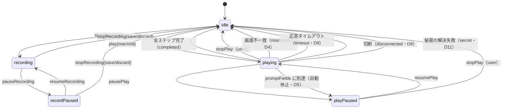
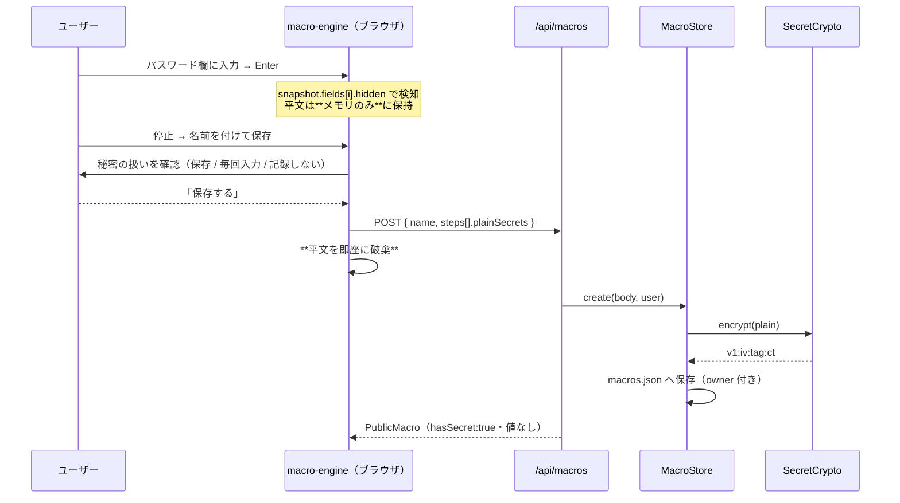
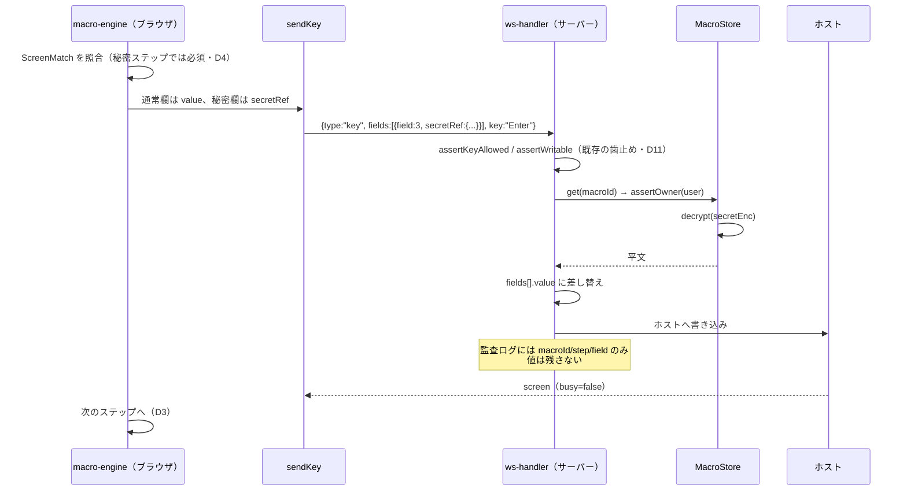

# 仕様: 5250端末画面のマクロ機能（記録・再生）

## 用語の固定

本仕様の「マクロ」は、**ACS の HOD マクロに相当するユーザー機能**（一連の画面操作を記録して再生する）を指す。
ACS のメニューにある `Actions > Record Playback` は**IBM サポート向けのトレース採取**であって別物
（research F9）。UI 文言でもこの2つを混同させない。

## 概要

5250端末セッションの操作を**画面単位のステップ列**として記録し、再生時はホストの応答を待ち合わせながら
同じ操作を送り直す。記録・再生とも休止／停止でき、状態は OIA に出す。

**サインオンの自動化を中核ユースケースとして扱う**ため、パスワード等の秘密もマクロに含められる。
秘密は**サーバー側の master key で暗号化して保存し、再生時はサーバー内部で復号して差し込む**。
ブラウザは平文も暗号文も受け取らない（既存の自動サインオンと同じ信頼境界）。

実現の土台は research で確認済み:

- ホストへの AID 送信は `session-controller.ts:239` の `sendKey()` **1 点**に絞られている（F10）
- 送信の実体が既に「AID ＋ フィールド値」で、打鍵列の再現が不要（F11）
- 応答待ちは既存の `s.busy`、タイムアウトは `key-done.timedOut` で取れる（F12）
- 新画面到着で `edits.clear()` されるため、**画面境界が既に構造として存在**する（F13）
- 秘密の暗号化保存は `SecretCrypto`（AES-256-GCM）が**既に稼働している**（後述 D5）

## 設計方針

### D1. 記録の単位は「1 画面 = 1 ステップ」

打鍵列ではなく、**その画面で最終的に何を入力し、どの AID を押したか**を 1 ステップとして記録する。

**理由**: (a) プロトコル上の送信単位がそもそもこれ（F11）、(b) HOD も画面単位で
「画面の印象＋ユーザー入力」を記録している（F2）、(c) `edits.clear()` による画面境界が既にある（F13）。

**退けた案**: 打鍵列（keydown）の記録。カーソル移動・修正・IME・DBCS 欄の挙動まで再現する必要があり、
`ScreenGrid` の編集ロジックに深く踏み込む。再生時のタイミング依存も大きい。得るものが無い。

### D2. 記録・再生のフックは `sendKey` に集約する

`session-controller.ts` にマクロエンジンのフックを置く。記録は `sendKey` の送信直前に
`{fields, key, cursor}` を横取りし、再生は同じ `sendKey` を呼ぶ。**コンポーネント側は無改造**で、
キーボード・凡例ボタン・ホイール・OIA ボタンの全経路（F10 の 6 箇所）が自動的に記録対象になる。

### D3. 再生の同期は `busy` を待つ

再生ドライバは 1 ステップ送るごとに `s.busy` が `false` に戻るまで待ってから次へ進む。
`sendKey` 自身が `if (!s || s.busy) return;` で多重送信を弾いている（F12）ため、この待ちは
**取りこぼし防止に必須**。記録時の実時間間隔は再現しない（遅いだけで再現性が上がらない）。
代わりにステップ間ウェイトを設定で持つ（既定 0ms）。

### D4. 画面照合は「打ち込み先の同一性」に限定する

再生前に、**そのステップで書き込む各フィールドが、記録時と同じ開始位置に入力可能な欄として
存在するか**だけを照合する。加えて画面サイズ（rows×cols）の一致を見る。

**理由**: 無照合だと「違う画面に打ち込む」実害が出る（R1）。一方 HOD 並みの `<description>`
（テキスト照合・フィールド数・OIA）は、サブファイルの行数変動などで**誤検知が多く**、v1 には過剰。
「書き込む先が同じ座標に同じ形で在る」ことだけを厳格に見るのが、コストと安全の折り合い点。

不一致なら**再生を停止**（D9）。**秘密を含むステップでは照合を必須とする**（違う画面に
パスワードを打ち込まないための歯止め。D5 と対で効く）。

### D5. 秘密（パスワード）はサーバーで暗号化保存し、サーバー内部で差し込む ★中核

**前提の訂正**: 調査当初「パスワードは値が来ないので記録できない」と判断したが誤り。
ホスト由来のスナップショットに値が無いだけで、**ユーザーが打った値は `s.edits` にあり、
そのままホストへ送られている**（research F15・R2 で訂正済み）。つまり記録は技術的に可能であり、
どう安全に扱うかを設計する必要がある。

**採用する仕組みは、既にこのリポジトリで稼働している自動サインオンと同一**:

| 既存（自動サインオン） | 本仕様（マクロの秘密） |
|---|---|
| `SecretCrypto`（AES-256-GCM、`v1:iv:tag:ct`） | 同じものを使う |
| master key は `AS400_SECRET_KEY`（env、単一利用者では `.env` に自動生成・0600） | 同じ |
| 保存時にクライアントが平文を 1 回 POST → `store.encryptPassword()` | 同じ |
| 暗号文も平文も**クライアントへ返さない**（`PublicSystem`「パスワードは形式を問わず決して返さない」） | 同じ |
| 使用時にサーバー内部で `crypto.decrypt()`（`config-resolver.ts:177-180`） | 同じ |
| 鍵未設定なら警告して機能を落とす | 同じ |

**再生時の差し込み**: クライアントは平文も暗号文も持たないため、`{type:"key"}` 送信時に
**値の代わりに参照（`secretRef`）を送り、サーバーが復号して差し替えてからホストへ書く**（D11）。

**記録時の選択**: hidden 欄への入力を検知したら、記録停止時に欄ごとに 3 択を出す。

| 選択 | 保存されるもの | 再生時 |
|---|---|---|
| **保存する**（既定・サインオン自動化） | `secretEnc`（サーバー側・暗号化） | サーバーが復号して差し込む。止まらない |
| **毎回入力する** | 何も保存しない（`prompt: true`） | そのステップで自動休止し、ユーザーが入力して再開 |
| **記録しない** | ステップから欄ごと除外 | 空のまま送る |

**平文の寿命**: 記録中の秘密は**クライアントのメモリのみ**に置き、保存時に一度 POST したら即座に破棄する。
localStorage には**いかなる形でも書かない**。記録を破棄した場合は秘密も一緒に消える。

**退けた案**: 暗号文をクライアントへ返して送信時に載せる。既存の
「パスワードは形式を問わず決して返さない」方針を崩し、暗号文の流出＝オフライン解析の的を増やす。

### D6. 保存形式は独自 JSON。ただし HOD の構造に対応づける

HOD の XML（`<HAScript>`）そのものは採らない。screen recognition の記述子体系が大きく、
ACS 互換は requirement で対象外のため。ただしステップを
**`screen`（照合）/ `fields`＋`key`（操作）/ 暗黙の次ステップ** の 3 部構成にし、
HOD の `<description>` / `<actions>` / `<nextscreens>` と対応づく形にしておく（将来の変換余地）。

### D7. 保存先はサーバー（`macros.json`）。localStorage は使わない

D5 により**秘密がサーバー管理になるため、マクロ本体もサーバーに置く**。
localStorage とサーバーに分けると、マクロ削除で秘密が孤児化する・二重の真実ができる、という
保守上の罠になる。

実装は既存の `PersonalConfigStore`（`connections.json`）と同じ形にする:

- ファイル `macros.json`、原子的保存（tmp→rename）、CRUD からの明示呼び出しのみ
- レコードは `owner` を持ち、`assertOwner` で所有者チェック（認証オフ時は単一の暗黙オーナー）
- REST は `config-routes.ts` と同じ体裁で `/api/macros`

**退けた案**: マクロは localStorage、秘密だけサーバー。上記の孤児化・二重管理が起きる。

### D8. 記録対象は `sendKey` 経由の全 AID。GUI 選択フィールドは対象外

- **含める**: `Enter` / `F1`〜`F24` / `PageUp` / `PageDown` / `Clear` / `Help` / `Print` / `Attn`
- **含める（特別扱い）**: `SysReq` — `sysReqText` も併せて記録する（F20）
- **対象外**: 拡張5250 の GUI 選択フィールド（`selectGuiChoice` / `submitGuiSelection`）。
  別経路でホスト宣言に依存するため（F16・R5）。記録中にこれが呼ばれたらマクロに
  `incomplete: true` を立て、保存時と再生開始時に警告する（**黙って壊れたマクロを作らない**）

### D9. 異常時は停止する

画面不一致・応答タイムアウト・切断・`readOnly` セッションでは、**再生を続行せず停止**して理由を出す。
HOD の `continueontimeout` 相当の「続行」オプションは v1 では設けない（誤入力の実害が大きい）。

### D10. UI

- **状態表示**: OIA（`StatusBar.vue`）に `⏺ 記録中` / `▶ 再生中` / `⏸ 休止中` を出す。
  既存の `🔒 応答待ち` と同じ枠・同じ意匠。ACS のシアンバー（F9）に相当
- **操作**: トップバーに `⏺ マクロ` ボタン → ポップオーバーで一覧と記録／再生／休止／停止。
  `ViewSettingsMenu` と同じ構造にし、`headerMenu.ts` の「同時に 1 つだけ開く」に参加する。
  `activeIsEmulator` が true のときだけ出す（UI-DESIGN「アクティブ状態に応じた表示切り替え」）
- **秘密の可視化**: 一覧で秘密を含むマクロに鍵アイコンを出す。**値は表示も編集もできない**
  （差し替えは「記録し直す」）
- **キー割り当て**: `keybindings` の割当先に `macro:<id>` を追加（F18）。`view:` と同じ要領で、
  ホストへは送らずローカルで再生を起動する（ACS の F8 相当）

### D11. 秘密の差し込みは `WsKey` を拡張して行う（新メッセージ型を作らない）

`ws-messages.ts` の `WsKey` には明示的な設計コメントがある——
「別メッセージ型にしないのは、**readOnly ゲート・監査・busy 対応付けといった歯止めを
key 経路と二重に書かないため**（片方への付け忘れを構造的に防ぐ）」。

秘密の差し込みも同じ理由で `WsKey.fields` の拡張として実装し、新しいメッセージ型は作らない。
これにより `assertKeyAllowed` / `assertWritable` / 監査（`withAudit`）が**自動的に効く**。

```ts
// 変更前: { field: number | {row,col}; value: string }[]
// 変更後: 値そのもの か 秘密参照 かのタグ付き union
fields?: (
  | { field: number | { row: number; col: number }; value: string }
  | { field: number | { row: number; col: number }; secretRef: MacroSecretRef }
)[]
```

サーバーは `secretRef` を見たら、**所有者を検証したうえで**該当マクロの `secretEnc` を復号し、
`value` に差し替えてからホストへ書く。ws-handler は既に `this.user`（`AuthUser`）を持つ。

## 対象範囲

### 追加

| ファイル | 役割 |
|---|---|
| `packages/web-ui/src/stores/macros.ts` | マクロの取得・CRUD（REST 経由）。秘密は保持しない |
| `packages/web-ui/src/macro-engine.ts` | 記録／再生の状態機械。`sendKey` を駆動する |
| `packages/web-ui/src/components/MacroMenu.vue` | トップバーのポップオーバー（一覧・記録・再生・休止・停止） |
| `packages/server/src/macro-store.ts` | `macros.json` の永続化・所有者チェック・秘密の暗号化 |
| `packages/server/src/macro-routes.ts` | `/api/macros` の CRUD（`config-routes.ts` と同体裁） |

### 変更

| ファイル | 変更内容 |
|---|---|
| `web-ui/session-controller.ts` | `sendKey` に記録フック。再生ドライバ用の内部送信口。`secretRef` 送信 |
| `web-ui/stores/sessions.ts` | セッションごとのマクロ状態（`macro?: MacroRuntime`） |
| `web-ui/components/StatusBar.vue` | OIA に記録中／再生中／休止中の表示 |
| `web-ui/stores/keybindings.ts` | 割当先に `macro:<id>` を追加 |
| `web-ui/composables/useKeymap.ts` | `macro:` バインドの分岐 |
| `web-ui/components/KeybindingsPanel.vue` | マクロを割当先として選べるように |
| `web-ui/App.vue` | `MacroMenu` をトップバーへ（`activeIsEmulator` 条件） |
| `server/ws-messages.ts` | `WsKey.fields` をタグ付き union へ（D11） |
| `server/ws-handler.ts` | `secretRef` の解決（所有者検証＋復号＋差し替え） |
| `server/app.ts` / `main.ts` | `macro-routes` の登録、`MacroStore` の生成（`SecretCrypto` を渡す） |

### 触らない

`packages/core`（プロトコル層）、`ScreenGrid.vue` の文字編集ロジック、既存の `config-store` / 認証。

## インターフェース / データ構造

### サーバー保存形式（`macros.json` / D7）

```ts
/** サーバーにだけ存在する完全形（secretEnc を含む）。API では絶対に返さない */
interface MacroRecord {
  id: string;                 // "m-" + randomUUID()
  name: string;
  owner?: string;             // 認証オン時のみ。assertOwner で照合
  createdAt: number;
  updatedAt: number;
  incomplete?: boolean;       // 記録できない操作を含む（D8）
  steps: MacroStepRecord[];
}

interface MacroStepRecord {
  screen: ScreenMatch;                      // 照合材料（D4）
  fields: { field: number; value: string }[];        // 通常の入力値
  /** 秘密を持つ欄。value は保存せず暗号文だけを持つ（D5） */
  secrets?: { field: number; secretEnc: string }[];
  /** 再生時にユーザー入力を待つ欄（「毎回入力する」を選んだ場合。D5） */
  promptFields?: number[];
  key: AidKey;
  sysReqText?: string;
  cursor: { row: number; col: number };
}

/** 「打ち込み先が同じ形で在るか」だけを見る（D4） */
interface ScreenMatch {
  rows: number;
  cols: number;
  /** このステップで書き込む欄の位置と長さ（fields・secrets・promptFields の合併） */
  targets: { field: number; row: number; col: number; len: number }[];
}
```

### API 露出形（クライアントが見る形）

**`secretEnc` は含めない**。秘密の有無だけを `hasSecret` で示す（既存 `PublicSystem.autoSignon` と同じ考え方）。

```ts
export interface PublicMacro {
  id: string;
  name: string;
  owner?: string;
  createdAt: number;
  updatedAt: number;
  incomplete?: boolean;
  /** 秘密を含むか（一覧の鍵アイコン用）。値は返さない */
  hasSecret: boolean;
  steps: PublicMacroStep[];
}

export interface PublicMacroStep {
  screen: ScreenMatch;
  fields: { field: number; value: string }[];
  /** 秘密が入る欄の位置だけ（値なし）。再生時 secretRef を組み立てるのに使う */
  secretFields?: number[];
  promptFields?: number[];
  key: AidKey;
  sysReqText?: string;
  cursor: { row: number; col: number };
}
```

### REST（`/api/macros`・`config-routes.ts` と同体裁）

| メソッド | パス | 備考 |
|---|---|---|
| `GET` | `/api/macros` | `{ macros: PublicMacro[] }`。所有者のものだけ |
| `POST` | `/api/macros` | 作成。**平文の秘密はここで 1 回だけ送る**（下記） |
| `PUT` | `/api/macros/:id` | 改名（`{ name }`）。ステップの部分更新は行わない |
| `DELETE` | `/api/macros/:id` | 削除（秘密も一緒に消える） |

```ts
/** POST 本体。plainSecrets はここでだけ現れ、サーバーは暗号化して捨てる */
interface CreateMacroBody {
  name: string;
  incomplete?: boolean;
  steps: {
    screen: ScreenMatch;
    fields: { field: number; value: string }[];
    /** 平文の秘密（保存時のみ。暗号化して secretEnc になる） */
    plainSecrets?: { field: number; value: string }[];
    promptFields?: number[];
    key: AidKey;
    sysReqText?: string;
    cursor: { row: number; col: number };
  }[];
}
```

`plainSecrets` があるのに `MacroStore` が `SecretCrypto` を持たない（`AS400_SECRET_KEY` 未設定）場合は
**保存を拒否**し、`CONFIG_ERROR` を返す（既存 `encryptPassword` と同じ挙動＝黙って平文で保存しない）。

### 秘密参照（D11）

```ts
export interface MacroSecretRef {
  macroId: string;
  step: number;     // 0-based
  field: number;    // fieldIndex
}
```

サーバー側の解決手順（`ws-handler.ts`）:

1. `this.user` で `macroStore.get(macroId)` を引き、`assertOwner` で所有者を検証
2. `steps[step].secrets` から `field` 一致の `secretEnc` を取る
3. `crypto.decrypt()` して `value` に差し替える
4. 見つからない／復号失敗なら**そのキー送信自体を拒否**（`As400Error`）。空文字で送らない
5. 監査ログには `secretRef` の所在（macroId/step/field）だけを残し、**値は残さない**

### マクロエンジンの実行時状態（web-ui）

```ts
export type MacroMode = "idle" | "recording" | "recordPaused" | "playing" | "playPaused";

export interface MacroRuntime {
  mode: MacroMode;
  macroId?: string;
  /** 記録中に積んでいるステップ（秘密の平文はここにだけ一時的に載る） */
  steps: DraftStep[];
  index: number;
  stopReason?: "completed" | "user" | "mismatch" | "timeout" | "disconnected" | "readonly" | "secret";
}
```

### 公開 API（`macro-engine.ts`）

```ts
export function startRecording(sessionId: string): void;
export function pauseRecording(sessionId: string): void;
export function resumeRecording(sessionId: string): void;
/** 記録終了。save=true なら秘密の扱いを決めたうえで POST し、平文を破棄する */
export function stopRecording(
  sessionId: string,
  save: boolean,
  name?: string,
  secretChoices?: Record<string, "store" | "prompt" | "skip">  // "step:field" → 選択
): Promise<PublicMacro | undefined>;

export function play(sessionId: string, macroId: string): void;
export function pausePlay(sessionId: string): void;
export function resumePlay(sessionId: string): void;
export function stopPlay(sessionId: string): void;
```

## 振る舞いの詳細

### 状態遷移



**記録と再生は排他**（同一セッションで同時には走らない）。`idle` 以外からの `startRecording` / `play` は無視。

### 秘密を含むマクロの記録 → 保存



### 秘密を含むマクロの再生



### エッジケース

| ケース | 挙動 |
|---|---|
| `AS400_SECRET_KEY` 未設定 | 秘密の保存を拒否（`CONFIG_ERROR`）。「毎回入力する」なら保存できる。単一利用者では `main.ts` が自動生成するため通常は発生しない |
| 復号失敗（鍵の入れ替え等） | そのキー送信を拒否し、再生を `secret` 理由で停止。「記録し直してください」と案内 |
| 他人のマクロを参照する `secretRef` | `assertOwner` で拒否 |
| 再生開始時に `busy` が true | busy が解けるまで待ってから 1 ステップ目へ |
| 再生中にユーザーが手で打鍵 | 再生中は AID を無視（`busy` プロテクトに加えた二重の歯止め） |
| `readOnly` セッション | 再生を開始しない（`readonly`）。記録も v1 では不可 |
| 切断中 | 記録・再生とも開始しない。実行中に切断されたら停止 |
| `promptFields` の欄が未入力のまま再開 | そのまま送る（空文字）。ホスト側の判断に委ねる |
| ステップ 0 件で停止 | 保存しない（空マクロを作らない） |
| 記録を破棄 | メモリ上の平文も一緒に破棄。POST しない |
| 同名マクロ | 許可する（id で区別）。一覧では作成日時を併記 |
| マクロ削除 | `secretEnc` も一緒に消える（孤児を作らない。D7 の理由） |
| タブ／セッションを閉じた | 実行時状態は破棄。保存済みマクロは残る |
| 保存データの JSON 破損 | 警告のうえ空で起動し、既存ファイルは上書きしない（`config-store` と同じ） |

## ドメイン固有の考慮

- **AGENTS.md「コメントの残し方」**: `sendKey` へのフック、`macro-engine.ts` 冒頭、`ws-handler` の
  `secretRef` 解決には**俯瞰コメント**を置く。判断の出所は `spec D1`〜`D11` 形式で参照する
- **セキュリティ（AGENTS.md「実資格情報・秘密を成果物に書かない」）**:
  - 平文の秘密は localStorage・操作ログ・監査ログ・テストフィクスチャの**いずれにも書かない**
  - `ws-client.ts` の `maskOutgoing` は `secretRef` 経路では masking 対象が無くなる（構造的に安全）
  - テストでは実在しうる資格情報を使わない（`dummy` 等）
- **core のピュアロジック層は Node API 非依存**: `SecretCrypto` は `node:crypto` を使うため
  **server パッケージに閉じる**（現状どおり）。core・web-ui には持ち込まない
- **UI-DESIGN.md**:
  - トップバーのボタンは `.theme-btn`（固定高 28px・`inline-flex` 中央寄せ）
  - **トグルの幅を固定**して隣接ボタンをずらさない（記録中／停止でラベルが変わる部分は固定幅 span）
  - ポップオーバーはバックドロップ＋本体、`headerMenu.ts` に参加して同時に 1 つだけ開く
  - OIA の状態表示は `role="status"` を付ける
- **`vue-tsc`**: `npm run build -w @as400web/web-ui` で型チェックを通す
- **テスト実行**: web-ui は `cd packages/web-ui && npx vitest run`（ルートからは `.vue` の解析に失敗する）。
  server は既存の実行方法に従う

## エラー処理 / 異常系

| 事象 | 扱い |
|---|---|
| 画面不一致 | 再生停止。OIA に「マクロ: 画面が一致しません（ステップ N）」 |
| 応答タイムアウト（`key-done.timedOut`） | 再生停止。既存の `MSG_NO_RESPONSE` と併せて理由を出す |
| 秘密の解決失敗（未設定・復号失敗・所有者違い） | **キー送信を拒否**し再生停止（`secret`）。空文字で代替しない |
| 鍵未設定での秘密保存 | `CONFIG_ERROR` を返し保存しない。UI は「毎回入力する」を案内 |
| 切断 | 記録・再生とも停止。記録は保存可否を確認 |
| `macros.json` 書き込み失敗 | 保存失敗を通知。実行時状態は保持（名前を変えて再試行できる） |
| `incomplete` なマクロの再生 | 再生開始前に警告し、ユーザーの確認を取る |

## 受け入れ基準との対応

| # | 完了条件 | 実現方法 |
|---|---|---|
| A1 | 記録開始→複数画面→停止→命名保存 | D2（`sendKey` フック）＋ D1（画面単位ステップ）＋ `stopRecording` |
| A2 | 再生で同じ画面遷移に到達 | D3（busy 待ち）＋ D4（照合）＋ `fields`/`key` の再送。秘密は D5・D11 |
| A3 | 再生中に休止・再開 | `pausePlay` / `resumePlay` |
| A4 | 記録中・再生中に停止でき、以後は手で操作できる | `stopRecording` / `stopPlay` → `idle`。`idle` ではフックが素通し |
| A5 | 状態が UI で判別できる | D10（OIA に `⏺`/`▶`/`⏸`） |
| A6 | 一覧・改名・削除 | `/api/macros` の CRUD ＋ `MacroMenu.vue` |
| A7 | 再読み込みで残る | D7（サーバー `macros.json`。localStorage より強い保証） |
| A8 | 既存操作に回帰なし | `idle` 時は `sendKey` の挙動を変えない。`WsKey` の union 拡張は既存形を残す。既存 75 テストで担保（F21） |
| A9 | ビルドが通る | `vue-tsc -b && vite build` を手元で必ず実行 |

requirement の非機能要件「マクロにパスワード等の秘密が記録されうる点を要件として認識する。
実資格情報を平文で成果物・ログに残さない」は、**D5（サーバー暗号化）＋ D11（値をクライアントに渡さない）**
で満たす。requirement の対象外（ACS 互換・スクリプト構文・プリンター・スケジュール）は本仕様でも対象外。

## 未解決 / 将来

- GUI 選択フィールドの記録（D8 で対象外。`incomplete` で可視化）
- マクロの共有（サーバー保存になったため、`owner` を外す／profiles 相当を足せば実現可能）
- HOD XML への書き出し／読み込み（D6 で構造の対応づけのみ確保）
- 再生速度スライダー（ACS にはある。D3 でステップ間ウェイトの器だけ用意）
- 鍵ローテーション時の秘密の再暗号化（`SecretCrypto` の `v1` プレフィックスが備えている枠組み）
- マクロ内の変数・条件分岐（requirement で対象外）

## 補足: 既存の自動サインオンとの使い分け

このリポジトリには既に**プロトコルレベルの自動サインオン**（`signon.ts`・`system.signon`）がある。
これはサインオン**画面を出さずに**認証を通すもので、マクロによるログイン自動化とは経路が違う。

- **自動サインオン**: 接続時に TN5250 の仕組みで認証。画面操作を伴わない
- **マクロ**: サインオン画面に**打ち込む**。加えてメニュー選択など**その後の定型操作も続けられる**

両者は排他ではなく、「自動サインオン＋その後の定型操作をマクロ」という組み合わせもできる。
