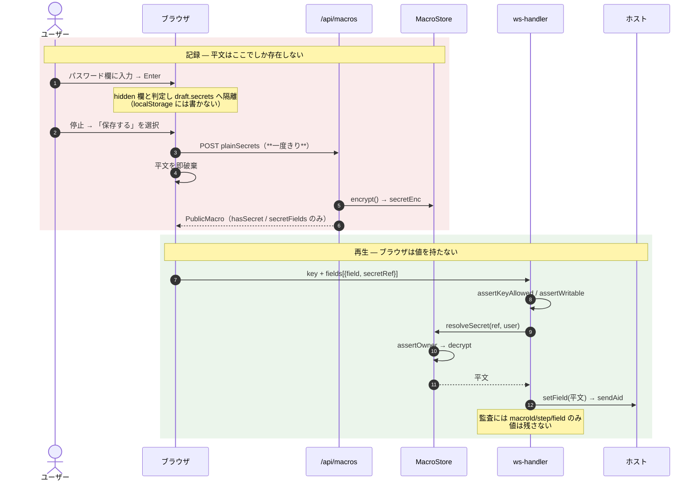
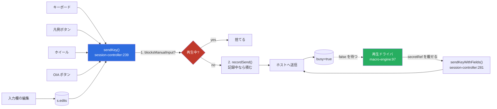

# レビューガイド: 5250端末画面のマクロ機能（記録・再生）

## 変更概要 / 目的

ACS の 5250 エミュレーターにあるマクロ機能（**記録 / 再生 / 休止 / 停止**）を追加する。
サインオンなど定型操作を一度覚えさせて呼び出すだけにする。

**ACS からの移行が動機**なので、調査は原典に当たった。判明した要点（`research.md`）:

- ACS の 5250 マクロの実体は **Host On-Demand マクロ言語**（XML `<HAScript>`）で、
  記録の単位は打鍵ではなく**画面**（`<description>` 照合 ＋ `<actions>` 操作 ＋ `<nextscreens>`）
- Stop は記録・再生の**両方**を終了、Pause は一時中断 — ご指摘の 4 操作の括りは ACS の実装どおり
- ⚠️ ACS の `Actions > Record Playback` は **IBM サポート向けトレース採取**で別物。用語を混同させない

規模: 変更 16 ファイル（+339 / −21）＋ 新規 14 ファイル（実装 7・テスト 7）。

## レビューの勘所は 1 つ — 秘密（パスワード）の流れ

**当初 spec ではパスワードを記録しない設計だったが、「ログイン自動化こそ中核ユースケース」という
判断で方針転換した**（差し戻し 1 回）。したがってこの PR で最も見てほしいのは秘密の扱いです。

**採用した仕組みは、このリポジトリで既に稼働している自動サインオンと同一**
（`SecretCrypto` / AES-256-GCM / `AS400_SECRET_KEY`）。守っている不変条件:

> **平文も暗号文も、ブラウザには一度も渡らない。**

既存 `config-types.ts` の `PublicSystem` が掲げる「パスワードは形式を問わず決して返さない」を、
マクロでもそのまま踏襲しています。実現方法は「値の代わりに**参照**を送り、サーバーが復号して
ホストへ書く直前に差し替える」（spec D11）。

**なぜ新メッセージ型を作らず `WsKey.fields` を union に広げたか**: `ws-messages.ts` 自身が
「別メッセージ型にしないのは、readOnly ゲート・監査・busy 対応付けといった歯止めを
key 経路と二重に書かないため」と書いている。秘密こそその歯止めを確実に通すべきなので、同じ判断に乗せた。

### 秘密まわりで特に確認してほしい 4 点

| # | 見る場所 | 確認したいこと |
|---|---|---|
| 1 | `packages/server/src/macro-store.ts:218` `toPublic()` | `secretEnc` を落としているか（テストで文字列レベルに固定済み） |
| 2 | `packages/server/src/macro-store.ts:175` `resolveSecret()` | `assertOwner` を必ず通り、失敗時に**空文字へフォールバックしない**か |
| 3 | `packages/server/src/ws-handler.ts:245` `resolveField()` | **1 欄も書く前に**全欄を解決しているか（下記の理由） |
| 4 | `packages/web-ui/src/macro-record.ts:86` `recordSend()` | hidden 欄を `secrets` へ隔離しているか |

**#3 の理由**: 途中で失敗して throw すると、それまでに書いた欄だけがホストに残り
「ユーザー名は入ったがパスワードは空」という中途半端な状態で AID を待つことになる。
`msg.fields.map(...)` で先に全部解決してから `setField` する順序が本質です。

## もう 1 つの要点 — フックを `sendKey` 1 点に集約した

5250 の送信はもともと「AID ＋ そのフォーマットで編集した欄」で、新画面が届くと
`edits.clear()` される（`stores/sessions.ts`）。**この画面境界がそのままステップの区切りになる**
ため、打鍵列を再現する必要がない（spec D1）。

送信口が `sendKey` 1 点なので、記録フックもそこに置けば**キーボード・機能キー凡例ボタン・
ホイール・OIA ボタンの全 6 経路がコンポーネント無改造で記録対象になる**。

**`idle` のときは `recordSend` が即 return する**ので既存挙動は一切変わらない（明示テストあり）。

## 主要な変更箇所

### server

- `packages/server/src/macro-types.ts` — 型を 3 層に分離。`MacroRecord`（ファイル・`secretEnc` あり）/
  `PublicMacro`（API・落とす）/ `CreateMacroBody`（`plainSecrets` はここだけ）。
  この分離が崩れると秘密が漏れる。**AID キーの二重定義は型パリティで守っている**（`Attn` を 1 つ外すと
  ビルドが落ちることを確認済み）
- `packages/server/src/macro-store.ts:113` `create()` — 平文を受け取り即暗号化して捨てる。
  鍵が無ければ**保存を拒否**（黙って平文で持つ経路を作らない）
- `packages/server/src/ws-handler.ts:245` `resolveField()` — 秘密の解決点。`secretRef` の形も検証する
- `packages/server/src/ws-messages.ts` — `WsKey.fields` をタグ付き union へ（**加算的**。既存形はそのまま）

### web-ui

- `packages/web-ui/src/macro-record.ts` — 記録。**`session-controller` に依存しない**
  （依存の向きを一方向に保つため。`decisions.md` D1）
- `packages/web-ui/src/macro-engine.ts:97` `runFrom()` — 再生ループ。
  照合 → prompt 判定 → 送信 → `busy` 待ち
- `packages/web-ui/src/macro-engine.ts:36` `screenMatches()` — 画面照合（下記リスク参照）
- `packages/web-ui/src/session-controller.ts:256/314/332` — 再生中の手入力を 3 入口で遮断
- `packages/web-ui/src/components/MacroMenu.vue` — 記録停止時に**欄ごと 3 択**
  （保存する / 毎回入力する / 記録しない）。**値は表示しない**

## リスク / 確認してほしい点

1. **⚠️ 画面照合は「書き込む欄」しか見ない（spec D4 の意図的な折り合い）**
   HOD は本文テキスト・フィールド数・OIA まで照合するが、サブファイルの行数変動で誤検知が多く
   v1 には過剰と判断した。結果として **F キーだけで遷移するステップ（`targets` が空）は
   rows/cols しか照合されない**。純粋な画面遷移だけのマクロは照合が実質効かないので、
   この折り合いで良いかご判断ください。

2. **再生の完了判定が最後の応答を待たない**
   最終ステップを送った直後に `completed` にするため、OIA から「▶ 再生中」が消えた時点で
   まだホスト応答待ちのことがある（`🔒 応答待ち` は出る）。実害は小さいと判断して許容。

3. **休止中（`playPaused`）は手入力を通す**
   「毎回入力する」欄でユーザーが値を打ってから再開する動線を塞がないため、意図的にこうしている
   （`blocksManualInput` が `playing` のみ true）。

4. **鍵ローテーション時の再暗号化は未実装**
   鍵を入れ替えると復号に失敗し、再生が `secret` 理由で停止して「記録し直してください」と出る。
   `SecretCrypto` の `v1:` プレフィックスが将来の移行枠組みを持っているので、必要になったら足せる。

5. **実機（IBM i）での記録→再生が未実施**
   自動テストは擬似スナップショットで駆動している。IME・DBCS 欄・パスワード欄での操作感は
   AGENTS.md の test 方針が求める観点だが、このセッションでは確認できていない。

6. **`zip-writer.test.ts` 4 件が失敗**（本変更と無関係）
   この環境に `unzip` が無いための `spawnSync unzip EACCES`。zip 周りには一切触れていない。

## 検証結果

- server 585 passed（既存環境要因の 4 件を除き緑）/ web-ui 896 passed
- ビルド: `tsc -b`（server）・`vue-tsc -b && vite build`（web-ui）とも成功
- lint: 変更分 0 件
- review: ラウンド 1 で should 3 件（`selectGuiChoice` の非対称・`secretRef` 未検証・
  `toPublic` の参照共有）を検出し修正、ラウンド 2 で指摘なし。詳細は `review.md`

## 関連ドキュメント

`requirement.md`（何を・なぜ）/ `research.md`（ACS・HOD の原典調査）/ `spec.md`（D1〜D11 の設計判断）/
`decisions.md`（実装中の逸脱 5 件）/ `review.md`（指摘と対応）
