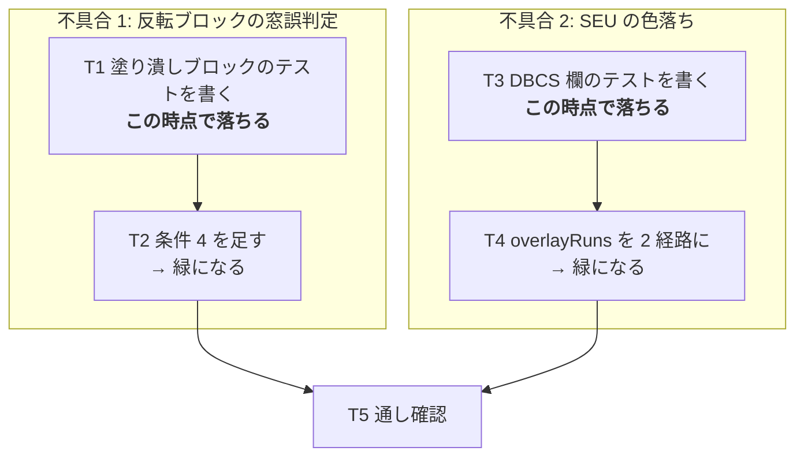

# 計画: 反転ブロックの窓誤判定と、SEU ソース欄の埋め込み属性の色落ちを直す

## split 判定

**subtask に分割しない**（親 work 単体・単一 `tasks.md`）。

2 件の不具合は互いに独立で、原理的には別 work・別 PR にもできる。
しかし**どちらも 1 ファイル 1 箇所の修正**で、報告も 1 件としてまとまっており、
利用者は「この 2 つが直った版」を 1 回で受け取りたい状況にある。
過剰分割の禁止（`DESIGN.md`「5.」）に従い 1 work・1 PR にまとめる。

代わりに**タスクは 2 系統に分け、互いに依存させない**（片方が詰まっても他方は進む）。

## 実装方針

**両方とも「修正前に落ちるテスト」を先に書く。** 原因は実測で特定済みなので、
テストを先に書けば「本当にその原因か」の最終確認と、回帰防止が同時に片づく。

## 作業順序と依存関係

1. **T1 / T3 — 落ちるテストを書く**（依存: なし。互いに独立）
   実測で確認済みの現象をテストの形に落とす。**ここで落ちなければ原因の特定が誤っている**ので、
   落ちることを確認してから次へ進む。
2. **T2 / T4 — 修正する**（依存: それぞれ T1 / T3）
3. **T5 — 通し確認**（依存: T2, T4）

## リスク / 留意点

| # | リスク | 対応 |
|---|---|---|
| R1 | 条件 4 が**本物の窓も弾く**（窓の中に全幅の反転行がある場合） | spec D1 で緩い側（内側に非反転セルが 1 つでもあればよい）を採用。既存の `reverse-frame-window.test.ts` が実機由来のケースを持っているので、それが通り続けることを確認する |
| R2 | DBCS 欄で**桁がずれる**（全角 1 文字 = 2 桁） | spec D4。`columnViewLayout` と同じ `isFullWidth` を使い、桁の数え方を 2 つ作らない。テストで全角を含むケースを見る |
| R3 | SBCS 欄の挙動を壊す | 分岐はセンチネルの有無で行い、**センチネルがある経路は 1 行も触らない**。既存 `screen-grid-embedded-attr.test.ts` が**無変更で**通ることを受け入れ基準にする |
| R4 | テストが「修正後に通る」だけで、**何も守っていない** | T1 / T3 で**先に落ちること**を確認する。前作業 retro で原則化を提案した手順 |
| R5 | web-ui は root の `tsc -b` に含まれない | T5 で `npm run build -w @as400web/web-ui`（`vue-tsc` 込み）を必ず実行する |
| R6 | web-ui のテストはパッケージ dir から実行しないと `.vue` の解析に失敗する（AGENTS.md） | `cd packages/web-ui && npx vitest run` で実行する |

## テスト方針

**不具合 1**（`packages/web-ui/test/reverse-frame-window.test.ts` に追記）
- 全面反転の矩形ブロック（内側に非反転セルが無い）→ 窓と判定**しない**
- 内側が空いた反転枠 → 従来どおり窓と判定する（既存ケースが通り続ける）
- 内側に全幅の反転行がある窓 → 窓と判定する（R1 の確認）

**不具合 2**（`packages/web-ui/test/screen-grid-embedded-attr.test.ts` に追記）
- 値にセンチネルが無く、セルの色が途中で変わる欄 → オーバーレイが**複数の色クラス**を持つ
- 全角を含む DBCS 欄 → オーバーレイの連結文字列が入力欄の表示値と一致する（桁ずれなし）
- SBCS 欄（既存 3 件）が**無変更で**通る

**全体**
- `cd packages/web-ui && npx vitest run`（896 件から減らさない）
- `npm run build`（`tsc -b`）／ `npm test`（全 workspace）／ `npm run lint`
- `npm run build -w @as400web/web-ui`（`vue-tsc -b && vite build`）

**ガードの検証**: T1 / T3 のテストは `git stash` で修正前へ戻し、**落ちることを確認**する。

**実機観点**: どちらも実機（PUB400 の SEU / ATNPGM 窓）で報告された現象。
本作業では単体テストで固定するが、**実機確認は利用者に委ねる**旨を PR に明記する。
