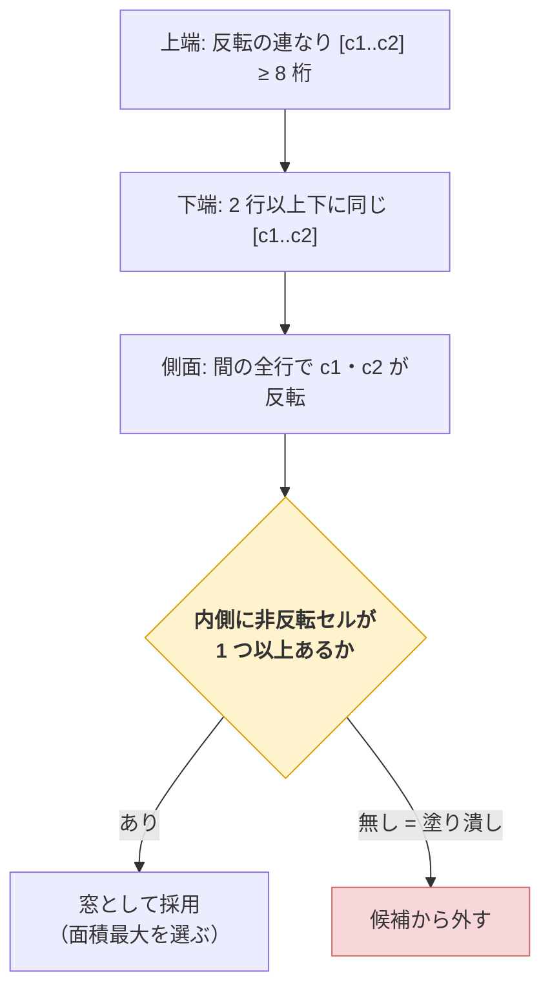
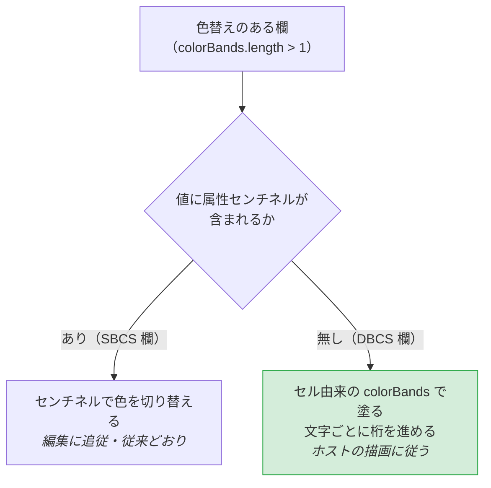

# 仕様: 反転ブロックの窓誤判定と、SEU ソース欄の埋め込み属性の色落ちを直す

## 概要

独立した 2 件の不具合を直す。どちらも **1 つの条件・1 つの分岐**の追加で閉じる。

| # | 場所 | 変更 |
|---|---|---|
| 1 | `composables/fkeyLegend.ts` `detectReverseFrame` | 「中が空いている」条件を足す |
| 2 | `components/ScreenGrid.vue` `overlayRuns` | センチネルが無い欄はセル由来の色バンドで塗る |

## 設計方針

### 不具合 1

#### D1. 条件は「内側に非反転セルが 1 つでもあること」（緩い側を採る）

現行の 3 条件（上端・下端・側面）に 4 つ目を足す。

> 4. **内側**（行 `top+1..bottom-1` × 桁 `c1+1..c2-1`）に、**反転でないセルが 1 つ以上ある**

塗り潰しブロックは内側も全部反転なので、これだけで弾ける。

**行ごとに要求する（厳しい側）案は採らない。** 窓の中に**全幅の反転強調行**
（選択中の行・見出し行）があるのは普通で、厳しくすると本物の窓を弾く。
requirement で挙げたとおり、この誤検出は「窓が窓と認識されない」＝
背面の F キー凡例が窓の上に残る、という**より目立つ実害**になる。

「1 つでもあればよい」は最小の条件で、閾値を持たない（推測で調整する余地を作らない）。
前作業 spec の「実測をもって緩める。推測で緩めない」と同じ姿勢で、**足す側も最小**にする。

#### D2. 判定は既存ループの中で行い、探索順は変えない

`detectReverseFrame` は「面積が最大の矩形」を選ぶ。条件 4 は側面チェックの直後、
`area` 計算の前に置く。**枠として成立しない矩形を候補から外すだけ**で、
優先順位・最小幅（8 桁）・上下端完全一致には触れない。

内側が存在しない矩形（`c2 - c1 < 2`）は最小幅 8 桁の制約から起こり得ないが、
**内側が空なら「非反転セルが 1 つ以上」は偽**になるので、自然に弾かれる（追加の場合分け不要）。

### 不具合 2

#### D3. 「値にセンチネルがあるか」で経路を分ける

`overlayRuns` を 2 経路にする。**欄の種別（`dbcsType`）ではなく、値にセンチネルがあるかで分ける。**

```
値に属性センチネルがある  → 従来どおりセンチネルで色を切り替える（SBCS 欄。編集に追従）
値に属性センチネルが無い  → セル由来の colorBands で塗る（DBCS 欄。ホストの描画に従う）
```

`dbcsType` で分ける案も考えたが、**判定したい事実は「値が色情報を持っているか」**そのもの。
センチネルの有無を見れば、将来 core 側が DBCS 欄にもセンチネルを載せられるようになったとき、
web-ui を触らずに良い経路（編集追従）へ自動的に移る。原因に直接対応する条件を使う。

#### D4. セル由来の経路は「文字ごとに桁を進めて」色を引く

`colorBands` は**桁**（`{ start, len, cls }`、スライス先頭からの桁オフセット）で、
オーバーレイに出す文字列は**文字**。DBCS 欄では両者が一致しない
（実測: 20 桁の欄に対し値は 11 文字。SO/SI と全角 1 文字＝2 桁のため）。

そこで、文字を 1 つずつ見て**表示幅ぶん桁を進めながら**バンドから色を引く。

```ts
let col = 0;
for (const ch of value) {
  const cls = classAtColumn(bands, col) ?? seg.cls;
  // …同じ cls の文字をランにまとめる…
  col += isFullWidth(ch) ? 2 : 1;
}
```

`isFullWidth` は `composables/fieldValidate.ts` の既存関数を使う（DBCS 欄の列ビュー
`columnViewLayout` が桁を数えるのと**同じ規則**。桁の数え方を 2 つ作らない）。

全角 1 文字は先頭の桁の色を採り、後半桁は文字が無いので参照されない。
これで**桁ずれが起きない**（受け入れ基準）。

#### D5. DBCS 欄では色が編集に追従しないことを受け入れ、明記する

セル由来なので、色は**ホストが描いた位置**に留まる。`e9ab19e` 以前と同じ挙動。

値にセンチネルを載せれば追従できるが、それは `e9ab19e` が
「SO/SI・2 バイトの都合で**送信エンコードが壊れる**」として避けた経路であり、
**送信でソースを壊す危険**と引き換えになる。requirement の対象外にも明記済み。

**「色が編集で少しずれる」より「色が全く出ない」方が悪い**という判断。
コード側にこの理由を残す。

#### D6. `colorBands` は今も算出済み。使うだけ

`rows` computed は既に `inputColorBands(row, c, start.width)` を呼び、
`bands.length > 1` のときだけ `colorBands` を持たせている。
`e9ab19e` 以降この値は**オーバーレイを出すか否かの門番にしか使われていなかった**
（描画は値由来に切り替わったため）。今回それを本来の用途にも使う。
**新しいデータは増やさない。**

## 対象範囲

### 変更

| ファイル | 内容 |
|---|---|
| `packages/web-ui/src/composables/fkeyLegend.ts` | `detectReverseFrame` に条件 4（内側に非反転セル） |
| `packages/web-ui/src/components/ScreenGrid.vue` | `overlayRuns` を 2 経路化。`isFullWidth` を import |

### 追加（テスト）

| ファイル | 内容 |
|---|---|
| `packages/web-ui/test/reverse-frame-window.test.ts` | 塗り潰しブロックを弾く / 空いた枠は通す |
| `packages/web-ui/test/screen-grid-embedded-attr.test.ts` | DBCS 欄（センチネル無し）で色が出る・桁がずれない |

既存ファイルに追記する（**同じ主題のテストを別ファイルに散らさない**）。

### 変更しない

- core（`fieldValue` のセンチネル方針・送信エンコード）
- 反転枠判定の最小幅・上下端完全一致・優先順位
- SBCS 欄のオーバーレイ挙動
- `inputColorBands` / `colorBands` のデータ構造

## インターフェース / データ構造

新しい公開 API は増やさない。`ScreenGrid.vue` 内に補助関数を 1 つ足す。

```ts
/** 桁オフセットに掛かるバンドの class（無ければ undefined） */
function classAtColumn(
  bands: { start: number; len: number; cls: string }[],
  col: number
): string | undefined;
```

## 振る舞いの詳細

### 反転枠の判定（変更後）



### オーバーレイの色（変更後）



### エッジケース

| 状況 | 扱い |
|---|---|
| 内側が全反転の枠（塗り潰し） | 窓と判定しない（不具合 1 の修正そのもの） |
| 内側に全幅の反転強調行がある窓 | 他の行に非反転セルがあれば窓と判定する（D1） |
| 反転が 1 つも無い画面 | 従来どおり即座に `null`（既存の早期 return） |
| センチネルもバンドも無い欄 | オーバーレイ自体が出ない（`colorBands` の門番が閉じている。従来どおり） |
| DBCS 欄の全角文字 | 先頭桁の色を採り、2 桁ぶん進める（D4） |
| バンドの範囲外の桁 | `seg.cls`（欄先頭の色）にフォールバック |

## ドメイン固有の考慮

- **AGENTS.md「規格どおりより既存クライアントと同じ挙動を優先する」**——
  SEU の色分けは実機 ACS で見えるものなので、**出ないこと自体が不具合**。
  「編集で色が少しずれる」より優先して、まず出す（D5）
- **AGENTS.md「コメントは why を書く」**——`overlayRuns` の 2 経路は
  「なぜ DBCS 欄だけ違うのか」（core が SO/SI の都合でセンチネルを載せられない）を
  分岐のところに書く。読み手が「片方を消せそう」と誤解しないため
- **前作業 retro の「ガードを新設したら壊して確認する」**——
  今回のテストは 2 件とも**修正前のコードで落ちること**を確認してから完成とする
  （受け入れ基準に明記済み）
- **桁の数え方を 2 つ作らない**——`isFullWidth` は `columnViewLayout` と同じものを使う（D4）

## エラー処理 / 異常系

| 想定 | 扱い |
|---|---|
| `colorBands` が undefined なのに fallback 経路に入る | 到達しない（`colorBands` が無ければオーバーレイ自体を出さない）。型で `?? []` を置く |
| バンドが桁を覆い切らない | `seg.cls` にフォールバック（`classAtColumn` が undefined を返す） |
| 内側が存在しない矩形 | 条件 4 が偽になり自然に弾かれる（追加の場合分け不要。D2） |

## 受け入れ基準との対応

| requirement の完了条件 | 満たし方 |
|---|---|
| 塗り潰しブロックが窓と判定されない | D1 の条件 4 |
| 内側が空いた枠は従来どおり窓 | D1（緩い側を採ったため既存ケースは影響なし）＋既存テスト |
| 不具合 1 の回帰テストが修正前に落ちる | 追加テスト＋`git stash` で確認 |
| DBCS 欄で色分けがオーバーレイに出る | D3 の分岐＋D4 の塗り |
| DBCS 欄で桁がずれない | D4（`isFullWidth` で 2 桁進める） |
| SBCS 欄の既存挙動が変わらない | D3（センチネルがある経路は無変更）＋既存テストが無変更で通る |
| 不具合 2 の回帰テストが修正前に落ちる | 追加テスト＋`git stash` で確認 |
| build / test / lint / vue-tsc | 変更は 2 ファイル・型変更なし |
