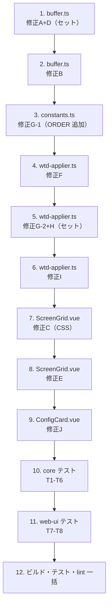

# 計画: 表示/応答不具合 10 件の取り込み

## split 判定

**分割しない（1 PR・subtask 化なし）。**

- 10 個の修正はいずれも数行〜数十行で、変更ファイルは 5 本（core 3 / web-ui 2）。
- 修正 A と D、修正 G と H は**セットで適用しないと新しい不具合が出る**ため、分けられない。
- 原典が 1 つのメモとして「この一式を当てること」を求めており、途中状態でコミットする意味が無い。

## 実装順

依存があるので次の順で進める。core → web-ui、本体 → テストの順。

- **3 → 5**: `ORDER.UNKNOWN_1C` を先に定義しないと `case` が書けない。
- **4 → 5**: 修正F で default 分岐を直してから、その手前に `case` を足す（衝突を避ける）。
- **10 → 11**: core のテストが通ってから web-ui に移る。core が壊れていると web-ui の失敗の切り分けが濁る。

## リスクと対処

| リスク | 対処 |
|---|---|
| 修正A を入れて D を忘れる → 窓の枠が残る（原典の不具合3 が再発） | 1 タスクにまとめる。`wdsf-gui.test.ts` の既存テストが検知する |
| 修正G を入れて H を忘れる → カナモードで化ける（原典の不具合7 が再発） | 1 タスクにまとめ、T5 で `rawByte` が `undefined` を検証 |
| T8 が原典に無く、書き起こしが的外れになる | 「修正前に戻すと fail する」を実際に確かめる（spec §6） |
| `codec.decodeDbcsPair` の有無や `SO`/`SI` の import が原典の前提と違う | 修正I の実装前に現物を確認する |
| 原典の diff が現行と食い違う | spec §0 で全件照合済み。実装中に差異が出たら `decisions.md` に記録 |

## 検証

`spec.md` §7 のコマンド一式。実機確認は不可（`test.md` に未実施として記録）。
