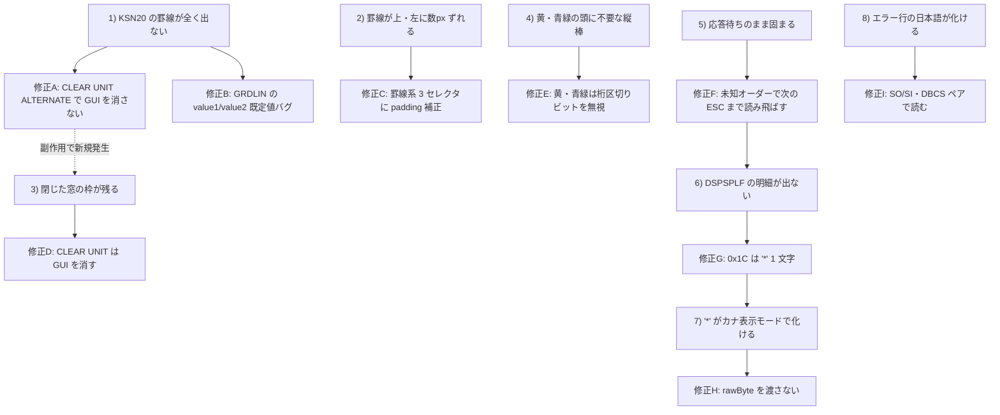

# 要件: 別環境で確認済みの表示/応答不具合 10 件を取り込む（罫線・GUI 構造体・データストリーム・設定保管場所）

## 背景 / 課題

コミットできない別環境で本コードベースを修正した記録（`Bugfix.pdf`、全 18 ページ・画像 PDF）が
持ち込まれた。中身は 2 つの文書。

1. **16 ページ**: 罫線（GRDATR/GRDLIN）・GUI 構造体（CREATE WINDOW 等）・5250 データストリーム解析の
   表示/応答不具合 **8 件**（修正 A〜I の 9 個の変更）。実機（PB1000R・PUB400 系）のトレースを
   `AS400_TRACE_RECORDS=1` で採取し、ACS の実表示と 1 文字単位で突き合わせて確定させたもの。
2. **2 ページ**: 「セッションを追加」で親システムにサーバー設定を選ぶと `system XXX not found` で
   保存に失敗する不具合（修正 J）。

いずれも**原因・根拠・diff・テスト・再現手順まで揃っている**。本作業はこれを当リポジトリへ再現する。

> PDF は画像のみ（テキスト層なし）だったため、埋め込み JPEG を取り出して全 18 ページを読み取った。
> 読み取り結果の書き起こしは `source-notes.md` に残す（原典との突き合わせ用）。

### 8 件の不具合の連鎖（文書1）

## 目的 / ゴール

`Bugfix.pdf` に記録された 10 個の修正（A〜J）とそれに付随するテストを、当リポジトリに
**同じ内容で**取り込み、ビルド・テスト・lint がすべて通る状態にする。

## スコープ

### 対象

| 修正 | 症状 | 変更ファイル |
|---|---|---|
| A | CLEAR UNIT ALTERNATE が罫線を含む GUI 構造体を毎回消す | `packages/core/src/screen/buffer.ts`（`resize()`） |
| B | GRDLIN の `value1`/`value2` に `GRID_DEFAULT`(0xFF) が素通し | `packages/core/src/screen/buffer.ts`（`applyGridLines()`） |
| C | 罫線・窓枠が上・左に数 px ずれる | `packages/web-ui/src/components/ScreenGrid.vue`（CSS 3 セレクタ） |
| D | 閉じた CREATE WINDOW の枠が残る（A の副作用） | `packages/core/src/screen/buffer.ts`（`clearUnit()`） |
| E | 黄・青緑フィールドの頭に不要な桁区切り | `packages/web-ui/src/components/ScreenGrid.vue`（`hasRealColsep()`） |
| F | 未知オーダーでレコード全部を捨て「応答待ちのまま固まる」 | `packages/core/src/protocol/wtd-applier.ts`（`applyWtd()` default） |
| G | `0x1C` の正体（"*" 1 文字）を実装 | `packages/core/src/protocol/constants.ts` / `wtd-applier.ts` |
| H | `0x1C` の "*" がカナ表示モードで化ける | `packages/core/src/protocol/wtd-applier.ts`（`rawByte` を渡さない） |
| I | WRITE ERROR CODE の DBCS メッセージが文字化け | `packages/core/src/protocol/wtd-applier.ts`（`applyWriteErrorCode()`） |
| J | 新規セッション追加で `system XXX not found` | `packages/web-ui/src/components/ConfigCard.vue`（`isServer`） |

- **テストの変更・追加**（原典が指定したもの）
  - `packages/core/test/wdsf-gui.test.ts` — 実機トレース根拠の doc コメント追加（期待値は変えない）
  - `packages/core/test/wdsf-grid-border.test.ts` — `value1`/`value2` 既定値フォールバックの回帰テスト
  - `packages/core/test/wdsf-applier-grid-lines.test.ts` — **新規**。修正 A の根本原因を再現する統合テスト
  - `packages/core/test/wtd-applier.test.ts` — 未知オーダーの挙動書き換え、`0x1C`、`rawByte`、
    WRITE_ERROR_CODE の DBCS 回帰
  - `packages/web-ui/test/screen-grid-colsep.test.ts` — 黄・青緑で `a-colsep` を出さない 2 件
  - `packages/web-ui/test/config-card-ownership.test.ts` — 修正 J の再現テスト
- **原典に残された doc コメント**（実機トレースの根拠・判断の出所）もあわせて取り込む。
  AGENTS.md「なぜを書く」「原典を参照する」に沿った内容であり、落とすと判断の根拠が失われる。

### 対象外

- `Bugfix.pdf` 自体のリポジトリへのコミット（作業用の持ち込み資料。成果物ではない）。
- 原典が「残課題」として明示した `0x1C` の 5250 プロトコル上の正式名称・意味の確定
  （規格上の裏付けは取れていない。コメントに未確認と明示するところまでが対象）。
- 罫線の色・線種を ACS に合わせる変更（既決事項。ホスト指定どおりに描く方針は変えない）。
- 実機（PUB400 / 実機）への接続確認。この環境からは実施できないため、
  原典の「再現・検証手順」は `test.md` に手順として記録するに留める。

## 機能要件

1. 修正 A〜J をすべて適用する。原典の diff と**同じ振る舞い**になること。
2. 原典が指定したテストの変更・追加をすべて適用する。
3. 原典の doc コメント（実機トレースの根拠）を取り込む。
4. 修正 A と D は**セットで**適用する（A 単独だと不具合 3 が発生する）。
5. 修正 G と H は**セットで**適用する（G 単独だと不具合 7 が発生する）。

## 非機能要件 / 制約

- **原典に忠実に**。diff に無い変更を混ぜない（別環境と実装が食い違うと次の持ち込みが破綻する）。
- ただし**現行コードと前提が食い違う場合は原典より現物を優先**し、差異を `decisions.md` に記録する
  （原典は別環境の記録であり、当リポジトリが先に進んでいる可能性がある）。
- `npm run build`（`tsc -b`）・`npx vitest run`（core / web-ui）・`npx eslint .`・
  `npx vue-tsc -b`（web-ui）がすべて通ること。
- web-ui のテストは**パッケージ dir から実行**する（AGENTS.md）。
- ログは stderr のみ。`console.*` は使わない。
- 実資格情報を成果物に書かない（原典のトレース例はホスト由来のバイト列で、秘密は含まない）。

## 完了条件 (受け入れ基準)

- [ ] 修正 A〜J の 10 件がすべて適用されている。
- [ ] `packages/core/test/wdsf-applier-grid-lines.test.ts` が新規追加され、
      「罫線を描いた直後の CLEAR UNIT ALTERNATE で罫線が消えない」「REM_ALL_GUI_CONSTRUCTS では消える」が通る。
- [ ] `wtd-applier.test.ts` で、未知オーダー後続の WRITE/READ が失われないこと
      （`unlockKeyboard` / `readRequested` が `true`）が検証されている。
- [ ] `0x1C` が `"*"` を 1 桁書き、`rawByte` が付かないことが検証されている。
- [ ] WRITE_ERROR_CODE の実機トレース（96 バイト）から `"機能キーは使用できません。"` が得られる。
- [ ] 黄・青緑のセルで `a-colsep` が付かず、他の色では従来どおり付く。
- [ ] 修正 J の再現テストが通り、修正前に戻すと fail する。
- [ ] `npx vitest run`（core / web-ui 両方）・`npx eslint .`・`npx vue-tsc -b` がすべて成功する。
- [ ] 原典との対応表が `source-notes.md` に残り、取り込み漏れが無いことを追跡できる。

## 未確定事項 / 確認したいこと

- 原典の diff が当リポジトリの現行コードにそのまま当たるか（`buffer.ts` の `resize()`/`clearUnit()` は
  一致を確認済み。他ファイルは coding 時に照合する）。
- 修正 J の diff 中「テストの追加分は同梱の diff ファイル参照」とあるが、
  **その diff ファイルは PDF に含まれていない**。再現テストは原典の「再現手順」から書き起こす必要がある。
- 実機確認（原典の「再現・検証手順」4 項）はこの環境からは実施できない。
