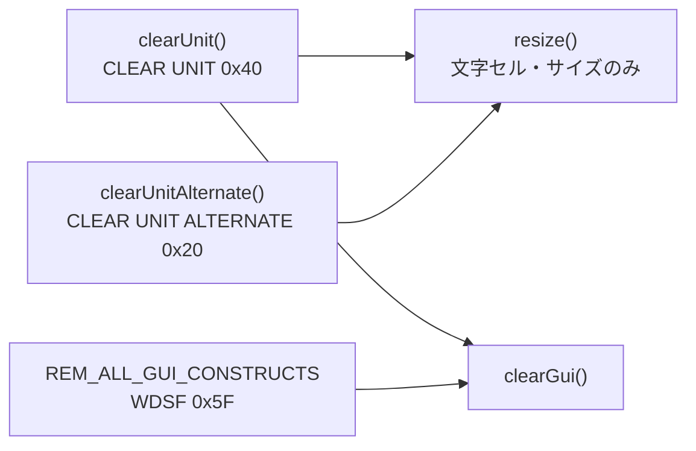

# 仕様: 表示/応答不具合 10 件の取り込み

原典は `Bugfix.pdf`（書き起こしは `source-notes.md`）。本仕様は**原典の diff を当リポジトリの
現行コードに当てるための確定版**であり、原典に無い判断は加えない。

## 0. 現物照合の結果（spec 時点）

原典の diff コンテキストが現行コードと**すべて一致**することを確認した。

| 対象 | 現行の位置 | 一致 |
|---|---|---|
| `resize()`（末尾 `this.clearGui()`） | `core/src/screen/buffer.ts:105-114` | ✓ |
| `clearUnit()`（24x80 分岐あり） | `core/src/screen/buffer.ts:313-325` | ✓ |
| `applyGridLines()`（`value1: it.value1`） | `core/src/screen/buffer.ts:202-228` | ✓ |
| `ORDER`（`WDSF: 0x15` の次が `SF: 0x1d`） | `core/src/protocol/constants.ts:58-69` | ✓ |
| `applyWtd` default（`r.skip(r.remaining)`） | `core/src/protocol/wtd-applier.ts:280-284` | ✓ |
| `applyWriteErrorCode()`（SO/SI 無し） | `core/src/protocol/wtd-applier.ts:405-412` | ✓ |
| `applyDataStream` doc コメント | `core/src/protocol/wtd-applier.ts:33-36` | ✓ |
| `.grid-line` / `.win-frame` / `.gui-window-border`（margin 無し） | `web-ui/src/components/ScreenGrid.vue:2922, 2938, 2953` | ✓ |
| `.gui-window`（margin 有り＝補正の手本） | `web-ui/src/components/ScreenGrid.vue:3318-3320` | ✓ |
| `cellClass()` / `attrByteClass()` | `web-ui/src/components/ScreenGrid.vue:558-567, 589-597` | ✓ |
| `decorAttrClass()`（CS を見ない） | `web-ui/src/components/ScreenGrid.vue:608-615` | ✓ |
| `isServer`（`props.system?.ref ?? props.session?.ref`） | `web-ui/src/components/ConfigCard.vue:107-111` | ✓ |

テスト側の前提も確認済み。
- `core/test/wtd-applier.test.ts`: `apply()` は `{ buf, result, warns }` を返す。`codecForCcsid` /
  `parseRecord` / `ScreenBuffer` / `applyDataStream` / `ORDER` は import 済み。`rowText()` / `e()` あり。
- `core/test/wdsf-grid-border.test.ts`: `gridBody()` / `item()` / `GRID_MINOR` / `apply()` あり。
  `describe("ScreenBuffer のグリッド線状態")` の最後の `it` は `"項目が色・線種を指定していればそちらを使う"`（:155-162）。
- `web-ui/test/screen-grid-colsep.test.ts`: `cell()` / `snapWith()` / `blank()` / `mount` あり。
  最後の `it` は `"他の属性と併用できる（下線・反転と同じランに載る）"`。
- `web-ui/test/config-card-ownership.test.ts`: `stubFetch()` / `SRV_SYSTEM` / `OWN_SYSTEM` / `systemsStore` あり。
- `ConfigCard.vue`: `props.kind` / `props.parentSystem` / `sesForm.system`（`:141` で `parentSystem` から初期化）/
  `source`（`:63`、既定 `"personal"`）あり。

**差異は無いため、原典どおりに当てる。**

## 1. `packages/core/src/screen/buffer.ts`

### 1-1. 修正A — `resize()` から GUI クリアを外す

`private resize()` の直前に doc コメントを追加し、末尾の `this.clearGui();` を削除する。
コメントは原典の全文（`source-notes.md`「修正A」）をそのまま入れる。

**不変条件**: `clearGui()` メソッド自体は残す。`REM_ALL_GUI_CONSTRUCTS`（`wtd-applier.ts` の
`"remove-all"` ケース）からの呼び出しが生きていること。

### 1-2. 修正D — `clearUnit()` を独立させる

```ts
clearUnit(): void {
  this.resize(24, 80);
  this.clearGui();
}
```

24x80 判定の早期 return と手動クリアの分岐を削除する（`resize()` を無条件に呼んでも結果が同じ）。
doc コメントは原典の全文に差し替える。

**適用後の 3 者の役割**（原典の最終形）:



### 1-3. 修正B — `applyGridLines()` の value1/value2 既定値フォールバック

```ts
value1: it.value1 !== GRID_DEFAULT ? it.value1 : 0,
value2: it.value2 !== GRID_DEFAULT ? it.value2 : 0
```

直前に原典のコメント（`source-notes.md`「修正B」）を入れる。

## 2. `packages/core/src/protocol/constants.ts`

### 修正G-1 — `ORDER.UNKNOWN_1C` の追加

`WDSF: 0x15` と `SF: 0x1d` の間に `UNKNOWN_1C: 0x1c` を追加し、原典の doc コメント
（正体未確認である旨・観測状況・ACS 突き合わせの経緯）を付ける。

## 3. `packages/core/src/protocol/wtd-applier.ts`

### 3-1. 修正F — 未知オーダーで次の ESC まで読み飛ばす

`applyWtd` の `default:` 分岐:

```ts
default:
  warn(`unknown order 0x${b.toString(16)} — skipping to next command`);
  // （原典のコメント）
  while (r.remaining > 0 && r.peek() !== ESC) r.u8();
  return;
```

あわせて `applyDataStream` の doc コメント（`:33-36`）を原典の文面に差し替える。

**なぜ ESC まで読み飛ばして安全か**: ESC(0x04) は表示データ（0x40 以上）にも他のオーダーにも
現れないため、次の ESC は必ずコマンド境界である。

### 3-2. 修正G-2 / 修正H — `ORDER.UNKNOWN_1C` の実装

`applyWtd` の switch、`case ORDER.WDSF` の直後・`default` の直前:

```ts
case ORDER.UNKNOWN_1C:
  // 表示は "*" 1 文字（桁を 1 つ占有）。詳細は ORDER.UNKNOWN_1C の doc コメント参照。
  // **rawByte は渡さない。**（原典のコメント全文）
  buf.setChar(addr++, "*");
  break;
```

**修正G と修正H を統合した最終形で入れる**（`setChar` の第 3 引数 `rawByte` を渡さない）。
原典は G→H の 2 段階だが、H が G の実装を上書きするため、中間状態を経由しない。
コメントには両方の経緯（"*" と確定した理由・`rawByte` を渡さない理由）を残す。

### 3-3. 修正I — `applyWriteErrorCode()` の SO/SI・DBCS 対応

`applyWtd` の主ループと同じ SO/SI・DBCS ペア処理を追加する（`source-notes.md`「修正I」の diff どおり）。
doc コメントも差し替える。

**前提の確認**: `SO` / `SI` はファイル冒頭で import 済みであること、`codec.decodeDbcsPair` が
オプショナルであること（`&&` でガードする理由）を coding 時に確認する。

## 4. `packages/web-ui/src/components/ScreenGrid.vue`

### 4-1. 修正C — 罫線系 3 セレクタに padding 補正

`.grid-line`（:2922）・`.win-frame`（:2938）・`.gui-window-border`（:2953）の 3 つに
`margin: 8px 0 0 10px;` を追加する。値は `.gui-window`（:3320）と同一。

### 4-2. 修正E — 黄・青緑は桁区切りビットを落とす

`cellClass()` の直前に `hasRealColsep(color, columnSeparator)` を追加し、
`cellClass()`（:565）と `attrByteClass()`（:595）の `a-colsep` 付与判定を差し替える。

```ts
function hasRealColsep(color: string, columnSeparator: boolean): boolean {
  return columnSeparator && color !== "yellow" && color !== "turquoise";
}
```

`decorAttrClass()` は変更しない（元々 `columnSeparator` を見ておらず、より厳しいルール）。

## 5. `packages/web-ui/src/components/ConfigCard.vue`

### 修正J — `isServer` をセッションの親システム参照から判定する

```ts
const isServer = computed(() => {
  if (props.kind === "system") {
    const r = props.system?.ref;
    return r ? r.startsWith("srv:") : source.value === "server";
  }
  const r = props.session?.ref ?? sesForm.system;
  return r?.startsWith("srv:") ?? false;
});
```

doc コメントを原典の全文に差し替える。

**判定の根拠**: セッションは参照先システムと同じ保管場所にしか置けない
（サーバー側 `config-store.ts` の `assertIntegrity` / `addSession`）。UI 側の `source` select は
システム作成フォームにしか無いため、セッションでは親システム参照が唯一の根拠になる。

## 6. テスト

| # | ファイル | 内容 |
|---|---|---|
| T1 | `core/test/wdsf-gui.test.ts` | 「CLEAR UNIT で GUI がクリアされる」に実機トレース根拠の doc コメント追加（期待値は変えない） |
| T2 | `core/test/wdsf-grid-border.test.ts` | 「繰り返し無し（value1/value2 既定 0xFF）は 0 に倒す」を追加 |
| T3 | `core/test/wdsf-applier-grid-lines.test.ts` | **新規**。CLEAR UNIT ALTERNATE で罫線が消えない／REM_ALL_GUI_CONSTRUCTS では消える |
| T4 | `core/test/wtd-applier.test.ts` | 未知オーダーのテストを「次の ESC から復帰する」に書き換え（例バイトを `0x1c`→`0x16`） |
| T5 | `core/test/wtd-applier.test.ts` | `0x1C` が `"*"` を書き、`rawByte` が付かない（修正G＋H を 1 テストに統合） |
| T6 | `core/test/wtd-applier.test.ts` | WRITE_ERROR_CODE の DBCS 実機トレース（96 バイト）→「機能キーは使用できません。」 |
| T7 | `web-ui/test/screen-grid-colsep.test.ts` | 黄地・青緑地で `a-colsep` を出さない（2 件） |
| T8 | `web-ui/test/config-card-ownership.test.ts` | 修正 J の再現テスト |

T1〜T7 は原典に全文がある。**T8 だけは原典の diff が PDF に含まれていない**ため、原典の「再現手順」
（サーバー設定のシステムを親に選んで新規セッションを保存 → `source` が `"server"` で POST される）を
既存テストの流儀（`stubFetch` で `fetch` を差し替え、`calls` に積まれた body を検証）で書き起こす。

**T8 の受け入れ条件**: 修正前のコードに戻すと fail すること（原典が「修正前に戻すと再現テスト 1 件が
fail することを確認済み」と記録している）。

## 7. 検証

```
npm run build                                        # tsc -b（全ワークスペース）
cd packages/core   && npx vitest run
cd packages/web-ui && npx vitest run                 # ルートから実行しない（AGENTS.md）
npx eslint .                                         # リポジトリルート
cd packages/web-ui && npx vue-tsc -b tsconfig.json tsconfig.test.json
```

実機確認（原典の手順 4 a〜g）は**この環境からは実施できない**。`test.md` に未実施として記録し、
`review.md` で残課題として扱う。

## 8. 非機能

- 原典の doc コメントは**落とさない**。判断の出所（実機トレース・ACS 突き合わせ・利用者報告）が
  コードから消えると、次に同じ場所を触る人が同じ誤りを繰り返す（AGENTS.md「なぜを書く」）。
- 原典に無い変更を混ぜない。気づいた別の問題は `review.md` に記録して本作業では触らない。
- `console.*` を使わない。`decisions.md` に実資格情報を書かない。
