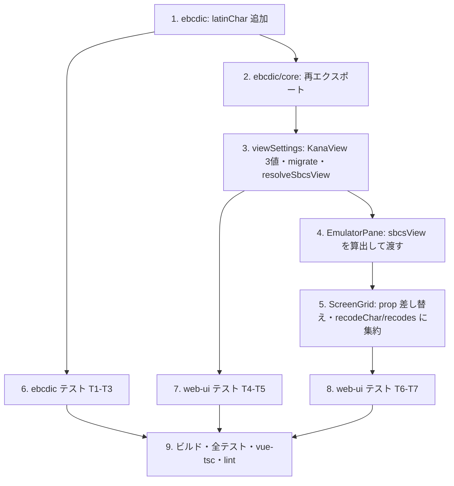

# 計画: 英カナ表示切り替えの CCSID 対称化

## split 判定

**分割しない（1 PR・subtask 化なし）。** 変更は 3 パッケージにまたがるが、
`latinChar` を足して表示側で使うという 1 本の筋で、途中でコミットしても価値が出ない。

## 実装順

下から積む（ebcdic → core の再エクスポート → web-ui の設定 → 画面）。

- **1 → 5**: `latinChar` が `@as400web/core/browser` から引けないと `ScreenGrid` が書けない。
- **3 → 4 → 5**: 型（`KanaView` / `SbcsView`）を先に確定させる。
- **T3（到達可能性ガード）は 1 の直後に回す**。ここを後回しにすると、
  `latinChar` の import 経路を間違えても気づかないまま先へ進む。

## リスクと対処

| リスク | 対処 |
|---|---|
| `latinChar` の import 経路を誤り DBCS 表を引き込む（**型もビルドもテストも通ってしまう**） | T3 を実装直後に走らせる。到達ファイル一覧と 16 KB 上限は緩めない |
| 旧設定利用者の見た目が変わる | `migrate()` で `false→auto` / `true→kana`。T5 で固定。spec §2 の等価表が根拠 |
| `host` のときに再解釈経路へ落ちる → `rawByte` 無しセルが化ける | `recodes()` が `sbcsView !== "host"` を最初に見る。T7 で固定 |
| 画面はカナだが入力欄は英字、のような食い違い | 再解釈を `recodeChar`/`recodes` の 2 関数に集約し、3 経路すべてがそこを通る |
| `katakanaViewActive` の改名で呼び出し漏れ | `vue-tsc` が拾う（未定義参照）。改名後に必ず走らせる |
| 930 の `latin` 表示中に `uppercaseInput` が大文字化して食い違う | **本作業では触らない**（対象外）。`decisions.md` に検討記録を残す |

## 検証

`spec.md` §6 のコマンド一式。実機確認は不可（`test.md` に未実施として記録）。
