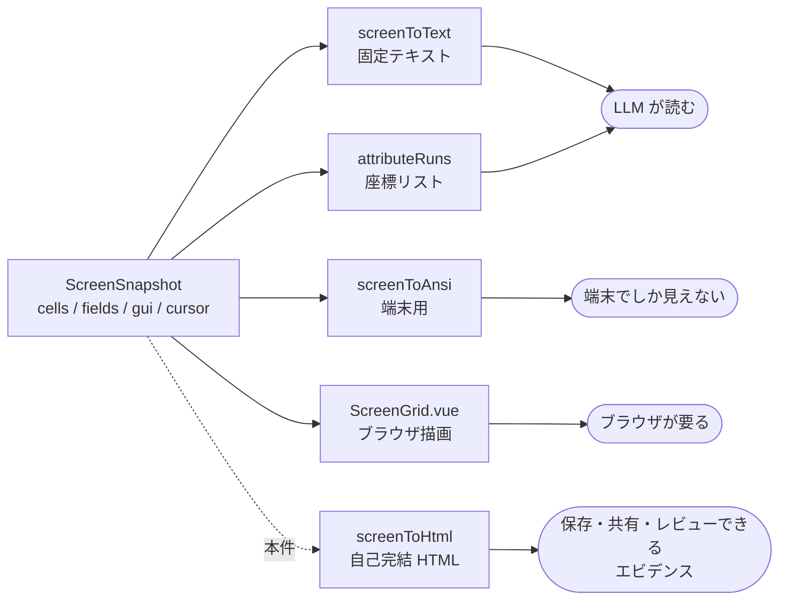

# 要件: 5250 画面を忠実再現する HTML 出力（自動操作エビデンス）

## 背景 / 課題

MCP 経由で 5250 セッションを操作できるようになり、画面は `get_screen` / `wait_screen` /
`run_steps` がテキスト（`grid` / `fields` / `attributes` / `ansi`）で返す。LLM が読むには十分だが、
**自動操作の結果を人間に見せるエビデンスとしては足りない**。

- 固定テキストの `grid` は桁位置こそ保つが、色も強調も無い。実画面とは見た目が違いすぎる。
- `attributes`（`AttrRun` の座標リスト）は機械可読だが、`(3,7) len=12 white reverse` を並べられても
  **人間の目では「どこがどう強調されているか」を頭の中で再構成できない**。
- `ansi`（`screenToAnsi`）は色が付くが **ターミナルでしか見えない**。保存・共有・レビューに使えない。

一方 web-ui（`ScreenGrid.vue`）は同じ `ScreenSnapshot` から実機同等の画面を描いている。
**この描画知識を、ブラウザ無しで再現できる静的 HTML に落とす**のが本件。

## 目的 / ゴール

`ScreenSnapshot` から **TypeScript の決定的な変換**で、5250 エミュレータの見た目を忠実に再現した
HTML を生成し、MCP ツールで取得できるようにする。
**AI に HTML を書かせない**——変換は純関数で、同じ入力からは常に同じ HTML が出る。

用途は 2 つある。

1. **1 画面ぶんのエビデンス**：ある操作の結果を 1 枚の HTML として残す。
2. **履歴ナビゲーション付きの完全版**：一連の自動操作（`run_steps` 等）の各画面を 1 つの HTML に束ね、
   前後の遷移をたどれるようにする。

**両モードの画面描画は同一の変換で行う。** 履歴版に載る 1 画面 1 画面も、単票モードが出すのと
同じ決定的 TS 変換の出力である。履歴版はそこにナビゲーションを被せるだけで、
**描画経路を二重に持たない**（持つと単票と履歴で見た目がずれ、エビデンスとして信用できなくなる）。

生成された HTML は**さらに束ねて静的 HTML サイトとして構築できる**ことを想定する。

## スコープ

### 対象

- **変換ロジック**（TypeScript の純関数）: `ScreenSnapshot` → HTML 文字列。
- **2 つの出力モード**
  - **単票モード**: 現在（または指定）の 1 画面だけを HTML 化。
  - **履歴モード**: 複数画面＋履歴ナビゲーションを持つ完全版 HTML。
- **画面履歴の保持**: サーバー側セッションごとに画面遷移を記録する仕組みと、
  記録の開始／終了・取得範囲の指定手段。
- **MCP ツールの追加**: 上記を呼び出せるツール。単票用と履歴用で**分割してよい**。
- **再現する要素**
  - 文字：DBCS の 2 桁占有、SO/SI 桁、対を失った全角セル、非表示（`nonDisplay`）。
  - 表示属性：5250 の 7 色（green / white / red / turquoise / yellow / pink / blue）、
    反転・下線・点滅・桁区切り。
  - カーソル位置。
  - 入力欄の見た目：保護 / 入力可 / 非表示 / 数値、フィールド境界。
  - 窓：`gui.windows` の枠、`WDWBORDER`（ホスト指定の罫線文字・色）、`WDWTITLE`（見出し／脚注）。
  - グリッド罫線：`gui.gridLines`（`GRDATR` / `GRDLIN`）。**ホストが指定した色・線種のとおりに描く**
    （AGENTS.md「既存クライアントが情報を捨てているなら合わせない」の既決事項）。
  - 拡張 5250 GUI 部品：ラジオ / チェックボックス / プッシュボタン / メニュー / スクロールバー
    （選択状態・選択不可の区別を残す）。
  - `systemMessage`（ホスト発のメッセージ）。
- **OIA（画面下部のステータス行）**: `StatusBar.vue` 相当の帯を再現する。
  ただし静的エビデンスなので **`ScreenSnapshot` から導ける項目に限る**——
  カーソル位置（行/列）、画面サイズ、キーボードロック（応答待ち）、入力可否、`systemMessage`。
  **ライブ UI 状態は載せない**（マクロ記録/再生の状態、挿入/上書きモード、操作ログのトグルは
  スナップショットに無い＝再現するとエビデンスとして嘘になる）。
  `StatusBar` 右側の AID ボタン群（F キー・Attn・SysReq）は**押せないので置かない**。
- **エビデンスメタ情報**: 取得日時、`sessionId`、接続先ホスト / ジョブ識別子、画面サイズ、
  履歴モードでは各ステップの送信キー等。
- **テーマ切り替え**: 5250 エミュレータ相当の**ダークモードと通常（ライト）モード**を HTML 上のボタンで切替。
- **自己完結**: 単一 HTML ファイルで完結し、外部の CSS / JS / Web フォント / 画像を参照しない。
- **静的サイト化への適性**: 生成物を複数集めて 1 つの静的サイトに束ねられること
  （ID の衝突を起こさない・相対リンクを壊さない、等）。

### 対象外

- **web-ui のようなデザインカスタマイズ**（`data-skin` のスキン群、配色モード `semantic`、質感 `crt`/`flat`、
  画面フォント選択、コントロール表現 `plain`/`underline`/`filled`/`rich`、ボタン意匠、ウォーターマーク）。
  **5250 エミュレータの基本デザイン 1 種類のみ**を採用する。
- **OIA のうちライブ UI 状態**（マクロ記録/再生、挿入/上書き、操作ログのトグル）と、
  **`StatusBar` の AID ボタン群 / 画面テキスト内の機能キー凡例のボタン化**。
  押せない静的エビデンスに操作部品を置くと、押せると誤解させるため。
  OIA そのものは対象（上記「対象」を参照）。
- **HTML から 5250 を操作すること**。生成物は読み取り専用のエビデンスであり、入力欄は編集できない。
- **AI / LLM による HTML 生成**。決定的な TS 変換のみ。
- **サーバー上へのファイル保存**。ツールは HTML 文字列を返し、保存は呼び出し側の責務とする
  （サーバーのパス書き込みは信頼設定になるため、本件では発生させない）。
- **プリンター出力（スプール）の HTML 化**。本件は 5250 表示画面のみ。
- **静的サイトのビルド機構そのもの**（インデックス生成・目次・デプロイ）。束ねるのは呼び出し側。

## 機能要件

1. **単票 HTML の取得**: 指定セッションの現在画面を、忠実再現 HTML として取得できる。
2. **履歴 HTML の取得**: 記録された複数画面を 1 つの HTML にまとめ、
   画面間を前後に移動できるナビゲーションを備えた形で取得できる。
3. **履歴の記録**: セッションの画面遷移を記録できる。記録の開始・終了（あるいは取得範囲）を指定できる。
4. **忠実な再現**: 上記「再現する要素」を、web-ui の描画と**見た目が一致する**水準で再現する。
   桁位置がずれない（DBCS を含む行でも 1 桁 = 1 セル）。
5. **テーマ切替**: HTML 上のボタンでダーク / ライトを切り替えられる。
   初期状態は 5250 端末らしいダークとする。
6. **メタ情報の提示**: エビデンスとして必要な情報（日時・接続先・ジョブ・画面サイズ・操作）が
   画面と一緒に読める。
7. **自己完結**: ネットワークもローカルファイルも参照せず、HTML 単体で開ける。

## 非機能要件 / 制約

- **決定的**: 同じ入力からは同じ HTML が出る。日時のような非決定要素は**入力として受け取る**
  （変換関数の中で `Date.now()` を呼ばない）。
- **core のピュアロジック層は Node API 非依存**（AGENTS.md）。変換関数は `node:*` を import しない。
- **桁位置は `ch` 単位・DBCS = 2ch** の前提を web-ui と共有する（和欧 1:2 の等幅前提）。
  ただし生成 HTML は**外部フォントを持てない**ため、フォント指定の扱いを設計で決める必要がある。
- **HTML エスケープ**: 画面文字・フィールド値・窓見出し・メタ情報はすべてホスト由来。
  `<` `>` `&` `"` `'` を必ずエスケープする（属性値・テキストの双方）。
- **秘密を出さない**: `hidden` フィールドの値は HTML に書かない（既存の `(masked)` と同じ扱い）。
  監査ログにフィールド値を記録しない既存方針（`audit.ts`）を崩さない。
- **サイズ**: 27x132 でも 3,564 セル。1 セル 1 要素にせず、**表示属性が同じセルの連なりを 1 要素に畳む**
  （`ScreenGrid.vue` の `rows()` / `attributeRuns` と同じ考え方）。履歴モードでは画面数だけ倍になるため、
  出力サイズの上限・画面数の上限を持つ。
- **配色は CSS 変数で一元化**し、light / dark の両方を定義する（`styles.css` の `--t-*` / `--crt*` に準拠）。
- **ログは stderr のみ**（stdio MCP の stdout を汚さない）。
- **既存ツールの応答形を壊さない**（フィールド追加・ツール追加に留める）。
- 変更ごとにユニットテストを追加する（スナップショット比較で回帰資産化する）。

## 完了条件 (受け入れ基準)

- [ ] `ScreenSnapshot` を渡すと自己完結 HTML 文字列を返す純関数があり、`node:*` に依存しない。
- [ ] MCP ツールから、指定セッションの現在画面の HTML を取得できる。
- [ ] MCP ツールから、記録された複数画面を束ねた履歴ナビゲーション付き HTML を取得できる。
- [ ] 履歴の記録を開始・終了（または取得範囲を指定）できる。
- [ ] 生成 HTML をブラウザで開くと、同じ画面の web-ui 表示と**見た目が一致する**
      （文字・7 色・反転・下線・点滅・桁区切り・カーソル・入力欄・窓・罫線・拡張 5250 部品）。
      DBCS を含む行で桁がずれない。
- [ ] OIA にカーソル位置・画面サイズ・キーボードロック・入力可否・`systemMessage` が出ており、
      スナップショットに無いライブ状態（マクロ・挿入/上書き）と AID ボタンは出ていない。
- [ ] HTML 上のボタンでダーク / ライトを切り替えられ、どちらでも判読できる。
- [ ] 生成 HTML が外部リソース（CSS / JS / フォント / 画像 / API）を一切参照しない。
- [ ] `<script>` や `"` を含むホスト文字列を画面に置いても HTML が壊れず、注入も起きない。
- [ ] `hidden` フィールドの値が HTML に現れない。
- [ ] 同じ入力から 2 回生成した HTML が完全一致する。
- [ ] 生成 HTML を 2 枚以上同じディレクトリに置いても、互いに干渉しない（id 衝突・リンク破壊が無い）。
- [ ] ユニットテストが追加され、`npm test` と `npm run lint` が通る。

## 未確定事項 / 確認したいこと

**履歴まわり（ユーザーからも課題として提示済み。design で詰める）**

- **履歴をどこに持つか**: `SessionEntry` にリングバッファを足す（`AuditBuffer` と同じ流儀）か、
  別ストアにするか。現状 `Session5250` / `SessionEntry` に画面履歴は無い。
- **記録の開始・終了をどう指定するか**: 明示的な start / stop ツールを置くか、
  常時記録しておいて取得時に範囲（件数・時刻・マーカー）を指定するか。
- **何を記録するか**: `ScreenSnapshot` 全体か、送信した AID キー・入力フィールド座標も併せて残すか。
  **入力値そのものを残すと秘密が履歴に入る**ため、記録対象は秘密の扱い（上記制約）と整合させる。
- **容量・上限**: 保持件数、メモリ上限、あふれたときの挙動。

**その他**

- ツールを単票用・履歴用に分割するか、1 ツールの引数で分けるか。
- 変換ロジックの置き場（`@as400web/core` のブラウザ安全サブパス / `packages/server`）。
  core に置けば web-ui から「この画面を HTML で保存」も将来できるが、本件のスコープ外。
- 等幅フォントの指定方法（外部フォントを埋め込めない前提で、桁ズレをどう防ぐか）。
