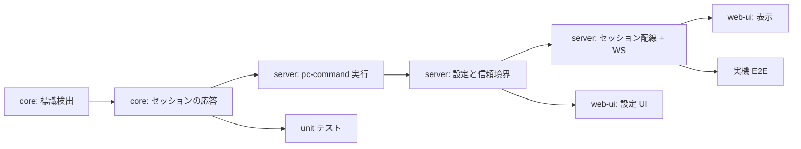

# 計画: STRPCO / STRPCCMD 対応

`spec.md` の実装計画。**subtask には割らない**（1 PR に収まる規模で、core → server → web-ui の
一方向依存が単純なため。protocol「2.8」の過剰分割の禁止）。
`design` 工程も挟まない——spec に構成図・境界の 5 層・型まで書き切っており、
別文書にしても写しになるだけと判断した（autonomous の自律判定）。

## 依存の順序

## タスク

`tasks.md` に分解。要点だけ:

1. **core の検出**が土台。実測レコードを fixture にして先にテストを書く。
2. **core のセッション応答**は「画面イベントを出さない・必ず実行キーを返す」の 2 点が肝。
   ここを外すと実機で固まるか、中間画面がちらつく。
3. **server の実行**は既定 OFF。無効・拒否でも実行キーは返るので、
   「動かないがホストは進む」が正しい振る舞い。
4. **信頼境界**は `printer` の 5 層をなぞる。既存テスト（個人設定に printer を入れると 400）と
   同じ形のテストを `pcCommand` にも用意する。
5. **実機 E2E** は `TESTLIB/PCOTEST`（データ域でコマンドを渡す CL。作成済み）を使う。
   判定は「ホストが進んだ」ではなく**サーバー側でコマンドが実際に走った証拠**（ファイル生成）で行う
   （research D5: ホストは実行を検証しない）。

## リスクと対処

| リスク | 対処 |
|---|---|
| 標識の誤検出で通常画面を壊す | 11 バイト完全一致。非一致なら 1 バイトも消費しない（peek のみ） |
| 実行キーを返し忘れてホストが固まる | 例外・タイムアウトを含め `finally` で必ず送る。実機で無効設定でも確認 |
| 同一ジョブで STRPCO 2 回 → IWS4010 | E2E は 1 セッション 1 回（research D2） |
| 個人設定から実行を有効化される | スキーマに持たせない＋ 5 層のテスト |
| PAUSE(*YES) の長時間コマンドでセッションが止まる | `timeoutMs`（既定 60 秒）で kill して実行キーを返す |
