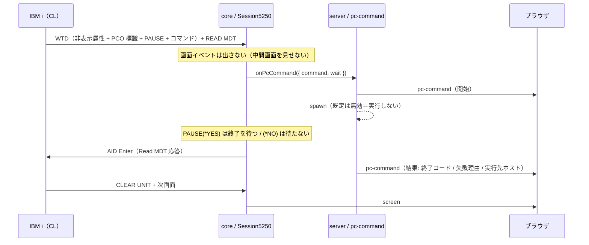

# 仕様: STRPCO / STRPCCMD（PC コマンド）対応

前提は `requirement.md`、実測値は `research.md`（推測を混ぜない）。

---

## 1. 全体像



**STRPCO 側に実装は要らない**（research D2。ホストは何も送らない）。
「STRPCO に対応する」とは「STRPCO を実行した状態で STRPCCMD が期待どおり動く」ことである。

## 2. core（@as400web/core）

### 2.1 検出

`applyWtd`（`protocol/wtd-applier.ts`）のデータ処理ループで、**属性バイトを消費する前**に
次の 11 バイトを覗いて照合する。

| 名前 | バイト列 | 意味 |
|---|---|---|
| `PCO_START` | `27 80 FC D7 C3 D6 40 83 80 A1 80` | STRPCCMD（コマンド実行） |
| `PCO_END` | `27 00 FC D7 C3 D6 40 83 80 82 00` | PC Organizer 終了（**未検証**。research D6） |

- 一致したら、標識の**次の 1 バイト**が PAUSE 標識（`0x81`='a' → 待たない / それ以外 → 待つ）。
- そのあと **0x40 以上のバイトが続く限り**がコマンド本文（EBCDIC → 文字列、末尾の空白を除去）。
  終端は RA などのオーダー（research D4）。**空白詰めに頼らない。**
- **バイト列は今までどおり画面バッファへ書く**（非表示属性なので見えない）。消費して隠すと
  READ SCREEN 応答が ACS と変わる。
- 位置（行 1 桁 1）は判定条件に**しない**（実測は常に (1,1) だが条件を増やす利得が無い）。
- `PCO_END` は本文を解釈せず、種別だけを結果に載せる。

`ApplyResult` に追加:

```ts
/** PC Organizer（STRPCCMD）の標識を検出した */
pcCommand?: { command: string; wait: boolean };
/** PC Organizer 終了の標識を検出した（コマンドは伴わない） */
pcCommandEnd?: boolean;
```

### 2.2 セッションの振る舞い

`ConnectOptions` に追加:

```ts
/**
 * STRPCCMD で届いたコマンドの実行係。**未指定なら実行しない**（core は実行しない）。
 * PAUSE(*YES) のときだけ完了を待ってからホストへ実行キーを返す。
 */
onPcCommand?: (cmd: { command: string; wait: boolean }) => Promise<void> | void;
```

`handleRecord` の分岐（データストリーム適用後）:

1. `pcCommand` / `pcCommandEnd` を検出したら
   - **`screen` イベントを出さない・`pendingAid` を解決しない**（PCO の中間画面を見せない。
     tn5250j も `updateDirty()` を飛ばす）。状態は `locked` のまま。
   - `pcCommand` なら `onPcCommand` を呼ぶ。`wait` が真なら解決を待つ。偽なら待たない。
     ハンドラの例外・拒否は `warn` に落として**握りつぶす**（ホストを固めないため）。
   - 続けて **AID Enter の Read MDT 応答**を送る（`buildReadMdtResponse`）。
     **ハンドラが無い・失敗しても必ず送る**（返さないとホストが待ち続ける。research D5）。
2. そのあとホストが送ってくる CLEAR UNIT ＋ 次画面が通常経路で処理され、
   `pendingAid` はそこで解決する（利用者から見ると「CALL を実行したら次の画面が出た」だけ）。

**タイムアウト**: `wait` が真でハンドラが返らないと実行キーを返せない。上限は**呼び出し側（server）が
持つ**（core にタイマーを二重に持たない）。core 側は `sendAid` の既定タイムアウト（30 秒）で
利用者の待ちが解ける。

## 3. server（@as400web/server）

### 3.1 実行モジュール `pc-command.ts`

```ts
export interface PcCommandConfig {
  /** 実行を許可する。**既定 false**（オプトイン） */
  enabled?: boolean;
  /** PAUSE(*YES) のときの上限（既定 60000ms）。超えたら kill して失敗として報告 */
  timeoutMs?: number;
  /** 作業ディレクトリー */
  cwd?: string;
  /**
   * 許可パターン（正規表現。全体一致）。**指定したらそれ以外は実行しない**。
   * 省略時は「enabled ならすべて実行」。
   */
  allow?: string[];
}

export type PcCommandOutcome =
  | { status: "ran"; exitCode: number | null; durationMs: number }
  | { status: "started" }                       // PAUSE(*NO)：起動だけ確認
  | { status: "disabled" }                      // 設定で無効
  | { status: "denied" }                        // allow に一致しない
  | { status: "failed"; error: string; durationMs: number };
```

- 実行は `child_process.spawn(command, { shell: true })`。Windows は `cmd.exe /c`、
  POSIX は `/bin/sh -c` が使われる（ACS/PCOMM が PC のシェルへ渡すのと同じ意味論）。
- `wait=false` は `unref()` して待たない（GUI アプリの起動が主用途）。
- `wait=true` は終了を待ち、`timeoutMs` で kill する。
- 標準出力・標準エラーは**保持しない**（帰す先が無く、業務データが混ざる恐れがある）。
  終了コードだけを返す。
- 実行内容は `log.info` と監査ログに残す（`command` の全文。実行できたなら既に信頼済み）。

### 3.2 設定（信頼境界）

`serverSessionSchema` **だけ**に `pcCommand` を持たせる（`printer` と同じ 1 層目）。
`personalSessionSchema` は `.strict()` なので、個人設定に書くと **400 で弾かれる**。

```ts
export const pcCommandSchema = z.object({
  enabled: z.boolean().optional(),
  timeoutMs: z.number().int().positive().max(3_600_000).optional(),
  cwd: z.string().optional(),
  allow: z.array(z.string().min(1)).optional()
}).strict();
```

境界の各層（`printer` の 5 層と同じ形）:

| 層 | 場所 | 内容 |
|---|---|---|
| 1 | `config-types.ts` | 個人設定のスキーマに**そもそも無い** |
| 2 | `config-routes.ts` | サーバー設定への書き込みは `canEditServer`（認証オフ or admin） |
| 3 | `config-routes.ts` | `sessionType !== "display"` なら `pcCommand` を落とす |
| 4 | `config-routes.ts` | `allow` の正規表現を保存**前**に検証（壊れた正規表現を永続化しない） |
| 5 | `config-resolver.ts` | `source === "server"` のセッション設定からのみ実行時設定を渡す |

### 3.3 セッションへの配線

- `ResolvedTarget.pcCommand?: PcCommandConfig`（`printerOutput` と同じ位置づけ）。
- `SessionManager.open` の `OpenOptions` に `pcCommand?: PcCommandConfig` を足し、
  `Session5250.connect` の `onPcCommand` を組み立てて渡す。
- 実行結果は `SessionEntry.pcCommands`（直近 20 件）に積み、push フック
  （`onPcCommand`。ws-handler が付ける）で通知する。プリンターの `outputStatuses` と同じ形。

### 3.4 WebSocket

```ts
/** PC コマンド（STRPCCMD）の実行状況。開始時と完了時の 2 回届く */
export interface WsPcCommand {
  type: "pc-command";
  sessionId: string;
  at: number;
  command: string;
  wait: boolean;
  /** 実行先ホスト名（サーバープロセスが動いている機械） */
  hostname: string;
  /** 省略＝開始。あれば結果 */
  outcome?: PcCommandOutcomeMsg;
}
```

`WsOpened` に `pcCommand: boolean`（このセッションで実行が有効か）を足す。

## 4. web-ui

- `SessionState` に `pcCommands: PcCommandEntry[]`（上限 20）と `pcCommandEnabled: boolean` を持つ。
- **操作員メッセージ**（`composables/opMessages.ts` に定数を追加。文体を揃える）:
  - `MSG_PC_COMMAND_RUNNING` = 「PC コマンドを実行しています」
  - `MSG_PC_COMMAND_DONE` = 「PC コマンドを実行しました」
  - `MSG_PC_COMMAND_FAILED` = 「PC コマンドの実行に失敗しました」
  - `MSG_PC_COMMAND_DISABLED` = 「PC コマンドの実行は無効になっています」
  - `MSG_PC_COMMAND_DENIED` = 「PC コマンドが許可リストに一致しません」
- 上記を `SessionState.notice` に載せる（既存の通知枠。StatusBar に出る）。
- `SessionInfo.vue` に「PC コマンド」節を足し、直近の実行を
  `時刻 / コマンド / 待ち / 結果 / 実行先` で並べる。
- **実行先の言い換え**: ブラウザが `localhost` / `127.0.0.1` / `::1` に接続しているなら
  「このPC（<hostname>）」、そうでなければ「サーバー（<hostname>）」と表示する。
  これが requirement の「localhost 実行時はローカル PC / サーバーモード時はサーバー」の可視化にあたる。
- 設定 UI（`ConfigCard.vue`）: display セッションで、かつサーバー設定を編集できるとき**だけ**
  「PC コマンド（STRPCCMD）」の有効化チェック・タイムアウト・許可パターンを出す
  （`printer` 節と同じ露出条件）。

## 5. 受け入れ条件との対応

| requirement の条件 | 満たし方 |
|---|---|
| 標識形式を実測で確定 | `research.md` D1/D3/D4 |
| 検出のユニットテスト | 実測レコードの hex を fixture にした `pc-command-detect.test.ts` |
| 実機で CL が先へ進む | `scripts/verify-pcocmd.mjs`（PAUSE 双方） |
| 無効時に固まらない | 無効でも実行キーは返す（3.1 の `disabled`）＋ 実機で確認 |
| 一般ユーザーが有効化できない | 1〜5 層（3.2）＋ スキーマ拒否のテスト |
| 何をどこで実行したか分かる | `pc-command` メッセージ＋ SessionInfo 表示 |
| README/docs | README の設定表と `docs/` に追記 |

## 6. やらないこと（と理由）

- **PC Organizer の対話モード**（PC 側でコマンドを打つ画面）。ホストは 5250 上で何も送らず
  実装対象が無い（research D2）。既存エミュレーターも実装していない。
- **標準出力のホストへの返送**。5250 側にそのための経路が無い（実測でホストは結果を問い合わせない）。
- **ブラウザ側 PC での実行**。ブラウザからローカルコマンドは起動できない。
- **`ENDPCO`**。この機に存在しない（research D2）。
