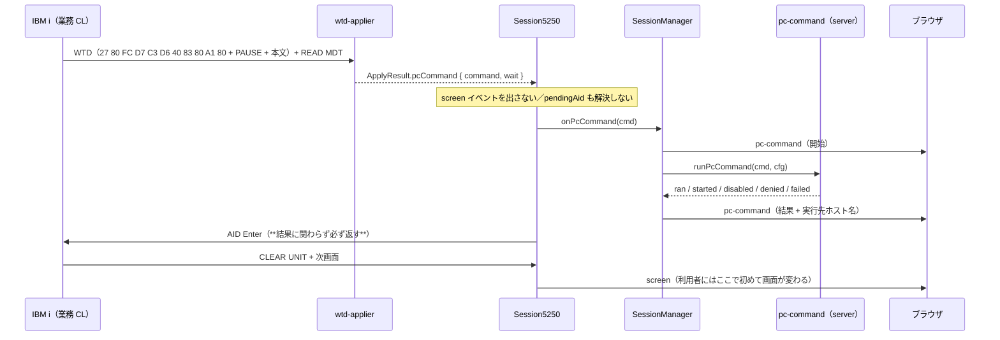

# ウォークスルー（人間レビュー補助）

「PC コマンド（STRPCO / STRPCCMD）対応」の差分を、**読む順**に並べたもの。
先に `research.md`（実測値）を見ると、以下の判断の根拠がすべて揃う。

## 0. 一言でいうと

ホストの `STRPCCMD` は、**5250 の画面データに非表示の標識を埋め込んで**クライアントにコマンドを渡す。
これを検出して**サーバープロセスが動いている機械**で実行し、ホストへ実行キーを返す。既定は無効。

`STRPCO` 側は**実装が要らない**（ホストが何も送らない）。ただし**先に実行していないと
`STRPCCMD` は標識を送ってこない**ので、テスト CL では必ず先に呼ぶ。

## 1. 処理の流れ

## 2. ファイルごとの読みどころ

### core（検出と応答）

| ファイル | 見るところ |
|---|---|
| `packages/core/src/protocol/pc-command.ts` | **新規**。標識 2 種と、PAUSE・本文の切り出し。`readPcCommand` が「0x40 以上が続く限り」で読むのは、終端が空白詰めではなく RA オーダーだから（research D4） |
| `packages/core/src/protocol/wtd-applier.ts` | 属性 0x27 を見たときだけ 11 バイト照合。**1 バイトも消費しない**——標識も本文も画面バッファへは今までどおり書く（消すと READ SCREEN 応答が他クライアントと変わる） |
| `packages/core/src/session/session.ts` | `handleRecord` の新しい分岐。**画面イベントを出さず・`pendingAid` も解決せず・ロックのまま**実行 → 実行キー。`runPcCommand` は例外を握りつぶしてでも必ず応答する |
| `packages/core/src/protocol/bytes.ts` | `peekUpTo`（末尾で例外にしない覗き見）を追加。`peekAt` は末尾で投げるので照合に使えない |

**ここが一番の勘所**: 実行キーを返さないとホストは待ち続け、業務 CL が止まる。
逆にホストは実行されたかを**検証しない**ので、返しさえすれば「成功」になる（research D5）。
だから core は「実行できたか」に関わらず応答する設計になっている。

### server（実行と信頼境界）

| ファイル | 見るところ |
|---|---|
| `packages/server/src/pc-command.ts` | **新規**。`spawn(cmd, { shell: true })`。`PAUSE(*NO)` は待たず `unref`、`PAUSE(*YES)` は `timeoutMs` で kill。標準出力は保持しない（返す先が無い） |
| `packages/server/src/config-types.ts` | `pcCommandSchema` を **`serverSessionSchema` にだけ**足す（信頼境界 1 層目）。個人設定は `.strict()` が弾く |
| `packages/server/src/config-routes.ts` | `dropPrinterForDisplay` を `dropByKind` に一般化（3 層目）。`validatePcCommand` で壊れた正規表現を保存前に弾く（4 層目） |
| `packages/server/src/config-resolver.ts` | 5 層目。`source === "server"` かつ `display` のときだけ実行設定を渡す |
| `packages/server/src/config-store.ts` | 露出は `includeTrusted` のときだけ。**`allow` は配列ごと複製**（レビュー must で直した箇所） |
| `packages/server/src/session-manager.ts` | `handlePcCommand` が開始・完了の 2 イベントを積む。履歴は 20 件 |
| `packages/server/src/ws-handler.ts` / `ws-messages.ts` | `pc-command` メッセージと `WsOpened.pcCommand`（有効かの真偽値） |

**露出だけ他と違う点**: `printer` は API に値を返さないが、`pcCommand` は**編集できる相手には値ごと返す**。
更新はオブジェクトごと置き換えなので、返さないと編集のたびに `allow` が黙って消える
＝**設定の消失が安全側に倒れない**（`enabled` だけ残って許可リストが消えると、むしろ緩くなる）。

### web-ui（見せ方）

| ファイル | 見るところ |
|---|---|
| `composables/opMessages.ts` | 通知文言 5 種。テストは文言リテラルではなくここを参照する規約に従う |
| `session-controller.ts` | `pc-command` を受けて履歴に積み、`notice` に出す |
| `components/SessionInfo.vue` | 履歴一覧。**実行先の言い換え**——ブラウザが loopback に繋いでいれば「このPC（<host>）」、でなければ「サーバー（<host>）」 |
| `components/ConfigCard.vue` | 設定 UI。display × サーバー設定 × 編集権限のときだけ出す。`loadPcCommand` で既存値を読み戻す（読まないと保存で消える） |

## 3. 実機で確かめたこと（`test.md` の要約）

`scripts/verify-pcocmd.mjs` が **28 アサーション全通過**。
判定は「ホストが進んだか」ではなく**サーバー側にファイルが作られたか**。

- `PAUSE(*YES)`／`PAUSE(*NO)` の双方でコマンドが実行される
- **無効（既定）・許可リスト外では実行されないが、CL は先へ進む**（＝ホストを固めない）
- コマンド本文と PAUSE 指定が送信値と一致する（多重検出・取りこぼし無し）

## 4. レビューで見てほしい点

1. **既定 OFF とオプトインの置き場所**が妥当か（`printer` と同じ 5 層でよいか）。
   これは「ホストが送ってきた任意の文字列を OS のシェルに渡す」機能である。
2. **`allow` を正規表現の全体一致にした**判断（前方一致だと後置きが素通りする）。
   緩いパターンを書けば緩い門になる点は運用者の責任、としている。
3. **中間画面を出さない**判断（tn5250j と同じ）。「一瞬変な画面が出る」より良いはずだが、
   デバッグ時に「何も起きていないように見える」側面はある（通知とセッション情報で補っている）。
4. 実行先の言い換えを**ブラウザ側の接続先**（loopback か）で決めている点。
   サーバーが remote address を持ち回るより単純だが、リバースプロキシ越しでは
   「サーバー（<host>）」と出る（実態としては正しい）。
