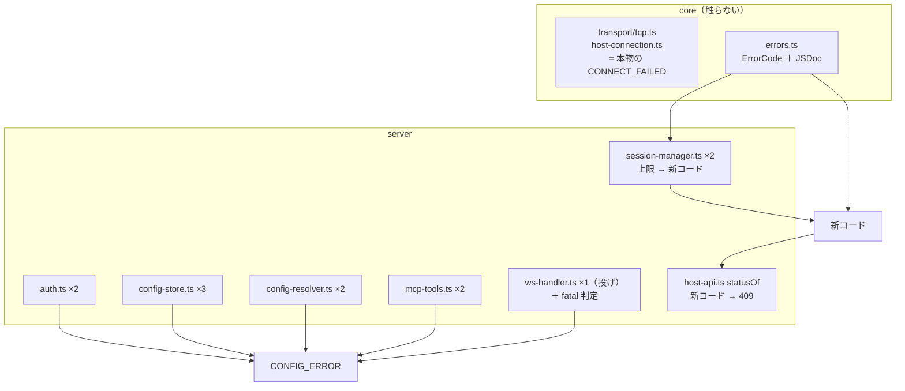

# 調査: `CONNECT_FAILED` の流用箇所と波及

## 調査の問い

- Q1: 流用は正確に何箇所・どこか。それぞれ**本当の意味**は何か
- Q2: core 側の `CONNECT_FAILED` は正しい用途か（対象外にできるか）
- Q3: HTTP ステータス写像はどう変わるか。`statusOf` 以外に写像はあるか
- Q4: 「セッション上限」に使える既存コードはあるか。無ければ足すべきか
- Q5: `fatal` を読んでいるクライアントはあるか（判定を変えて壊れないか）
- Q6: `CONNECT_FAILED` を期待している既存テストはどれか

## 判明した事実

### F1: 流用は **12 箇所**（backlog の「11 箇所」より 1 多い）

`packages/server/src/` の `"CONNECT_FAILED"` は 14 出現。うち 2 つは**判定側**で、
**投げているのは 12 箇所**（すべて接続と無関係）。

| 箇所 | メッセージ | 実際の意味 |
|---|---|---|
| `session-manager.ts:383` | `session limit reached (8)` | **資源の上限**。接続は試みてすらいない |
| `session-manager.ts:554` | 同（プリンター） | 同 |
| `auth.ts:88` | `failed to read users <path>` | 起動時の**設定ファイル読み込み失敗** |
| `auth.ts:92` | `invalid users file: …` | **スキーマ違反** |
| `config-store.ts:391` | `failed to read <what> <path>` | 設定ファイル読み込み失敗 |
| `config-store.ts:398` | `invalid <what>: …` | スキーマ違反 |
| `config-store.ts:413` | `signon.password (平文) は廃止されました` | 設定の書式が古い |
| `config-resolver.ts:83` | `system, session, or host required` | **指定不足**（呼び出し側の入力） |
| `config-resolver.ts:208` | `password not available (env <name> unset)` | 設定の不備（環境変数未設定） |
| `mcp-tools.ts:316` | `system <名> has no signon credentials` | 設定の不備 |
| `mcp-tools.ts:1065` | `host or profile required` | 指定不足 |
| `ws-handler.ts:415` | `host or profile required` | 指定不足 |

判定側の 2 つ:

- `host-api.ts:58` — `statusOf` の写像（`CONFIG_ERROR` と**同じ 400**）
- `ws-handler.ts:122` — `fatal = code === "SESSION_CLOSED" || code === "CONNECT_FAILED"`

### F2: core 側は正しい用途（対象外にできる）

`CONNECT_FAILED` は core に 6 箇所（`transport/tcp.ts` 4 / `transport/host-connection.ts` 2）。
いずれも**ソケットが繋がらなかった／ポートマッパーが引けなかった**ときで、名前どおり。
`describeSocketError()`（`errors.ts`）が `EHOSTUNREACH` 等を日本語の原因説明に変える仕組みも
このコードに紐づいている。**触らない。**

### F3: HTTP ステータスは「上限」以外は変わらない（Q3）

`statusOf`（`host-api.ts:39`）は **`CONFIG_ERROR` と `CONNECT_FAILED` をどちらも 400** に写す。
したがって設定系 10 箇所を `CONFIG_ERROR` に移しても**ステータスは不変**＝API の後方互換が保たれる。

写像は 4 箇所あるが、他の 3 つは `FORBIDDEN`/`SESSION_NOT_FOUND` だけを見て**残りを 400 に落とす**
ので、これも影響なし:

- `host-api.ts:39` `statusOf` → `400 | 403 | 404 | 409 | 502`
- `config-routes.ts:44` `errStatus` → `400 | 403 | 404`
- `admin.ts:34` `errStatus` → `400 | 403 | 404`
- `macro-routes.ts:26` → 同形

**変わるのはセッション上限だけ**（400 → 409 にするなら `statusOf` に足す。戻り型に 409 は既にある）。

### F4: 「セッション上限」に流用できる既存コードは無い（Q4）

| 候補 | 使えるか |
|---|---|
| `SESSION_REJECTED` | **不可**。core の `printer-session.ts:205` が「**ホストが**起動応答で拒否した（8925 等）」に使っている。こちらは自分側の上限 |
| `RESOURCE_BUSY` | **不可**。IFS の rc=1/32/33（**ホスト上の対象が他に掴まれている**）専用で、`ifsApi.ts:52` が「他の処理が対象を使用中です」という文言に写している。混ぜると UI が嘘を言う |
| `CONFIG_ERROR` | 不適。`--max-sessions` の設定は正しく、**今の状態**の問題 |

→ **新しいコードが要る。** 既存を消さずに足す形なら外部契約は壊れない（requirement の非機能）。

### F5: `fatal` を読んでいるクライアントは**無い**（Q5）

`fatal` の出現は `ws-messages.ts:154`（型宣言）と `ws-handler.ts:122`（判定）と
`sendError` の引数だけ。**`packages/web-ui/src/` には 1 件も無い**（grep 0 件）。
web-ui の `error` 処理は `session-controller.ts:189` / `:283` で、
**`sessionId` が未確定なら open の Promise を reject する**という自前の判断をしている。

つまり `fatal` は**誰も読んでいない助言**。しかも判定がコードの列挙なので、
今回のような改名で意味が黙って変わる。**「セッションが無い／失われた」という状態で決める**形にすれば、
コード名の変更に引きずられない（この作業そのものが、列挙で意味を持たせる危険の実例）。

### F6: `CONNECT_FAILED` を期待する既存テストは 4 件（Q6）

| テスト | 期待の中身 | 今回の扱い |
|---|---|---|
| `core/test/transport.test.ts:43` | 接続拒否 | **正しい用途**。変更なし |
| `core/test/hostserver-port-mapper.test.ts:100` | 接続できない | 同 |
| `server/test/session-manager.test.ts:29` | **上限超過** | **新コードへ書き換える** |
| `server/test/host-ifs.test.ts:123` | `["CONNECT_FAILED", 400]` の写像表 | 写像自体は残すので通る |

### F7: `ErrorCode` の JSDoc は**後半だけ**にある

**実測 25 種**（backlog の「21 種」は 2026-07-19 時点の数で、その後増えていた）。
意味が書かれているのは `HOST_SERVER_UNSUPPORTED` 以降の **9 種**（`errors.ts:19-58`）だけで、
**前半 16 種（`CONNECT_FAILED` / `CONFIG_ERROR` / `PROTOCOL_ERROR` 等）はコメントが無い**。
今回の腐り方は「意味が書かれていないコードに、近そうなものを使った」結果でもある。

## 影響範囲

## 実現性 / リスク

- **実現可能。** 設定系 10 箇所は HTTP ステータスが変わらないので機械的に移せる
- **リスク 1: 上限のステータス変更（400 → 409）**。MCP・ブラウザは本文の文言を見せるだけなので
  実害は見当たらないが、`statusOf` のテストと写像表を揃える
- **リスク 2: `fatal` の判定変更**。読んでいるクライアントは無い（F5）ので実害なし。
  ただし「`open` 前の `key`」など分類が変わるケースがあるのでテストで固定する
- **リスク 3: 意味を移しただけで JSDoc を書かないと同じことが起きる**。
  F7 のとおり原因の半分は「意味が書かれていない」ことなので、JSDoc を必須にする

## spec への申し送り

1. **新コードを 1 つ足す**（F4）。名前は「セッションの上限」を指すもの。`statusOf` は **409**
   （時間や対象を変えれば通る＝既存の `ALREADY_EXISTS`/`RESOURCE_BUSY`/`NOT_EMPTY` と同じ棚）
2. **設定系 10 箇所は `CONFIG_ERROR`**（F3。ステータス不変）。「指定不足」も設定の不備として扱う
3. **`fatal` は状態で決める**（F5）。コードの列挙をやめる
4. **`ErrorCode` の全種に用途の JSDoc を書く**（F7）。今回の腐りの原因の半分
5. core は触らない（F2）。テストも 2 件はそのまま通る（F6）
