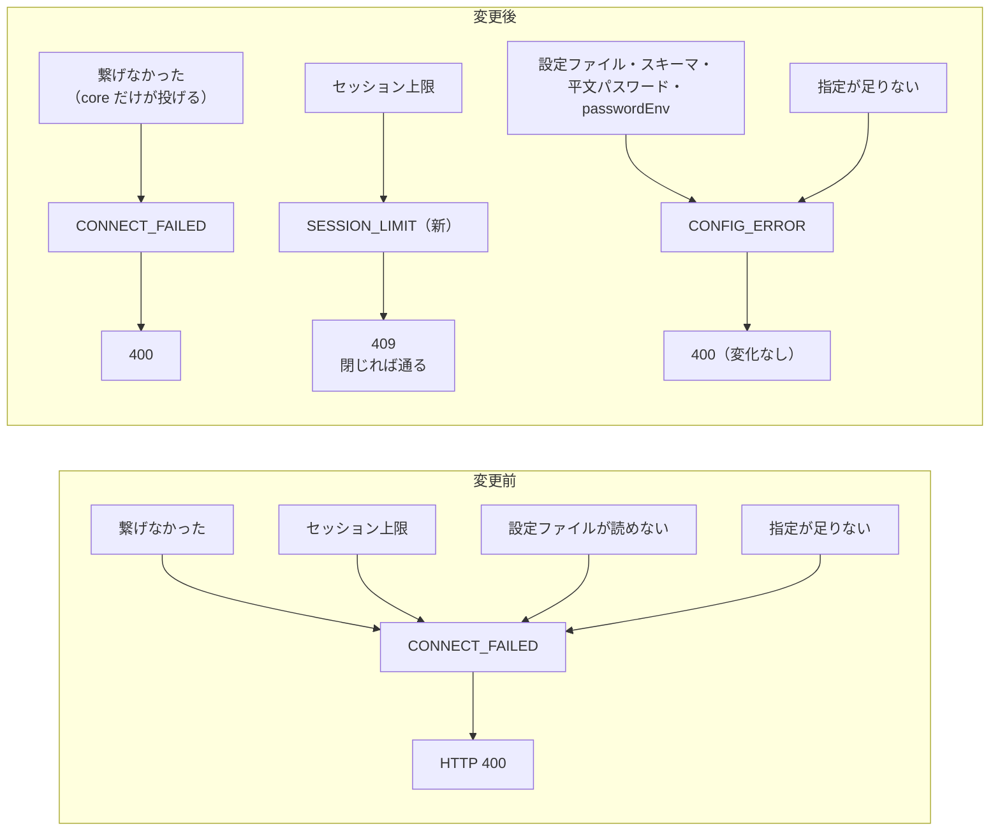

# レビューガイド: `CONNECT_FAILED` の意味を取り戻す

## 変更概要 / 目的

`CONNECT_FAILED`（＝IBM i へ繋げなかった）が server 側で**接続と無関係な 12 箇所**に流用されていた
——「セッション上限に達した」「設定ファイルが読めない」「接続先の指定が足りない」。
受け取った側が**ホストが落ちているのか、こちらの設定が悪いのか**を区別できない状態だった。

`statusOf` が「502 は上流との通信失敗に限る」と決めているのと同じ思想で、
**コード名そのものにも同じ規律を戻す**。

## 特に見てほしい所

### 1. 移し先は 2 つだけ。新設は 1 つ（decisions D1・D3）

| 移し先 | 対象 | HTTP |
|---|---|---|
| `CONFIG_ERROR`（既存） | 10 箇所（設定ファイル・スキーマ・平文パスワード・`passwordEnv`・資格情報・**指定不足**） | 400（**現状と同じ＝後方互換**） |
| `SESSION_LIMIT`（新設） | 2 箇所（表示・プリンターの上限） | **400 → 409** |

**「指定不足」に専用コードを作りませんでした**——利用者の対処が同じ（こちら側の指定を直す）で
ステータスも同じ 400 になるため、*区別できても誰も使わない区別*が増えるだけです（D3）。

**`RESOURCE_BUSY` の流用も退けました**。あちらは**ホスト上の対象**が掴まれている状態で、
`ifsApi.ts:52` が「他の処理が対象を使用中です」と案内します。混ぜると UI が嘘を言います（D1）。

### 2. 409 を選んだ理由（decisions D2）

`statusOf` には既に **409 の棚**があります（`ALREADY_EXISTS` / `RESOURCE_BUSY` / `NOT_EMPTY`）。
共通するのは「**時間や対象を変えれば通りうる**ので 502 に落とさない」。
セッション上限も**どれか閉じれば通る**ので同じ棚です。400 は「要求が間違っている」ですが、要求は正しい。
429/503 は `statusOf` の戻り型を広げるので採りませんでした。

### 3. 腐りの原因を 2 つ塞いだ（ここが本体）

移し替えだけでは同じことがまた起きます。

- **`ErrorCode` の前半 16 種にコメントが無かった**（実測 25 種のうち意味が書かれていたのは後半 9 種だけ）。
  意味が書かれていないコードには、呼び出し側が「近そうなもの」を選びます。
  **全 26 種に用途＋似ているコードとの使い分け**を書きました（decisions D5）
- **`fatal` 判定がエラーコードの列挙だった**（`ws-handler.ts:122`）。
  コード名を変えた瞬間に意味が黙って変わる形で、実際この作業で「開けなかった」が
  致命的でなくなるところでした。**状態（`this.sessionId === undefined`）で決める**ようにしました（D4）

## 処理フロー

## 主要な変更箇所

- `packages/core/src/errors.ts:2` — `ErrorCode` の JSDoc。**非コメントの差分は
  `+ | "SESSION_LIMIT"` の 1 行だけ**（既存メンバーは消していない）
- `packages/core/src/errors.ts:47` — `SESSION_LIMIT` の定義。
  `CONNECT_FAILED` と `RESOURCE_BUSY` との**使い分け**を書いてある
- `packages/server/src/host-api.ts:59` — `statusOf` の 409 の棚に追加（理由をコメントに）
- `packages/server/src/session-manager.ts:385` — 表示セッションの上限。
  「繋ぎに行く前に自分側で断っている」をコメントに
- `packages/server/src/ws-handler.ts:128` — `fatal` を状態判定へ。**なぜ列挙をやめたか**を書いてある
- `packages/server/test/error-code-semantics.test.ts` — **意味ごとの回帰資産**。
  末尾の不変条件は `packages/server/src` を**丸ごと走査**して throw が 0 件であることを見る
  （ファイル列挙だと新しいファイルが素通りする）

## リスク / 確認してほしい点

- **HTTP ステータスが 1 箇所変わります**（セッション上限 400 → 409）。理由は D2。
  MCP・ブラウザは本文の文言を見せるだけなので実害は見当たりませんが、
  外部の HTTP クライアントが 400 で分岐していれば影響します
- **`fatal` の分類が 1 ケース変わります**（`open` 前の `key` が false → true）。
  読んでいるクライアントは無く（`packages/web-ui/src` に 0 件）、
  「この接続にセッションが無い」は事実なので変更後のほうが正しいと判断しました
- **レビューで見つけた must**: `README.md` の「`host` も無ければ `CONNECT_FAILED`」という
  記述が嘘になっていました（修正済み）。**利用者向けドキュメントにコード名が書かれている箇所**は
  ここだけでしたが、同種の記述が今後増えると同じ穴が空きます
- **空振り検証 14/14** 全て検出。「上限を `CONNECT_FAILED` に戻す」がプリンター側でも落ちるので、
  表示だけ直して満足する形にはなっていません
- **実機スモークテスト 11/11**（実機）。この変更は接続のたびに通る経路
  （`config-resolver` / `auth` / `config-store`）に触るので回しました。1 回目の NG は
  検証スクリプト側の作りの問題（サインオン入力を待機ループの外で 1 回だけ試していた）で、これも直しました
