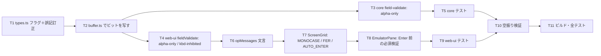

# 計画: FFW の挙動ビットに従う

## subtask 分割の判定: 分割しない

core のフラグ公開（T1–T3）と web-ui の作法（T4–T8）に分かれるが、
**core だけ入れても利用者から見た振る舞いは変わらない**＝単独デリバリ不可。1 PR に収まる。

## 実装方針

**core → web-ui の順**（`Field` のフラグが web-ui の入力になるので、逆順だと型が無い）。
`ScreenGrid.vue` は大きく壊したときの影響が読みにくいので、純ロジック（core・composable）を
テストで固めてから触る。

**T2 が関門。** `Field` の組み立ては 5 つの既存フラグと同じ場所なので、
ここを壊すと `adjust` / `signedNumeric` / `digitsOnly` の既存テストが落ちる。

## 作業順序と依存関係

1. **T1** `types.ts` に 6 つの任意フラグを足し、`digitsOnly` の JSDoc の誤記（0x0600 → 0x0500）を直す（依存: なし）
2. **T2** `buffer.ts` の snapshot 組み立てでビットを写す（依存: T1）— **関門**
3. **T3** core `field-validate.ts` に alpha-only を足す（依存: T1）
   - **`keyboardInhibited` は core では弾かない**（spec B5。ペースト・マクロ・MCP を塞がないため）
4. **T4** web-ui `fieldValidate.ts` の `rejectReason` に `alpha-only` / `kbd-inhibited`（依存: T1）
5. **T5** core テスト（`field-ffw-bits.test.ts`）（依存: T2, T3）
6. **T6** `opMessages.ts` に 4 つの文言（依存: T4）
7. **T7** `ScreenGrid.vue`（依存: T1, T6）
   - `inputChar(ch, f)` へ変更（**呼び出し 7 か所すべてに field を渡す**）
   - `advanceIfFull` に FER / AUTO_ENTER の分岐
   - `fieldExitKey` に AUTO_ENTER の分岐
8. **T8** `EmulatorPane.vue` の `onAid` に Enter 前の必須検証（依存: T7）
9. **T9** web-ui テスト（依存: T7, T8）
10. **T10** 空振り検証（依存: T5, T9）
11. **T11** ビルド（`vue-tsc` 込み）・全テスト（依存: 全部）

## リスク / 留意点

| # | リスク | 対応 |
|---|---|---|
| R1 | **MONOCASE がほぼ全欄に立つ**（実測）ため、影響が大きい。今まで小文字が通っていた画面で通らなくなる | 実機の作法どおり＝これが正しい。ただし**`CHECK(LC)` 欄では小文字が残る**ことをテストで固定し、「全部大文字になる」実装との違いを守る |
| R2 | `inputChar` の呼び出しが 7 か所。1 か所でも field を渡し忘れると経路ごとに挙動が食い違う | 引数を**必須**にして型で強制する（省略可能にしない） |
| R3 | 必須検証で **F3 が塞がる**と画面から出られない | spec 方針 3 で **Enter 限定**。テストで「F3 は止めない」を固定する |
| R4 | `keyboardInhibited` を core の送信時検証に入れるとペースト・マクロ・MCP が塞がる | spec B5 のとおり **core では弾かない**。理由をコメントに残す |
| R5 | mandatory-fill の「満杯」判定を JS 文字数で見ると DBCS 欄がずれる | `dbcsByteLength` を使う。DBCS 欄のテストを置く |
| R6 | katakana を「制限」と誤解して後から実装される | **何もしない**ことをコメントとテストで固定する（research F2 が根拠） |
| R7 | AUTO_ENTER が満杯のたびに Enter を送り、無限ループのように見える | 送信後は新画面が来る。FER と同時なら FER 優先（spec B3） |

## テスト方針

- **core（`packages/core/test/field-ffw-bits.test.ts`）**
  - FFW → `Field` のフラグ写しを**実測値で**固定する（research 2.2 の 9 パターン）:
    `0x4020`→monocase / `0x4000`→なし / `0x4120`→alphaOnly+monocase / `0x4400`→どちらも無し /
    `0x4500`→digitsOnly / `0x4600`→keyboardInhibited / `0x40a0`→autoEnter+monocase /
    `0x4060`→fieldExitRequired / `0x4028`→mandatoryEnter
  - `validateFieldContent`: alpha-only が数字を弾き `,` `.` `-` 空白を通す。
    **キーボード入力不可の欄は core では弾かない**
- **web-ui**
  - `fieldValidate`: `alpha-only` / `kbd-inhibited` の `rejectReason`
  - `ffw-behavior.test.ts`（新規・純ロジック）: 必須検証の判定関数を
    composable に切り出して単体テストする（`ScreenGrid.vue` に埋めない）
  - `ScreenGrid` のコンポーネントテスト: MONOCASE 欄で大文字化・`CHECK(LC)` 欄で小文字が残る /
    FER 欄で `field-full` が出ない / AUTO_ENTER 欄で `aid=Enter` が出る
  - `EmulatorPane`: Enter で止まる・F3 では止まらない
- **既存資産**: `field-digits-only.test.ts` / `write-extent.test.ts` / `pane-nav.test.ts` /
  `field-full-advance.test.ts` / `field-adjust` 系をそのまま通す
- **空振り検証**: 判定を外すと落ちることを確認する（とくに
  「`CHECK(LC)` 欄で小文字が残る」「F3 は止めない」「mandatory-fill は空を通す」）
- **実行**: web-ui は**パッケージ dir から**（AGENTS.md）。ビルドは `vue-tsc` 込み
