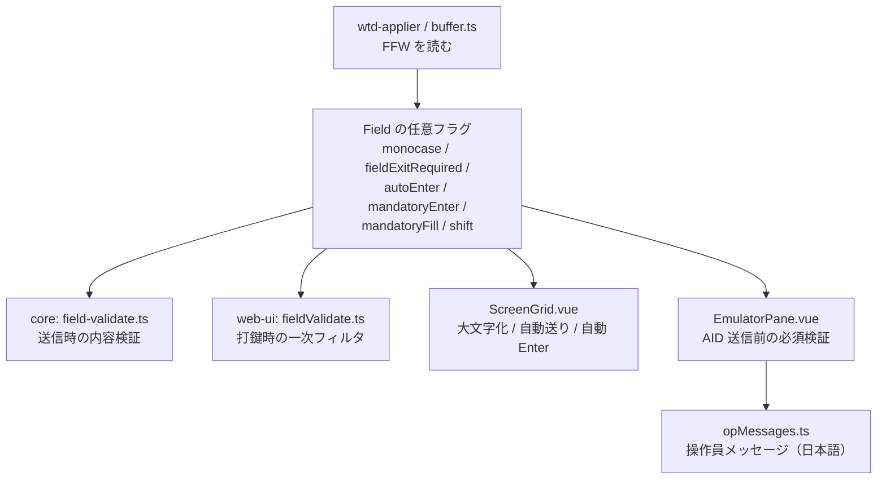

# 調査: FFW の挙動ビット

requirement の未確定（U1〜U5）を潰す。**原典の直読**（GNU tn5250 の C 実装・tn5250j の Java 実装）と
**実機の実測**の 2 本立て（AGENTS.md「既存プロトコル実装の移植」／前作 #205 と同じやり方）。

## 調査の問い

- **U1**: `SHIFT_ALPHA_ONLY` / `SHIFT_KATAKANA` / `SHIFT_IO` の正しい扱い
- **U2**: MONOCASE は実機でどれくらい一般的か。`uppercaseInput` を置き換える影響の大きさ
- **U3**: `MANDATORY_ENTER` / `MANDATORY_FILL` の検証は誰の仕事か。どの AID で行うか
- **U4**: `AUTO_ENTER` の発火契機。そもそも何の DDS 指定で立つのか
- **U5**: 検証で止めたときのキーボードロックの扱い

## 1. 原典（参照実装のソースを直読）

取得元（作業ディレクトリへ落としただけ。リポジトリには取り込まない）:

- GNU tn5250 `lib5250/field.h` `field.c` `display.c`
  （<https://raw.githubusercontent.com/tn5250/tn5250/master/lib5250/>）
- tn5250j `Screen5250.java` `ScreenField.java`
  （<https://raw.githubusercontent.com/tn5250j/tn5250j/master/src/org/tn5250j/framework/tn5250/>）

### F1: ビット定義は `constants.ts` と完全一致（`field.h:102-128`）

`SHIFT_DIGITS_ONLY = 0x0500` / `SHIFT_IO = 0x0600`。
**`types.ts` の `digitsOnly` の説明が「0x0600」なのは誤記**（requirement の訂正対象）。
tn5250 は 0x0600 を `MAG_READER`（磁気ストライプ読み取り装置）と呼ぶ。

### F2: シフト種別の入力検証 — **2 実装が完全に一致**（U1 の答え）

GNU tn5250 `tn5250_field_valid_char`（`field.c:394-445`）と
tn5250j の `switch (getCurrentFieldShift())`（`Screen5250.java:1366-1400`）。

| shift | tn5250 C | tn5250j | 結論 |
|---|---|---|---|
| `0x0000` alpha | 無条件に許可 | 許可 | 制限なし |
| `0x0100` **alpha-only** | `isalpha` `,` `.` `-` `空白` のみ | `isLetter` `,` `-` `.` `空白` のみ | **数字を弾く** |
| `0x0200` num-shift | 無条件に許可 | 許可 | 制限なし（キーボードのシフト状態） |
| `0x0300` num-only | 数字 `,` `.` `-` `空白` | 数字 `+` `,` `-` `.` `空白` | 既存実装どおり |
| `0x0400` **katakana** | `"KATAKANA not implemented"` → **許可** | case 0/2/4 をまとめて許可 | **制限ではない**（キーボードのシフト状態） |
| `0x0500` digits-only | 数字のみ | 数字のみ | 既存実装どおり |
| `0x0600` **io / mag-reader** | **必ず拒否**（`DATA_DISALLOWED`） | case が無い＝`updateField` が false のまま**捨てられる** | **キーボードからは入力不可** |
| `0x0700` signed-num | **数字のみ**（`+`/`-` は Field+/Field− キー扱い） | 数字 `+` `-`（符号桁の規則つき） | 下の F7 参照 |

→ **U1 の答え**: `ALPHA_ONLY` は制限、`KATAKANA` は**制限ではない**、`IO` は**入力不可**。
2 つの独立実装が一致しているので推測の余地が無い。

### F3: MONOCASE の適用は「打鍵 1 文字ごとに大文字化」（`display.c:923-925`）

```c
/* Upcase the character if this is a monocase field. */
if (tn5250_field_is_monocase(field) && isalpha(ch)) { ch = toupper(ch); }
```

`tn5250_display_interactive_addch` の冒頭。**保護欄チェックの直後・型検証より前**。
`isalpha` なので **ASCII 英字だけ**（全角には触らない）。
tn5250j は `ScreenField#isToUpper()` を**定義しているが一度も呼んでいない**＝未実装。

### F4: FER の挙動（`display.c:1032-1040`）

```c
if (end_of_field && !is_wordwrap(field)) {
    if (tn5250_field_is_fer(field)) {
        indicator_set(IND_FER);                 /* 自動送りしない・ADJUST もしない */
        set_cursor(field_end_row, field_end_col);
    } else { field_adjust(...); if (auto_enter) do_aidkey(ENTER); ... }
}
```

FER 標識が立っている間は**データキーを含むほとんどのキーが抑止**され（`display.c:1336-1370`）、
矢印・Field Exit・Field±・Tab・BackTab・Enter・Reset・Help・F1–F24 だけが通って標識を落とす。

### F5: AUTO_ENTER の発火契機（`display.c` の 5 か所すべて）

`1042`（打鍵で満杯）/ `1637`（Field Exit）/ `1687`（Field+）/ `1744`（Field−）/ `1822`（Dup）。
**どれも「ADJUST を適用したあと、次欄へ移る代わりに Enter を送って return」**という同じ形。
tn5250j も同じ（`Screen5250.java:1435` で満杯時にフラグを立て `:1459` で `sendAid(AID_ENTER)`）。

→ **U4 の答え**: 発火は「満杯になったとき」と「欄を出る操作のとき」。**最終欄かどうかは無関係。**

### F6: MANDATORY の検証は**参照実装にほぼ無い**（U3 の答えの半分）

- **GNU tn5250**: `MANDATORY`（0x0008）の検証は**どこにも無い**（`display.c`/`session.c` を grep して 0 件）。
  `MANDATORY_FILL`（0x0007）も ADJUST の switch で `NO_ADJUST` と同じく何もしない
- **tn5250j**: `isMandatoryEnter()` の検証は **`fieldExit()` の中だけ**
  （`Screen5250.java:1541`。空なら `displayError(ERR_MANDITORY_ENTER=0x21)`）。
  `MANDATORY_FILL` は `setManditoryEntered()` でフラグを立てるが、**そのフラグを読む場所が無い**

しかも tn5250j の `displayError()` は `sessionVT.sendNegResponse2(ec)`＝
**ホストへ否定応答を返してホストにメッセージを出させる**（`Screen5250.java:1832-1838`）。
本 PJ は操作員メッセージを**クライアント側で日本語表示**する方針（`opMessages.ts`）なので、この経路は採らない。

→ **原典からは「AID 送信時にどう検証すべきか」の答えが出ない。実機で切り分ける（下の 2.1）。**

### F7: signed-num の許容集合が既存実装と違う（本 work の対象外だが記録する）

tn5250 C は signed-num を**数字のみ**とし、`+` / `-` の打鍵は Field+ / Field− へ横流しする
（`display.c:927-940` の `sign_key_hack`）。本 PJ は Field± が未実装なので、
`field-validate.ts` の `/^[0-9.,+-]*$/` から `-` を外すと**負値がまったく打てなくなる**。
→ **触らない。** backlog の「Field− / Field+」「符号付き数値の送信表現」と一体で判断する。

## 2. 実機（IBM i 7.5 / CCSID 939）

### 2.1 実験 A: **ホストは CHECK(ME) / CHECK(MF) を検証しない**（U3 の答え）

前作の `TESTLIB/ADJPGM` をそのまま使い、**CHECK(ME) 欄を空・CHECK(MF) 欄を部分入力（6 桁中 2 桁）**の
まま Enter を送った（`scripts/research-ffw.mjs` の実験 A）。

```
CHECK(MF) A      12        ->  [12    ]      ← 部分入力がそのまま通った
CHECK(ME) A                ->  [      ]      ← 空のまま通った
keyboardLocked=false
```

RPG が値を写した＝**ホストは 1 つも弾かなかった**。

→ **端末が検証しなければ誰も検証しない。** この 2 つのビットは端末側に実装しないと
DDS に `CHECK(ME)` と書いたアプリの意図が完全に無視される。

### 2.2 実験 B: DDS のシフト種別・`CHECK(LC)`・`CHECK(ER)` → FFW（U2 と U4 の答え）

`scripts/build-ffwtest.mjs` で `TESTLIB/FFWDSPF` + `FFWPGM` を作り、
`scripts/research-ffw.mjs` が**生データストリームを core を通さず独立にパース**して採取した。

```
in# 1 A plain          FFW=0x4020  shift=alpha       MONOCASE
in# 2 A CHECK(LC)      FFW=0x4000  shift=alpha
in# 3 X alpha-only     FFW=0x4120  shift=alpha-only  MONOCASE
in# 4 N num-shift      FFW=0x4220  shift=num-shift   MONOCASE
in# 5 W katakana       FFW=0x4400  shift=katakana
in# 6 D digits-only    FFW=0x4500  shift=digits-only
in# 7 I inhibit-kbd    FFW=0x4600  shift=io
in# 8 M num-only-char  FFW=0x4300  shift=num-only
in# 9 A CHECK(ER)      FFW=0x40a0  shift=alpha       AUTO_ENTER MONOCASE
```

読み取れる事実:

1. **DDS 35 桁のキーボード・シフトがそのまま FFW の 0x0700 になる。**
   `X`→0x0100 / `W`→0x0400 / `D`→**0x0500** / `I`→**0x0600** / `M`→0x0300。
   `constants.ts` の値が正しく、**`types.ts` の「digits-only（0x0600）」は誤記**だと確定した
2. **`CHECK(ER)` が AUTO_ENTER（0x0080）を立てる DDS キーワード**だった（U4 の残り）。
   単独コンパイルでも通る（下の 2.3）
3. **MONOCASE は「英字を打てるシフト」にだけ既定で立つ**——alpha / alpha-only / num-shift には立ち、
   katakana / digits-only / io / num-only には立たない
4. **`CHECK(LC)` を書くと MONOCASE が落ちる**（0x4020 → 0x4000）。
   つまり**素の英数字欄に MONOCASE が立つのは「LC を書いていないから」**で、
   前作 2.2.1 の見立てが実測で裏付けられた

→ **U2 の答え**: MONOCASE は**特殊な DDS ではなく既定**。実機の英数字入力欄はほぼ全部これ。

### 2.3 副産物: `Y`（num-only）は文字欄として書けない

シフト種別を**1 件ずつ単独でコンパイル**して切り分けたところ、`Y` だけが
`DDS のエラーが，指定の GENLVL では認められない。` で落ちた（小数位が必須＝数値欄専用）。
残る 9 件（`A` / `A CHECK(LC)` / `X` / `N` / `W` / `D` / `I` / `M` / `A CHECK(ER)`）は全部通った。

**最初はまとめて 1 回だけコンパイルして落ち、「どれが原因か」が分からなかった。**
1 件ずつに割ったことで `Y` だけの問題と分かり、かつ `CHECK(ER)` が有効だという収穫まで出た。
（この切り分けは `build-ffwtest.mjs` にそのまま残してある）

## 3. 影響範囲



- `packages/core/src/screen/types.ts`: `Field` に任意フラグを追加・`digitsOnly` の誤記訂正
- `packages/core/src/screen/buffer.ts`: snapshot 組み立てでビットを写す
- `packages/core/src/screen/field-validate.ts`: alpha-only / io を追加
- `packages/web-ui/src/composables/fieldValidate.ts`: 同上（打鍵時）＋ `RejectReason` 追加
- `packages/web-ui/src/composables/opMessages.ts`: 操作員メッセージ追加
- `packages/web-ui/src/components/ScreenGrid.vue`: MONOCASE・FER・AUTO_ENTER
- `packages/web-ui/src/components/EmulatorPane.vue`: AID 送信前の必須検証・`uppercaseInput` の受け渡し

## 4. spec への申し送り

| 未確定 | 結論 | 根拠 |
|---|---|---|
| U1 alpha-only | **数字を弾く**（英字・`,`・`.`・`-`・空白のみ） | F2（2 実装一致） |
| U1 katakana | **制限しない**（キーボードのシフト状態） | F2（2 実装一致） |
| U1 io | **キーボードからは入力不可** | F2（2 実装一致）＋ DDS の `I` が "Inhibit keyboard entry" |
| U2 MONOCASE の一般性 | **既定で立つ**（`CHECK(LC)` を書いた欄だけ落ちる） | 2.2 の 2・4 |
| U3 検証の担い手 | **端末しかいない**（ホストは検証しない） | 2.1 の実測 |
| U3 どの AID か | **原典に答えが無い** → spec で決める（下の申し送り 3） | F6 |
| U4 AUTO_ENTER | **満杯時と欄を出る操作時**。DDS では `CHECK(ER)` | F5・2.2 の 2 |
| U5 キーボードロック | 既存方針（メッセージを出しても入力は止めない）に揃える | `opMessages.ts` の注記 |

そのうえで spec で決めるべきこと:

1. **`uppercaseInput`（CCSID 930/5026 の全欄大文字化）は残す。**
   MONOCASE の代用ではなく**別の理由**だと分かったため——カタカナ系コードページは
   SBCS 表に英小文字を持たず、大文字化しないと `field-validate.ts` の
   「マップ不能文字」検証で送信できなくなる。**2 つは併存させ、どちらかが真なら大文字化**する。
   requirement は「CCSID による代用をやめる」と書いたが、**やめるのは「MONOCASE の代わりに使うこと」**であって
   カタカナ系の大文字化そのものではない
2. **MONOCASE は ASCII 英字だけ**を対象にする（F3 の `isalpha`）。全角には触らない。
   既存 `ScreenGrid.vue:124` の `ch >= "a" && ch <= "z"` がそのまま使える
3. **必須検証（ME / MF）を走らせる AID は Enter だけにする。**
   機能キーでも検証すると**必須欄が空の画面から F3 で抜けられなくなる**（利用者が詰む）。
   参照実装はそもそも AID 時検証を持たない（F6）ので、弱い側に倒しても原典から離れない。
   `decisions.md` に逸脱として記録する
4. **FER は「自動送りをしない」だけにする。** 原典の FER 標識（他キーを抑止する状態機械）までは作らない。
   本実装は欄が満杯なら以降の打鍵が入らない（`fieldEdit.ts:41`）ので、
   自動送りを止めるだけで「Field Exit か Tab で出る」という実機の操作感になる
5. **AUTO_ENTER は満杯時と Field Exit 時の両方**（F5）。Field± / Dup は未実装なので対象外
