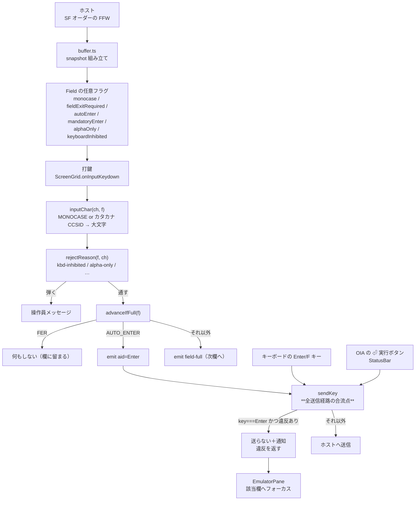

# レビューガイド: FFW の挙動ビットに従う

## 変更概要 / 目的

5250 の FFW（Field Format Word）は「この欄をどう扱え」という**ホストからの指示**だが、
`constants.ts` に定義があるだけで**一度も読まれていないビットが 6 群**残っていた。
それを読み、実機と同じ作法で振る舞うようにする。

利用者から見える差は 5 つ。

| ビット | これまで | これから |
|---|---|---|
| `MONOCASE` 0x0020 | CCSID 930/5026 のときだけ**全欄**を大文字化 | **欄単位**で大文字化（`CHECK(LC)` 欄は小文字が残る） |
| `FIELD_EXIT_REQUIRED` 0x0040 | 満杯なら必ず次欄へ自動送り | FER 欄では送らない |
| `AUTO_ENTER` 0x0080 | 次欄へ送るだけ | 満杯・Field Exit で **Enter を自動送信** |
| `MANDATORY_ENTER` 0x0008 / `MANDATORY_FILL` 0x0007 | 素通り | **Enter を止めて操作員メッセージ** |
| shift `ALPHA_ONLY` 0x0100 / `IO` 0x0600 | 素通り | 英字専用は数字を弾き、`I` は打鍵不可 |

## 重要ポイント（特に見てほしい所）

### 1. 実測でしか出てこなかった 3 つの事実

推測ではなく、**実機に DDS を作って FFW の実バイトを採った**結果です
（`research.md` 2 章。スクリプトは `scripts/build-ffwtest.mjs` / `research-ffw.mjs`）。

- **MONOCASE は既定で立つ。** DDS の文字欄は `CHECK(LC)` を書かない限り載る
  （素の `6A` → `0x4020` / `CHECK(LC)` 付き → `0x4000`）。**特殊な指定ではなく普通の画面の話**
- **`CHECK(ER)` が AUTO_ENTER を立てる DDS キーワード**（`0x40a0`）。原典にも当たりが無く、
  シフト種別を 1 件ずつ単独コンパイルして切り分けて見つけた
- **ホストは `CHECK(ME)` / `CHECK(MF)` を検証しない。** 空・部分入力のまま Enter を送っても
  RPG がそのまま受け取った。**端末が止めなければ誰も止めない**

### 2. `uppercaseInput` を消さず MONOCASE と併存させた（`decisions.md` D2）

requirement は「CCSID による代用をやめる」と書いていましたが、調査で**別々の理由**だと分かりました。
カタカナ系コードページは SBCS 表に英小文字を持たないため、大文字化をやめると
`CHECK(LC)` 欄で小文字が打ててしまい **core の「マップ不能文字」検証で送信できなくなります**。
→ `packages/web-ui/src/components/ScreenGrid.vue:135` の `inputChar` に両方の根拠を表で残しました。

### 3. 必須検証は **Enter だけ**（`decisions.md` D1）

機能キーでも止めると、**必須欄が空の画面から F3 で抜けられなくなります**。
ホストが検証しない以上こちらが止めれば本当に止まるので、事故の代償が大きい。
テスト「**F3 は止めない**」でこの判断を固定しています。

### 4. 判定の置き場所を途中で move した（`decisions.md` D7）— **ここが一番の学び**

最初 `EmulatorPane.onAid` に置いたところ、**OIA の「⏎ 実行」ボタンだけ素通り**していました
（`StatusBar.vue:62` は `onAid` を通らず `sendKey` を直に呼ぶ）。
**単体テスト 27 件は全部緑のまま**で、実機ブラウザ検証で初めて出ました。
判定を `sendKey`（全送信経路の合流点）へ移し、その経路の回帰テストを足しています。

## 処理フロー

## 主要な変更箇所

- `packages/core/src/screen/types.ts:56` — `Field` に任意フラグ 6 つ。
  あわせて `digitsOnly` の JSDoc の誤記（0x0600 → **0x0500**）を訂正
- `packages/core/src/screen/buffer.ts:896` — FFW からフラグへ写す。
  **`SHIFT_KATAKANA` には何もしない**ことをコメントで明示（制限だと誤解されやすい）
- `packages/core/src/screen/field-validate.ts:31` — 英字専用の許容集合。
  **キーボード入力不可はここで弾かない**（送信時検証はペースト・マクロ・MCP も通るため。D3）
- `packages/web-ui/src/composables/mandatoryCheck.ts` — 必須検証の**純関数**。
  コンポーネントに埋めると空振り検証ができないので切り出した
- `packages/web-ui/src/session-controller.ts:307` — `sendKey` に必須検証。戻り値が
  `void` → `MandatoryFinding | undefined` に変わった（既存呼び出しは無改造で通る）
- `packages/web-ui/src/components/ScreenGrid.vue:135` — `inputChar(ch, f)`（呼び出し 7 か所）
- `packages/web-ui/src/components/ScreenGrid.vue:1697` — `advanceIfFull` の FER / AUTO_ENTER

## リスク / 確認してほしい点

- **R1: MONOCASE の影響範囲が広い。** 実機の英数字入力欄はほぼ全部これなので、
  「今まで小文字が通っていた画面で大文字になる」変化が広く出ます。**実機に合わせた結果**ですが、
  もし小文字のまま送りたい画面があればそれは DDS 側が `CHECK(LC)` を書くべきものです
- **R2: 必須検証で Enter が止まる。** ホストは検証しないので、**こちらが止めれば本当に止まります**。
  逃げ道として F3 等の機能キーは止めていません（D1）。マクロ再生も止めません（D8）
- **R3: FER 欄で末尾に達しても何もメッセージが出ません**（実機は操作員エラーを出す）。
  打っても入らないので黙って落ちるのと同じ、と割り切っています（D5）
- **R4: `sendKey` の戻り値変更**。`void` を期待していた呼び出しは無改造で通りますが、
  型が変わっている点だけ確認してください
