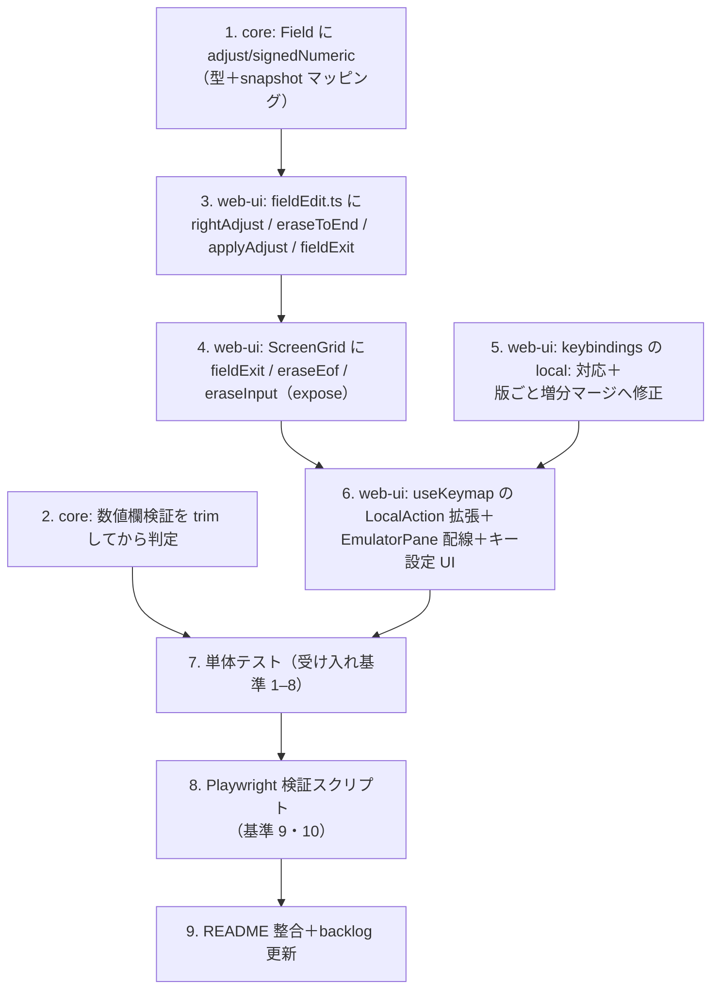

# 計画: FFW の ADJUST とローカル編集キー

## サブタスク分割の判定

**分割しない**（`protocol.md`「2.8」の過剰分割禁止）。変更は core 3 ファイル・web-ui 5 ファイル・
README・スクリプトで、1 PR に収まる。core の型追加 → web-ui の純ロジック → UI 配線、と
依存が一直線で、並行実装で得られる時間短縮も無い。

## 実装順序と依存

**先に core（1・2）を通す。** web-ui のロジックは `Field.adjust` を前提に書くので、
型が無いと `vue-tsc` が通らず手戻りになる。

## 主要な設計判断（decisions.md へ）

| # | 判断 | 理由 |
|---|---|---|
| D1 | 右寄せは **web-ui** で行い core では行わない | ホストは整形しない（実測）。core で送信時整形すると画面と送信値が食い違う |
| D2 | Erase EOF は**右寄せしない**（tn5250j と違える） | backlog の定義「Field Exit の①だけ」。消しただけで文字が右へ飛ぶのは不自然 |
| D3 | signed-num は ADJUST 無指定でも空白右寄せする | 原典 2 実装が一致。実機の数値欄は全部 signed-num。ホストは左詰めも右詰めも同じに解釈＝退行リスク無し（実測） |
| D4 | 数値欄検証は `trim()` してから判定 | 右寄せが作る前後の空白は padding。埋め込み空白は従来どおり弾く |
| D5 | 既定バインドは**版ごとの増分**で混ぜる | 既存実装は版を上げると消した既定まで復活する（既存バグの修正を含む） |
| D6 | DBCS 欄では右寄せしない | 全角の対・SO/SI・バイト予算を壊すリスク。実機に DBCS＋ADJUST の構成を確認できていない |
| D7 | `advanceIfFull` は触らない | 満杯の欄は右寄せしても無変化。既存経路に手を入れる利得が無い |

## リスクと対処

- **既存の入力挙動への退行**: Field Exit は**新しいキー**でしか呼ばれない。既存の Tab / Enter /
  文字入力の経路は変更しない（spec 4）。`advanceIfFull` も据え置き
- **キーバインド既定の追加が既存利用者の設定を壊す**: D5 の増分マージで担保。テストで固定する
- **Ctrl+Backspace / Ctrl+Delete のブラウザ既定**: `makeKeydownHandler` はカスタム解決時に
  `preventDefault()` するため入力欄でも奪える。Playwright で実測して確かめる
- **実機の装置名待ち**: 既存スクリプト同様、装置名プールでリトライする（`scripts/README.md`）

## 検証計画

1. `cd packages/core && npx vitest run` — core の型・検証
2. `cd packages/web-ui && npx vitest run` — 純ロジック・keymap・keybindings
   （**パッケージ dir から実行する**。ルートからだと偽陽性が出る。AGENTS.md）
3. `npm run build -w @as400web/web-ui` — `vue-tsc -b` のテンプレート型チェック
4. `node --env-file=.env scripts/verify-browser-adjust.mjs` — 実ブラウザ＋実機
