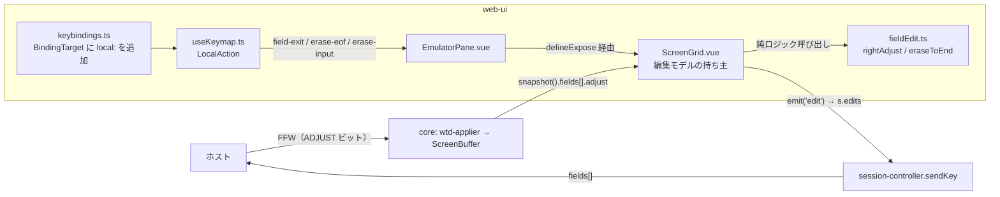

# 仕様: FFW の ADJUST とローカル編集キー

requirement / research を実装仕様に落とす。**research で実測・原典確認した事実だけを根拠にする。**

## 0. 全体像



**右寄せは端末（web-ui）が行い、core は行わない。** ホストが整形しないことは実測済み
（research 2.3）。core 側で送信時に整形すると画面には左詰めのまま出て実機と食い違う。

## 1. core: ADJUST 種別をスナップショットへ公開する

### 1.1 型（`packages/core/src/screen/types.ts`）

```ts
/** FFW の ADJUST（右寄せ）指定。0x0005/0x0006/0x0007 に対応（無指定は undefined） */
export type FieldAdjust = "right-zero" | "right-blank" | "mandatory-fill";

export interface Field {
  // …既存…
  numeric: boolean;
  /** FFW の ADJUST 指定。欄を出るとき（Field Exit）に端末が右寄せするための指定 */
  adjust?: FieldAdjust;
  /** FFW の shift が signed-num（0x0700）。ADJUST 無指定でも空白で右寄せする規則に使う */
  signedNumeric: boolean;
}
```

- `adjust` は**指定があるときだけ付ける**（既存の `dbcsType` と同じく optional の付与方式に合わせる）
- `signedNumeric` は必ず入れる（`numeric` は 3 種類をまとめた既存フラグで、
  signed-num だけを見分けられないため別に持つ）

### 1.2 マッピング（`packages/core/src/screen/buffer.ts` の `snapshot()`）

```ts
const adj = f.ffw & FFW.ADJUST_MASK;
// 0x0001–0x0004 は予約（tn5250 field.h の MF_RESERVED_1..4）。未定義値は無指定として扱う
if (adj === FFW.ADJUST_RIGHT_ZERO) field.adjust = "right-zero";
else if (adj === FFW.ADJUST_RIGHT_BLANK) field.adjust = "right-blank";
else if (adj === FFW.ADJUST_MANDATORY_FILL) field.adjust = "mandatory-fill";
```

`signedNumeric = shift === FFW.SHIFT_SIGNED_NUMERIC`。

### 1.3 数値欄の内容検証を「前後の空白は padding として許す」に緩める

`packages/core/src/screen/field-validate.ts`。現状 `/^[0-9.,+-]*$/` は空白を弾くため、
**空白埋めの右寄せをした値を自分で送信できない**（research 2.3 の副作用）。

```ts
// 右寄せ（RIGHT_BLANK・signed-num）が作る前後の空白は**桁合わせの padding**であって
// 入力文字ではない。埋め込みの空白（"1 2"）は従来どおり弾く。
const target = value.trim();
```

- `trim()` した結果に対して既存の正規表現を当てる
- `"  12"` / `"12  "` は通る。`"1 2"` は従来どおり `FIELD_TYPE`
- **DBCS 種別・コードページの検証は `value` のまま**（padding も含めて表現可能か見る必要がある）

## 2. web-ui: 純ロジック（`composables/fieldEdit.ts`）

すべて `EditState` を受けて新しい `EditState` を返す純関数。単体テストで固める。

### 2.1 `eraseToEnd(state): EditState`

カーソル位置から欄末尾までを空白にする。カーソルは動かさない。

```ts
export function eraseToEnd(state: EditState): EditState {
  const chars = [...state.chars];
  for (let i = state.cursor; i < chars.length; i++) chars[i] = " ";
  return { ...state, chars };
}
```

### 2.2 `rightAdjust(state, fill, opts?): EditState`

**GNU tn5250 `tn5250_display_shift_right`（research 1.2）をそのまま移す。**

```ts
export function rightAdjust(state: EditState, fill: string, opts: { keepLastPosition?: boolean } = {}): EditState
```

- `end = chars.length - 1`。`opts.keepLastPosition` なら `end--`（符号桁を動かさない）
- 先頭から `end` まで、空白が続く間 `fill` で埋める
- **全桁が空白なら何もしないで返す**（原典の「そうしないと無限ループ」に対応）
- 末尾（`end`）が空白の間、`end`→1 を右へずらして `chars[0] = fill`
- カーソルは**欄末尾（`chars.length`）**へ置く（右寄せ後に続きを打てる位置が無いため。
  Field Exit は直後に次の欄へ移るのでカーソル値自体は表に出ないが、Erase EOF 等での
  再利用に備えて定義しておく）

### 2.3 `applyAdjust(state, field): EditState`

FFW の指定から `rightAdjust` の引数を決める。**research 1.4 / 1.5 の規則**。

| 条件 | 動作 |
|---|---|
| `field.signedNumeric` | `rightAdjust(state, " ", { keepLastPosition: true })`（**ADJUST 指定より優先**） |
| `adjust === "right-zero"` | `rightAdjust(state, "0")` |
| `adjust === "right-blank"` | `rightAdjust(state, " ")` |
| `adjust === "mandatory-fill"` | **何もしない** |
| 無指定 | 何もしない |

> signed-num を先に見るのは原典どおり（tn5250 は `mand_fill_type` を無条件に `RIGHT_BLANK` へ
> 差し替える）。実機の数値欄はすべて signed-num で来る（research 2.2）。

### 2.4 `fieldExit(state, field): EditState`

`eraseToEnd` → `applyAdjust` の合成（research 1.6 の②③）。①の MDT と④の欄移動は呼び出し側。

## 3. web-ui: ローカル編集キー 3 種

### 3.1 `LocalAction` の拡張（`composables/useKeymap.ts`）

```ts
export type LocalAction =
  | "home" | "end" | "tab" | "shift-tab"
  | "left" | "right" | "up" | "down"
  | "word-left" | "word-right" | "word-up" | "word-down"
  // ローカル編集キー（ホストへ送らない。端末が完結させる）
  | "field-exit" | "erase-eof" | "erase-input";

/** キー設定から割り当てられるローカル編集キー（ナビゲーションは対象外） */
export const LOCAL_EDIT_ACTIONS = ["field-exit", "erase-eof", "erase-input"] as const;
export type LocalEditAction = (typeof LOCAL_EDIT_ACTIONS)[number];
```

`classifyKey` は**変更しない**（素のキーには割り当てない。既定は 3.3 のキーバインドで与える）。

### 3.2 `BindingTarget` の拡張（`stores/keybindings.ts`）

```ts
export type BindingTarget = AidKey | `view:${string}` | `macro:${string}` | `local:${LocalEditAction}`;
export function isLocalBinding(t: string): t is `local:${LocalEditAction}`;
export function localActionOf(t: string): LocalEditAction;
```

`makeKeydownHandler` の分岐へ `isLocalBinding` を追加し、`h.local(localActionOf(custom))` を呼ぶ。
**`view:` / `macro:` と同じくホストへ送らない。**

### 3.3 既定バインドと「版ごとの増分」への修正

research 3.3 の既存バグを直してから足す。

```ts
/** 版ごとに**その版で追加した既定だけ**を混ぜる。全既定を混ぜ直すと
 *  利用者が消した既定まで復活する（「消したら消えたまま」を破る）。 */
const ADDED_BY_VERSION: Record<number, Record<string, BindingTarget>> = {
  1: { "ctrl+F1": "view:kana", "ctrl+F3": "view:sosi" },
  2: {
    "ctrl+Enter": "local:field-exit",
    "ctrl+Delete": "local:erase-eof",
    "ctrl+Backspace": "local:erase-input"
  }
};
const VERSION = 2;
export const DEFAULT_BINDINGS = Object.assign({}, ...Object.values(ADDED_BY_VERSION));
```

`load()` は保存済み版 `v` に対し `v+1 … VERSION` の増分だけを `saved` へ足す（保存済みが優先）。
初回起動（`raw === null`）は従来どおり `DEFAULT_BINDINGS` 全部。

### 3.4 キー設定 UI（`components/KeybindingsPanel.vue`）

`<select>` に optgroup を 1 つ足す。

```
<optgroup label="ローカル編集キー（ホストへ送らない）">
  Field Exit（欄の残りを消して右寄せ・次の欄へ）
  Erase EOF（カーソルから欄末尾まで消去）
  Erase Input（すべての入力欄をクリア）
</optgroup>
```

`targetLabel()` も `local:` を人が読める名前に変換する。

### 3.5 実行（`ScreenGrid.vue` → `defineExpose`）

編集モデル（`edit` / `editFieldIndex`）を持つのは `ScreenGrid` なので、3 つとも
ここで実行して `EmulatorPane` から呼ぶ。

| 関数 | 動作 |
|---|---|
| `fieldExit()` | 編集中の欄に `fieldExit(edit, f)` を適用 → `sync()`（値が変われば `emit("edit")` ＝ MDT）→ `emit("field-full", f.index)` で**次の入力欄へ** |
| `eraseEof()` | `eraseToEnd(edit)` → `sync()`。**カーソルは動かさない・欄も出ない・右寄せしない**（research 3.2） |
| `eraseInput()` | 非保護の全欄について、現在値が空でなければ `emit("edit", index, "")` し、入力要素も空にする → 先頭の入力欄へフォーカス |

`EmulatorPane.onLocal` に 3 ケースを足し、`gridRef.value?.fieldExit()` 等を呼ぶ。

**保護欄・入力欄外での操作**は既存の保護時通知（`MSG_PROTECTED`）に合わせて拒否する
（原典も `KBDSRC_PROTECT` で弾く。research 1.6）。

### 3.6 DBCS 欄の扱い

DBCS 欄（`f.dbcsType`）は列ビューとバイト予算の都合で編集モデルの意味が違う。
**DBCS 欄では Field Exit の右寄せを行わず、消去と欄移動だけ行う**（`eraseToEnd` は桁単位で安全）。
実機の DBCS 欄に ADJUST が付く構成は確認できていないため、**やらないことを明示**する
（勝手な整形で全角の対を壊さないため）。

## 4. `advanceIfFull` は変えない

原典では「打鍵で満杯になったとき」も adjust を通す（research 1.3）が、
**満杯の欄は右寄せしても 1 桁も動かない**（research 1.2 の「末尾が非空白なら無変化」）。
既存の自動送りに手を入れる理由が無いので**触らない**（退行リスクを増やさない）。

## 5. README の整合（`README.md:335`）

現状の 1 行を、実装した内容と既定キーに置き換える。

```
- **ローカル編集キー**: Field Exit（Ctrl+Enter）＝欄の残りを消して FFW の指定どおり右寄せし次の欄へ、
  Erase EOF（Ctrl+Delete）＝カーソルから欄末尾まで消去、Erase Input（Ctrl+Backspace）＝全入力欄をクリア。
  いずれも**ホストへは送らない**端末内の操作で、「⌨ キー」から好きなキーへ割り当て直せます
```

## 6. 受け入れ基準（test 工程で検証する）

| # | 基準 | 検証方法 |
|---|---|---|
| 1 | `rightAdjust` が原典と同じ結果を返す（末尾非空白は無変化 / 全空白は無変化 / 語中の空白は保持 / 先頭空白は fill 置換） | 単体（vitest） |
| 2 | `mandatory-fill` は桁を動かさない | 単体 |
| 3 | signed-num は ADJUST 無指定でも空白右寄せし、**最終桁（符号桁）を動かさない** | 単体 |
| 4 | `eraseToEnd` がカーソル以降だけを消す | 単体 |
| 5 | core の `snapshot().fields[].adjust` が FFW から正しく出る | 単体 |
| 6 | 数値欄の検証が前後の空白を通し、埋め込み空白は弾く | 単体 |
| 7 | `local:*` バインドが `h.local()` を呼び、**ホストへ送らない** | 単体（keymap） |
| 8 | 版を上げても**利用者が消した既定が復活しない** | 単体（keybindings） |
| 9 | 実ブラウザで Field Exit / Erase EOF / Erase Input が動く | Playwright（`scripts/verify-browser-adjust.mjs`） |
| 10 | **実機で、CHECK(RZ)/CHECK(RB) 欄に部分入力＋Field Exit した値が右寄せでホストへ届く** | 実機（Playwright 経由で TESTLIB/ADJPGM を操作） |
| 11 | `npm run build -w @as400web/web-ui`（`vue-tsc -b`）が通る | ビルド |

## 7. やらないこと（再掲・逸脱防止）

- Field− / Field+（符号の確定）。`SHIFT_SIGNED_NUMERIC` の**送信表現**の議論とセットで別 work
- `FIELD_EXIT_REQUIRED` / `AUTO_ENTER` / `MONOCASE` / `MANDATORY_ENTER` の**強制**
  （FFW からは読めるようにするが、挙動は変えない）
- DUP キー
- `mandatory-fill` の入力検証
